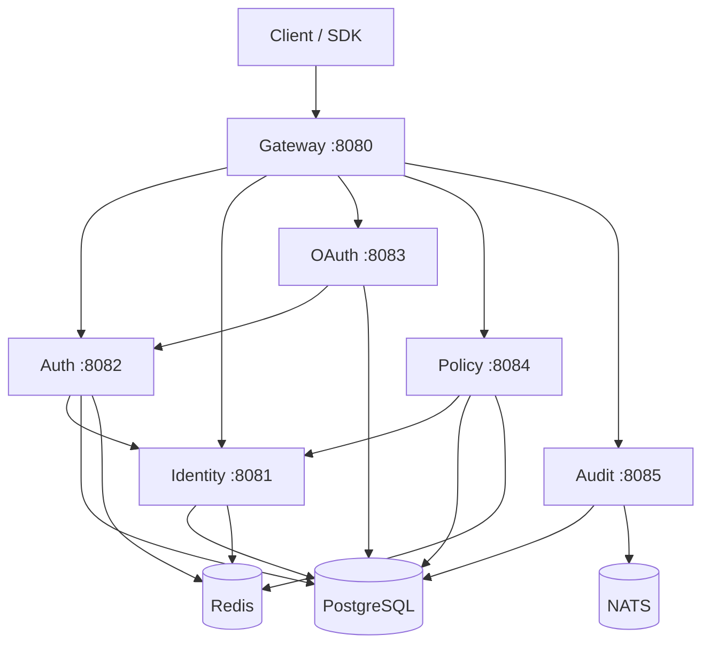

# GGID — Open Source Identity & Access Management Platform

[](https://github.com/topcheer/ggid/actions)
[](https://golang.org)
[](LICENSE)
[]()
[](CONTRIBUTING.md)

> Enterprise-grade IAM with Zero Trust, OAuth 2.1, ReBAC, ITDR, and AI Agent Identity — built in Go.

## Why GGID?

GGID is the only open-source IAM evolving into a **Zero Trust platform** with:

- **OAuth 2.1** with PKCE, DPoP, PAR, JAR, RAR, Token Exchange (RFC 8693)
- **ReBAC** (Zanzibar-style) + **ABAC** fine-grained authorization
- **ITDR** with MITRE ATT&CK mapping (15 detection rules)
- **AI Agent Identity** — first-class agent principals with delegated access
- **Verifiable Credentials** (W3C DID/VC) with OID4VCI/OID4VP
- **Adaptive Authentication** with unified risk engine (5 signal categories, 20 types)
- **SM2/SM3/SM4** China GM compliance
- **11 SDKs** (Go, Python, TypeScript, Java, C#, Rust, Ruby, PHP, Dart, React)
- **PostgreSQL Row-Level Security** for multi-tenant isolation
- **Hash-chained audit trail** (HMAC-SHA256, tamper-evident)
- **WASM plugin architecture** (wazero runtime)

## Quickstart (5 Minutes)

### 1. Start GGID

```bash
# Clone and start infrastructure
 git clone https://github.com/topcheer/ggid.git
cd ggid
make docker-run   # PostgreSQL + Redis + NATS
make migrate-up   # Apply database migrations
make build        # Build all services
```

### 2. Create Admin User

```bash
curl -X POST http://localhost:8081/api/v1/identity/users \
  -H "Content-Type: application/json" \
  -d '{"email":"admin@corp.com","password":"Admin123!","name":"Admin"}'
```

### 3. Login & Get Token

```bash
TOKEN=$(curl -s -X POST http://localhost:8082/api/v1/auth/login \
  -H "Content-Type: application/json" \
  -d '{"username":"admin@corp.com","password":"Admin123!"}' | jq -r .access_token)
echo $TOKEN
```

### 4. Create OAuth Client

```bash
curl -X POST http://localhost:8083/api/v1/oauth/clients \
  -H "Authorization: Bearer $TOKEN" \
  -H "Content-Type: application/json" \
  -d '{"client_name":"My App","redirect_uris":["http://localhost:3000/callback"]}'
```

### 5. Access Console

Open `http://localhost:8080` in your browser.

## Architecture



## Feature Matrix

### Authentication
- [x] OAuth 2.1 (PKCE, PAR, JAR, DPoP)
- [x] OIDC (Discovery, UserInfo, Back-Channel Logout)
- [x] WebAuthn / FIDO2 / Passkeys
- [x] Passwordless (magic link, SMS)
- [x] MFA (TOTP, SMS, push, biometric)
- [x] Adaptive MFA (risk-based step-up)
- [x] SAML 2.0 federation
- [x] Social login (Google, GitHub, Microsoft, Apple)
- [x] China GM (SM2/SM3) signing

### Authorization
- [x] ReBAC (Zanzibar-style relationship-based)
- [x] ABAC (attribute-based conditions)
- [x] RAR (Rich Authorization Requests)
- [x] Token Exchange (RFC 8693, delegation chains)
- [x] Unified PDP (per-request authorization)
- [x] PostgreSQL Row-Level Security (tenant isolation)
- [x] PAM JIT (zero standing privilege)

### Security
- [x] ITDR (15 MITRE ATT&CK detection rules)
- [x] Risk Engine (5 signal categories, 20 types)
- [x] Impossible Travel detection
- [x] Device posture compliance
- [x] Hash-chained audit trail (tamper-evident)
- [x] DLP policies + egress PII redaction
- [x] CMK/KMS (7 providers: AWS/GCP/Azure/Vault/PKCS11/SM2)
- [x] DPoP proof-of-possession tokens

### Zero Trust
- [x] ZTNA Access Broker
- [x] Gateway PEP (per-request authz)
- [x] CAE continuous evaluation middleware
- [x] Secret Broker (zero-trust secret injection)
- [x] WASM plugin architecture (wazero)

### Platform
- [x] Multi-tenant with PostgreSQL RLS
- [x] Hash-chain audit (HMAC-SHA256)
- [x] SIEM/SOAR integration
- [x] Webhook engine (HMAC signed, retry, dead-letter)
- [x] Compliance automation (SOC2/ISO/NIST evidence)
- [x] SCIM 2.0 outbound provisioning

## Comparison

| Feature | GGID | Auth0 | Okta | Keycloak |
|---------|------|-------|------|----------|
| Open Source | ✅ | Partial | ❌ | ✅ |
| License | Apache 2.0 | Proprietary | Proprietary | Apache 2.0 |
| Language | Go | Node.js | Java | Java |
| OAuth 2.1 | ✅ | ✅ | ✅ | Partial |
| ReBAC (Zanzibar) | ✅ | ❌ | ❌ | ❌ |
| ITDR | ✅ | Custom | Custom | ❌ |
| DPoP | ✅ | ❌ | ❌ | ❌ |
| China GM (SM2/3/4) | ✅ | ❌ | ❌ | ❌ |
| AI Agent Identity | ✅ | ❌ | ❌ | ❌ |
| VC/DID (W3C) | ✅ | ❌ | ❌ | Partial |
| Zero Trust (ZTNA) | ✅ | ❌ | ❌ | ❌ |
| SDKs | 11 | 8 | 7 | 3 |

## SDKs

| Language | Status | Package |
|----------|--------|---------|
| Go | ✅ Production | go.mod |
| React | ✅ Production | npm |
| Java | ✅ Functional | Maven |
| C# | ✅ Functional | NuGet |
| TypeScript/Node | ⚠️ In progress | npm |
| Python | ⚠️ Minimal | PyPI |
| Rust | ⚠️ Skeleton | crates.io |
| Ruby | ⚠️ Skeleton | gem |
| PHP | ⚠️ Skeleton | Packagist |
| Dart | ⚠️ Skeleton | pub.dev |
| React Native | ⚠️ Minimal | npm |

## Documentation

- [Architecture](docs/research/zero-trust-maturity-assessment.md)
- [Research Library](docs/research/) (48+ deep-dive documents)
- [Guides](docs/guides/)
- [Contributing](CONTRIBUTING.md)
- [Changelog](CHANGELOG.md)

## Roadmap

See [Kanban](docs/kanban.md) for 254 backlog items. Highlights:

- OpenAPI 3.1 spec generation + Swagger UI
- Multi-region active-active deployment
- GraphQL API layer
- EU Digital Identity Wallet (eIDAS 2.0)
- BBS+ selective disclosure
- Service mesh (Istio + microsegmentation)

## Contributing

We welcome contributions! See [CONTRIBUTING.md](CONTRIBUTING.md) for details.

## License

Apache License 2.0 — see [LICENSE](LICENSE).
