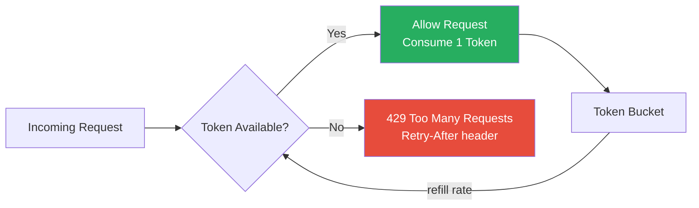
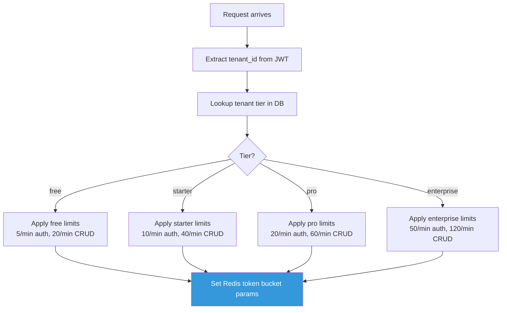

# API Rate Limiting Configuration

> Per-endpoint limits, tenant tier differentiation, 429 response format, and
> client retry guidance.

---

## How Rate Limiting Works

GGID uses a Redis-backed **token bucket** algorithm. Each request consumes a
token from the bucket. Tokens regenerate at a fixed rate up to the burst capacity.



---

## Per-Endpoint Limits

| Endpoint | Method | Rate Limit | Key | Burst |
|----------|--------|-----------|-----|-------|
| `/api/v1/auth/login` | POST | 10/min | IP + username | 15 |
| `/api/v1/auth/register` | POST | 5/min | IP | 8 |
| `/api/v1/auth/refresh` | POST | 30/min | Refresh token `jti` | 40 |
| `/api/v1/auth/password/reset` | POST | 3/hr | IP + email | 5 |
| `/api/v1/auth/magic-link` | POST | 3/hr | IP + email | 5 |
| `/api/v1/users` | GET | 60/min | User (JWT `sub`) | 80 |
| `/api/v1/users` | POST | 20/min | User (JWT `sub`) | 25 |
| `/api/v1/users/:id` | GET | 60/min | User (JWT `sub`) | 80 |
| `/api/v1/users/:id` | PATCH | 20/min | User (JWT `sub`) | 25 |
| `/api/v1/users/:id` | DELETE | 10/min | User (JWT `sub`) | 12 |
| `/api/v1/roles` | GET/POST | 30/min | User (JWT `sub`) | 40 |
| `/api/v1/policies/check` | POST | 100/min | User (JWT `sub`) | 120 |
| `/api/v1/orgs` | GET/POST | 30/min | User (JWT `sub`) | 40 |
| `/api/v1/audit/events` | GET | 30/min | User (JWT `sub`) | 40 |
| `/api/v1/audit/stream` | GET (SSE) | 5/min | User (JWT `sub`) | 5 |
| `/scim/v2/*` | * | 100/min | SCIM API key | 120 |
| `/healthz` | GET | No limit | — | — |
| `/readyz` | GET | No limit | — | — |

---

## Tenant Tier Configuration

Rate limits scale with tenant subscription tier:

| Tier | Auth Endpoints | CRUD Endpoints | Policy Check | SCIM | SSE Stream |
|------|---------------|----------------|-------------|------|------------|
| **Free** | 5/min | 20/min | 30/min | — | — |
| **Starter** | 10/min | 40/min | 60/min | 50/min | 1 |
| **Pro** | 20/min | 60/min | 100/min | 100/min | 3 |
| **Enterprise** | 50/min | 120/min | 300/min | 200/min | 10 |

### Configure Tenant Tier

```bash
curl -X PATCH $API/api/v1/tenants/$TENANT_ID \
  -H "Authorization: Bearer $SUPERADMIN_TOKEN" \
  -d '{
    "tier": "pro",
    "rate_limits": {
      "auth_endpoints": "20/min",
      "crud_endpoints": "60/min",
      "policy_check": "100/min",
      "scim": "100/min",
      "sse_streams": 3
    }
  }'
```

### Tier Resolution Flow



---

## 429 Response Format

When rate limited, GGID returns HTTP 429 with structured error:

```http
HTTP/1.1 429 Too Many Requests
Content-Type: application/json
Retry-After: 42
X-RateLimit-Limit: 60
X-RateLimit-Remaining: 0
X-RateLimit-Reset: 1699999999

{
  "error": {
    "code": "RATE_LIMIT_EXCEEDED",
    "message": "Rate limit exceeded. Try again in 42 seconds.",
    "request_id": "req-abc123",
    "details": {
      "limit": 60,
      "window_seconds": 60,
      "retry_after_seconds": 42,
      "reset_at": "2024-01-15T10:31:00Z"
    }
  }
}
```

### Response Headers

| Header | Description |
|--------|-------------|
| `X-RateLimit-Limit` | Maximum requests per window |
| `X-RateLimit-Remaining` | Requests remaining in current window |
| `X-RateLimit-Reset` | Unix timestamp when window resets |
| `Retry-After` | Seconds until the client should retry |

---

## Client Retry Strategy

### Exponential Backoff with Jitter

```go
func withRetry(ctx context.Context, fn func() (*http.Response, error)) error {
    maxRetries := 3
    baseDelay := time.Second

    for attempt := 0; attempt < maxRetries; attempt++ {
        resp, err := fn()
        if err == nil && resp.StatusCode != 429 {
            return nil
        }

        if resp.StatusCode == 429 {
            retryAfter := resp.Header.Get("Retry-After")
            delay, _ := strconv.Atoi(retryAfter)
            if delay == 0 {
                delay = int(baseDelay.Seconds()) * (1 << attempt)
            }
            // Add jitter (0-50% of delay)
            jitter := time.Duration(rand.Intn(delay*500)) * time.Millisecond
            select {
            case <-time.After(time.Duration(delay)*time.Second + jitter):
            case <-ctx.Done():
                return ctx.Err()
            }
        }
    }
    return fmt.Errorf("max retries exceeded")
}
```

### Node.js Axios Interceptor

```typescript
import axios from 'axios';

const client = axios.create({ baseURL: 'https://iam.example.com' });

client.interceptors.response.use(
  (response) => response,
  async (error) => {
    if (error.response?.status === 429) {
      const retryAfter = parseInt(error.response.headers['retry-after'] || '1', 10);
      const jitter = Math.random() * 500;
      await new Promise(resolve => setTimeout(resolve, retryAfter * 1000 + jitter));
      return client.request(error.config); // Retry
    }
    return Promise.reject(error);
  }
);
```

---

## Burst Capacity

Burst allows short spikes above the steady-state rate:

```
Rate: 60 req/min (1 req/sec steady state)
Burst: 80 (allows 80 instant requests, then refills at 1/sec)

Timeline:
  t=0s:   80 requests (burst consumed)  → bucket empty
  t=1s:   +1 token
  t=60s:  bucket full again (80)
```

### Configure Burst per Endpoint

```bash
curl -X PUT $API/api/v1/settings/rate-limits \
  -H "Authorization: Bearer $ADMIN_TOKEN" \
  -d '{
    "endpoints": {
      "/api/v1/auth/login": {
        "rate": "10/min",
        "burst": 15,
        "key": "ip_username"
      },
      "/api/v1/users": {
        "rate": "60/min",
        "burst": 80,
        "key": "jwt_sub"
      }
    }
  }'
```

---

## Rate Limit Key Strategies

| Key Strategy | Description | Use Case |
|-------------|-------------|----------|
| `ip` | Per client IP address | Anonymous endpoints (login, register) |
| `ip_username` | Per IP + username combination | Prevent distributed brute force |
| `jwt_sub` | Per authenticated user (JWT `sub` claim) | All authenticated endpoints |
| `tenant_id` | Per tenant | Tenant-level quotas |
| `api_key` | Per SCIM API key | SCIM provisioning endpoints |
| `global` | System-wide | Emergency throttling |

---

## Monitoring Rate Limits

### Prometheus Metrics

```
# Rate limit counters
ggid_ratelimit_allowed_total{endpoint="/api/v1/auth/login"}
ggid_ratelimit_denied_total{endpoint="/api/v1/auth/login"}
ggid_ratelimit_tokens_available{endpoint="/api/v1/users"}

# By tenant
ggid_ratelimit_denied_total{endpoint="/api/v1/users",tenant="aaa-111"}
```

### Alerting Rules

```yaml
groups:
  - name: rate-limiting
    rules:
      - alert: HighRateLimitDenialRate
        expr: |
          sum(rate(ggid_ratelimit_denied_total[5m])) by (endpoint)
          / sum(rate(ggid_ratelimit_allowed_total[5m])) by (endpoint)
          > 0.1
        for: 5m
        annotations:
          summary: "Rate limit denial rate >10% on {{ $labels.endpoint }}"
```

---

## Custom Rate Limit Overrides

Administrators can override default limits for specific tenants, endpoints,
or IP ranges without changing global configuration.

### Per-Tenant Custom Limits

```bash
curl -X PUT $API/api/v1/settings/rate-limits/tenants/$TENANT_ID \
  -H "Authorization: Bearer $SUPERADMIN_TOKEN" \
  -d '{
    "overrides": {
      "/api/v1/auth/login": {
        "rate": "100/min",
        "burst": 150
      },
      "/api/v1/users": {
        "rate": "200/min",
        "burst": 250
      }
    }
  }'
```

### Per-IP-Range Overrides

Whitelist or throttle specific IP ranges (useful for trusted API integrations
or known abusive networks):

```bash
curl -X PUT $API/api/v1/settings/rate-limits/ip-overrides \
  -H "Authorization: Bearer $ADMIN_TOKEN" \
  -d '{
    "overrides": [
      {
        "cidr": "10.0.0.0/8",
        "limit_multiplier": 10,
        "comment": "Internal network - 10x limits"
      },
      {
        "cidr": "192.168.1.0/24",
        "rate": "unlimited",
        "comment": "Trusted automation IPs"
      },
      {
        "cidr": "203.0.113.0/24",
        "rate": "1/min",
        "burst": 2,
        "comment": "Known abuse range"
      }
    ]
  }'
```

### Per-Endpoint Custom Limits

Override limits for individual endpoints without affecting others:

```bash
curl -X PATCH $API/api/v1/settings/rate-limits/endpoints \
  -H "Authorization: Bearer $ADMIN_TOKEN" \
  -d '{
    "/api/v1/auth/login": {
      "default": {"rate": "10/min", "burst": 15},
      "tenant_tier_override": {
        "enterprise": {"rate": "100/min", "burst": 120}
      }
    },
    "/api/v1/policies/check": {
      "default": {"rate": "100/min", "burst": 120},
      "tenant_tier_override": {
        "enterprise": {"rate": "500/min", "burst": 600}
      }
    }
  }'
```

---

## Rate Limit Bypass

### mTLS Bypass

Service-to-service calls authenticated via mutual TLS bypass rate limiting:

```bash
curl -X PUT $API/api/v1/settings/rate-limits/bypass \
  -H "Authorization: Bearer $ADMIN_TOKEN" \
  -d '{
    "mtls_cert_cn": ["ggid-internal/*"],
    "comment": "Internal service mesh calls are not rate limited"
  }'
```

Requests presenting a valid client certificate with a CN matching the pattern
are exempt from rate limiting. This is verified at the Gateway middleware level.

### API Key Bypass

Long-lived API keys (e.g., SCIM provisioning, webhook deliveries) can have
custom or unlimited limits:

```bash
# Create API key with custom limits
curl -X POST $API/api/v1/api-keys \
  -H "Authorization: Bearer $ADMIN_TOKEN" \
  -d '{
    "name": "SCIM Provisioning",
    "scopes": ["scim:read", "scim:write"],
    "rate_limit": {
      "rate": "500/min",
      "burst": 600
    },
    "expires_in_days": 365
  }'

# Create unlimited API key (enterprise only)
curl -X POST $API/api/v1/api-keys \
  -H "Authorization: Bearer $SUPERADMIN_TOKEN" \
  -d '{
    "name": "Audit Log Exporter",
    "scopes": ["audit:read"],
    "rate_limit": "unlimited",
    "expires_in_days": 90
  }'
```

### Health Check Bypass

`/healthz` and `/readyz` endpoints are never rate limited. This ensures
load balancer and Kubernetes probes always succeed.

---

## Redis Implementation Details

GGID uses a **sliding window** rate limiter backed by Redis for distributed
rate limiting across multiple Gateway instances.

### Algorithm: Sliding Window with Lua Script

The rate limiter uses an atomic Redis Lua script to check and decrement tokens
in a single round trip:

```lua
-- KEYS[1] = rate limit key (e.g., "rl:login:ip:192.168.1.1")
-- ARGV[1] = max tokens (capacity)
-- ARGV[2] = refill rate (tokens per second)
-- ARGV[3] = current timestamp (seconds)
-- ARGV[4] = key TTL (seconds)

local key = KEYS[1]
local capacity = tonumber(ARGV[1])
local refill_rate = tonumber(ARGV[2])
local now = tonumber(ARGV[3])
local ttl = tonumber(ARGV[4])

local bucket = redis.call('HMGET', key, 'tokens', 'last_refill')
local tokens = tonumber(bucket[1]) or capacity
local last_refill = tonumber(bucket[2]) or now

-- Refill tokens based on elapsed time
local elapsed = math.max(0, now - last_refill)
tokens = math.min(capacity, tokens + (elapsed * refill_rate))

local allowed = 0
local remaining = tokens

if tokens >= 1 then
    tokens = tokens - 1
    allowed = 1
    remaining = tokens
end

-- Update bucket
redis.call('HMSET', key, 'tokens', tokens, 'last_refill', now)
redis.call('EXPIRE', key, ttl)

-- Return: allowed, remaining, retry_after_seconds
local retry_after = 0
if allowed == 0 then
    retry_after = math.ceil((1 - tokens) / refill_rate)
end

return {allowed, remaining, retry_after}
```

### Redis Key Structure

| Key Pattern | TTL | Purpose |
|------------|-----|---------|
| `rl:{endpoint}:{key_strategy}:{identifier}` | 60-3600s | Token bucket state |
| `rl:lockout:{username}` | 900s (15min) | Account lockout after failed logins |
| `rl:tenant:{tenant_id}:quota` | 86400s | Daily tenant quota counter |

### Lua Script Registration

```go
// Scripts are registered once on startup via EVALSHA
var rateLimitScript = redis.NewScript(`
    -- (Lua script from above)
`)

// Each request: single round-trip EVALSHA
result, err := rateLimitScript.Run(ctx, rdb, keys, args).Slice()
// result[0] = allowed (0 or 1)
// result[1] = remaining tokens
// result[2] = retry_after seconds
```

### Distributed Consistency

All Gateway instances share the same Redis cluster, ensuring rate limits are
enforced globally regardless of which instance receives the request.

```
Gateway-1 ─┐
Gateway-2 ─┼──► Redis Cluster (3 shards)
Gateway-3 ─┘

Token bucket state is shared across all instances.
No local in-memory rate counting.
```

### Fallback Behavior

If Redis is unavailable:

| Mode | Behavior | Risk |
|------|----------|------|
| **Fail-open** (default) | Allow all requests, log warning | Rate limits not enforced temporarily |
| **Fail-closed** | Deny all rate-limited endpoints | Availability impact |

```bash
# Configure failover mode
RATE_LIMIT_FAIL_MODE=open   # 'open' or 'closed'
```

### Performance Characteristics

| Metric | Value |
|--------|-------|
| Rate limit check latency | 0.8-1.8ms (single Redis call) |
| Lua script execution | <0.1ms (in-process on Redis) |
| Memory per bucket | ~80 bytes |
| Max buckets per GB Redis | ~12 million |
| Network round trips per check | 1 (EVALSHA) |

---

## References

- [Rate Limiting Guide](./rate-limiting.md) — Detailed algorithm explanation
- [Security Checklist](./security-checklist.md) — Production security audit
- [Error Codes](./error-codes.md) — Complete error reference
- [API Reference](./api-reference.md) — All endpoints
