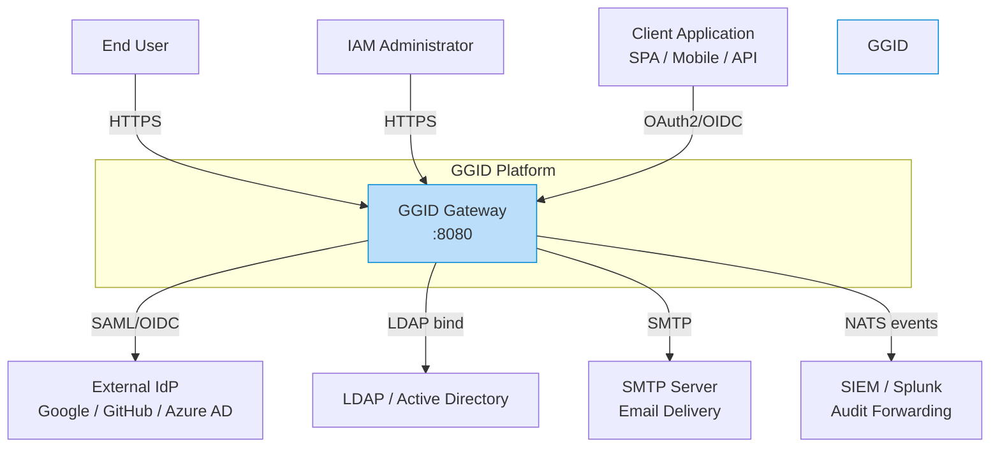
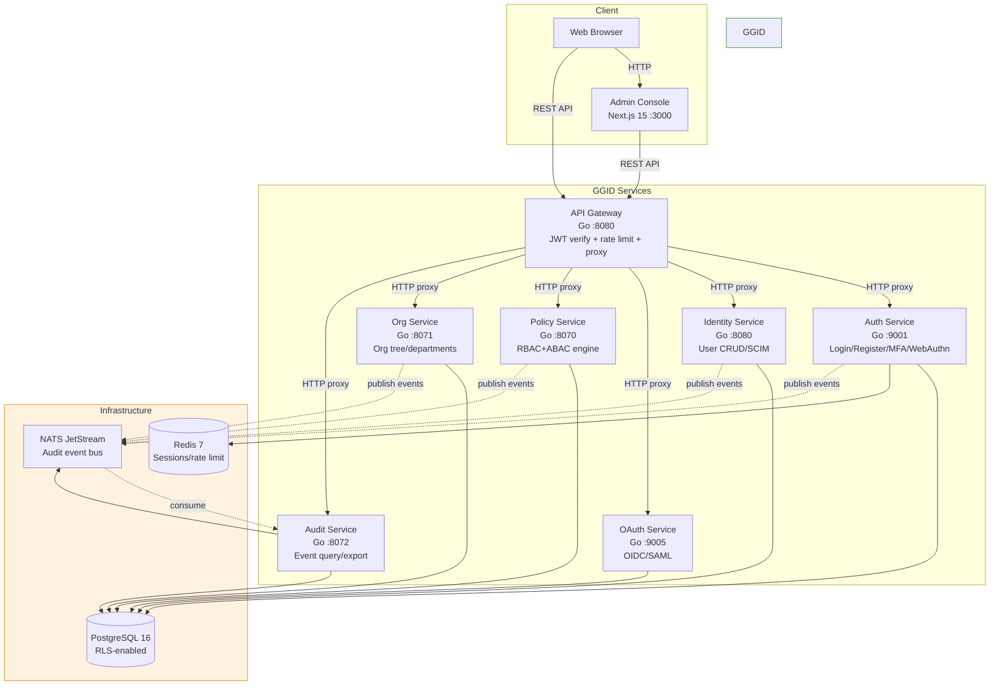
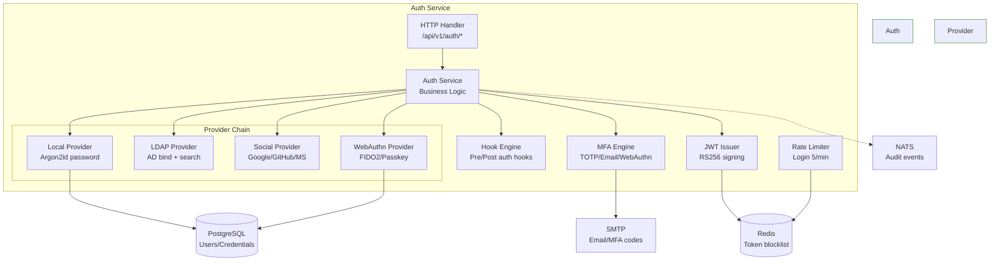
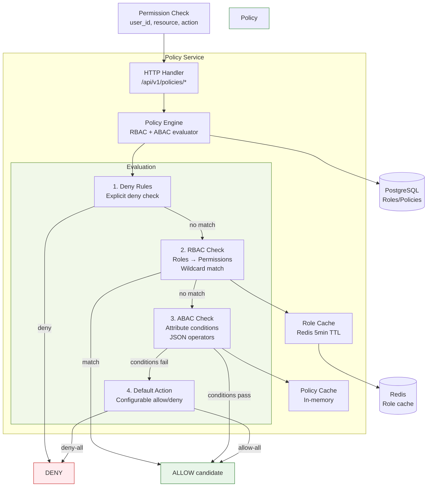
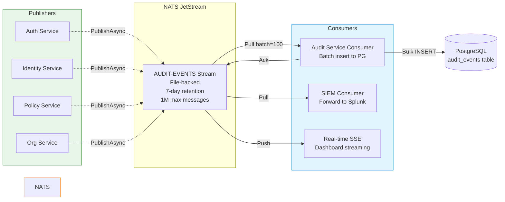
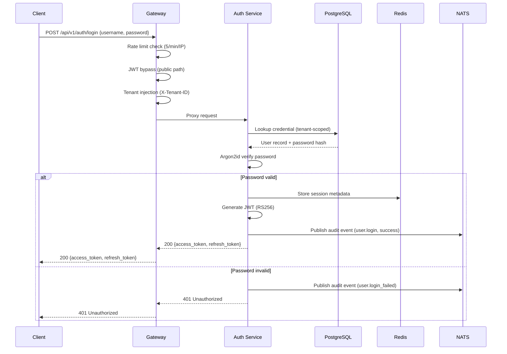
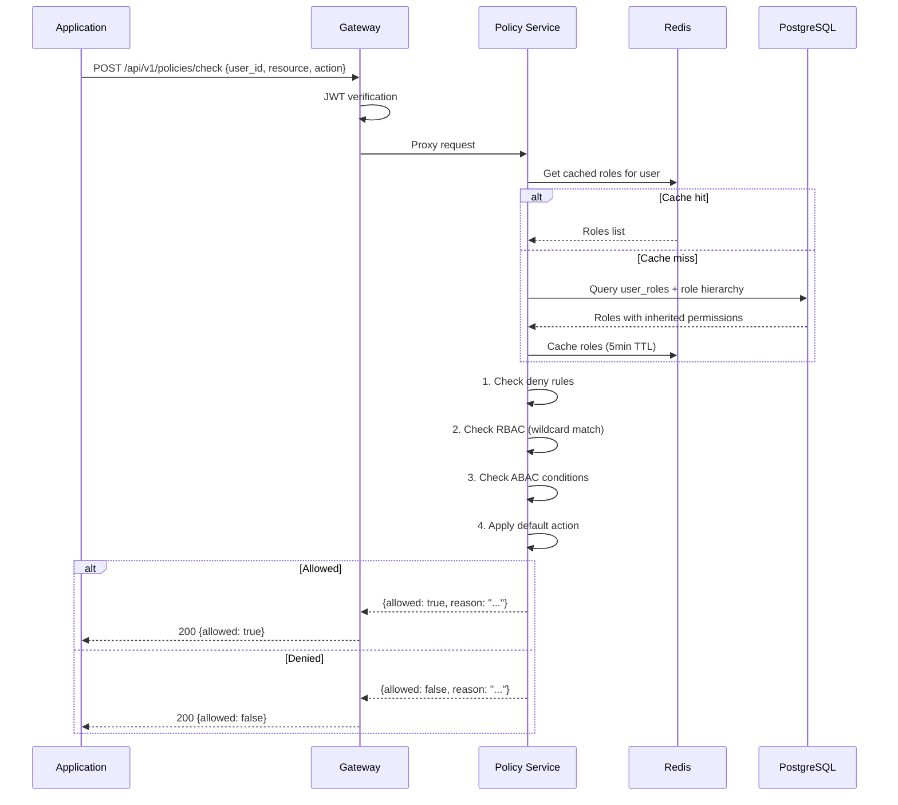

# GGID Architecture — C4 Model

System architecture visualized using the [C4 model](https://c4model.com/) with
[Mermaid](https://mermaid.js.org/) diagrams.

---

## Level 1: System Context



---

## Level 2: Container



---

## Level 3: Component — API Gateway

```mermaid
graph LR
    subgraph Gateway
        RL[Rate Limiter]
        CORS[CORS Handler]
        JWT[JWT Verifier<br/>JWKS cache 15min]
        Tenant[Tenant Injector<br/>X-Tenant-ID → query/body]
        Router[Router<br/>Path prefix match]
        Proxy[Reverse Proxy<br/>Keep-alive pool]
        CB[Circuit Breaker<br/>Per-backend]
        HC[Health Checker<br/>Weighted LB]
        Metrics[Prometheus Metrics]
        OTel[OTel Tracing]
    end

    Req[Incoming Request] --> RL
    RL -->|pass| CORS
    CORS --> JWT
    JWT -->|verified| Tenant
    JWT -->|public path| Tenant
    Tenant --> Router
    Router --> Proxy
    Proxy --> CB
    CB -->|healthy| HC
    CB -->|tripped| Err503[503 Service Unavailable]
    HC -->|forward| Backend[Backend Service]
    Backend --> Metrics
    Metrics --> Resp[Response]

    RL -->|exceeded| Err429[429 Too Many Requests]
    JWT -->|invalid| Err401[401 Unauthorized]

    style Gateway fill:#e1f5fe,stroke:#0288d1
    style Err429 fill:#ffebee,stroke:#c62828
    style Err401 fill:#ffebee,stroke:#c62828
    style Err503 fill:#ffebee,stroke:#c62828
```



---

## Level 3: Component — Auth Service



---

## Level 3: Component — Policy Engine



---

## Level 3: Component — Audit Pipeline



---

## Deployment View

```mermaid
graph TB
    subgraph Docker Compose / Kubernetes
        LB[Load Balancer<br/>nginx / Ingress]
        
        subgraph Gateway Tier
            GW1[Gateway Replica 1]
            GW2[Gateway Replica 2]
        end
        
        subgraph Service Tier
            Auth1[Auth :9001]
            Ident1[Identity :8080]
            OAuth1[OAuth :9005]
            Pol1[Policy :8070]
            Org1[Org :8071]
            Aud1[Audit :8072]
        end
        
        subgraph Data Tier
            PG[(PostgreSQL<br/>Primary + Replica)]
            Redis[(Redis Cluster)]
            NATS[NATS Cluster<br/>3 nodes)]
        end
    end

    Client[Client Traffic] --> LB
    LB --> GW1
    LB --> GW2
    GW1 --> Auth1
    GW1 --> Ident1
    GW1 --> OAuth1
    GW1 --> Pol1
    GW1 --> Org1
    GW1 --> Aud1
    GW2 --> Auth1
    GW2 --> Ident1
    GW2 --> Pol1
    
    Auth1 --> PG
    Auth1 --> Redis
    Ident1 --> PG
    Pol1 --> PG
    Org1 --> PG
    Aud1 --> PG
    Aud1 --> NATS
    
    Auth1 -.-> NATS

    style Gateway Tier fill:#e1f5fe,stroke:#0288d1
    style Service Tier fill:#e8f5e9,stroke:#388e3c
    style Data Tier fill:#fff3e0,stroke:#f57c00
```

---

## Data Flow: Login Request



---

## Data Flow: Permission Check


