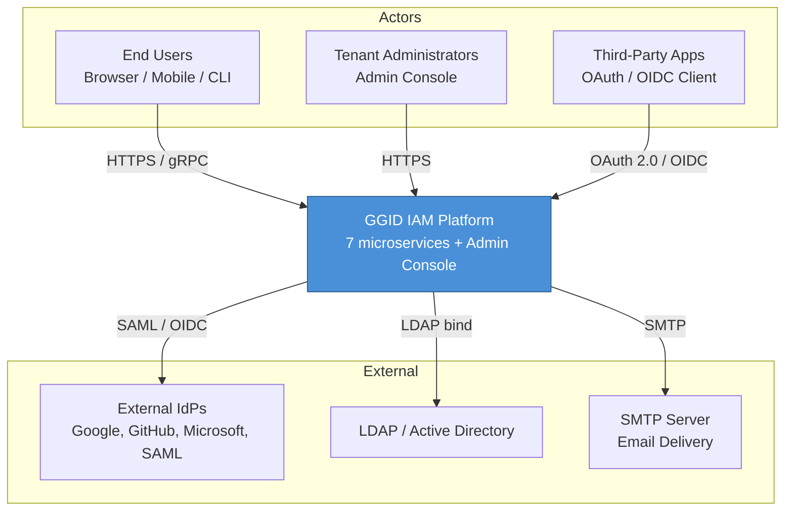
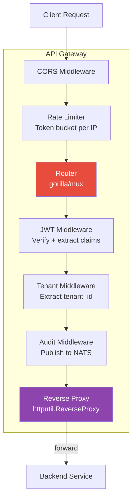
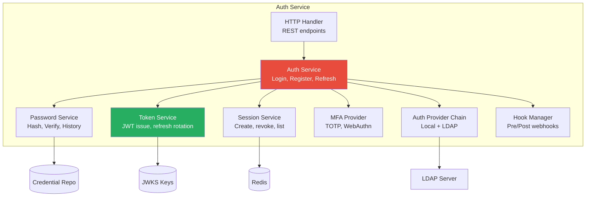
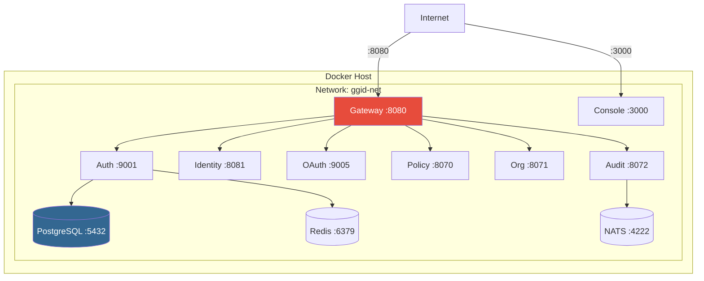
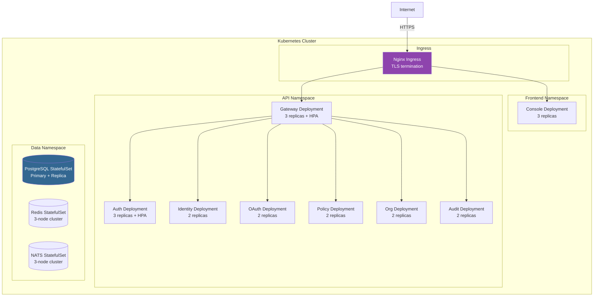
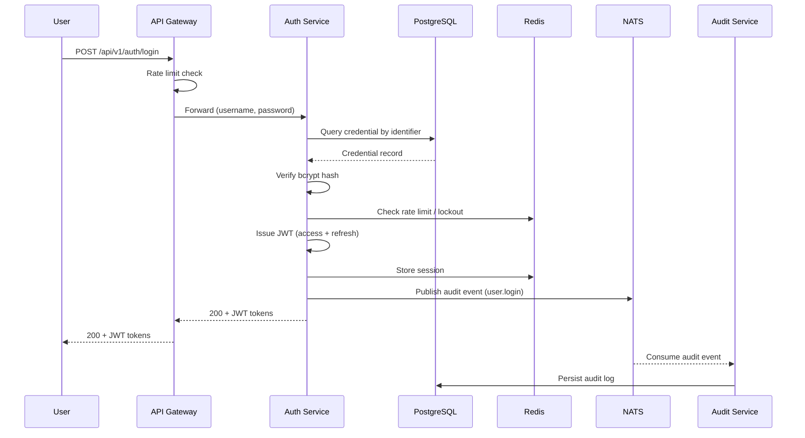
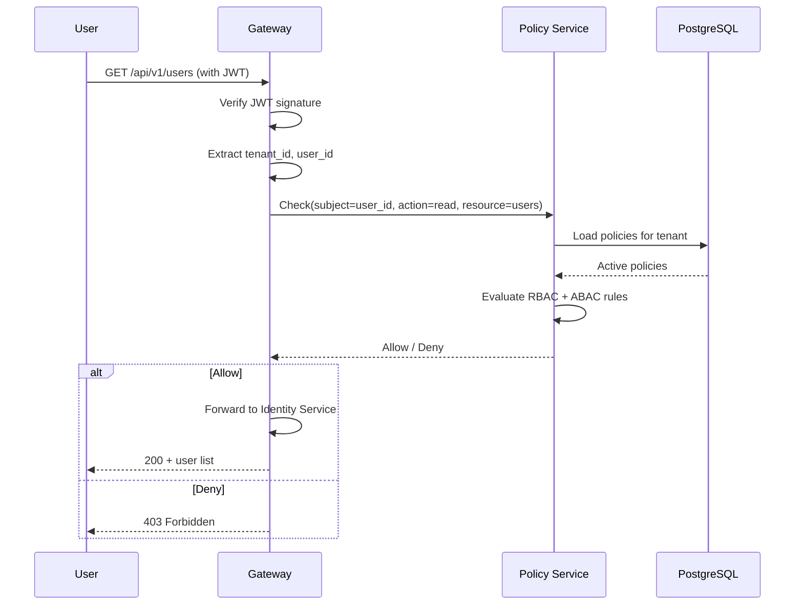
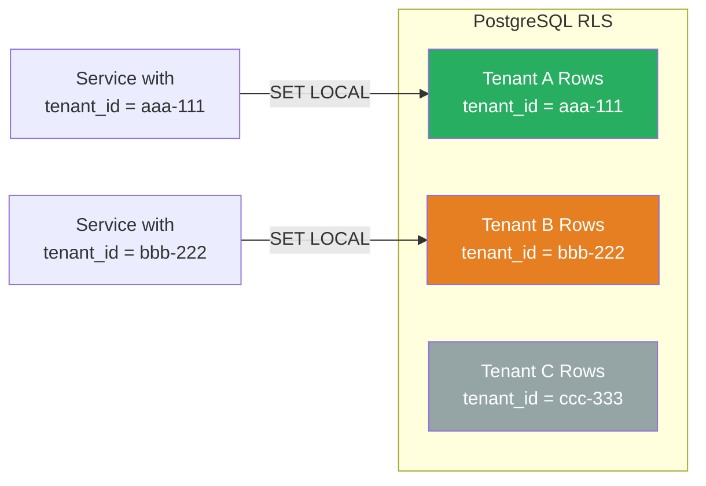
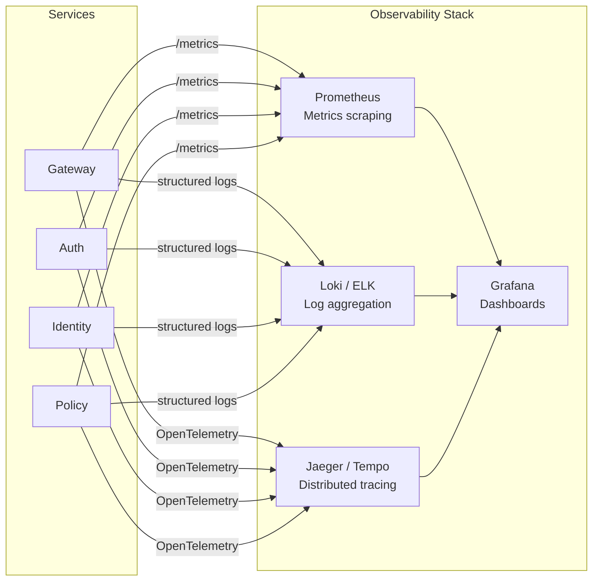

# GGID Architecture

> C4 Model — System Context, Container, Component, and Deployment views.
> Built with [Mermaid](https://mermaid.js.org/) diagrams for GitHub/GitLab rendering.

---

## Overview

GGID is an Apache 2.0 open-source Identity and Access Management (IAM) platform
built as a Go microservices monorepo. It provides authentication, authorization,
policy enforcement, organization management, and audit logging for multi-tenant
SaaS applications.

**Key characteristics:**

- **7 microservices** — independently deployable, communicating via gRPC and REST
- **Multi-tenant** — PostgreSQL Row-Level Security (RLS) isolates tenant data
- **Event-driven** — NATS JetStream for async audit event streaming
- **Polyglot persistence** — PostgreSQL (primary), Redis (cache/sessions), LDAP (directory)

---

## 1. System Context (C4 Level 1)

The System Context view shows GGID as a single box and its relationships with
external actors and systems.



### Actors

| Actor | Description | Protocol |
|-------|-------------|----------|
| End Users | authenticate, manage profile, access resources | HTTPS, gRPC |
| Tenant Admins | manage users, roles, orgs, policies via Console | HTTPS |
| Third-Party Apps | integrate via OAuth 2.0 / OIDC / SAML | HTTPS |

### External Dependencies

| System | Purpose |
|--------|---------|
| External IdPs | Social login (Google, GitHub, Microsoft, Apple, etc.) |
| LDAP / AD | Enterprise directory integration |
| SMTP Server | Transactional email (verification, reset, notifications) |

---

## 2. Container View (C4 Level 2)

The Container view breaks the system into its major deployable units.

```mermaid
graph LR
    subgraph Client
        Console[Admin Console<br/>Next.js 15<br/>:3000]
    end

    subgraph Gateway
        GW[API Gateway<br/>Go<br/>:8080]
    end

    subgraph Core Services
        Auth[Auth Service<br/>Go<br/>:9001]
        Identity[Identity Service<br/>Go + gRPC<br/>:8081 / :50051]
        OAuth[OAuth Service<br/>Go<br/>:9005]
        Policy[Policy Service<br/>Go + gRPC<br/>:8070 / :9070]
        Org[Org Service<br/>Go + gRPC<br/>:8071 / :9071]
        Audit[Audit Service<br/>Go + gRPC<br/>:8072 / :9072]
    end

    subgraph Infrastructure
        PG[(PostgreSQL 16<br/>:5432)]
        Redis[(Redis 7<br/>:6379)]
        NATS[(NATS JetStream<br/>:4222)]
    end

    Console -->|REST| GW
    GW -->|REST / gRPC| Auth
    GW -->|REST / gRPC| Identity
    GW -->|REST / gRPC| OAuth
    GW -->|REST / gRPC| Policy
    GW -->|REST / gRPC| Org
    GW -->|REST / gRPC| Audit

    Auth --> PG
    Auth --> Redis
    Identity --> PG
    OAuth --> PG
    Policy --> PG
    Org --> PG
    Audit --> PG

    Auth -.->|publish events| NATS
    GW -.->|publish events| NATS
    NATS -.->|consume| Audit

    style GW fill:#e74c3c,color:#fff
    style PG fill:#336791,color:#fff
    style Redis fill:#dc382d,color:#fff
    style NATS fill:#34a8c4,color:#fff
```



### Container Summary

| Container | Language | Port(s) | Role |
|-----------|----------|---------|------|
| Admin Console | TypeScript (Next.js 15) | 3000 | Web UI for tenant admins |
| API Gateway | Go | 8080 | JWT verification, routing, rate limiting |
| Auth Service | Go | 9001 | Register, login, JWT, MFA, refresh |
| Identity Service | Go | 8081, 50051 | User profiles, groups, SCIM 2.0 |
| OAuth Service | Go | 9005 | OAuth 2.0, OIDC, social login |
| Policy Service | Go | 8070, 9070 | RBAC + ABAC policy engine |
| Org Service | Go | 8071, 9071 | Organization tree, memberships |
| Audit Service | Go | 8072, 9072 | Event persistence, SSE streaming |
| PostgreSQL | — | 5432 | Primary data store with RLS |
| Redis | — | 6379 | Session cache, rate limiting, reset tokens |
| NATS JetStream | — | 4222 | Async audit event stream |

---

## 3. Component View (C4 Level 3)

The Component view zooms into the API Gateway and Auth Service to show their
internal structure.

### API Gateway Components



### Auth Service Components



---

## 4. Deployment View (C4 Level 4)

The Deployment view shows how containers are deployed in production.

### Docker Compose (Development)



### Kubernetes (Production)



---

## 5. Data Flow: Authentication Request



---

## 6. Data Flow: Policy Check



---

## 7. Multi-Tenant Data Isolation

GGID uses PostgreSQL Row-Level Security (RLS) to enforce tenant isolation at
the database level. Every table includes a `tenant_id` column, and RLS policies
ensure queries only return rows matching the current tenant context.



### RLS Policy Example

```sql
-- Enable RLS on all tenant-scoped tables
ALTER TABLE users ENABLE ROW LEVEL SECURITY;

-- Policy: users can only see their own tenant's data
CREATE POLICY tenant_isolation ON users
    USING (tenant_id = current_setting('app.tenant_id')::uuid);

-- Set tenant context per transaction
SET LOCAL app.tenant_id = '00000000-0000-0000-0000-000000000001';
```

---

## 8. Technology Stack

| Layer | Technology | Version |
|-------|-----------|---------|
| Language | Go | 1.25 |
| Frontend | Next.js + React + TypeScript | 15.x |
| Database | PostgreSQL | 16 |
| Cache | Redis | 7 |
| Message Queue | NATS JetStream | 2.10+ |
| Directory | OpenLDAP | 2.6 |
| Protocol | gRPC + REST + SSE | — |
| Serialization | Protocol Buffers + JSON | — |
| Auth | JWT (RS256) + OIDC + SAML 2.0 | — |

---

## 9. Service Communication Matrix

| From \ To | Gateway | Auth | Identity | OAuth | Policy | Org | Audit |
|-----------|---------|------|----------|-------|--------|-----|-------|
| **Gateway** | — | REST | REST/gRPC | REST | REST/gRPC | REST/gRPC | REST/gRPC |
| **Auth** | — | — | — | — | — | — | NATS pub |
| **Identity** | — | — | — | — | gRPC | — | NATS pub |
| **OAuth** | — | gRPC | — | — | — | — | NATS pub |
| **Policy** | — | — | — | — | — | — | NATS pub |
| **Org** | — | — | — | — | — | — | NATS pub |
| **Audit** | — | — | — | — | — | — | — |

- **REST**: Synchronous HTTP JSON
- **gRPC**: Synchronous Protocol Buffers
- **NATS pub**: Async fire-and-forget event publish

---

## 10. Cross-Cutting Concerns

### Observability



### Security Layers

1. **Edge**: TLS 1.3, HSTS, CSP headers (Ingress / Gateway)
2. **Authentication**: JWT RS256 verification at Gateway
3. **Authorization**: RBAC + ABAC policy check at Policy Service
4. **Tenant Isolation**: PostgreSQL RLS
5. **Audit**: NATS JetStream → Audit Service → append-only table
6. **Secrets**: Vault / Sealed Secrets / env vars (12-factor)

---

## References

- [C4 Model](https://c4model.com/) — Simon Brown's architecture visualisation framework
- [GGID Quick Start](./quick-start.md) — Get started in 5 minutes
- [Deployment Guide](./deployment.md) — Production deployment instructions
- [Security Whitepaper](./security-whitepaper.md) — Threat model and security controls
- [Data Model Design](./design/data-model.md) — Entity relationships and schema
