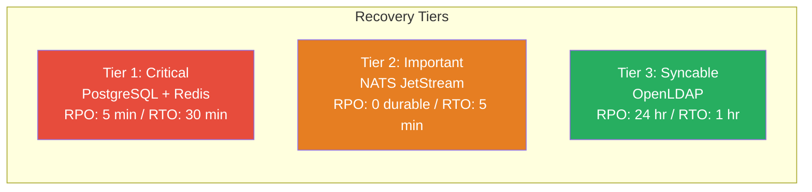
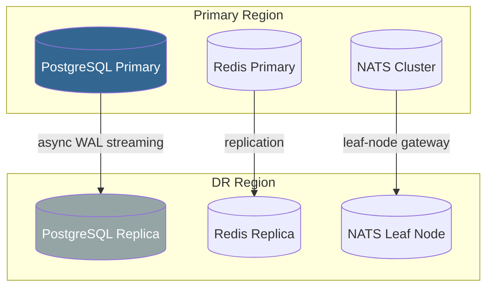

# Backup & Disaster Recovery

> Data backup strategy, RPO/RTO targets, and recovery procedures for all GGID components.

---

## Overview

GGID stores critical identity data across four persistence layers. This guide
covers backup configuration, restore procedures, and disaster recovery drills
for each component.

| Component | Backup Method | RPO | RTO |
|-----------|--------------|-----|-----|
| PostgreSQL | pg_basebackup + WAL archiving | 5 min | 30 min |
| Redis | AOF + RDB snapshots | 1 min | 5 min |
| NATS JetStream | File-based persistence + backup | 0 (durable) | 5 min |
| OpenLDAP | slapcat LDIF export | 24 hr | 1 hr |

---

## PostgreSQL Backup

### Continuous WAL Archiving

```ini
# postgresql.conf
wal_level = replica
archive_mode = on
archive_command = 'aws s3 cp %p s3://ggid-wal-archive/%f'
max_wal_size = 4GB
archive_timeout = 300  # Force WAL switch every 5 minutes
```

### Base Backup with pg_basebackup

```bash
#!/bin/bash
# backup-postgres.sh — Run daily
set -euo pipefail

TIMESTAMP=$(date +%Y%m%d_%H%M%S)
BACKUP_DIR="/backups/postgres/base_${TIMESTAMP}"
S3_BUCKET="s3://ggid-backups/postgres"

# Method 1: pg_basebackup (online, consistent)
PGPASSWORD=$PG_PASSWORD pg_basebackup \
  -h $PG_HOST \
  -U replication_user \
  -D $BACKUP_DIR \
  -Ft -z \          # tar format + gzip
  -Xs \             # streaming WAL during backup
  -P \              # progress
  -c fast           # fast checkpoint

# Upload to S3
aws s3 sync $BACKUP_DIR $S3_BUCKET/base_${TIMESTAMP}/

# Cleanup local (keep 7 days)
find /backups/postgres/ -maxdepth 1 -mtime +7 -exec rm -rf {} \;

# Cleanup S3 (keep 30 days)
aws s3 ls $S3_BUCKET/ | awk '{print $2}' | \
  while read dir; do
    date_str=$(echo $dir | grep -oE '[0-9]{8}')
    if [ $(date -d "${date_str:0:4}-${date_str:4:2}-${date_str:6:2} +%s" 2>/dev/null) ]; then
      age=$(( ($(date +%s) - $(date -d "${date_str:0:4}-${date_str:4:2}-${date_str:6:2}" +%s)) / 86400 ))
      [ $age -gt 30 ] && aws s3 rm $S3_BUCKET/$dir --recursive
    fi
  done

echo "Base backup completed: $TIMESTAMP"
```

### Point-in-Time Recovery (PITR)

```bash
#!/bin/bash
# restore-postgres-pitr.sh — Restore to a specific point in time

TARGET_TIME="2024-01-15 10:30:00 UTC"
BACKUP_DIR="/backups/postgres/base_20240115_020000"
PG_DATA="/var/lib/postgresql/data"

# 1. Stop PostgreSQL
pg_ctl stop -D $PG_DATA

# 2. Clear existing data
rm -rf $PG_DATA/*

# 3. Extract base backup
tar -xzf $BACKUP_DIR/base.tar.gz -C $PG_DATA

# 4. Configure recovery
cat >> $PG_DATA/postgresql.auto.conf << EOF
restore_command = 'aws s3 cp s3://ggid-wal-archive/%f %p'
recovery_target_time = '$TARGET_TIME'
recovery_target_action = 'promote'
EOF

touch $PG_DATA/recovery.signal

# 5. Start PostgreSQL (begins recovery automatically)
pg_ctl start -D $PG_DATA

# 6. Monitor recovery
tail -f $PG_DATA/log/postgresql-*.log | grep -i recovery
```

### Logical Backup with pg_dump (Supplemental)

```bash
# Daily logical backup (schema + data)
pg_dump -h $PG_HOST -U ggid -Fc -d ggid \
  > /backups/postgres/logical_$(date +%Y%m%d).dump

# Restore
pg_restore -h $PG_HOST -U ggid -d ggid -c \
  /backups/postgres/logical_20240115.dump
```

---

## Redis Backup

### AOF (Append-Only File) Persistence

```conf
# redis.conf
appendonly yes
appendfilename "appendonly.aof"
appendfsync everysec          # Balance between safety and performance
auto-aof-rewrite-percentage 100
auto-aof-rewrite-min-size 64mb

# RDB snapshots (supplemental)
save 900 1                    # 1 change in 15 min
save 300 10                   # 10 changes in 5 min
save 60 10000                 # 10000 changes in 1 min
```

### Backup Script

```bash
#!/bin/bash
# backup-redis.sh
TIMESTAMP=$(date +%Y%m%d_%H%M%S)
S3_BUCKET="s3://ggid-backups/redis"

# Method 1: BGSAVE (non-blocking)
redis-cli -h $REDIS_HOST -a $REDIS_PASSWORD BGSAVE

# Wait for save to complete
while [ "$(redis-cli -h $REDIS_HOST -a $REDIS_PASSWORD LASTSAVE)" -le "$START_TIME" ]; do
  sleep 1
done

# Copy RDB
docker exec ggid-redis cat /data/dump.rdb > /backups/redis/rdb_${TIMESTAMP}

# Copy AOF
docker exec ggid-redis cat /data/appendonly.aof > /backups/redis/aof_${TIMESTAMP}

# Upload to S3
aws s3 cp /backups/redis/rdb_${TIMESTAMP} $S3_BUCKET/rdb_${TIMESTAMP}
aws s3 cp /backups/redis/aof_${TIMESTAMP} $S3_BUCKET/aof_${TIMESTAMP}
```

### Restore Redis

```bash
#!/bin/bash
# restore-redis.sh

# Stop Redis
docker compose stop redis

# Replace data files
cp /backups/redis/rdb_20240115 dump.rdb
# Or: cp /backups/redis/aof_20240115 appendonly.aof

# Restart (Redis loads data on startup)
docker compose start redis

# Verify
redis-cli -h redis DBSIZE
```

---

## NATS JetStream Persistence

### Configuration

```yaml
# NATS config — persistent stream
jetstream:
  store_dir: /data/jetstream
  max_memory_store: 1GB
  max_file_store: 10GB

# Stream definition with file persistence
stream_config:
  name: AUDIT_EVENTS
  storage: file              # Persistent
  retention: limits          # Keep until max age/size
  max_age: 72h               # 72-hour retention
  max_msgs: 1000000
  replicas: 3                # RAFT replicated
```

### Backup Script

```bash
#!/bin/bash
# backup-nats.sh — Backup JetStream data
TIMESTAMP=$(date +%Y%m%d_%H%M%S)

# Method 1: Copy the file store directory
docker exec ggid-nats tar czf - /data/jetstream \
  > /backups/nats/jetstream_${TIMESTAMP}.tar.gz

# Method 2: Export stream data via NATS CLI
nats stream view AUDIT_EVENTS --json > /backups/nats/stream_meta_${TIMESTAMP}.json

# Upload
aws s3 cp /backups/nats/jetstream_${TIMESTAMP}.tar.gz s3://ggid-backups/nats/
```

### Restore NATS

```bash
# Stop NATS
docker compose stop nats

# Restore file store
tar -xzf /backups/nats/jetstream_20240115.tar.gz -C /data/nats/

# Start NATS
docker compose start nats

# Verify
nats stream ls
nats stream info AUDIT_EVENTS
```

---

## OpenLDAP Backup

### Export with slapcat

```bash
#!/bin/bash
# backup-ldap.sh — Export LDAP data to LDIF
TIMESTAMP=$(date +%Y%m%d_%H%M%S)

# Full database export
docker exec ggid-ldap slapcat \
  > /backups/ldap/ldap_${TIMESTAMP}.ldif

# Upload
aws s3 cp /backups/ldap/ldap_${TIMESTAMP}.ldif s3://ggid-backups/ldap/

# Keep 30 days locally
find /backups/ldap/ -mtime +30 -delete
```

### Restore LDAP

```bash
# Stop LDAP
docker compose stop ldap

# Clear existing data
docker exec ggid-ldap rm -rf /var/lib/ldap/*

# Import LDIF
docker exec -i ggid-ldap slapadd \
  < /backups/ldap/ldap_20240115.ldif

# Fix permissions
docker exec ggid-ldap chown -R ldap:ldap /var/lib/ldap

# Start LDAP
docker compose start ldap

# Verify
ldapsearch -x -H ldap://localhost:389 \
  -D "cn=admin,dc=example,dc=com" -w $LDAP_PASSWORD \
  -b "dc=example,dc=com" | grep numEntries
```

---

## RPO/RTO Targets



| Tier | Component | RPO | RTO | Backup Frequency |
|------|-----------|-----|-----|------------------|
| Critical | PostgreSQL | 5 min (WAL) | 30 min | Daily base + continuous WAL |
| Critical | Redis | 1 min (AOF) | 5 min | Every second (AOF) + RDB snapshots |
| Important | NATS JetStream | 0 (durable) | 5 min | File store replication (RAFT 3-node) |
| Syncable | OpenLDAP | 24 hr | 1 hr | Daily slapcat export |

---

## Recovery Drill Procedure

Run this procedure quarterly to validate backup integrity:

### Step 1: Simulate Database Loss

```bash
# In a test environment (NOT production)
docker compose stop postgres
docker volume rm ggid-pgdata
```

### Step 2: Restore from Backup

```bash
# Run PITR restore (see above)
./scripts/restore-postgres-pitr.sh

# Verify data integrity
psql -h localhost -U ggid -d ggid -c "
  SELECT
    (SELECT count(*) FROM users) AS user_count,
    (SELECT count(*) FROM credentials) AS cred_count,
    (SELECT count(*) FROM roles) AS role_count,
    (SELECT count(*) FROM audit_events) AS audit_count;
"
```

### Step 3: Restore Redis

```bash
./scripts/restore-redis.sh
redis-cli -h localhost DBSIZE  # Should match pre-failure count
```

### Step 4: Restore NATS

```bash
./scripts/restore-nats.sh
nats stream info AUDIT_EVENTS  # Should show correct message count
```

### Step 5: Restore LDAP

```bash
./scripts/restore-ldap.sh
ldapsearch -x -b "dc=example,dc=com" | grep numEntries
```

### Step 6: Validate Application

```bash
# Health checks
curl localhost:8080/healthz    # Gateway
curl localhost:8081/healthz    # Identity

# Functional test
curl -X POST localhost:8080/api/v1/auth/login \
  -H "Content-Type: application/json" \
  -d '{"username":"testuser","password":"TestPass123!"}'

# Expect: 200 + JWT token
```

### Step 7: Document Results

| Check | Expected | Actual | Pass/Fail |
|-------|----------|--------|-----------|
| PostgreSQL user count | Pre-failure count | _____ | ___ |
| Redis session count | Pre-failure count | _____ | ___ |
| NATS stream messages | Pre-failure count | _____ | ___ |
| LDAP entries | Pre-failure count | _____ | ___ |
| Login functional | 200 + JWT | _____ | ___ |
| Total recovery time | < 45 min | _____ | ___ |

---

## Automated Backup Schedule

```bash
# /etc/cron.d/ggid-backups

# PostgreSQL: continuous WAL (every 5 min via archive_command)
# PostgreSQL: daily base backup at 2 AM
0 2 * * * ggid /opt/ggid/scripts/backup-postgres.sh >> /var/log/ggid-backup.log 2>&1

# Redis: RDB snapshot every 5 min (via BGSAVE in redis.conf)
# Redis: daily backup upload at 2:30 AM
30 2 * * * ggid /opt/ggid/scripts/backup-redis.sh >> /var/log/ggid-backup.log 2>&1

# NATS: daily backup at 3 AM
0 3 * * * ggid /opt/ggid/scripts/backup-nats.sh >> /var/log/ggid-backup.log 2>&1

# LDAP: daily export at 3:30 AM
30 3 * * * ggid /opt/ggid/scripts/backup-ldap.sh >> /var/log/ggid-backup.log 2>&1

# Weekly full verification (restore test)
0 4 * * 0 ggid /opt/ggid/scripts/backup-verify.sh >> /var/log/ggid-backup.log 2>&1
```

---

## Cross-Region Replication

For disaster recovery with minimal RPO:



### Failover Procedure

1. **Promote DR database:** `pg_ctl promote -D $PG_DATA`
2. **Switch Redis:** Update Sentinel to promote DR Redis
3. **Update DNS:** Route traffic to DR region
4. **Verify:** Run smoke tests
5. **Backfill:** Once primary is restored, set up reverse replication

---

## References

- [High Availability](./high-availability.md) — Multi-instance deployment
- [Deployment Guide](./deployment.md) — Production setup
- [Helm Chart Guide](./helm-chart.md) — Kubernetes deployment

---

## RTO/RPO Targets

| Scenario | RPO (Data Loss) | RTO (Downtime) | Strategy |
|----------|:---------------:|:---------------:|----------|
| Single service crash | 0 | < 30s | Auto-restart (Docker/K8s) |
| Database failover | < 1s | < 30s | Streaming replication |
| AZ failure | < 1s | < 2m | Multi-AZ deployment |
| Region failure | < 5m | < 15m | Cross-region replica |
| Data corruption | < 15m | < 1h | PITR (Point-in-Time Recovery) |
| Ransomware | < 15m | < 4h | Immutable backups (S3 Object Lock) |

---

## DR Runbook

### Phase 1: Declare Incident (0-5 min)

```bash
# 1. Verify the scope of the disaster
docker ps --format '{{.Names}}: {{.Status}}'    # Docker
kubectl get pods -n ggid                          # Kubernetes

# 2. Check database connectivity
docker exec ggid-postgres pg_isready -U ggid

# 3. Declare incident and assemble response team
```

### Phase 2: Database Recovery (5-30 min)

```bash
# Option A: Failover to replica (if available)
# On the replica:
pg_ctl promote -D /var/lib/postgresql/data
# Update app connection strings to point to new primary

# Option B: Restore from backup (PITR)
# 1. Stop all services
docker compose stop

# 2. Restore latest base backup
wal-g backup-fetch /var/lib/postgresql/data LATEST

# 3. Create recovery config
cat > /var/lib/postgresql/data/recovery.signal << 'EOF'
EOF
cat >> /var/lib/postgresql/data/postgresql.conf << 'EOF'
restore_command = 'wal-g wal-fetch %f %p'
recovery_target_time = '2024-01-15T10:30:00Z'
recovery_target_action = 'promote'
EOF

# 4. Start PostgreSQL
pg_ctl start -D /var/lib/postgresql/data

# 5. Wait for recovery to complete (check logs)
tail -f /var/log/postgresql/postgresql.log | grep "recovery complete"
```

### Phase 3: Service Recovery (30-60 min)

```bash
# 1. Start infrastructure
docker compose up -d postgres redis nats

# 2. Wait for healthy
until docker exec ggid-postgres pg_isready; do sleep 2; done
until docker exec ggid-redis redis-cli ping; do sleep 2; done

# 3. Run migrations (idempotent — skips if up to date)
make migrate-up

# 4. Start services in dependency order
docker compose up -d auth identity oauth
sleep 10
docker compose up -d policy org audit
sleep 5
docker compose up -d gateway

# 5. Verify health
curl http://localhost:8080/healthz
```

### Phase 4: Validation (60-90 min)

```bash
# 1. Run E2E smoke tests
bash deploy/e2e-docker-test.sh

# 2. Verify audit log integrity
docker exec ggid-postgres psql -U ggid -c "
  SELECT COUNT(*) FROM audit_events WHERE created_at > NOW() - INTERVAL '1 hour';
"

# 3. Verify user count matches pre-disaster
docker exec ggid-postgres psql -U ggid -c "
  SELECT COUNT(*) FROM users WHERE status = 'active';
"

# 4. Check for data gaps
docker exec ggid-postgres psql -U ggid -c "
  SELECT DATE_TRUNC('hour', created_at), COUNT(*)
  FROM audit_events
  WHERE created_at > NOW() - INTERVAL '24 hours'
  GROUP BY 1 ORDER BY 1;
"
```

### Phase 5: Post-Incident (90+ min)

1. Document root cause and timeline
2. Verify all backups are functioning
3. Set up monitoring alerts for the failure mode
4. Schedule post-mortem review
5. Update DR runbook with lessons learned
- [Disaster Recovery](./disaster-recovery.md) — DR runbook
