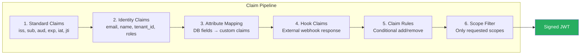

# JWT Custom Claims Guide

How to extend GGID JWTs with custom claims, attribute mapping, and OIDC scope configuration.

---

## Standard JWT Claims

GGID JWTs include these standard claims:

```json
{
  "iss": "ggid-auth",
  "sub": "550e8400-e29b-41d4-a716-446655440000",
  "aud": "ggid-api",
  "iat": 1720612860,
  "exp": 1720616460,
  "jti": "token-unique-id",
  "tenant_id": "00000000-0000-0000-0000-000000000001",
  "roles": ["admin", "editor"],
  "scopes": ["openid", "profile", "email"],
  "email": "john@example.com",
  "username": "john.doe"
}
```

---

## Custom Claims via Hooks

Use the `pre-token-issue` hook to inject custom claims:

### Hook Registration

```bash
POST /api/v1/auth/hooks
{
  "event": "pre-token-issue",
  "url": "https://yourapp.com/hooks/custom-claims",
  "secret": "hmac-secret",
  "enabled": true
}
```

### Hook Response

```json
{
  "action": "allow",
  "modify": {
    "claims": {
      "department": "engineering",
      "clearance_level": 5,
      "custom_role": "contractor"
    }
  }
}
```

The `claims` object is merged into the JWT. Custom claims appear alongside standard claims.

### Example Hook Server

```python
from flask import Flask, request, jsonify
import jwt, time

app = Flask(__name__)

@app.route("/hooks/custom-claims", methods=["POST"])
def custom_claims():
    data = request.json["data"]

    # Look up user in your system
    user_extra = lookup_user(data["user_id"])

    return jsonify({
        "action": "allow",
        "modify": {
            "claims": {
                "department": user_extra["department"],
                "clearance": user_extra["clearance_level"],
                "cost_center": user_extra["cost_center"]
            }
        }
    })
```

---

## Attribute Mapping

Map user profile fields and metadata to JWT claims:

### Configuration

```bash
PUT /api/v1/settings/claim-mapping
{
  "mappings": [
    {"source": "metadata.department", "claim": "department"},
    {"source": "metadata.title", "claim": "job_title"},
    {"source": "metadata.location", "claim": "office"},
    {"source": "phone", "claim": "phone_number"}
  ]
}
```

### Source Fields

| Source | Available | Example |
|--------|-----------|---------|
| `email` | Always | `john@example.com` |
| `username` | Always | `john.doe` |
| `phone` | If set | `+1234567890` |
| `display_name` | If set | `John Doe` |
| `locale` | If set | `en-US` |
| `timezone` | If set | `America/New_York` |
| `metadata.*` | Custom fields | `metadata.department` |

---

## Tenant-Specific Claims

Different tenants can have different claim configurations:

```bash
PUT /api/v1/tenants/{tenant_a}/claim-mapping
{
  "mappings": [
    {"source": "metadata.cost_center", "claim": "cost_center"}
  ]
}

PUT /api/v1/tenants/{tenant_b}/claim-mapping
{
  "mappings": [
    {"source": "metadata.division", "claim": "division"},
    {"source": "metadata clearance", "claim": "clearance"}
  ]
}
```

When a JWT is issued, only the issuing tenant's claim mapping applies.

---

## OIDC Scope Mapping

OIDC scopes control which claims are included in ID tokens and UserInfo responses:

| Scope | Claims Included |
|-------|----------------|
| `openid` | `sub` |
| `profile` | `name`, `username`, `locale`, `timezone` |
| `email` | `email`, `email_verified` |
| `phone` | `phone_number` |
| `roles` | `roles`, `permissions` |
| `tenant` | `tenant_id`, `tenant_name` |

### Custom Scopes

Register custom scopes for OAuth clients:

```bash
POST /api/v1/oauth/clients/{client_id}/scopes
{
  "name": "department",
  "description": "Access to department claim",
  "claims": ["department", "cost_center"]
}
```

### Request Scopes in Authorization

```bash
GET /oauth/authorize?
  client_id=xxx&
  scope=openid+profile+email+roles+department&
  redirect_uri=https://app.com/callback
```

The resulting JWT includes only claims for granted scopes.

---

## Claim Rules Engine

Define rules that dynamically set claims based on conditions:

```bash
POST /api/v1/settings/claim-rules
{
  "rules": [
    {
      "name": "Admin Extended TTL",
      "condition": {
        "roles": ["admin"]
      },
      "claims": {
        "access_level": "elevated"
      },
      "token_ttl_override": 900
    },
    {
      "name": "Remote Worker Flag",
      "condition": {
        "metadata.location": "remote"
      },
      "claims": {
        "remote_worker": true
      }
    }
  ]
}
```

Rules are evaluated in order. First matching rule's claims are applied.

---

## Security Considerations

1. **Don't put secrets in JWT** — JWTs are base64-encoded, not encrypted
2. **Keep JWT small** — Large claims increase header size for every request
3. **Validate custom claims** — Don't trust client-provided claim values
4. **Claim versioning** — If claim schema changes, old tokens still have old claims
5. **Hook timeout** — Claim hooks have 3s timeout; if exceeded, token issued without custom claims (fail-open)

---

## Accessing Claims in Your Application

### Go Middleware

```go
// After JWT verification, claims are in context
user := ggid.UserFromContext(r.Context())
// user.Roles, user.TenantID, user.CustomClaims["department"]
```

### Node.js

```typescript
const claims = await client.verifyToken(token);
const department = claims.department;
```

### Manual JWT Decode

```javascript
// Decode JWT payload (no verification — use SDK for verification)
const payload = JSON.parse(atob(token.split('.')[1]));
console.log(payload.department);
```

---

## JWT Claim Processing Pipeline

Claims are assembled through a multi-stage pipeline:



### Stage Details

| Stage | Source | Example Claims |
|-------|--------|---------------|
| Standard | Internal (Auth Service) | `iss`, `sub`, `aud`, `exp`, `iat`, `jti` |
| Identity | User record | `email`, `name`, `tenant_id`, `roles`, `groups` |
| Attribute Mapping | Configured DB fields | `department`, `employee_id`, `cost_center` |
| Hook | External webhook | `clearance_level`, `region`, `permissions[]` |
| Claim Rules | Rule engine | Conditional claims based on tenant/user attributes |
| Scope Filter | OAuth scopes | Only include claims allowed by granted scopes |

---

## Conditional Claims (Rules Engine)

Add claims conditionally based on user attributes:

```json
// PUT /api/v1/settings/claim-rules
{
  "rules": [
    {
      "name": "admin_clearance",
      "condition": {
        "roles": ["admin", "superadmin"]
      },
      "claims": {
        "clearance_level": "top-secret",
        "can_access_audit": true
      }
    },
    {
      "name": "enterprise_features",
      "condition": {
        "tenant_tier": "enterprise"
      },
      "claims": {
        "api_rate_limit": 1000,
        "features": ["sso", "scim", "webhooks", "custom_claims"]
      }
    },
    {
      "name": "region_restriction",
      "condition": {
        "user_metadata.country": "EU"
      },
      "claims": {
        "data_region": "eu-west-1",
        "gdpr_consent_required": true
      }
    }
  ]
}
```

### Rule Evaluation Order

Rules are evaluated in order. Later rules can override earlier claims:

```
1. admin_clearance       → clearance_level: "top-secret"
2. enterprise_features   → features: ["sso", "scim", ...]
3. region_restriction    → data_region: "eu-west-1"

Final JWT contains ALL matched claims, with later rules taking precedence.
```

---

## SAML Claim Mapping

For SAML SP-initiated SSO, claims map to SAML attributes:

```xml
<!-- SAML Assertion Attributes -->
<saml:Attribute Name="email">
  <saml:AttributeValue>user@test.com</saml:AttributeValue>
</saml:Attribute>
<saml:Attribute Name="department">
  <saml:AttributeValue>Engineering</saml:AttributeValue>
</saml:Attribute>
<saml:Attribute Name="roles">
  <saml:AttributeValue>admin</saml:AttributeValue>
  <saml:AttributeValue>viewer</saml:AttributeValue>
</saml:Attribute>
```

### SAML Attribute Mapping Config

```bash
# Configure attribute mapping for SAML responses
PUT /api/v1/saml/attribute-mapping
{
  "mappings": [
    {
      "saml_attribute": "email",
      "source": "user.email"
    },
    {
      "saml_attribute": "department",
      "source": "user_metadata.department"
    },
    {
      "saml_attribute": "roles",
      "source": "user.roles",
      "multi_value": true
    }
  ]
}
```

---

## Scope-Based Claim Filtering

Not all claims are included in every token. Claims are filtered by the OAuth scopes granted:

| Scope | Claims Included |
|-------|----------------|
| `openid` | `sub`, `iss`, `aud`, `exp`, `iat` |
| `profile` | `name`, `family_name`, `given_name`, `picture` |
| `email` | `email`, `email_verified` |
| `roles` | `roles[]`, `groups[]`, `permissions[]` |
| `custom.department` | `department`, `cost_center` |
| `offline_access` | Issues refresh token |

### Scope Validation

```go
// Example: only include department claim if scope is granted
func buildClaims(user User, scopes []string) jwt.MapClaims {
    claims := jwt.MapClaims{
        "sub":   user.ID,
        "email": user.Email,
        "name":  user.Name,
    }

    if contains(scopes, "roles") {
        claims["roles"] = user.Roles
        claims["groups"] = user.Groups
    }

    if contains(scopes, "custom.department") {
        claims["department"] = user.Metadata["department"]
        claims["cost_center"] = user.Metadata["cost_center"]
    }

    return claims
}
```

---

## Testing Custom Claims

### Verify Token Contents

```bash
# Get a token
TOKEN=$(curl -sX POST $API/api/v1/auth/login \
  -H "Content-Type: application/json" \
  -d '{"username":"alice","password":"..."}' | jq -r .access_token)

# Decode and inspect claims (no verification)
echo $TOKEN | cut -d. -f2 | base64 -d 2>/dev/null | jq .

# Expected output:
# {
#   "sub": "uuid-here",
#   "email": "alice@test.com",
#   "tenant_id": "00000000-0000-0000-0000-000000000001",
#   "roles": ["admin"],
#   "department": "Engineering",
#   "clearance_level": "top-secret",
#   "exp": 1699999999,
#   "iat": 1699999099
# }
```

### Test via Hook Server

```go
// Simple test hook server that adds claims
func main() {
    http.HandleFunc("/claims", func(w http.ResponseWriter, r *http.Request) {
        var req struct {
            UserID   string `json:"user_id"`
            TenantID string `json:"tenant_id"`
        }
        json.NewDecoder(r.Body).Decode(&req)

        // Add custom claims
        json.NewEncoder(w).Encode(map[string]interface{}{
            "department":     "Engineering",
            "clearance":      "level-5",
            "cost_center":    "CC-1234",
        })
    })
    http.ListenAndServe(":9999", nil)
}
```
