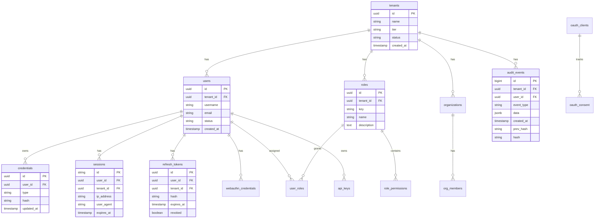

# GGID Database Schema

Entity relationship diagram, table descriptions, indexes, RLS policies, and
migration sequence for the GGID PostgreSQL database.

---

## Table of Contents

- [Entity Relationship Diagram](#entity-relationship-diagram)
- [Table Reference](#table-reference)
- [Indexes](#indexes)
- [Row-Level Security Policies](#row-level-security-policies)
- [Migration Sequence](#migration-sequence)

---

## Entity Relationship Diagram



---

## Table Reference

### tenants

The root entity for multi-tenancy. Every other table references `tenant_id`.

| Column | Type | Nullable | Default | Description |
|--------|------|----------|---------|-------------|
| `id` | UUID | No | `gen_random_uuid()` | Primary key |
| `name` | VARCHAR(255) | No | — | Tenant display name |
| `slug` | VARCHAR(100) | No | — | URL-safe identifier |
| `tier` | VARCHAR(20) | No | `'free'` | `free`/`starter`/`pro`/`enterprise` |
| `status` | VARCHAR(20) | No | `'active'` | `active`/`suspended`/`deleted` |
| `features` | JSONB | Yes | `'{}'` | Feature flags |
| `branding` | JSONB | Yes | `'{}'` | Logo/colors/fonts |
| `created_at` | TIMESTAMPTZ | No | `now()` | Creation timestamp |
| `updated_at` | TIMESTAMPTZ | No | `now()` | Last update |

**RLS:** Not applicable (superadmin-only table, no tenant_id filter).

---

### users

| Column | Type | Nullable | Description |
|--------|------|----------|-------------|
| `id` | UUID | No | Primary key |
| `tenant_id` | UUID | No | FK to tenants |
| `username` | VARCHAR(100) | No | Unique per tenant |
| `email` | VARCHAR(255) | No | Unique per tenant |
| `name` | VARCHAR(255) | Yes | Full name |
| `status` | VARCHAR(20) | No | `active`/`suspended`/`deleted` |
| `email_verified` | BOOLEAN | No | Email verification status |
| `phone` | VARCHAR(20) | Yes | Phone number |
| `metadata` | JSONB | Yes | Custom attributes |
| `last_login_at` | TIMESTAMPTZ | Yes | Last successful login |
| `created_at` | TIMESTAMPTZ | No | Creation timestamp |
| `updated_at` | TIMESTAMPTZ | No | Last update |

**Indexes:** `uniq_users_tenant_username`, `uniq_users_tenant_email`
**RLS:** Enabled

---

### credentials

Stores password hashes and other credential types.

| Column | Type | Nullable | Description |
|--------|------|----------|-------------|
| `id` | UUID | No | Primary key |
| `user_id` | UUID | No | FK to users |
| `tenant_id` | UUID | No | FK to tenants (for RLS) |
| `type` | VARCHAR(20) | No | `password`/`ldap`/`oauth` |
| `identifier` | VARCHAR(255) | Yes | External ID (for LDAP/OAuth) |
| `hash` | TEXT | Yes | bcrypt/Argon2id hash |
| `created_at` | TIMESTAMPTZ | No | Creation timestamp |
| `updated_at` | TIMESTAMPTZ | No | Last update |

**RLS:** Enabled

---

### roles

| Column | Type | Nullable | Description |
|--------|------|----------|-------------|
| `id` | UUID | No | Primary key |
| `tenant_id` | UUID | No | FK to tenants |
| `key` | VARCHAR(50) | No | Unique key per tenant (e.g., `admin`) |
| `name` | VARCHAR(100) | No | Display name |
| `description` | TEXT | Yes | Description |

**Indexes:** `uniq_roles_tenant_key`
**RLS:** Enabled

---

### role_permissions

Maps roles to permissions (many-to-many).

| Column | Type | Description |
|--------|------|-------------|
| `role_id` | UUID | FK to roles |
| `permission` | VARCHAR(100) | Permission string (e.g., `users:read`) |

**Primary Key:** `(role_id, permission)`

---

### user_roles

Maps users to roles (many-to-many).

| Column | Type | Description |
|--------|------|-------------|
| `user_id` | UUID | FK to users |
| `role_id` | UUID | FK to roles |
| `tenant_id` | UUID | For RLS |
| `assigned_at` | TIMESTAMPTZ | Assignment timestamp |

**Primary Key:** `(user_id, role_id)`

---

### organizations

| Column | Type | Description |
|--------|------|-------------|
| `id` | UUID | Primary key |
| `tenant_id` | UUID | FK to tenants |
| `name` | VARCHAR(255) | Org name |
| `slug` | VARCHAR(100) | URL-safe identifier |
| `parent_id` | UUID | Parent org (nullable, for hierarchy) |
| `created_at` | TIMESTAMPTZ | Creation timestamp |

**RLS:** Enabled

---

### org_members

| Column | Type | Description |
|--------|------|-------------|
| `org_id` | UUID | FK to organizations |
| `user_id` | UUID | FK to users |
| `tenant_id` | UUID | For RLS |
| `role` | VARCHAR(50) | Member role in org |

**Primary Key:** `(org_id, user_id)`

---

### sessions

| Column | Type | Description |
|--------|------|-------------|
| `id` | VARCHAR(64) | Primary key (random token) |
| `user_id` | UUID | FK to users |
| `tenant_id` | UUID | FK to tenants |
| `ip_address` | VARCHAR(45) | Client IP |
| `user_agent` | TEXT | Browser UA |
| `expires_at` | TIMESTAMPTZ | Session expiry |
| `created_at` | TIMESTAMPTZ | Creation timestamp |

**RLS:** Enabled

---

### refresh_tokens

| Column | Type | Description |
|--------|------|-------------|
| `id` | UUID | Primary key |
| `user_id` | UUID | FK to users |
| `tenant_id` | UUID | FK to tenants |
| `hash` | VARCHAR(64) | SHA-256 hash of token |
| `expires_at` | TIMESTAMPTZ | Token expiry |
| `revoked` | BOOLEAN | Whether token is revoked |
| `created_at` | TIMESTAMPTZ | Creation timestamp |

**Index:** `idx_refresh_tokens_hash` on `hash`
**RLS:** Enabled

---

### webauthn_credentials

| Column | Type | Description |
|--------|------|-------------|
| `id` | UUID | Primary key |
| `user_id` | UUID | FK to users |
| `tenant_id` | UUID | For RLS |
| `credential_id` | BYTEA | WebAuthn credential ID |
| `public_key` | BYTEA | COSE public key |
| `attestation_type` | VARCHAR(50) | Attestation format |
| `transports` | TEXT[] | Authenticator transports |
| `name` | VARCHAR(100) | User-assigned name |
| `sign_count` | INTEGER | Signature counter |
| `created_at` | TIMESTAMPTZ | Registration timestamp |

**RLS:** Enabled

---

### api_keys

| Column | Type | Description |
|--------|------|-------------|
| `id` | UUID | Primary key |
| `user_id` | UUID | FK to users |
| `tenant_id` | UUID | FK to tenants |
| `name` | VARCHAR(100) | Description |
| `key_hash` | VARCHAR(64) | SHA-256 hash |
| `key_prefix` | VARCHAR(10) | First 8 chars (for identification) |
| `scopes` | TEXT[] | Permission scopes |
| `expires_at` | TIMESTAMPTZ | Expiry (nullable) |
| `last_used_at` | TIMESTAMPTZ | Last API call |
| `created_at` | TIMESTAMPTZ | Creation timestamp |

**RLS:** Enabled

---

### organizations

Organizational units within a tenant (groups, departments).

| Column | Type | Notes |
|--------|------|-------|
| `id` | UUID | PK |
| `tenant_id` | UUID | FK to tenants (RLS) |
| `name` | VARCHAR(200) | Org display name |
| `slug` | VARCHAR(100) | URL-friendly identifier |
| `parent_id` | UUID | FK to organizations (nullable, for hierarchy) |
| `metadata` | JSONB | Arbitrary org metadata |
| `created_at` | TIMESTAMPTZ | Creation timestamp |
| `updated_at` | TIMESTAMPTZ | Last update |

**Indexes:** `uniq_orgs_tenant_slug`
**RLS:** Enabled

### organization_members

Maps users to organizations (many-to-many).

| Column | Type | Notes |
|--------|------|-------|
| `org_id` | UUID | FK to organizations |
| `user_id` | UUID | FK to users |
| `role` | VARCHAR(50) | Role within org (admin/member/viewer) |
| `joined_at` | TIMESTAMPTZ | Membership start |

**Index:** `idx_org_members_org_user` (org_id, user_id)
**RLS:** Enabled

---

### policies

ABAC policy rules for fine-grained access control.

| Column | Type | Notes |
|--------|------|-------|
| `id` | UUID | PK |
| `tenant_id` | UUID | FK to tenants (RLS) |
| `name` | VARCHAR(200) | Policy name |
| `effect` | VARCHAR(10) | `allow` or `deny` |
| `conditions` | JSONB | Attribute conditions (array of {attribute, operator, value}) |
| `applies_to` | JSONB | Target actions (e.g., `["auth.login", "users:read"]`) |
| `priority` | INTEGER | Evaluation order (lower = higher priority) |
| `enabled` | BOOLEAN | Policy active flag |
| `created_at` | TIMESTAMPTZ | Creation timestamp |

**Index:** `idx_policies_tenant` (tenant_id, enabled, priority)
**RLS:** Enabled

---

### audit_events

Append-only audit log with hash chaining for tamper detection.

| Column | Type | Description |
|--------|------|-------------|
| `id` | BIGSERIAL | Primary key |
| `tenant_id` | UUID | FK to tenants |
| `user_id` | UUID | Acting user (nullable for system events) |
| `event_type` | VARCHAR(50) | Event type (e.g., `auth.login`) |
| `data` | JSONB | Event payload |
| `ip_address` | VARCHAR(45) | Source IP |
| `prev_hash` | VARCHAR(64) | SHA-256 hash of previous event |
| `hash` | VARCHAR(64) | SHA-256 hash of this event |
| `created_at` | TIMESTAMPTZ | Event timestamp |

**Indexes:** `idx_audit_tenant_created`, `idx_audit_event_type`, `idx_audit_user_id`
**RLS:** Enabled

---

### oauth_clients

| Column | Type | Description |
|--------|------|-------------|
| `id` | UUID | Primary key |
| `tenant_id` | UUID | FK to tenants |
| `client_id` | VARCHAR(100) | OAuth client identifier |
| `client_secret` | TEXT | Hashed secret |
| `name` | VARCHAR(100) | Display name |
| `redirect_uris` | TEXT[] | Allowed redirect URIs |
| `grant_types` | TEXT[] | Supported grant types |
| `scopes` | TEXT[] | Available scopes |

**Index:** `uniq_oauth_clients_tenant_client_id`
**RLS:** Enabled

---

## Indexes

### Performance-Critical Indexes

```sql
-- User lookups (frequent)
CREATE UNIQUE INDEX uniq_users_tenant_username ON users (tenant_id, username);
CREATE UNIQUE INDEX uniq_users_tenant_email ON users (tenant_id, email);

-- Role lookups
CREATE UNIQUE INDEX uniq_roles_tenant_key ON roles (tenant_id, key);

-- Audit queries (time-range + event type)
CREATE INDEX idx_audit_tenant_created ON audit_events (tenant_id, created_at DESC);
CREATE INDEX idx_audit_event_type ON audit_events (tenant_id, event_type);
CREATE INDEX idx_audit_user_id ON audit_events (tenant_id, user_id);

-- Token validation
CREATE INDEX idx_refresh_tokens_hash ON refresh_tokens (hash);
CREATE INDEX idx_sessions_expires ON sessions (expires_at);

-- OAuth client lookup
CREATE UNIQUE INDEX uniq_oauth_clients_tenant_client_id
    ON oauth_clients (tenant_id, client_id);

-- API key validation
CREATE INDEX idx_api_keys_hash ON api_keys (key_hash);
```

---

## Row-Level Security Policies

All tenant-scoped tables have identical RLS policies:

```sql
-- Pattern applied to every tenant-scoped table
ALTER TABLE {table} ENABLE ROW LEVEL SECURITY;
ALTER TABLE {table} FORCE ROW LEVEL SECURITY;

CREATE POLICY tenant_isolation ON {table}
    FOR ALL
    USING (tenant_id = current_setting('app.tenant_id')::uuid);
```

### Tables with RLS

| Table | RLS Enabled | Force RLS |
|-------|-------------|-----------|
| `users` | Yes | Yes |
| `credentials` | Yes | Yes |
| `roles` | Yes | Yes |
| `role_permissions` | Yes (via role join) | Yes |
| `user_roles` | Yes | Yes |
| `organizations` | Yes | Yes |
| `org_members` | Yes | Yes |
| `sessions` | Yes | Yes |
| `refresh_tokens` | Yes | Yes |
| `webauthn_credentials` | Yes | Yes |
| `api_keys` | Yes | Yes |
| `audit_events` | Yes | Yes |
| `oauth_clients` | Yes | Yes |

### Tenant Context Per Transaction

```sql
-- Set at the start of each transaction
SET LOCAL app.tenant_id = '00000000-0000-0000-0000-000000000001';

-- All queries within this transaction are automatically scoped
SELECT * FROM users;  -- Only returns this tenant's users
```

---

## Migration Sequence

Migrations are forward-only and applied in order:

```
deploy/migrations/
├── 001_create_tenants.sql
├── 002_create_users.sql
├── 003_create_credentials.sql
├── 004_create_roles_permissions.sql
├── 005_create_organizations.sql
├── 006_create_sessions_tokens.sql
├── 007_create_audit_events.sql
├── 008_create_oauth_clients.sql
├── 009_create_webauthn_credentials.sql
├── 010_create_api_keys.sql
├── 011_enable_rls_policies.sql
├── 012_create_indexes.sql
└── 013_seed_default_tenant.sql
```

### Migration Commands

```bash
# Apply all pending migrations
bash deploy/migrate.sh

# Check current migration version
psql -c "SELECT version FROM schema_migrations ORDER BY version DESC LIMIT 1;"

# Verify all tables exist
psql -c "\dt" | grep -E 'tenants|users|roles|audit'
```

### Migration Safety Rules

1. **Forward-only** — No down migrations in production
2. **Additive changes** — Add columns nullable, create new tables
3. **Backfill in batches** — Never `UPDATE` all rows in one statement
4. **Create indexes concurrently** — `CREATE INDEX CONCURRENTLY` (no lock)
5. **Deprecate across releases** — Stop writing → stop reading → drop column

---

## References

- [Multi-Tenancy Guide](./multi-tenancy-guide.md) — RLS deep dive
- [Deployment Guide](./deployment-guide.md) — Database setup
- [Configuration Reference](./configuration-reference.md) — DB env vars

---

## Auth Service Tables

### credentials

```sql
CREATE TABLE credentials (
    id              UUID PRIMARY KEY DEFAULT gen_random_uuid(),
    tenant_id       UUID NOT NULL REFERENCES tenants(id),
    user_id         UUID NOT NULL REFERENCES users(id),
    identity_type   VARCHAR(32) NOT NULL DEFAULT 'password',
    identifier      VARCHAR(255) NOT NULL,
    secret_hash     TEXT,
    metadata        JSONB DEFAULT '{}',
    verified        BOOLEAN DEFAULT FALSE,
    last_used_at    TIMESTAMPTZ,
    expires_at      TIMESTAMPTZ,
    created_at      TIMESTAMPTZ NOT NULL DEFAULT NOW(),
    updated_at      TIMESTAMPTZ NOT NULL DEFAULT NOW(),
    UNIQUE(tenant_id, identity_type, identifier)
);

CREATE INDEX idx_credentials_user ON credentials(tenant_id, user_id);
CREATE INDEX idx_credentials_lookup ON credentials(tenant_id, identity_type, identifier);
```

### sessions

```sql
CREATE TABLE sessions (
    id              UUID PRIMARY KEY DEFAULT gen_random_uuid(),
    tenant_id       UUID NOT NULL,
    user_id         UUID NOT NULL,
    session_token   VARCHAR(512) NOT NULL,
    refresh_token   VARCHAR(512),
    ip_address      INET,
    user_agent      TEXT,
    device_type     VARCHAR(32),
    expires_at      TIMESTAMPTZ NOT NULL,
    idle_expires_at TIMESTAMPTZ,
    revoked         BOOLEAN DEFAULT FALSE,
    revoked_reason  VARCHAR(128),
    created_at      TIMESTAMPTZ NOT NULL DEFAULT NOW(),
    last_activity   TIMESTAMPTZ NOT NULL DEFAULT NOW(),
    UNIQUE(session_token)
);

CREATE INDEX idx_sessions_user ON sessions(tenant_id, user_id);
CREATE INDEX idx_sessions_expires ON sessions(expires_at) WHERE revoked = FALSE;
```

### mfa_factors

```sql
CREATE TABLE mfa_factors (
    id              UUID PRIMARY KEY DEFAULT gen_random_uuid(),
    tenant_id       UUID NOT NULL,
    user_id         UUID NOT NULL,
    method          VARCHAR(32) NOT NULL,  -- 'totp', 'sms', 'webauthn'
    secret          TEXT,                  -- TOTP secret (encrypted)
    phone           VARCHAR(32),           -- SMS method
    verified        BOOLEAN DEFAULT FALSE,
    enabled         BOOLEAN DEFAULT FALSE,
    backup_codes    TEXT[],                -- Hashed backup codes
    created_at      TIMESTAMPTZ NOT NULL DEFAULT NOW(),
    UNIQUE(tenant_id, user_id, method)
);
```

## OAuth Service Tables

### oauth_clients

```sql
CREATE TABLE oauth_clients (
    id                  UUID PRIMARY KEY DEFAULT gen_random_uuid(),
    tenant_id           UUID NOT NULL,
    client_id           VARCHAR(128) NOT NULL UNIQUE,
    client_secret_hash  TEXT,
    name                VARCHAR(256) NOT NULL,
    description         TEXT,
    grant_types         TEXT[] NOT NULL DEFAULT ARRAY['authorization_code'],
    response_types      TEXT[] NOT NULL DEFAULT ARRAY['code'],
    redirect_uris       TEXT[] NOT NULL DEFAULT '{}',
    scopes              TEXT[] NOT NULL DEFAULT '{}',
    pkce_required       BOOLEAN DEFAULT TRUE,
    token_endpoint_auth VARCHAR(32) DEFAULT 'client_secret_post',
    access_token_ttl    INTEGER DEFAULT 900,
    refresh_token_ttl   INTEGER DEFAULT 86400,
    status              VARCHAR(16) DEFAULT 'active',
    metadata            JSONB DEFAULT '{}',
    created_at          TIMESTAMPTZ NOT NULL DEFAULT NOW(),
    updated_at          TIMESTAMPTZ NOT NULL DEFAULT NOW()
);

CREATE INDEX idx_oauth_clients_tenant ON oauth_clients(tenant_id);
```

### oauth_authorization_codes

```sql
CREATE TABLE oauth_authorization_codes (
    id                  UUID PRIMARY KEY DEFAULT gen_random_uuid(),
    tenant_id           UUID NOT NULL,
    client_id           VARCHAR(128) NOT NULL,
    user_id             UUID,
    code_hash           VARCHAR(64) NOT NULL,
    redirect_uri        TEXT NOT NULL,
    scopes              TEXT[] NOT NULL DEFAULT '{}',
    code_challenge      VARCHAR(256),
    code_challenge_method VARCHAR(8),
    nonce               VARCHAR(128),
    expires_at          TIMESTAMPTZ NOT NULL,
    used                BOOLEAN DEFAULT FALSE,
    created_at          TIMESTAMPTZ NOT NULL DEFAULT NOW(),
    UNIQUE(code_hash)
);

CREATE INDEX idx_oauth_codes_expiry ON oauth_authorization_codes(expires_at);
```

### oauth_refresh_tokens

```sql
CREATE TABLE oauth_refresh_tokens (
    id              UUID PRIMARY KEY DEFAULT gen_random_uuid(),
    tenant_id       UUID NOT NULL,
    user_id         UUID,
    client_id       VARCHAR(128) NOT NULL,
    token_hash      VARCHAR(64) NOT NULL,
    family_id       UUID NOT NULL,
    scopes          TEXT[] NOT NULL DEFAULT '{}',
    used            BOOLEAN DEFAULT FALSE,
    expires_at      TIMESTAMPTZ NOT NULL,
    revoked         BOOLEAN DEFAULT FALSE,
    created_at      TIMESTAMPTZ NOT NULL DEFAULT NOW(),
    UNIQUE(token_hash)
);

CREATE INDEX idx_refresh_tokens_family ON oauth_refresh_tokens(family_id);
CREATE INDEX idx_refresh_tokens_user ON oauth_refresh_tokens(tenant_id, user_id);
```

## WebAuthn Tables

### webauthn_credentials

```sql
CREATE TABLE webauthn_credentials (
    id                  UUID PRIMARY KEY DEFAULT gen_random_uuid(),
    tenant_id           UUID NOT NULL,
    user_id             UUID NOT NULL,
    credential_id       BYTEA NOT NULL,
    public_key          BYTEA NOT NULL,
    attestation_format  VARCHAR(32) NOT NULL,
    aaguid              UUID,
    sign_count          BIGINT NOT NULL DEFAULT 0,
    transports          TEXT[],
    device_type         VARCHAR(32),
    backed_up           BOOLEAN DEFAULT FALSE,
    name                VARCHAR(128),
    created_at          TIMESTAMPTZ NOT NULL DEFAULT NOW(),
    last_used_at        TIMESTAMPTZ,
    UNIQUE(tenant_id, credential_id)
);
```

## RLS Policy Reference

All tenant-scoped tables have this RLS policy pattern:

```sql
-- Enable RLS
ALTER TABLE {table} ENABLE ROW LEVEL SECURITY;

-- Policy: users can only see their tenant's data
CREATE POLICY tenant_isolation ON {table}
    USING (tenant_id::text = current_setting('app.tenant_id', true));

-- Force RLS even for table owners (except superuser/BYPASSRLS)
ALTER TABLE {table} FORCE ROW LEVEL SECURITY;
```

### Tables with RLS Enabled

| Table | Service | Tenant Column |
|-------|---------|---------------|
| users | Identity | tenant_id |
| groups | Identity | tenant_id |
| group_members | Identity | tenant_id |
| credentials | Auth | tenant_id |
| sessions | Auth | tenant_id |
| mfa_factors | Auth | tenant_id |
| webauthn_credentials | Auth | tenant_id |
| oauth_clients | OAuth | tenant_id |
| oauth_authorization_codes | OAuth | tenant_id |
| oauth_refresh_tokens | OAuth | tenant_id |
| oauth_consents | OAuth | tenant_id |
| roles | Policy | tenant_id |
| role_assignments | Policy | tenant_id |
| policies | Policy | tenant_id |
| orgs | Org | tenant_id |
| org_members | Org | tenant_id |
| audit_events | Audit | tenant_id |
