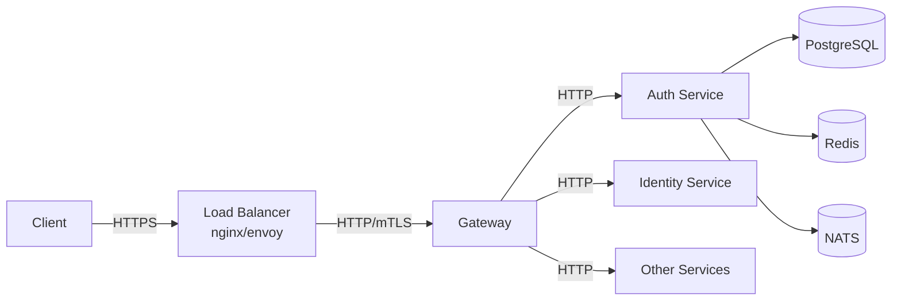

# GGID Deployment Guide

Production deployment guide for the GGID IAM platform. Covers Docker Compose,
Kubernetes with Helm, environment configuration, database setup, and TLS.

---

## Table of Contents

- [Prerequisites](#prerequisites)
- [Quick Start (Docker Compose)](#quick-start-docker-compose)
- [Kubernetes with Helm](#kubernetes-with-helm)
- [Environment Variables Reference](#environment-variables-reference)
- [Database Setup](#database-setup)
- [Redis Setup](#redis-setup)
- [NATS JetStream Setup](#nats-jetstream-setup)
- [LDAP Setup](#ldap-setup)
- [TLS Configuration](#tls-configuration)
- [Secrets Management](#secrets-management)
- [Post-Deployment Verification](#post-deployment-verification)

---

## Prerequisites

### Minimum Hardware

| Component | CPU | RAM | Disk | Use Case |
|-----------|-----|-----|------|----------|
| Single-node | 4 vCPU | 8GB | 50GB SSD | Dev / staging / small prod |
| Production (3-node) | 8 vCPU each | 16GB each | 100GB SSD each | HA production |
| Database | 4 vCPU | 16GB | 500GB SSD | Dedicated PostgreSQL |

### Software Requirements

- **Docker** 24.0+ and **Docker Compose** v2.20+
- **Kubernetes** 1.28+ (for K8s deployment)
- **Helm** 3.13+ (for K8s deployment)
- **Go** 1.25+ (for building from source)
- **PostgreSQL** 16+
- **Redis** 7+
- **NATS** 2.10+ (with JetStream enabled)

---

## Quick Start (Docker Compose)

The fastest way to get GGID running is via the reference Docker Compose stack in
`deploy/`.

### 1. Clone and Configure

```bash
git clone https://github.com/ggid/ggid.git
cd ggid

# Copy environment template
cp deploy/.env.example deploy/.env

# Edit with your settings
vim deploy/.env
```

### 2. Generate RSA Keys

GGID requires an RSA key pair for JWT signing:

```bash
# Generate private key
openssl genrsa -out deploy/keys/jwt-private.pem 2048

# Extract public key
openssl rsa -in deploy/keys/jwt-private.pem -pubout -out deploy/keys/jwt-public.pem

# Set permissions
chmod 600 deploy/keys/jwt-private.pem
```

### 3. Start the Stack

```bash
cd deploy

# Start all services
docker compose up -d

# Wait for healthchecks to pass (~30 seconds)
docker compose ps
```

### 4. Verify

```bash
# Gateway health
curl http://localhost:8080/healthz
# Expected: {"status":"ok"}

# Run E2E test
bash deploy/e2e-docker-test.sh
```

### Service Ports

| Service | Host Port | Container Port | Protocol |
|---------|-----------|----------------|----------|
| Gateway | 8080 | 8080 | HTTP |
| Identity | 8081 | 8080 | HTTP + gRPC |
| Auth | 9001 | 9001 | HTTP |
| OAuth | 9005 | 9005 | HTTP |
| Policy | 8070 | 8070 | HTTP |
| Org | 8071 | 8071 | HTTP |
| Audit | 8072 | 8072 | HTTP |
| Console | 3000 | 3000 | HTTP |
| PostgreSQL | 5432 | 5432 | TCP |
| Redis | 6379 | 6379 | TCP |
| NATS | 4222 | 4222 | TCP |
| NATS Monitoring | 8222 | 8222 | HTTP |
| LDAP | 389 | 389 | TCP |

### Docker Compose Commands

```bash
# Start (detached)
docker compose up -d

# Stop (keep volumes)
docker compose down

# Stop (remove volumes — WARNING: deletes all data)
docker compose down -v

# View logs
docker compose logs -f gateway
docker compose logs -f auth

# Rebuild after code changes
docker compose build --no-cache gateway
docker compose up -d gateway

# Scale a service (stateless only)
docker compose up -d --scale gateway=3
```

---

## Kubernetes with Helm

### 1. Add the GGID Helm Repository

```bash
helm repo add ggid https://charts.ggid.dev
helm repo update
```

### 2. Create a Values File

```yaml
# ggid-values.yaml
global:
  imageRegistry: ghcr.io/ggid
  imageTag: "latest"
  imagePullSecrets:
    - name: ghcr-pull-secret

# Gateway
gateway:
  replicas: 3
  resources:
    requests:
      cpu: 250m
      memory: 128Mi
    limits:
      cpu: 1000m
      memory: 512Mi
  ingress:
    enabled: true
    className: nginx
    host: iam.example.com
    tls:
      enabled: true
      secretName: ggid-tls

# Auth Service
auth:
  replicas: 2
  resources:
    requests:
      cpu: 500m
      memory: 256Mi
    limits:
      cpu: 2000m
      memory: 1Gi

# Identity Service
identity:
  replicas: 2

# PostgreSQL
postgresql:
  enabled: true
  primary:
    persistence:
      size: 100Gi
      storageClass: fast-ssd
  auth:
    username: ggid
    database: ggid
    existingSecret: ggid-db-secret

# Redis
redis:
  enabled: true
  architecture: standalone
  auth:
    existingSecret: ggid-redis-secret

# NATS
nats:
  enabled: true
  jetstream:
    enabled: true
    fileStore:
      enabled: true
      size: 10Gi
```

### 3. Install

```bash
# Create namespace
kubectl create namespace ggid

# Create secrets
kubectl create secret generic ggid-db-secret \
  --from-literal=password=$(openssl rand -base64 32) \
  -n ggid

kubectl create secret generic ggid-jwt-key \
  --from-file=private-key=./jwt-private.pem \
  -n ggid

# Install chart
helm install ggid ggid/ggid \
  -f ggid-values.yaml \
  -n ggid

# Check rollout
kubectl rollout status deployment/ggid-gateway -n ggid
```

### 4. Configure Ingress TLS

```bash
# Using cert-manager for automatic Let's Encrypt certs
kubectl apply -f - <<EOF
apiVersion: cert-manager.io/v1
kind: Certificate
metadata:
  name: ggid-tls
  namespace: ggid
spec:
  secretName: ggid-tls
  issuerRef:
    name: letsencrypt-prod
    kind: ClusterIssuer
  dnsNames:
    - iam.example.com
EOF
```

---

## Environment Variables Reference

### Gateway

| Variable | Default | Required | Description |
|----------|---------|----------|-------------|
| `GATEWAY_PORT` | `8080` | No | HTTP listen port |
| `GATEWAY_DOMAIN_SUFFIX` | — | No | Custom domain suffix for hosted pages |
| `AUTH_SERVICE_URL` | `auth:9001` | Yes | Auth service address |
| `IDENTITY_SERVICE_URL` | `identity:8080` | Yes | Identity service address |
| `OAUTH_SERVICE_URL` | `oauth:9005` | Yes | OAuth service address |
| `POLICY_SERVICE_URL` | `policy:8070` | Yes | Policy service address |
| `ORG_SERVICE_URL` | `org:8071` | Yes | Org service address |
| `AUDIT_SERVICE_URL` | `audit:8072` | Yes | Audit service address |
| `JWT_PUBLIC_KEY_PATH` | `/etc/ggid/keys/jwt-public.pem` | Yes | Path to JWT public key |
| `REDIS_URL` | `redis://redis:6379` | Yes | Redis connection string |
| `RATE_LIMIT_FAIL_MODE` | `open` | No | `open` or `closed` when Redis is down |
| `LOG_LEVEL` | `info` | No | `debug`, `info`, `warn`, `error` |

### Auth Service

| Variable | Default | Required | Description |
|----------|---------|----------|-------------|
| `AUTH_PORT` | `9001` | No | HTTP listen port |
| `DATABASE_URL` | — | Yes | PostgreSQL connection string |
| `REDIS_URL` | `redis://redis:6379` | Yes | Redis for sessions |
| `JWT_PRIVATE_KEY_PATH` | `/etc/ggid/keys/jwt-private.pem` | Yes | JWT signing key |
| `JWT_ACCESS_TTL` | `15m` | No | Access token TTL |
| `JWT_REFRESH_TTL` | `168h` | No | Refresh token TTL (7 days) |
| `BCRYPT_COST` | `12` | No | bcrypt cost factor (10-14) |
| `LDAP_URL` | — | No | LDAP server URL |
| `LDAP_BIND_DN` | — | No | LDAP bind DN |
| `LDAP_BIND_PASSWORD` | — | No | LDAP bind password |
| `LDAP_BASE_DN` | — | No | LDAP search base DN |
| `LDAP_USER_FILTER` | `(uid=%s)` | No | LDAP user filter template |
| `LDAP_START_TLS` | `false` | No | Enable STARTTLS for LDAP |
| `LDAP_AUTO_PROVISION` | `false` | No | Auto-create users on LDAP login |

### Identity Service

| Variable | Default | Required | Description |
|----------|---------|----------|-------------|
| `IDENTITY_HTTP_PORT` | `8080` | No | HTTP listen port |
| `IDENTITY_GRPC_PORT` | `50051` | No | gRPC listen port |
| `DATABASE_URL` | — | Yes | PostgreSQL connection string |

### OAuth Service

| Variable | Default | Required | Description |
|----------|---------|----------|-------------|
| `OAUTH_PORT` | `9005` | No | HTTP listen port |
| `DATABASE_URL` | — | Yes | PostgreSQL connection string |
| `JWT_PUBLIC_KEY_PATH` | `/etc/ggid/keys/jwt-public.pem` | Yes | For token verification |

### Policy Service

| Variable | Default | Required | Description |
|----------|---------|----------|-------------|
| `POLICY_HTTP_PORT` | `8070` | No | HTTP listen port |
| `POLICY_GRPC_PORT` | `9070` | No | gRPC listen port |
| `DB_HOST` | `localhost` | Yes | PostgreSQL host |
| `DB_PORT` | `5432` | Yes | PostgreSQL port |
| `DB_USER` | `ggid` | Yes | PostgreSQL user |
| `DB_PASSWORD` | — | Yes | PostgreSQL password |
| `DB_DATABASE` | `ggid` | Yes | Database name |

### Org Service

| Variable | Default | Required | Description |
|----------|---------|----------|-------------|
| `ORG_HTTP_PORT` | `8071` | No | HTTP listen port |
| `ORG_GRPC_PORT` | `9071` | No | gRPC listen port |
| `DB_HOST` | `localhost` | Yes | PostgreSQL host |
| `DB_PORT` | `5432` | Yes | PostgreSQL port |
| `DB_USER` | `ggid` | Yes | PostgreSQL user |
| `DB_PASSWORD` | — | Yes | PostgreSQL password |
| `DB_DATABASE` | `ggid` | Yes | Database name |

### Audit Service

| Variable | Default | Required | Description |
|----------|---------|----------|-------------|
| `AUDIT_HTTP_PORT` | `8072` | No | HTTP listen port |
| `AUDIT_GRPC_PORT` | `9072` | No | gRPC listen port |
| `DB_HOST` | `localhost` | Yes | PostgreSQL host |
| `DB_PORT` | `5432` | Yes | PostgreSQL port |
| `DB_USER` | `ggid` | Yes | PostgreSQL user |
| `DB_PASSWORD` | — | Yes | PostgreSQL password |
| `DB_DATABASE` | `ggid` | Yes | Database name |
| `NATS_URL` | `nats://nats:4222` | Yes | NATS JetStream URL |

### Console

| Variable | Default | Required | Description |
|----------|---------|----------|-------------|
| `GATEWAY_URL` | `http://gateway:8080` | Yes | Internal gateway URL |
| `NEXT_PUBLIC_GATEWAY_URL` | `http://localhost:8080` | Yes | Browser-accessible gateway URL |
| `PORT` | `3000` | No | Console listen port |
| `HOSTNAME` | `0.0.0.0` | No | Bind address |

---

## Database Setup

### PostgreSQL 16

```bash
# Using Docker
docker run -d \
  --name ggid-postgres \
  -e POSTGRES_USER=ggid \
  -e POSTGRES_PASSWORD=secure-password \
  -e POSTGRES_DB=ggid \
  -p 5432:5432 \
  -v ggid-pgdata:/var/lib/postgresql/data \
  postgres:16-alpine

# Or using the managed compose service
docker compose up -d postgres
```

### Run Migrations

```bash
# Migrations run automatically in Docker Compose via init container
# To run manually:
bash deploy/migrate.sh

# Or using the migration tool directly:
go run services/*/cmd/migrate.go up
```

### Verify Migrations

```bash
# Connect to PostgreSQL
docker exec -it ggid-postgres psql -U ggid -d ggid

# Check tables exist
\dt
# Expected: users, credentials, roles, user_roles, organizations,
#           org_members, audit_events, oauth_clients, policies, etc.

# Check Row-Level Security
SELECT relname, relrowsecurity FROM pg_tables WHERE schemaname = 'public';
```

### PostgreSQL Tuning (Production)

```ini
# postgresql.conf — tuned for 16GB RAM, SSD storage
max_connections = 200
shared_buffers = 4GB
effective_cache_size = 12GB
work_mem = 64MB
maintenance_work_mem = 1GB
wal_buffers = 16MB
max_wal_size = 4GB
random_page_cost = 1.1
effective_io_concurrency = 200
checkpoint_completion_target = 0.9
```

---

## Redis Setup

```bash
# Using Docker
docker run -d \
  --name ggid-redis \
  -p 6379:6379 \
  redis:7-alpine \
  redis-server --maxmemory 1gb --maxmemory-policy allkeys-lru

# Verify
redis-cli -h localhost ping
# Expected: PONG
```

### Redis Security (Production)

```bash
# Require password
redis-server \
  --requirepass "your-secure-password" \
  --maxmemory 2gb \
  --maxmemory-policy allkeys-lru \
  --timeout 300 \
  --tcp-keepalive 60

# Disable dangerous commands
rename-command FLUSHALL ""
rename-command FLUSHDB ""
rename-command CONFIG ""
```

---

## NATS JetStream Setup

NATS JetStream is used for the audit event pipeline and async notifications.

```bash
# Using Docker with JetStream enabled
docker run -d \
  --name ggid-nats \
  -p 4222:4222 \
  -p 8222:8222 \
  nats:2.10-alpine \
  -js \
  -m 8222 \
  --store_dir /data

# Verify JetStream is enabled
curl http://localhost:8222/jsz?enabled=true
```

### JetStream Stream Configuration

The audit service creates its stream automatically on startup. To verify:

```bash
# List streams
nats stream list --server nats://localhost:4222

# Check GGID_EVENTS stream
nats stream info GGID_EVENTS --server nats://localhost:4222

# View consumers
nats consumer list GGID_EVENTS --server nats://localhost:4222
```

### JetStream Persistence

For production, use file-based persistence:

```yaml
# docker-compose.yaml
nats:
  image: nats:2.10-alpine
  command: ["-js", "-m", "8222", "--store_dir", "/data"]
  volumes:
    - nats-data:/data
  ports:
    - "4222:4222"
    - "8222:8222"
```

---

## LDAP Setup

GGID supports LDAP authentication as an alternative or addition to local
password auth.

### OpenLDAP (Docker)

```bash
docker run -d \
  --name ggid-ldap \
  -p 389:389 \
  -e LDAP_ORGANISATION="Example Corp" \
  -e LDAP_DOMAIN="example.com" \
  -e LDAP_ADMIN_PASSWORD="admin-password" \
  osixia/openldap:1.5.0

# Seed test users
bash deploy/ldap-seed.sh
```

### Configure Auth Service for LDAP

```bash
# In .env or docker-compose.yaml
LDAP_URL=ldap://ldap:389
LDAP_BIND_DN=cn=admin,dc=example,dc=com
LDAP_BIND_PASSWORD=admin-password
LDAP_BASE_DN=dc=example,dc=com
LDAP_USER_FILTER=(uid=%s)
LDAP_START_TLS=false
LDAP_AUTO_PROVISION=true
```

### Verify LDAP Connectivity

```bash
# Test bind
ldapwhoami -x \
  -H ldap://localhost:389 \
  -D "cn=admin,dc=example,dc=com" \
  -w admin-password

# Search for users
ldapsearch -x \
  -H ldap://localhost:389 \
  -D "cn=admin,dc=example,dc=com" \
  -w admin-password \
  -b "dc=example,dc=com" \
  "(objectClass=person)"

# Test login through GGID
curl -X POST http://localhost:8080/api/v1/auth/login \
  -H "Content-Type: application/json" \
  -H "X-Tenant-ID: 00000000-0000-0000-0000-000000000001" \
  -d '{"username": "ldapuser", "password": "ldappass"}'
```

---

## TLS Configuration

### End-to-End TLS



### TLS Termination at Load Balancer

```nginx
# nginx.conf
server {
    listen 443 ssl http2;
    server_name iam.example.com;

    ssl_certificate /etc/ssl/iam.example.com.pem;
    ssl_certificate_key /etc/ssl/iam.example.com.key;
    ssl_protocols TLSv1.2 TLSv1.3;
    ssl_ciphers HIGH:!aNULL:!MD5;

    location / {
        proxy_pass http://ggid-gateway:8080;
        proxy_set_header Host $host;
        proxy_set_header X-Real-IP $remote_addr;
        proxy_set_header X-Forwarded-For $proxy_add_x_forwarded_for;
        proxy_set_header X-Forwarded-Proto https;
    }
}

# Redirect HTTP to HTTPS
server {
    listen 80;
    server_name iam.example.com;
    return 301 https://$server_name$request_uri;
}
```

### Internal TLS (Service Mesh)

For zero-trust deployments, enable TLS between internal services:

```bash
# Using Linkerd or Istio service mesh
# GGID services automatically detect X-Forwarded-Proto header
# and set Secure cookies accordingly

# In docker-compose.yaml, add:
GATEWAY_TLS_ENABLED=true
GATEWAY_TLS_CERT=/etc/ggid/tls/fullchain.pem
GATEWAY_TLS_KEY=/etc/ggid/tls/privkey.pem
```

---

## Secrets Management

### Kubernetes Secrets

```bash
# Database password
kubectl create secret generic ggid-db-secret \
  --from-literal=password=$(openssl rand -base64 32) \
  -n ggid

# JWT signing key
kubectl create secret generic ggid-jwt-key \
  --from-file=private-key=./jwt-private.pem \
  -n ggid

# Redis password
kubectl create secret generic ggid-redis-secret \
  --from-literal=redis-password=$(openssl rand -base64 24) \
  -n ggid
```

### External Secrets Operator (Vault)

```yaml
apiVersion: external-secrets.io/v1beta1
kind: ExternalSecret
metadata:
  name: ggid-secrets
  namespace: ggid
spec:
  secretStoreRef:
    name: vault-backend
    kind: ClusterSecretStore
  target:
    name: ggid-db-secret
  data:
    - secretKey: password
      remoteRef:
        key: ggid/prod/postgres
        property: password
    - secretKey: redis-password
      remoteRef:
        key: ggid/prod/redis
        property: password
```

### Sealed Secrets (GitOps)

```bash
# Install Sealed Secrets controller
helm install sealed-secrets sealed-secrets/sealed-secrets

# Encrypt a secret
echo -n 'my-db-password' | kubectl create secret generic ggid-db \
  --dry-run=client --from-file=password=/dev/stdin -o yaml | \
  kubeseal -o yaml > ggid-db-sealed.yaml

# Apply the sealed secret (safe to commit to Git)
kubectl apply -f ggid-db-sealed.yaml
```

---

## Post-Deployment Verification

### Health Checks

```bash
# All services healthy
for svc in gateway identity auth oauth policy org audit; do
  PORT=$(case $svc in
    gateway) echo 8080;; identity) echo 8081;; auth) echo 9001;;
    oauth) echo 9005;; policy) echo 8070;; org) echo 8071;; audit) echo 8072;;
  esac)
  STATUS=$(curl -s -o /dev/null -w "%{http_code}" http://localhost:$PORT/healthz)
  echo "$svc: $STATUS"
done
# Expected: all return 200
```

### Functional Test (E2E)

```bash
# Run the built-in E2E test
bash deploy/e2e-docker-test.sh
```

### Database Verification

```bash
# Check Row-Level Security is active
docker exec ggid-postgres psql -U ggid -d ggid -c \
  "SELECT relname, relrowsecurity FROM pg_tables WHERE schemaname='public' AND relrowsecurity=true;"

# Expected: all tenant-scoped tables have relrowsecurity = true
```

### NATS Verification

```bash
# Check JetStream is enabled and stream exists
curl -s http://localhost:8222/jsz?streams=true | jq '.streams[].name'
# Expected: ["GGID_EVENTS"]
```

### Redis Verification

```bash
# Check Redis is accessible and has data
redis-cli -h localhost info keyspace
# Expected: db0:keys=N,expires=M,avg_ttl=...
```

---

## Backup

See [Backup & Recovery Guide](./backup-recovery.md) for:
- PostgreSQL automated backups (pg_dump, WAL archiving)
- Point-in-time recovery (PITR)
- Redis snapshot configuration
- Disaster recovery runbook

---

## TLS Termination with Caddy

Caddy provides automatic HTTPS with Let's Encrypt, making it the simplest
option for TLS termination in front of GGID.

### Caddyfile

```caddyfile
# /etc/caddy/Caddyfile
iam.example.com {
    reverse_proxy gateway:8080 {
        header_up X-Forwarded-Proto {scheme}
        header_up X-Real-IP {remote_host}
    }

    # WebSocket support (for SSE audit stream)
    reverse_proxy gateway:8080 {
        flush_interval -1
    }
}

# Custom domain for hosted login pages
login.example.com {
    reverse_proxy gateway:8080
}
```

### Docker Compose with Caddy

```yaml
services:
  caddy:
    image: caddy:2.7-alpine
    ports:
      - "80:80"
      - "443:443"
    volumes:
      - ./Caddyfile:/etc/caddy/Caddyfile
      - caddy_data:/data
      - caddy_config:/config
    depends_on:
      gateway:
        condition: service_healthy

  gateway:
    # ... existing config ...
    environment:
      # Tell GGID it's behind a TLS-terminating proxy
      TRUSTED_PROXIES: "caddy"
      SECURE_COOKIES: "true"

volumes:
  caddy_data:
  caddy_config:
```

### Automatic Certificate Renewal

Caddy handles Let's Encrypt certificate provisioning and renewal automatically.
No cron jobs or manual renewal needed.

For custom CA certificates:

```caddyfile
iam.example.com {
    tls /etc/caddy/cert.pem /etc/caddy/key.pem
    reverse_proxy gateway:8080
}
```

---

## Docker Secrets

For production deployments, avoid putting secrets in environment variables or
`.env` files. Use Docker secrets instead.

### Create Secrets

```bash
# Create secrets from files or stdin
echo "my-secure-db-password" | docker secret create ggid_db_password -
echo "my-redis-password" | docker secret create ggid_redis_password -
openssl genrsa -out /tmp/jwt-private.pem 2048
docker secret create ggid_jwt_private_key /tmp/jwt-private.pem
rm /tmp/jwt-private.pem

# List secrets
docker secret ls
```

### Use Secrets in Docker Compose (Swarm Mode)

```yaml
services:
  auth:
    image: ghcr.io/ggid/auth:latest
    secrets:
      - ggid_db_password
      - ggid_jwt_private_key
    environment:
      # GGID reads secrets from /run/secrets/
      DB_PASSWORD_FILE: /run/secrets/ggid_db_password
      JWT_PRIVATE_KEY_PATH: /run/secrets/ggid_jwt_private_key

secrets:
  ggid_db_password:
    external: true
  ggid_jwt_private_key:
    external: true
```

### Non-Swarm: Mount Secret Files

For Docker Compose (non-Swarm), mount secret files via volumes:

```yaml
services:
  auth:
    volumes:
      - ./secrets/db_password:/run/secrets/ggid_db_password:ro
      - ./secrets/jwt_private.pem:/run/secrets/ggid_jwt_private_key:ro
    environment:
      DB_PASSWORD_FILE: /run/secrets/ggid_db_password
      JWT_PRIVATE_KEY_PATH: /run/secrets/ggid_jwt_private_key
```

### Vault Integration

For enterprise deployments, use HashiCorp Vault to inject secrets:

```yaml
services:
  auth:
    image: ghcr.io/ggid/auth:latest
    # Vault Agent sidecar reads secrets and writes to /vault/secrets/
    # GGID reads from file paths instead of env vars
    environment:
      DB_PASSWORD_FILE: /vault/secrets/db_password
      JWT_PRIVATE_KEY_PATH: /vault/secrets/jwt_private_key
    volumes:
      - vault-secrets:/vault/secrets:ro
```

---

## Persistent Volumes

Production deployments must persist data across container restarts.

### Volume Configuration

```yaml
# docker-compose.yaml
volumes:
  postgres_data:
    driver: local
    driver_opts:
      type: none
      o: bind
      device: /data/ggid/postgres  # Mount on fast SSD

  redis_data:
    driver: local

  nats_data:
    driver: local

services:
  postgres:
    image: postgres:16-alpine
    volumes:
      - postgres_data:/var/lib/postgresql/data
    # Data persists across container restarts and recreations

  redis:
    image: redis:7-alpine
    command: redis-server --appendonly yes  # Enable AOF persistence
    volumes:
      - redis_data:/data

  nats:
    image: nats:2.10-alpine
    command: ["-js", "--store_dir", "/data"]
    volumes:
      - nats_data:/data
```

### Kubernetes Persistent Volume Claims

```yaml
apiVersion: v1
kind: PersistentVolumeClaim
metadata:
  name: ggid-postgres-pvc
  namespace: ggid
spec:
  accessModes:
    - ReadWriteOnce
  storageClassName: fast-ssd
  resources:
    requests:
      storage: 100Gi
```

---

## Backup Strategy

### Automated PostgreSQL Backup (pg_dump Cron)

Create a sidecar container that runs `pg_dump` on a schedule:

```yaml
# docker-compose.yaml
services:
  pg-backup:
    image: prodrigestivill/postgres-backup-local:16
    restart: unless-stopped
    volumes:
      - ./backups:/backups
    environment:
      POSTGRES_HOST: postgres
      POSTGRES_DB: ggid
      POSTGRES_USER: ggid
      POSTGRES_PASSWORD: ${DB_PASSWORD}
      SCHEDULE: "@daily"           # Cron: every day at midnight
      BACKUP_KEEP_DAYS: 7          # Keep 7 daily backups
      BACKUP_KEEP_WEEKS: 4         # Keep 4 weekly backups
      BACKUP_KEEP_MONTHS: 6        # Keep 6 monthly backups
      HEALTHCHECK_PORT: 8080
    depends_on:
      postgres:
        condition: service_healthy
```

### Manual Backup and Restore

```bash
# Full backup
docker exec ggid-postgres pg_dump -U ggid -Fc ggid > backup-$(date +%Y%m%d).dump

# Restore from backup
docker exec -i ggid-postgres pg_restore -U ggid -d ggid < backup-20240115.dump

# Compressed backup (smaller, slower)
docker exec ggid-postgres pg_dump -U ggid -Fc --compress=9 ggid > backup-compressed.dump

# Schema-only backup (for testing)
docker exec ggid-postgres pg_dump -U ggid -s ggid > schema.sql
```

### WAL Archiving (Point-in-Time Recovery)

For point-in-time recovery, enable WAL archiving in PostgreSQL:

```ini
# postgresql.conf
archive_mode = on
archive_command = 'aws s3 cp %p s3://ggid-wal-archive/%f'
wal_level = replica
max_wal_size = 4GB
```

### Redis Backup

```bash
# Manual RDB snapshot
docker exec ggid-redis redis-cli BGSAVE
docker cp ggid-redis:/data/dump.rdb ./redis-backup-$(date +%Y%m%d).rdb

# Or configure periodic snapshots in redis.conf
# save 900 1    # Save if 1 key changed in 15 min
# save 300 10   # Save if 10 keys changed in 5 min
# save 60 10000 # Save if 10000 keys changed in 1 min
```

### Backup Verification

```bash
# Verify backup integrity (test restore to temporary DB)
docker run --rm -d --name test-pg \
  -e POSTGRES_USER=test -e POSTGRES_PASSWORD=test -e POSTGRES_DB=test \
  postgres:16-alpine

sleep 5
docker exec -i test-pg pg_restore -U test -d test < backup-20240115.dump
docker exec test-pg psql -U test -d test -c "SELECT COUNT(*) FROM users;"
docker stop test-pg
```

---

## References

- [Docker Compose Reference](../deploy/) — Production compose files
- [Configuration Reference](./configuration.md) — All environment variables
- [High Availability](./high-availability.md) — HA deployment patterns
- [Security Checklist](./security-checklist.md) — Production security audit
- [Backup & Recovery](./backup-recovery.md) — Backup strategies
- [Helm Chart Guide](./helm-chart.md) — Kubernetes Helm deployment
