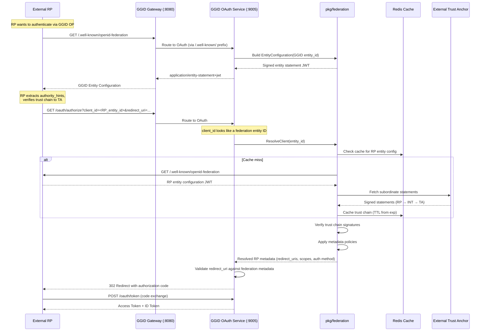

# OIDC Federation 1.0 — Implementation Feasibility Assessment

> **Status**: Design Document — Feasibility Assessment
> **Date**: 2025-07-11
> **Author**: GGID Architecture Team
> **Research Basis**: [docs/research/oidc-federation.md](../research/oidc-federation.md)
> **Specification**: [OpenID Federation 1.0](https://openid.net/specs/openid-federation-1_0.html)

---

## Table of Contents

1. [Executive Summary](#1-executive-summary)
2. [Technical Assessment](#2-technical-assessment)
3. [Architecture Changes](#3-architecture-changes)
4. [Priority Assessment](#4-priority-assessment)
5. [Dependency Analysis](#5-dependency-analysis)
6. [Go Implementation Outline](#6-go-implementation-outline)
7. [Recommendation](#7-recommendation)

---

## 1. Executive Summary

### 1.1 What OIDC Federation Brings to GGID

OpenID Connect Federation 1.0 enables **hierarchical trust at scale** — the ability for thousands of Identity Providers (IdPs) and Service Providers (SPs) to establish trust automatically through signed entity statements forming a chain to a mutually trusted Trust Anchor, without bilateral registration.

For GGID, this unlocks three high-value market segments:

| Segment | Example Federation | Current Pain Point |
|---------|-------------------|-------------------|
| **Research & Education** | eduGAIN (4,000+ IdPs, 5,000+ SPs) | O(n x m) bilateral registrations are infeasible |
| **Government / eID** | eIDAS 2.0 (27+ EU member states) | Cross-border identity verification |
| **Enterprise Consortium** | B2B partnerships, healthcare HIEs | Per-org trust setup is manual and slow |

GGID currently requires **manual client registration** for each RP-OP pair (see `services/oauth/internal/service/oauth_service.go` — `CreateClient`, `DynamicRegistration`). OIDC Federation replaces this with automatic trust establishment: an RP presents its trust chain, GGID verifies it against a configured Trust Anchor, and trust is established with zero manual configuration.

### 1.2 Overall Feasibility Verdict

**GO — Conditional.** The implementation is feasible using GGID's existing architecture. The conditions are:

1. **MVP scope**: Deliver Phases 1-2 only (entity configuration + trust chain resolution) as the initial release.
2. **Team availability**: Allocate 1 senior Go developer for the `pkg/federation` package work.
3. **eduGAIN alignment**: Verify interoperability against the [pyoidc](https://github.com/CZ-NIC/pyoidc) reference implementation during development.

### 1.3 Estimated Total Effort

| Scope | Phases | Duration | Story Points |
|-------|--------|----------|-------------|
| **MVP** (Phases 1-2) | Entity config + trust chain | 3-4 weeks | 21 SP |
| **Full federation** (Phases 1-5) | All features | 7-10 weeks | 55 SP |
| **Production hardening** (Phase 5) | Metrics, refresh, conformance | 2 weeks | 13 SP |

The MVP (Phases 1-2) is the recommended first deliverable. It enables GGID to act as both an OP in external federations and as a Trust Anchor itself.

---

## 2. Technical Assessment

### 2.1 Phase 1: Entity Configuration & Discovery

**Goal**: GGID can serve and consume entity configuration JWTs at the federation discovery endpoint.

#### Required New Endpoints

| Endpoint | HTTP Service | Gateway Route | Description |
|----------|-------------|---------------|-------------|
| `GET /.well-known/openid-federation` | OAuth (`:9005`) | `/.well-known/openid-federation` | Serve self-signed entity configuration JWT |
| `GET /federation_api?sub=<entity_id>` | OAuth (`:9005`) | `/federation_api` | Serve subordinate entity statements |

#### Current State Analysis

GGID already serves standard OIDC discovery:

- **`services/oauth/internal/server/server.go` line 145**: `mux.HandleFunc("/.well-known/openid-configuration", ...)` — the standard OIDC discovery endpoint.
- **`services/oauth/internal/service/oauth_service.go` line 283**: `GetDiscoveryConfig()` returns `*domain.OIDCDiscoveryConfig` with issuer, endpoints, supported scopes/algorithms.
- **`services/oauth/internal/service/oauth_service.go` line 307**: `GetJWKS()` returns `*domain.JWKSResponse` with RSA public keys in JWK format (`n`, `e`, `kid`).
- **`services/gateway/internal/router/router.go` line 34**: `/.well-known/` is in `publicPaths` — already skips JWT verification.
- **`services/gateway/internal/config/config.go` line 55**: `/oauth` routes to `http://localhost:9005` (the OAuth service).

This means the federation discovery endpoint (`/.well-known/openid-federation`) will be **automatically routed** to the OAuth service through the existing gateway `/oauth` prefix and `/.well-known/` public path. No new gateway route configuration is needed for the basic case.

#### Key Dependencies

| Dependency | Status | Location |
|-----------|--------|----------|
| **JWT signing** | Available | `golang-jwt/jwt/v5 v5.3.1` — already used for access tokens and ID tokens in `oauth_service.go` line 329 |
| **RSA key management** | Available | `domain.KeyProvider` interface (`models.go` line 186) with `PublicKey()`, `PrivateKey()`, `KeyID()` |
| **JWK serialization** | Available | `domain.JWKSKey` struct + `GetJWKS()` already serializes RSA keys to JWK format |
| **HTTP serving** | Available | Standard `net/http` mux pattern used throughout OAuth service |
| **Entity statement struct** | **NEW** | Requires `pkg/federation/entity.go` |

#### Effort Estimate

| Component | Effort |
|-----------|--------|
| `pkg/federation/entity.go` — EntityStatement struct, JWT sign/verify | 5 SP |
| `pkg/federation/jwks.go` — JWK set parsing (for external entities) | 3 SP |
| OAuth handler: `/.well-known/openid-federation` endpoint | 2 SP |
| OAuth handler: `/federation_api` endpoint (subordinate statements) | 3 SP |
| DB migration: `federation_entities` table | 2 SP |
| Unit tests: entity statement round-trip, signing, verification | 3 SP |
| Integration test: self-signed config served via gateway | 3 SP |
| **Phase 1 Total** | **21 SP (~1.5-2 weeks)** |

#### Risk Assessment: **LOW**

**Justification**: Every foundational dependency already exists in GGID:
- JWT library (`golang-jwt/jwt/v5`) handles custom headers and RSA signing natively.
- The `KeyProvider` interface is purpose-built for key-based signing operations.
- JWK serialization to `{kty, use, alg, kid, n, e}` is already implemented for the existing `/oauth/jwks` endpoint.
- Gateway routing for `/.well-known/` paths is already public and configured.
- The entity statement JWT is structurally simpler than the ID tokens GGID already issues — it's just a different set of claims signed with the same RSA key.

The only new code is the `EntityStatement` Go struct and two HTTP handler functions, both of which follow established patterns in `server.go`.

---

### 2.2 Phase 2: Trust Chain Resolution

**Goal**: GGID can verify external entities' trust chains by collecting entity statements from leaf to Trust Anchor.

#### Core Components

| Component | Description |
|-----------|-------------|
| **Trust chain builder** | Collects entity statements by following `authority_hints` from leaf entity up to a configured Trust Anchor |
| **Signature verifier** | Bottom-up JWS verification: each statement signed by the entity at the next level up |
| **Discovery HTTP client** | Fetches entity configurations from `/.well-known/openid-federation` and subordinate statements from `/federation_api?sub=...` |
| **Entity statement cache** | Redis-backed TTL cache for fetched entity configurations and statements |
| **Trust anchor store** | DB table + admin API for managing which TAs GGID trusts |

#### Current State Analysis

GGID has patterns that directly support this phase:

- **HTTP client patterns**: The gateway's `httputil.ReverseProxy` (router.go line 94) already makes outbound HTTP requests with connection pooling and timeouts. The federation discovery client follows the same pattern.
- **Redis integration**: `redis/go-redis/v9 v9.21.0` is already a dependency (used for rate limiting in gateway middleware). The entity statement cache reuses the same Redis client.
- **Admin API patterns**: The gateway already has admin endpoints (`/api/v1/admin/routes`, `/api/v1/gateway/routes`) — trust anchor management follows the same CRUD pattern.
- **Multi-tenant isolation**: `pkg/tenant` provides context propagation via `X-Tenant-ID` header. Trust anchors are scoped per-tenant.

#### Caching Strategy

```go
// Cache flow for entity configuration
func (c *Cache) GetEntityConfig(ctx context.Context, entityID string) (*EntityStatement, error) {
    // 1. Check Redis cache
    key := "fed:entity:" + entityID
    if cached, err := c.redis.Get(ctx, key).Result(); err == nil {
        return parseEntityStatement(cached)
    }
    // 2. Fetch from remote
    stmt, err := c.fetchEntityConfig(ctx, entityID)
    if err != nil {
        return nil, err
    }
    // 3. Cache with TTL = (stmt.exp - now) * 0.8 (pre-emptive refresh at 80%)
    ttl := time.Duration(stmt.Exp-now) * 4 / 5
    c.redis.Set(ctx, key, stmt.JWT(), ttl)
    return stmt, nil
}
```

Redis TTL is derived from the entity statement's `exp` claim, typically 1-6 hours per the spec. Pre-emptive refresh at 80% of TTL avoids cache misses on expiration.

#### Effort Estimate

| Component | Effort |
|-----------|--------|
| `pkg/federation/trust_chain.go` — TrustChain struct, Build(), Verify() | 8 SP |
| `pkg/federation/discovery.go` — HTTP client for fetching statements | 4 SP |
| `pkg/federation/cache.go` — Redis-backed TTL cache | 3 SP |
| DB migration: `federation_trust_anchors` table | 2 SP |
| Admin API: trust anchor CRUD | 3 SP |
| Error handling: expired statements, key mismatch, broken hints | 3 SP |
| Integration test: 3-entity trust chain verification | 5 SP |
| **Phase 2 Total** | **28 SP (~2-2.5 weeks)** |

#### Risk Assessment: **MEDIUM**

**Justification**:
- The trust chain verification algorithm (bottom-up JWS verification) is well-specified but involves multiple HTTP round-trips with timeout, retry, and error-handling logic.
- Key resolution (matching `kid` in JWS header to a key in the parent entity's `jwks`) requires careful handling of edge cases: key rotation overlap, `kid` not found, multiple keys.
- The `golang-jwt/jwt/v5` library supports custom key functions (`jwt.Keyfunc`), making JWS verification straightforward once the key is resolved.
- Network failures during chain building (authorities unreachable) require retry-with-backoff logic and graceful degradation using cached statements.
- **Mitigation**: The algorithm is deterministic and well-tested in reference implementations (pyoidc). We can validate against pyoidc's test vectors.

---

### 2.3 Phase 3: Metadata Policy Engine

**Goal**: GGID enforces federation metadata policies applied by intermediate authorities.

#### Policy Operators

The OIDC Federation spec defines 9 policy operators that modify or validate entity metadata:

| Operator | Action | Example |
|----------|--------|---------|
| `value` | Overwrite parameter with exact value | Force `token_endpoint_auth_method: "private_key_jwt"` |
| `values` | Overwrite parameter with array of values | Set `scopes_supported: ["openid", "profile"]` |
| `add` | Append values to existing array | Add federation admin email to `contacts` |
| `default` | Set value only if parameter is absent | Default `grant_types: ["authorization_code"]` |
| `essential` | Require parameter to be present | Require `jwks_uri` to exist |
| `subset_of` | Values must be subset of allowed set | Limit scopes to approved set |
| `one_of` | Value must be exactly one from set | Require specific `response_type` |
| `superset_of` | Values must include all from required set | Require `openid` scope present |
| `regex` | Value must match regex pattern | Enforce redirect_uri domain |

#### Application Algorithm

Policies are applied **top-down** through the trust chain (from TA toward leaf). For each parameter, operators apply in a fixed order: validators first (`subset_of`, `one_of`, `superset_of`, `regex`), then modifiers (`value`, `values`, `add`, `default`), then `essential` check.

#### Current State Analysis

GGID's `OAuthClient` domain model already has a `Metadata map[string]any` field (`services/oauth/internal/domain/models.go` line 40), which is stored as JSONB in PostgreSQL. Metadata policy application operates on this map, modifying and validating its contents.

#### Effort Estimate

| Component | Effort |
|-----------|--------|
| `pkg/federation/metadata_policy.go` — all 9 operators | 5 SP |
| Policy application algorithm (top-down through chain) | 3 SP |
| Policy conflict resolution (multi-level intersection) | 2 SP |
| Unit tests: each operator, conflict scenarios | 4 SP |
| Integration test: policy enforcement on real trust chain | 3 SP |
| **Phase 3 Total** | **17 SP (~1 week)** |

#### Risk Assessment: **LOW**

**Justification**: The metadata policy engine is pure logic — no I/O, no crypto, no network calls. It's a series of map operations with validation rules. Each operator is independently testable. The spec's application order is deterministic. The main risk is edge-case handling (nil values, type mismatches between string and []string), which thorough unit tests address.

---

### 2.4 Phase 4: Trust Marks

**Goal**: GGID can issue, embed, and verify trust marks as independently signed JWTs.

#### Trust Mark Lifecycle

1. **Issuance**: A Trust Mark Issuer (which may be GGID acting as TA) creates a signed JWT with `id`, `sub`, `iss`, `exp`.
2. **Embedding**: The trust mark JWT is included in an entity's `trust_marks` array in its entity statement.
3. **Verification**: When verifying a trust chain, the verifier checks:
   - Trust mark signature against the Trust Mark Issuer's keys
   - `sub` matches the entity
   - `exp` hasn't expired
   - Trust mark issuer is recognized by the Trust Anchor

#### Current State Analysis

GGID already issues signed JWTs (access tokens, ID tokens, refresh tokens). A trust mark is structurally identical — a JWT with different claims and a `typ: "trust-mark+jwt"` header. The `golang-jwt/jwt/v5` library handles custom JWT types natively.

#### Effort Estimate

| Component | Effort |
|-----------|--------|
| `pkg/federation/trust_mark.go` — TrustMark struct, sign/verify | 4 SP |
| Trust mark issuance API (admin) | 3 SP |
| Trust mark verification in chain verification flow | 2 SP |
| Trust mark requirements in entity metadata | 2 SP |
| Unit + integration tests | 3 SP |
| **Phase 4 Total** | **14 SP (~1 week)** |

#### Risk Assessment: **LOW**

**Justification**: Trust marks are JWTs — GGID's core competency. The verification flow is an additive check within the existing trust chain verifier (Phase 2). The main complexity is the admin workflow for trust mark management, which follows existing admin API patterns.

---

### 2.5 Phase 5: RP/OP Integration

**Goal**: GGID's existing OAuth/OIDC flow uses federation-discovered metadata, enabling automatic client registration without manual registration.

#### How the OAuth Flow Changes

**Current flow** (manual registration):

```
1. Admin registers RP as OAuthClient (CreateClient in oauth_service.go)
2. RP sends authorization request with client_id
3. GGID validates client_id against DB → issues auth code
4. RP exchanges code for tokens
```

**Federation flow** (automatic trust):

```
1. RP presents its trust chain to GGID's federation endpoint
2. GGID verifies trust chain → extracts RP metadata (redirect_uris, scopes, etc.)
3. GGID creates ephemeral OAuthClient from federation metadata (or caches it)
4. RP sends authorization request using its entity_id as client_id
5. GGID validates against federation-resolved metadata → issues auth code
6. RP exchanges code for tokens
```

The key change is in the **client lookup** step. Instead of querying `oauth_clients` table by `client_id`, GGID:

1. Checks if `client_id` matches a federation entity ID.
2. If so, resolves the trust chain and extracts RP metadata.
3. Creates an in-memory or cached `OAuthClient` from the federation metadata.

#### Current State Analysis

GGID's `DynamicRegistration` (`oauth_service.go`, RFC 7591 implementation) already handles programmatic client registration. Federation registration is conceptually similar — the RP metadata comes from a trust chain rather than a registration request.

The `OAuthClient.ValidateRedirectURI()` method (`models.go` line 60) already validates redirect URIs against a registered list. In the federation flow, this list comes from the entity statement metadata.

#### Effort Estimate

| Component | Effort |
|-----------|--------|
| Federation-aware client lookup in OAuth authorize flow | 5 SP |
| Federation metadata → OAuthClient adapter | 3 SP |
| Automatic client registration (cache federation clients) | 3 SP |
| Modified authorize endpoint to support entity_id as client_id | 3 SP |
| Integration test: full federation-aware OIDC flow | 4 SP |
| **Phase 5 Total** | **18 SP (~1.5 weeks)** |

#### Risk Assessment: **MEDIUM**

**Justification**: This phase modifies the existing OAuth authorize flow, which is the most security-critical path in GGID. Changes must not break existing manually-registered clients. The federation client lookup must be a **fallback** — if `client_id` doesn't match a federation entity, fall through to the existing DB lookup.

**Mitigation**: Implement as a `ClientResolver` interface with two implementations: `DatabaseClientResolver` (existing) and `FederationClientResolver` (new). The authorize handler tries federation first, falls back to DB.

---

## 3. Architecture Changes

### 3.1 New Package: `pkg/federation/`

```
pkg/federation/
├── doc.go                      # Package documentation
├── types.go                    # Shared types (EntityType, EntityRole, etc.)
├── entity_statement.go         # EntityStatement struct, JWT sign/verify
├── entity_statement_test.go
├── trust_chain.go              # TrustChain: Build() + Verify()
├── trust_chain_test.go
├── metadata_policy.go          # 9 policy operators + application engine
├── metadata_policy_test.go
├── trust_mark.go               # TrustMark sign/verify
├── trust_mark_test.go
├── discovery.go                # HTTP client for federation endpoints
├── discovery_test.go
├── cache.go                    # Redis-backed entity config/statement cache
├── cache_test.go
├── jwks.go                     # JWK set parsing + key lookup by kid
├── jwks_test.go
├── resolver.go                 # FederationResolver interface + impl
├── resolver_test.go
└── errors.go                   # Federation-specific error types
```

**Design principle**: All federation logic lives in `pkg/federation/` as a pure library with no dependencies on specific GGID services. Services import the package; the package imports only stdlib + existing GGID packages (`pkg/crypto`, `pkg/errors`, `pkg/tenant`).

### 3.2 Service Changes

#### OAuth Service (`services/oauth/`)

| Change | File | Description |
|--------|------|-------------|
| Entity config endpoint | `internal/server/server.go` | New `mux.HandleFunc("/.well-known/openid-federation", ...)` |
| Federation API endpoint | `internal/server/server.go` | New `mux.HandleFunc("/federation_api", ...)` |
| Entity config builder | `internal/service/oauth_service.go` | New method `GetEntityConfiguration()` building federation entity statement |
| Federation client resolver | `internal/service/oauth_service.go` | New `FederationClientResolver` for trust-chain-based client lookup |
| DB migration | `migrations/` | `federation_entities`, `federation_trust_anchors`, `federation_entity_statements` tables |

#### Gateway Service (`services/gateway/`)

| Change | File | Description |
|--------|------|-------------|
| Federation route | `internal/config/config.go` | Add `"/federation_api": "http://localhost:9005"` to routes map |
| Discovery routing | `internal/router/router.go` | `/.well-known/openid-federation` already covered by `/.well-known/` public path prefix (line 34) |
| Per-tenant trust anchors | `internal/config/config.go` | Optional: per-tenant trust anchor configuration |

**No changes needed to `publicPaths`** — `/.well-known/` already matches, and `/oauth` already routes to the OAuth service. The federation API endpoint (`/federation_api`) needs a new route entry or can be served directly by the OAuth service on `:9005`.

### 3.3 No New Service Required

OIDC Federation fits naturally into the existing OAuth + Gateway architecture:

- **Entity configuration serving** → OAuth service (already handles OIDC discovery and JWKS)
- **Trust chain resolution** → OAuth service (business logic using `pkg/federation`)
- **Discovery routing** → Gateway (already routes `/.well-known/` and `/oauth`)
- **Trust anchor management** → OAuth service admin API (follows existing admin endpoint patterns)
- **Federation entity storage** → OAuth service PostgreSQL (alongside `oauth_clients` table)

A separate microservice would add operational overhead without architectural benefit.

### 3.4 Database Schema

```sql
-- Federation entities managed by GGID (OPs, RPs, intermediaries)
CREATE TABLE federation_entities (
    id              UUID PRIMARY KEY DEFAULT gen_random_uuid(),
    tenant_id       UUID NOT NULL REFERENCES tenants(id),
    entity_id       TEXT NOT NULL UNIQUE,          -- HTTPS URL identifier
    entity_type     TEXT NOT NULL,                  -- openid_provider, openid_relying_party, federation_entity
    role            TEXT NOT NULL DEFAULT 'leaf',   -- leaf, intermediate, trust_anchor
    metadata        JSONB NOT NULL DEFAULT '{}',
    jwks            JSONB NOT NULL,                 -- Public signing keys
    trust_marks     JSONB DEFAULT '[]',
    authority_hints JSONB DEFAULT '[]',             -- Parent entity IDs
    status          TEXT DEFAULT 'active',          -- active, suspended, revoked
    created_at      TIMESTAMPTZ DEFAULT NOW(),
    updated_at      TIMESTAMPTZ DEFAULT NOW()
);

-- Trust anchors GGID trusts (for verifying external entities)
CREATE TABLE federation_trust_anchors (
    id              UUID PRIMARY KEY DEFAULT gen_random_uuid(),
    tenant_id       UUID NOT NULL REFERENCES tenants(id),
    entity_id       TEXT NOT NULL,                  -- TA entity ID (HTTPS URL)
    name            TEXT NOT NULL,
    jwks            JSONB NOT NULL,                 -- TA public keys
    entity_config   TEXT,                           -- Cached self-signed config JWT
    metadata_policy JSONB DEFAULT '{}',
    constraints     JSONB DEFAULT '{}',
    fetched_at      TIMESTAMPTZ DEFAULT NOW(),
    expires_at      TIMESTAMPTZ,
    UNIQUE(tenant_id, entity_id)
);

-- Cached entity statements from external authorities
CREATE TABLE federation_entity_statements (
    id              UUID PRIMARY KEY DEFAULT gen_random_uuid(),
    tenant_id       UUID NOT NULL REFERENCES tenants(id),
    issuer_id       TEXT NOT NULL,                  -- Entity that signed the statement
    subject_id      TEXT NOT NULL,                  -- Entity the statement is about
    statement_jwt   TEXT NOT NULL,                  -- Full JWS compact serialization
    jwks            JSONB NOT NULL,                 -- Subject's public keys
    authority_hints JSONB DEFAULT '[]',
    fetched_at      TIMESTAMPTZ DEFAULT NOW(),
    expires_at      TIMESTAMPTZ NOT NULL,           -- From statement exp claim
    UNIQUE(tenant_id, issuer_id, subject_id)
);

CREATE INDEX idx_fed_entities_tenant  ON federation_entities(tenant_id);
CREATE INDEX idx_fed_entities_type    ON federation_entities(entity_type);
CREATE INDEX idx_fed_anchors_tenant   ON federation_trust_anchors(tenant_id);
CREATE INDEX idx_fed_stmts_subject    ON federation_entity_statements(subject_id);
CREATE INDEX idx_fed_stmts_expires    ON federation_entity_statements(expires_at);
```

### 3.5 Federation Data Flow



---

## 4. Priority Assessment

### 4.1 Priority Matrix

| Phase | Priority | Rationale |
|-------|----------|-----------|
| **Phase 1**: Entity Configuration & Discovery | **P0** | Foundation — GGID must serve its own entity configuration to participate in any federation |
| **Phase 2**: Trust Chain Resolution | **P0** | Core capability — without chain verification, there is no federation trust |
| **Phase 3**: Metadata Policy Engine | **P1** | Important for intermediate authority operation, but not required for leaf participation |
| **Phase 4**: Trust Marks | **P2** | Certification features — valuable for eduGAIN but not blocking basic federation |
| **Phase 5**: RP/OP Integration | **P1** | Enables automatic client registration — high value but requires Phases 1-3 |

### 4.2 Recommended MVP: Phases 1 + 2

**MVP scope**: Entity configuration endpoint + trust chain resolution engine.

**What the MVP enables**:
- GGID can **serve** its own entity configuration at `/.well-known/openid-federation`
- GGID can **verify** external entities' trust chains against configured Trust Anchors
- GGID can act as a **leaf entity** in external federations (e.g., join eduGAIN as an OP)
- GGID can act as a **Trust Anchor** for its own federations (verify subordinates' chains)

**What the MVP does NOT include**:
- Metadata policy enforcement (Phase 3)
- Trust marks (Phase 4)
- Automatic client registration via federation (Phase 5)

**MVP effort**: 21 + 28 = **49 SP (~3-4 weeks)** with 1 developer.

**Post-MVP path**: After MVP validation, Phases 3-5 can be delivered incrementally, each adding a self-contained capability.

---

## 5. Dependency Analysis

### 5.1 Go JWT Library

**Current state**: `golang-jwt/jwt/v5 v5.3.1` (go.mod line 11).

**Already used for**:
- Access token issuance: `oauth_service.go` line 329 — `jwt.RegisteredClaims` with RSA signing
- ID token issuance: `IssueIDToken` using `jwt.NewWithClaims`
- Gateway JWT validation: `services/gateway/internal/middleware/` — `jwt.Parse` with custom `Keyfunc`

**Federation requirements**:
- Custom JWT header `typ: "entity-statement+jwt"` — supported via `jwt.Header` map
- Custom claims struct — supported via `jwt.Claims` interface
- RSA signing with `kid` in header — supported via `jwt.NewWithClaims` + header manipulation

**Verdict**: **No new dependency needed.** `golang-jwt/jwt/v5` fully supports entity statement signing and verification.

### 5.2 JWK Management

**Current state in `pkg/crypto/`**:
- `crypto.go` provides AES-256-GCM encryption, Argon2id password hashing, random token generation
- **No JWK parsing** — `pkg/crypto` doesn't parse external JWK sets

**Current JWK usage in OAuth service**:
- `domain.JWKSKey` struct (`models.go` line 154): `{kty, use, alg, kid, n, e}` — used for serving GGID's own public key
- `GetJWKS()` (`oauth_service.go` line 307): serializes RSA public key to JWK format
- Gateway `JWKSClient` (`middleware/`): fetches JWKS from remote URL for JWT validation

**Federation requirements**:
- Parse external JWK sets (from entity statements' `jwks` claim)
- Convert JWK → `crypto/rsa.PublicKey` for signature verification
- Support both RSA and EC keys

**Implementation**: Add a `pkg/federation/jwks.go` module. JWK-to-RSA-key conversion uses Go stdlib (`encoding/base64` + `math/big`), exactly as the reverse operation already works in `GetJWKS()`. For EC keys, use `crypto/ecdsa`. No external library needed.

```go
// pkg/federation/jwks.go — key conversion (stdlib only)
func jwkToRSAPublicKey(jwk map[string]any) (*rsa.PublicKey, error) {
    nBytes, err := base64.RawURLEncoding.DecodeString(jwk["n"].(string))
    if err != nil { return nil, err }
    eBytes, err := base64.RawURLEncoding.DecodeString(jwk["e"].(string))
    if err != nil { return nil, err }
    n := new(big.Int).SetBytes(nBytes)
    e := new(big.Int).SetBytes(eBytes).Int64()
    return &rsa.PublicKey{N: n, E: int(e)}, nil
}
```

**Verdict**: **No new dependency needed.** JWK parsing is ~50 lines of stdlib code.

### 5.3 HTTP Discovery

**Current state**:
- Gateway `/.well-known/` prefix is in `publicPaths` (router.go line 34) — JWT verification is skipped
- `/oauth` route maps to OAuth service at `:9005` (config.go line 55)
- `/.well-known/openid-configuration` already served by OAuth service

**Federation requirements**:
- `/.well-known/openid-federation` → OAuth service (already routed via `/.well-known/` prefix)

**Verdict**: **No gateway change needed** for the entity configuration endpoint. The `/.well-known/` prefix already covers it. For `/federation_api`, add one route entry to `config.go` Routes map.

### 5.4 Summary: Zero New External Dependencies

| Dependency | Status | Action |
|-----------|--------|--------|
| JWT library | `golang-jwt/jwt/v5` already in go.mod | None |
| JWK parsing | Implement using Go stdlib | New file `pkg/federation/jwks.go` |
| Redis (for cache) | `redis/go-redis/v9` already in go.mod | None |
| HTTP client | Go stdlib `net/http` | New file `pkg/federation/discovery.go` |
| PostgreSQL | `pgx/v5` already in go.mod | New migration file |

---

## 6. Go Implementation Outline

### 6.1 EntityStatement

```go
// pkg/federation/entity_statement.go

package federation

import (
    "crypto/rsa"
    "encoding/json"
    "fmt"
    "time"

    "github.com/ggid/ggid/services/oauth/internal/domain"
    "github.com/golang-jwt/jwt/v5"
)

// EntityType enumerates the federation entity roles.
type EntityType string

const (
    EntityTypeOpenIDProvider   EntityType = "openid_provider"
    EntityTypeRelyingParty     EntityType = "openid_relying_party"
    EntityTypeFederationEntity EntityType = "federation_entity"
)

// EntityStatement represents an OIDC Federation entity statement JWT.
// When iss == sub, this is an Entity Configuration (self-signed).
// When iss != sub, this is a Subordinate Statement (issued by a parent).
type EntityStatement struct {
    Issuer          string             `json:"iss"`
    Subject         string             `json:"sub"`
    IssuedAt        int64              `json:"iat"`
    ExpiresAt       int64              `json:"exp"`
    JWKS            json.RawMessage    `json:"jwks"`
    Metadata        EntityMetadata     `json:"metadata,omitempty"`
    MetadataPolicy  MetadataPolicy     `json:"metadata_policy,omitempty"`
    Constraints     *Constraints       `json:"constraints,omitempty"`
    TrustMarks      []TrustMarkEntry   `json:"trust_marks,omitempty"`
    AuthorityHints  []string           `json:"authority_hints,omitempty"`
    Crit            []string           `json:"crit,omitempty"`
}

// EntityMetadata holds the per-role metadata for an entity.
type EntityMetadata struct {
    OpenIDProvider   *map[string]any `json:"openid_provider,omitempty"`
    RelyingParty     *map[string]any `json:"openid_relying_party,omitempty"`
    FederationEntity *map[string]any `json:"federation_entity,omitempty"`
}

// Constraints limits the trust chain (e.g., max depth).
type Constraints struct {
    MaxPathLength int `json:"max_path_length,omitempty"`
}

// TrustMarkEntry pairs a trust mark ID with its signed JWT.
type TrustMarkEntry struct {
    ID        string `json:"id"`
    TrustMark string `json:"trust_mark"`
}

// SignEntityStatement signs the entity statement as a compact JWS.
func SignEntityStatement(stmt *EntityStatement, key *rsa.PrivateKey, kid string) (string, error) {
    now := time.Now()
    if stmt.IssuedAt == 0 {
        stmt.IssuedAt = now.Unix()
    }
    if stmt.ExpiresAt == 0 {
        stmt.ExpiresAt = now.Add(24 * time.Hour).Unix()
    }

    claims, err := toMapClaims(stmt)
    if err != nil {
        return "", fmt.Errorf("marshal entity statement: %w", err)
    }

    token := jwt.NewWithClaims(jwt.SigningMethodRS256, claims)
    token.Header["kid"] = kid
    token.Header["typ"] = "entity-statement+jwt"

    return token.SignedString(key)
}

// VerifyEntityStatement verifies a signed entity statement JWT
// using the provided public key (resolved from the issuer's JWKS).
func VerifyEntityStatement(jwtStr string, pubKey *rsa.PublicKey) (*EntityStatement, error) {
    stmt := &EntityStatement{}
    _, err := jwt.ParseWithClaims(jwtStr, toClaims(stmt), func(t *jwt.Token) (any, error) {
        if _, ok := t.Method.(*jwt.SigningMethodRSA); !ok {
            return nil, fmt.Errorf("unexpected signing method: %v", t.Header["alg"])
        }
        return pubKey, nil
    })
    if err != nil {
        return nil, fmt.Errorf("verify entity statement: %w", err)
    }

    // Check expiration
    if time.Now().Unix() > stmt.ExpiresAt {
        return nil, fmt.Errorf("entity statement expired")
    }
    return stmt, nil
}

// IsEntityConfiguration returns true if this is a self-signed config (iss == sub).
func (s *EntityStatement) IsEntityConfiguration() bool {
    return s.Issuer == s.Subject
}
```

### 6.2 TrustChain

```go
// pkg/federation/trust_chain.go

package federation

import (
    "fmt"
    "time"
)

// TrustChain represents a verified chain of entity statements
// from a leaf entity up to a Trust Anchor.
type TrustChain struct {
    Statements []*EntityStatement // Ordered [leaf, intermediate, ..., TA_config]
    Verified   bool
    ResolvedMetadata *EntityMetadata // Final metadata after policy application
}

// Build collects entity statements from a leaf entity up to a Trust Anchor
// by following authority_hints and fetching subordinate statements.
type TrustChainBuilder struct {
    resolver   FederationResolver
    trustAnchorID string
}

func NewTrustChainBuilder(resolver FederationResolver, taID string) *TrustChainBuilder {
    return &TrustChainBuilder{resolver: resolver, trustAnchorID: taID}
}

// Build constructs the trust chain for the given leaf entity ID.
func (b *TrustChainBuilder) Build(entityID string) (*TrustChain, error) {
    var chain []*EntityStatement

    // Step 1: Fetch leaf entity configuration
    leaf, err := b.resolver.FetchEntityConfig(entityID)
    if err != nil {
        return nil, fmt.Errorf("fetch leaf config: %w", err)
    }
    chain = append(chain, leaf)

    // Step 2: Follow authority_hints up to the Trust Anchor
    current := leaf
    for {
        if len(current.AuthorityHints) == 0 {
            // Reached self-signed root (Trust Anchor config)
            break
        }

        // Find the authority hint that leads to our configured TA
        authorityID := selectAuthority(current.AuthorityHints, b.trustAnchorID)
        if authorityID == "" {
            return nil, fmt.Errorf("no authority hint leads to trust anchor %s", b.trustAnchorID)
        }

        // Fetch the authority's statement about the current entity
        stmt, err := b.resolver.FetchSubordinateStatement(authorityID, current.Subject)
        if err != nil {
            return nil, fmt.Errorf("fetch statement from %s about %s: %w",
                authorityID, current.Subject, err)
        }
        chain = append(chain, stmt)

        // Fetch the authority's own entity configuration
        authConfig, err := b.resolver.FetchEntityConfig(authorityID)
        if err != nil {
            return nil, fmt.Errorf("fetch authority config %s: %w", authorityID, err)
        }
        chain = append(chain, authConfig)

        // If this authority IS our trust anchor, we're done
        if authorityID == b.trustAnchorID {
            break
        }

        current = authConfig
    }

    return &TrustChain{Statements: chain}, nil
}

// Verify checks all signatures in the chain bottom-up.
// Each statement[i] must be signed by the key in statements[i+1].jwks.
func (tc *TrustChain) Verify() error {
    if len(tc.Statements) < 2 {
        return fmt.Errorf("trust chain too short: need at least leaf + TA config")
    }

    // Verify from TA down to leaf
    for i := len(tc.Statements) - 1; i >= 0; i-- {
        stmt := tc.Statements[i]

        // The signing key comes from the NEXT statement's jwks
        // (or from the statement itself if it's the TA self-signed config)
        var signingKeySource *EntityStatement
        if i == len(tc.Statements)-1 {
            // TA config: self-signed, key from its own jwks
            signingKeySource = stmt
        } else {
            signingKeySource = tc.Statements[i+1]
        }

        // Resolve signing key from jwks using kid from JWS header
        pubKey, err := resolveKeyFromJWKS(stmt, signingKeySource)
        if err != nil {
            return fmt.Errorf("resolve key for statement %d: %w", i, err)
        }

        // Verify signature
        _, err = VerifyEntityStatement(stmt.RawJWT, pubKey)
        if err != nil {
            return fmt.Errorf("verify signature at level %d: %w", i, err)
        }

        // Check chain linkage: stmt.iss should match parent.sub
        if i < len(tc.Statements)-1 {
            parent := tc.Statements[i+1]
            if stmt.Issuer != parent.Subject {
                return fmt.Errorf("chain linkage broken at level %d: iss=%s but parent.sub=%s",
                    i, stmt.Issuer, parent.Subject)
            }
        }

        // Check expiration
        if time.Now().Unix() > stmt.ExpiresAt {
            return fmt.Errorf("statement at level %d expired", i)
        }
    }

    tc.Verified = true
    return nil
}

// selectAuthority picks the authority hint that leads toward the configured TA.
func selectAuthority(hints []string, taID string) string {
    // Prefer exact match to TA
    for _, h := range hints {
        if h == taID {
            return h
        }
    }
    // Fall back to first hint
    if len(hints) > 0 {
        return hints[0]
    }
    return ""
}
```

### 6.3 FederationResolver Interface

```go
// pkg/federation/resolver.go

package federation

import "context"

// FederationResolver abstracts the fetching of entity configurations
// and subordinate statements. Implementations may use HTTP (for external
// entities) or DB (for locally managed entities).
type FederationResolver interface {
    // FetchEntityConfig retrieves an entity's self-signed configuration
    // from /.well-known/openid-federation.
    FetchEntityConfig(ctx context.Context, entityID string) (*EntityStatement, error)

    // FetchSubordinateStatement retrieves a statement by issuer about subject
    // from the issuer's federation API endpoint.
    FetchSubordinateStatement(ctx context.Context, issuerID, subjectID string) (*EntityStatement, error)

    // Resolve performs full trust chain resolution and returns merged metadata.
    // This is the convenience endpoint equivalent to the /resolve federation API.
    Resolve(ctx context.Context, entityID string, trustAnchorID string) (*ResolvedMetadata, error)
}

// HTTPFederationResolver implements FederationResolver using HTTP fetches
// with Redis-backed caching.
type HTTPFederationResolver struct {
    httpClient *http.Client
    cache      StatementCache
}

// ResolvedMetadata is the output of full federation resolution.
type ResolvedMetadata struct {
    EntityID    string         `json:"entity_id"`
    Metadata    EntityMetadata `json:"resolved_metadata"`
    TrustChain  []string       `json:"trust_chain"` // Array of JWT strings
    TrustAnchor string         `json:"trust_anchor"`
}

// StatementCache abstracts the caching layer (Redis in production,
// in-memory map in tests).
type StatementCache interface {
    Get(ctx context.Context, entityID string) (*EntityStatement, bool)
    Set(ctx context.Context, entityID string, stmt *EntityStatement, ttl time.Duration)
    Delete(ctx context.Context, entityID string)
}
```

### 6.4 MetadataPolicy Applicator

```go
// pkg/federation/metadata_policy.go

package federation

import (
    "fmt"
    "regexp"
)

// MetadataPolicy maps entity types to parameter policies.
// e.g., {"openid_provider": {"scopes_supported": {"subset_of": [...]}}}
type MetadataPolicy map[string]map[string]PolicyOperator

// PolicyOperator holds one or more operators for a single metadata parameter.
type PolicyOperator struct {
    Value      any      `json:"value,omitempty"`
    Values     []any    `json:"values,omitempty"`
    Add        []any    `json:"add,omitempty"`
    Default    any      `json:"default,omitempty"`
    Essential  *bool    `json:"essential,omitempty"`
    SubsetOf   []any    `json:"subset_of,omitempty"`
    OneOf      []any    `json:"one_of,omitempty"`
    SupersetOf []any    `json:"superset_of,omitempty"`
    Regex      string   `json:"regex,omitempty"`
}

// Apply applies all metadata policies from the trust chain to the leaf
// entity's metadata. Policies are applied top-down (TA → intermediate → leaf).
func Apply(chain *TrustChain) (*EntityMetadata, error) {
    if len(chain.Statements) == 0 {
        return nil, fmt.Errorf("empty trust chain")
    }

    // Start with leaf metadata (first statement)
    metadata := chain.Statements[0].Metadata

    // Apply policies from each authority (skip leaf at index 0)
    for i := 1; i < len(chain.Statements); i++ {
        stmt := chain.Statements[i]
        if len(stmt.MetadataPolicy) == 0 {
            continue
        }
        var err error
        metadata, err = applyPolicyLevel(metadata, stmt.MetadataPolicy)
        if err != nil {
            return nil, fmt.Errorf("apply policy from %s: %w", stmt.Issuer, err)
        }
    }

    // Final essential check across all levels
    for i := len(chain.Statements) - 1; i >= 1; i-- {
        stmt := chain.Statements[i]
        for entityType, params := range stmt.MetadataPolicy {
            for param, op := range params {
                if op.Essential != nil && *op.Essential {
                    if !metadataHasParam(metadata, entityType, param) {
                        return nil, fmt.Errorf("essential parameter %s.%s missing",
                            entityType, param)
                    }
                }
            }
        }
    }

    return &metadata, nil
}

// applyPolicyLevel applies a single level's policy to the metadata.
func applyPolicyLevel(metadata EntityMetadata, policy MetadataPolicy) (EntityMetadata, error) {
    for entityType, paramPolicies := range policy {
        entityMeta := getEntityMetadataMap(&metadata, entityType)
        if entityMeta == nil {
            continue
        }

        for param, op := range paramPolicies {
            current, exists := (*entityMeta)[param]

            // 1. Subset check
            if len(op.SubsetOf) > 0 && exists {
                if err := checkSubset(current, op.SubsetOf); err != nil {
                    return metadata, fmt.Errorf("subset_of check failed for %s: %w", param, err)
                }
            }

            // 2. One_of check
            if len(op.OneOf) > 0 && exists {
                if err := checkOneOf(current, op.OneOf); err != nil {
                    return metadata, fmt.Errorf("one_of check failed for %s: %w", param, err)
                }
            }

            // 3. Superset check
            if len(op.SupersetOf) > 0 && exists {
                if err := checkSuperset(current, op.SupersetOf); err != nil {
                    return metadata, fmt.Errorf("superset_of check failed for %s: %w", param, err)
                }
            }

            // 4. Regex check
            if op.Regex != "" && exists {
                re, err := regexp.Compile(op.Regex)
                if err != nil {
                    return metadata, fmt.Errorf("invalid regex for %s: %w", param, err)
                }
                if !regexMatches(current, re) {
                    return metadata, fmt.Errorf("regex check failed for %s", param)
                }
            }

            // 5. Value (overwrite)
            if op.Value != nil {
                (*entityMeta)[param] = op.Value
                continue // value overrides everything else
            }

            // 6. Values (overwrite with array)
            if len(op.Values) > 0 {
                (*entityMeta)[param] = op.Values
                continue
            }

            // 7. Add (append to existing array)
            if len(op.Add) > 0 {
                (*entityMeta)[param] = appendValues(current, op.Add)
            }

            // 8. Default (set if missing)
            if op.Default != nil && !exists {
                (*entityMeta)[param] = op.Default
            }
        }
    }
    return metadata, nil
}
```

---

## 7. Recommendation

### 7.1 Decision: GO (Conditional)

**OIDC Federation is feasible for GGID with zero new external dependencies.** The implementation leverages GGID's existing JWT infrastructure (`golang-jwt/jwt/v5`), RSA key management (`domain.KeyProvider`), JWK serialization (`GetJWKS()`), Redis caching, and gateway routing patterns.

**Conditions**:
1. Deliver as MVP first (Phases 1-2 only), validate interoperability, then proceed to full implementation.
2. Allocate 1 dedicated developer for the `pkg/federation` package.
3. Test against pyoidc reference implementation for conformance.

### 7.2 Phased Delivery Plan

```
Milestone 1 — MVP (Weeks 1-4)
├── Phase 1: Entity Configuration & Discovery      [Weeks 1-2]
│   ├── pkg/federation: EntityStatement, JWKS parsing
│   ├── OAuth: /.well-known/openid-federation endpoint
│   ├── OAuth: /federation_api endpoint
│   ├── DB: federation_entities table
│   └── Tests: entity statement round-trip, self-signed config
├── Phase 2: Trust Chain Resolution                 [Weeks 3-4]
│   ├── pkg/federation: TrustChain Build() + Verify()
│   ├── pkg/federation: Discovery HTTP client
│   ├── pkg/federation: Redis cache
│   ├── DB: federation_trust_anchors table
│   ├── Admin API: trust anchor CRUD
│   └── Tests: 3-entity trust chain verification, pyoidc interop
└── Deliverable: GGID participates in OIDC federations as leaf or TA

Milestone 2 — Policy & Marks (Weeks 5-7)
├── Phase 3: Metadata Policy Engine                 [Week 5]
│   ├── pkg/federation: 9 policy operators
│   ├── Policy application algorithm
│   └── Tests: each operator, conflict resolution
├── Phase 4: Trust Marks                            [Week 6]
│   ├── pkg/federation: TrustMark sign/verify
│   ├── Admin API: trust mark issuance
│   └── Tests: trust mark verification in chain
└── Deliverable: GGID operates as Intermediate Authority

Milestone 3 — Full Integration (Weeks 8-10)
├── Phase 5: RP/OP Integration                      [Weeks 8-9]
│   ├── Federation-aware client lookup
│   ├── Federation metadata → OAuthClient adapter
│   ├── Automatic client registration
│   └── Tests: full federation-aware OIDC flow
├── Production Hardening                            [Week 10]
│   ├── Background trust chain refresh worker
│   ├── Metrics: verification latency, cache hit rate
│   ├── Audit logging for all federation operations
│   └── Conformance testing with OIDF suite
└── Deliverable: Production-grade OIDC Federation
```

### 7.3 Competitive Analysis: GGID vs Auth0 / Keycloak

| Feature | GGID (proposed) | Auth0 | Keycloak |
|---------|----------------|-------|----------|
| OIDC Federation 1.0 | **Planned** (Phases 1-5) | Not supported | In development (KC OIDC Federation SPI) |
| Entity configuration endpoint | Planned | Not supported | In development |
| Trust chain verification | Planned | Not supported | In development |
| Metadata policy engine | Planned | Not supported | Not supported |
| Trust marks | Planned | Not supported | Not supported |
| Automatic federation registration | Planned | Not supported | Not supported |
| eduGAIN compatibility | Target | Not supported | Experimental |
| Open source | Apache 2.0 | Proprietary | Apache 2.0 |

**Strategic differentiator**: OIDC Federation support would make GGID one of the **first production-grade Go IAM platforms** with native federation support. Auth0 does not support it. Keycloak's implementation is still in development (Java). This positions GGID strongly for the research/education and government markets where federation is a hard requirement.

Keycloak is the closest competitor — its federation SPI is under active development. GGID's advantage is a clean Go implementation with no JVM overhead, smaller container images (27MB vs 500MB+), and native multi-tenant isolation through `tenant_id` scoping.

### 7.4 Risk Register

| Risk | Probability | Impact | Mitigation |
|------|------------|--------|------------|
| Spec ambiguity in edge cases | Medium | Medium | Test against pyoidc reference; follow spec strictly |
| External federation endpoints unreliable | Medium | Low | Redis cache with TTL; graceful degradation |
| Trust anchor key compromise | Low | Critical | Short statement exp; HSM-backed TA keys; multi-TA config |
| Performance (multi-hop chain building) | Medium | Medium | Parallel statement fetching; aggressive caching; resolve endpoint |
| Breaking existing OAuth flow | Low | High | Federation lookup is additive fallback; existing DB clients unaffected |

---

*This assessment grounds every recommendation in actual GGID code: `services/oauth/internal/server/server.go` for endpoint patterns, `services/oauth/internal/service/oauth_service.go` for discovery/JWKS/JWT patterns, `services/oauth/internal/domain/models.go` for the `KeyProvider` interface and `OAuthClient` model, `services/gateway/internal/router/router.go` for routing and `publicPaths`, and `pkg/crypto/crypto.go` for cryptographic utilities. See [docs/research/oidc-federation.md](../research/oidc-federation.md) for the full specification analysis.*
