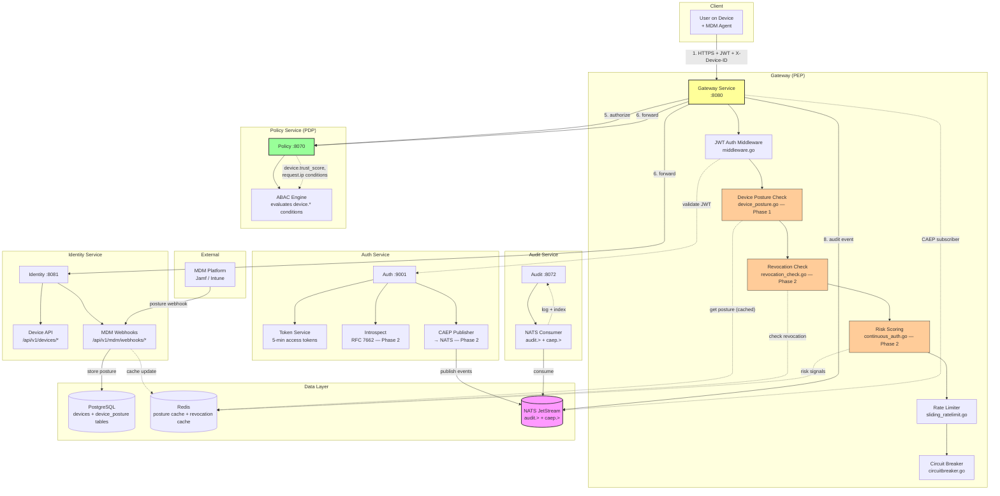
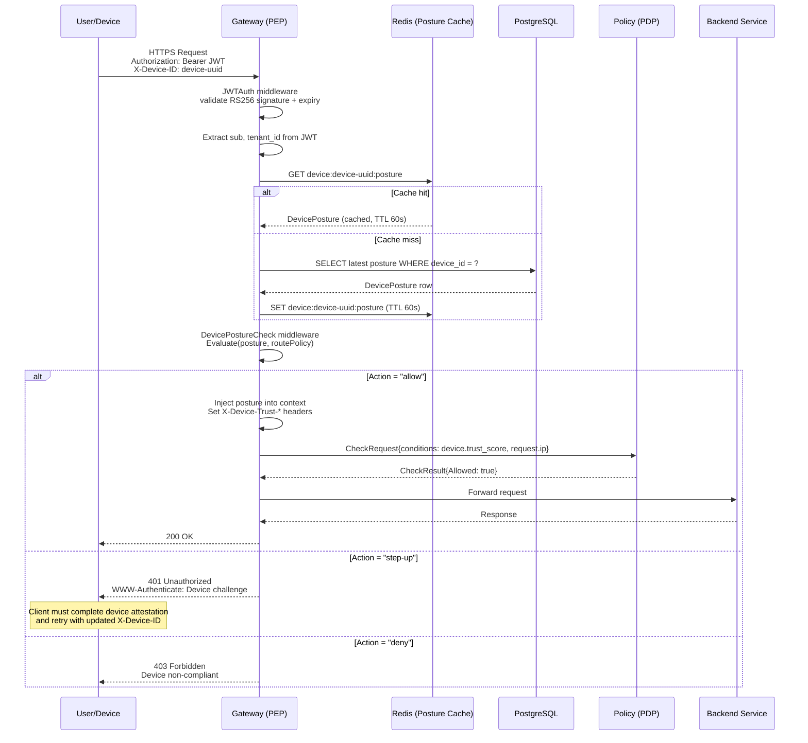
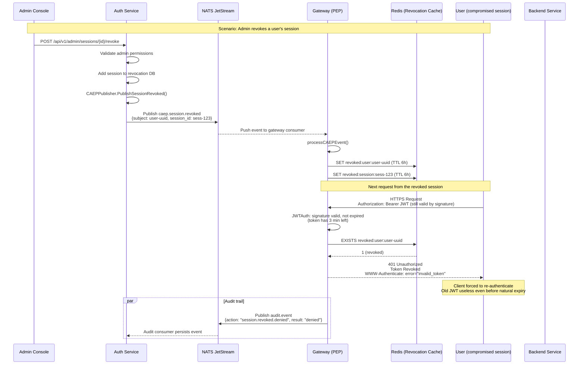
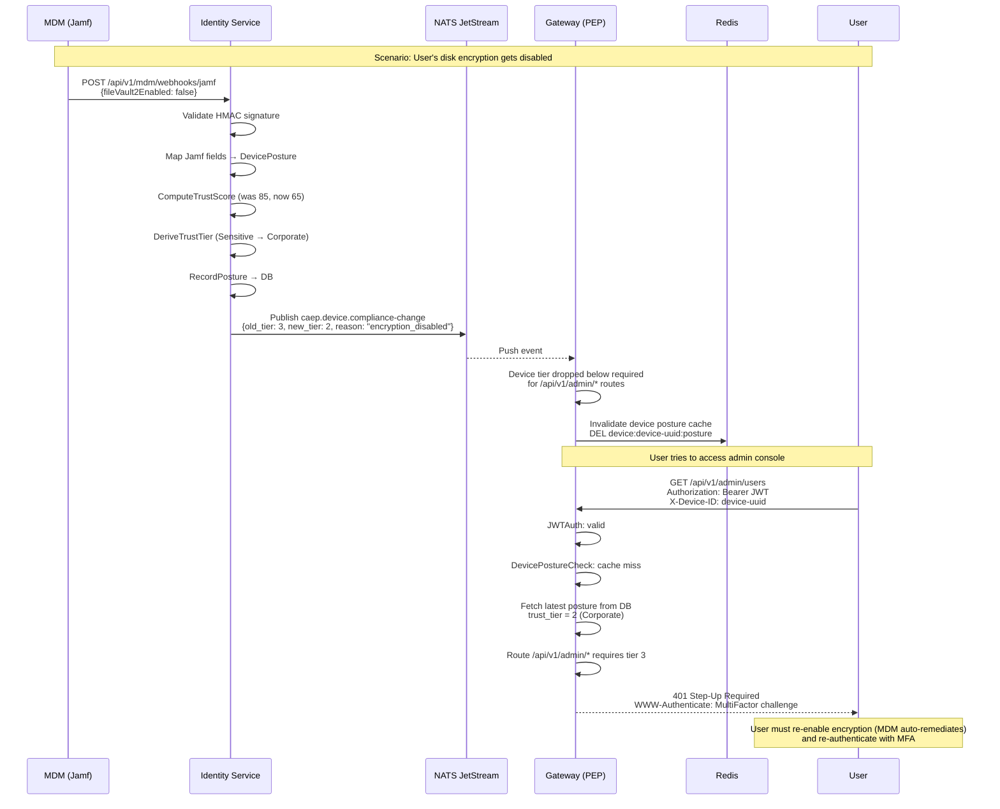

# Zero Trust Implementation Plan

> **Design Document** — Engineering blueprint for evolving GGID from perimeter-based identity verification (Level 0) to device-aware continuous authentication (Level 2), with a forward-looking roadmap for workload identity (Level 3).

---

## Table of Contents

1. [Executive Summary](#1-executive-summary)
2. [Current State Assessment](#2-current-state-assessment)
3. [Phase 1: Device Posture API (Level 0 → Level 1)](#3-phase-1-device-posture-api-level-0--level-1)
4. [Phase 2: Continuous Access Evaluation (Level 1 → Level 2)](#4-phase-2-continuous-access-evaluation-level-1--level-2)
5. [Phase 3: SPIFFE Integration (Level 2 → Level 3, Future)](#5-phase-3-spiffe-integration-level-2--level-3-future)
6. [Architecture Diagrams](#6-architecture-diagrams)
7. [Risk Assessment](#7-risk-assessment)
8. [Appendix: Glossary](#8-appendix-glossary)

---

## 1. Executive Summary

GGID is a Go-based IAM suite comprising seven microservices (gateway, identity, auth, oauth, policy, org, audit) that provides strong authentication, RBAC + ABAC authorization, and audit logging. Today, GGID operates at **Zero Trust Maturity Level 0** — identity-centric perimeter security. The gateway verifies JWTs on every request and the policy service evaluates RBAC + ABAC conditions, but there is no device trust signal, no continuous session evaluation, and no real-time revocation.

This document defines a three-phase implementation plan to advance GGID to **Level 2** (device-aware continuous authentication) within **6–7 months**, and outlines the path to Level 3 (workload identity via SPIFFE/SPIRE) as a longer-term goal.

### Maturity Model

| Level | Description | Status |
|-------|-------------|--------|
| **Level 0** — Identity-centric | JWT verification at gateway, RBAC/ABAC policy, audit logging | **Current** |
| **Level 1** — Device-aware | Device posture evaluated in access decisions, step-up triggers | Phase 1 (3–4 months) |
| **Level 2** — Continuous | Real-time session revocation (CAEP), risk scoring, short-lived tokens | Phase 2 (2–3 months) |
| **Level 3** — Workload identity | SPIFFE SVID-based mTLS between services, zero-config secrets | Phase 3 (future) |
| **Level 4** — Adaptive | ML-driven behavioral analytics, automated policy tuning | Future |

### Why GGID is Well-Positioned

GGID's existing architecture already maps to the NIST SP 800-207 zero-trust logical components:

- **Policy Enforcement Point (PEP)**: The gateway (`services/gateway/`) already acts as a reverse proxy with a mature middleware chain — JWT validation, tenant resolution, sliding-window rate limiting, circuit breakers.
- **Policy Decision Point (PDP)**: The policy service (`services/policy/internal/domain/models.go`) evaluates per-request `CheckRequest` with arbitrary `Conditions map[string]any` — the exact mechanism needed to inject device posture and risk signals.
- **Telemetry foundation**: The audit service (`services/audit/internal/consumer/nats_consumer.go`) consumes events from NATS JetStream with HMAC-chained tamper detection — ready to be extended for risk signal ingestion.

The core insight: **zero trust does not require replacing GGID's architecture — it requires extending existing interfaces with new signal types.**

---

## 2. Current State Assessment

### 2.1 What GGID Has Today

#### Gateway as Policy Enforcement Point

The gateway's middleware chain (`services/gateway/internal/middleware/middleware.go`) already implements per-request verification:

```go
// Existing middleware chain (simplified)
handler := RequestID(handler)
handler = Logging(handler)
handler = CORSWithConfig(corsCfg)(handler)
handler = TenantResolver(domainSuffix)(handler)
handler = JWTAuth(jwks, required, issuer, audience)(handler)  // RS256 JWT via JWKS
handler = SlidingWindowLimiter.Middleware(handler)             // Redis-backed rate limit
handler = CircuitMiddleware(prefix, registry, handler)         // Circuit breaker
```

The `JWTAuth` middleware validates RS256 JWTs against cached JWKS keys, extracts `sub` and `tenant_id` claims into the request context, and supports periodic JWKS refresh. This is the **insertion point** for zero-trust extensions — new middleware can be added to the chain without modifying existing components.

#### Policy Service as Decision Point

The policy engine (`services/policy/internal/domain/models.go`) already supports attribute-based conditions:

```go
// services/policy/internal/domain/models.go (existing)
type CheckRequest struct {
    UserID       uuid.UUID
    TenantID     uuid.UUID
    ResourceType string
    Action       string
    Resource     string
    Conditions   map[string]any  // ← Extensible: device posture, geo, risk score
}

type Policy struct {
    Effect      Effect       // allow | deny
    Actions     []string
    Resources   []string
    Conditions  map[string]any  // ← ABAC conditions evaluated per-request
    Priority    int
}
```

The `Conditions map[string]any` field is the critical enabler — device posture attributes, IP geolocation, and risk scores can be passed as new condition keys without schema changes. A policy can already express rules like:

```json
{
  "effect": "allow",
  "actions": ["iam:users:read"],
  "resources": ["*"],
  "conditions": {
    "device.managed": true,
    "device.trust_score": { "$gte": 70 },
    "request.ip_country": { "$in": ["US", "CA", "UK"] }
  }
}
```

The evaluation engine just needs to understand these new condition keys.

#### Audit Service as Telemetry Foundation

The audit service (`services/audit/internal/consumer/nats_consumer.go`) consumes `AuditEvent` messages from NATS JetStream:

```go
// Existing NATS stream configuration
StreamConfig{
    Name:     "AUDIT_EVENTS",
    Subjects: []string{"audit.>"},
    MaxAge:   72 * time.Hour,
    MaxBytes: 1 << 30, // 1 GB
}
```

Each `AuditEvent` includes `ActorType`, `Action`, `IPAddress`, `UserAgent`, `RequestID`, and HMAC chain hash for tamper detection. This infrastructure is ready to carry zero-trust signals (device posture changes, risk scores, session revocation events).

#### Additional Existing Capabilities

| Capability | Location | ZT Relevance |
|-----------|----------|--------------|
| MFA (TOTP) | `services/auth/` | Step-up auth foundation |
| WebAuthn / Passkeys | `services/auth/internal/webauthn/` | Hardware-backed device attestation |
| OAuth/OIDC | `services/oauth/` | Token lifecycle management |
| SAML SSO | `pkg/saml/` | Federation for partner IdPs |
| Tenant isolation | `pkg/tenant/` | Multi-tenant scoping for ZT policies |
| Rate limiting | `services/gateway/internal/middleware/sliding_ratelimit.go` | DDoS + brute-force protection |
| Circuit breaker | `services/gateway/internal/middleware/circuitbreaker.go` | Resilience for upstream calls |
| Redis integration | `go-redis/v9` | Backing store for session revocation cache |

### 2.2 What's Missing for Zero Trust

| Gap | Impact | Addressed By |
|-----|--------|-------------|
| **Device inventory & posture** | Access decisions cannot factor device health — a valid user on a compromised device gets through | Phase 1 |
| **Posture-aware policy conditions** | ABAC engine exists but has no `device.*` condition keys defined or evaluated | Phase 1 |
| **Continuous session evaluation** | Once a JWT is issued, it's valid until expiry — no mid-session revocation | Phase 2 |
| **CAEP event pipeline** | No mechanism to push/receive Shared Signals Framework events | Phase 2 |
| **Risk scoring** | No behavioral analytics, IP anomaly detection, or composite risk score | Phase 2 |
| **Token introspection (RFC 7662)** | Gateway validates JWTs locally — cannot detect server-side revocation in real-time | Phase 2 |
| **Short-lived tokens** | Default token lifetime is hours, not minutes — widens the attack window | Phase 2 |
| **Service-to-service mTLS** | Inter-service communication uses plain TLS, not mutual TLS with workload identity | Phase 3 |
| **Step-up auth triggers** | MFA exists but is not triggered dynamically by risk or device posture | Phase 1–2 |

---

## 3. Phase 1: Device Posture API (Level 0 → Level 1)

**Goal**: Incorporate device trust into every access decision. A valid user on an unmanaged, unpatched, or compromised device should be denied or challenged with step-up authentication.

**Estimated effort**: 3–4 months (10–12 story points)

### 3.1 Architecture Decision: New Package, Not New Service

Device posture data is tightly coupled to policy evaluation. Rather than deploying an 8th microservice, we implement device posture as a **shared package** (`pkg/deviceposture/`) that is consumed by the identity service (device registration API) and the gateway (posture check middleware).

**Rationale**:
- Avoids network hops for posture lookups — the gateway can use a local cache.
- Shares the same PostgreSQL database as identity (tenant-scoped).
- Reduces operational complexity (no new container to deploy, monitor, scale).

```
pkg/deviceposture/
    ├── model.go           // Device, DevicePosture, PostureCheck structs
    ├── store.go           // Store interface + PostgreSQL implementation
    ├── evaluator.go       // Posture evaluation logic
    ├── mdm_webhook.go     // Jamf/Intune webhook receivers
    └── store_test.go      // Unit tests
```

### 3.2 Data Model

```go
// pkg/deviceposture/model.go
package deviceposture

import (
    "time"
    "github.com/google/uuid"
)

// Platform identifies the device operating system.
type Platform string

const (
    PlatformMacOS   Platform = "macos"
    PlatformWindows Platform = "windows"
    PlatformLinux   Platform = "linux"
    PlatformIOS     Platform = "ios"
    PlatformAndroid Platform = "android"
)

// TrustTier classifies a device's trust level (NIST/BeyondCorp alignment).
type TrustTier int

const (
    TrustTierUntrusted TrustTier = 0 // Unknown or unmanaged device
    TrustTierBasic     TrustTier = 1 // Managed, basic compliance
    TrustTierCorporate TrustTier = 2 // Managed, encrypted, EDR active
    TrustTierSensitive TrustTier = 3 // Corporate + hardware attestation + recent check
)

// Device represents a registered device in the inventory.
type Device struct {
    ID              uuid.UUID  `json:"id"`
    TenantID        uuid.UUID  `json:"tenant_id"`
    UserID          uuid.UUID  `json:"user_id"`           // Primary owner
    DeviceName      string     `json:"device_name"`
    Platform        Platform   `json:"platform"`
    SerialNumber    string     `json:"serial_number"`      // Hardware serial (unique per tenant)
    MDMDeviceID     string     `json:"mdm_device_id"`      // Jamf/Intune device identifier
    EnrolledAt      time.Time  `json:"enrolled_at"`
    LastSeen        time.Time  `json:"last_seen"`
    CurrentTier     TrustTier  `json:"current_trust_tier"` // Computed from latest posture
    CreatedAt       time.Time  `json:"created_at"`
    UpdatedAt       time.Time  `json:"updated_at"`
}

// DevicePosture captures a point-in-time snapshot of device health signals.
// Multiple snapshots form a posture history (for trend analysis).
type DevicePosture struct {
    ID                uuid.UUID `json:"id"`
    DeviceID          uuid.UUID `json:"device_id"`
    TenantID          uuid.UUID `json:"tenant_id"`
    Platform          Platform  `json:"platform"`
    OSVersion         string    `json:"os_version"`
    Managed           bool      `json:"managed"`            // Enrolled in MDM
    Encrypted         bool      `json:"encrypted"`          // Disk encryption (FileVault/BitLocker/LUKS)
    FirewallEnabled   bool      `json:"firewall_enabled"`
    EDRHealthy        bool      `json:"edr_healthy"`         // Endpoint Detection & Response
    AntivirusActive   bool      `json:"antivirus_active"`
    ScreenLockEnabled bool      `json:"screen_lock_enabled"` // Mobile devices
    Jailbroken        bool      `json:"jailbroken"`          // iOS/Android jailbreak/root
    UsbRestricted     bool      `json:"usb_restricted"`
    AttestationValid  bool      `json:"attestation_valid"`   // TPM / Secure Enclave
    LastPatchDate     time.Time `json:"last_patch_date"`
    TrustScore        int       `json:"trust_score"`         // 0-100, computed
    TrustTier         TrustTier `json:"trust_tier"`          // Derived from score
    Source            string    `json:"source"`              // "mdm-webhook" | "agent-report" | "manual"
    CapturedAt        time.Time `json:"captured_at"`
}

// PosturePolicy defines the required posture for a resource tier.
// Stored as policy conditions in the policy service.
type PosturePolicy struct {
    MinTrustTier   TrustTier `json:"min_trust_tier"`
    RequireManaged bool      `json:"require_managed"`
    RequireEncrypted bool    `json:"require_encrypted"`
    RequireEDR     bool      `json:"require_edr"`
    MinOSVersion   string    `json:"min_os_version"`       // Semver, e.g. "14.0"
    MaxStaleDuration time.Duration `json:"max_stale_duration"` // Posture must be fresher than this
}

// PostureCheckResult is the output of evaluating a posture against a policy.
type PostureCheckResult struct {
    Compliant bool     `json:"compliant"`
    TrustTier TrustTier `json:"trust_tier"`
    TrustScore int     `json:"trust_score"`
    Failures  []string `json:"failures,omitempty"`
    Action    string   `json:"action"` // "allow" | "step-up" | "deny"
}
```

### 3.3 Store Interface

```go
// pkg/deviceposture/store.go
package deviceposture

import (
    "context"
    "github.com/google/uuid"
)

// Store defines the persistence interface for device inventory and posture.
type Store interface {
    // RegisterDevice creates or updates a device in the inventory.
    RegisterDevice(ctx context.Context, d *Device) error

    // GetDevice retrieves a device by ID.
    GetDevice(ctx context.Context, id uuid.UUID) (*Device, error)

    // GetDeviceByMDMID looks up a device by its MDM-assigned identifier.
    GetDeviceByMDMID(ctx context.Context, tenantID uuid.UUID, mdmID string) (*Device, error)

    // ListUserDevices returns all devices owned by a user.
    ListUserDevices(ctx context.Context, tenantID, userID uuid.UUID) ([]*Device, error)

    // RecordPosture inserts a new posture snapshot and updates the device's
    // current trust tier.
    RecordPosture(ctx context.Context, p *DevicePosture) error

    // GetLatestPosture returns the most recent posture snapshot for a device.
    GetLatestPosture(ctx context.Context, deviceID uuid.UUID) (*DevicePosture, error)

    // DeleteDevice removes a device from the inventory (lost/stolen/decommissioned).
    DeleteDevice(ctx context.Context, id uuid.UUID) error
}
```

### 3.4 Posture Evaluator

```go
// pkg/deviceposture/evaluator.go
package deviceposture

import (
    "fmt"
    "strings"
    "time"
)

// Evaluator computes a trust score and checks compliance against a policy.
type Evaluator struct {
    clock func() time.Time
}

func NewEvaluator() *Evaluator {
    return &Evaluator{clock: time.Now}
}

// ComputeTrustScore calculates a 0-100 score from posture signals.
// Weighting reflects BeyondCorp-style trust tiers.
func (e *Evaluator) ComputeTrustScore(p *DevicePosture) int {
    score := 0

    if p.Managed {
        score += 25
    }
    if p.Encrypted {
        score += 20
    }
    if p.FirewallEnabled {
        score += 10
    }
    if p.EDRHealthy {
        score += 20
    }
    if p.AttestationValid {
        score += 15
    }
    if p.AntivirusActive {
        score += 5
    }
    if p.ScreenLockEnabled {
        score += 5
    }

    // Penalties
    if p.Jailbroken {
        score = 0 // Hard fail
    }

    if score > 100 {
        score = 100
    }
    return score
}

// DeriveTrustTier maps a score to a trust tier.
func (e *Evaluator) DeriveTrustTier(score int) TrustTier {
    switch {
    case score >= 85:
        return TrustTierSensitive
    case score >= 55:
        return TrustTierCorporate
    case score >= 30:
        return TrustTierBasic
    default:
        return TrustTierUntrusted
    }
}

// Evaluate checks device posture against a policy and returns a decision.
func (e *Evaluator) Evaluate(p *DevicePosture, policy PosturePolicy) PostureCheckResult {
    var failures []string

    // Staleness check
    maxAge := policy.MaxStaleDuration
    if maxAge == 0 {
        maxAge = 24 * time.Hour // default: posture must be < 24h old
    }
    if e.clock().Sub(p.CapturedAt) > maxAge {
        failures = append(failures, fmt.Sprintf(
            "posture data stale (captured %s ago, max %s)",
            e.clock().Sub(p.CapturedAt).Round(time.Minute), maxAge,
        ))
    }

    // Individual checks
    if policy.RequireManaged && !p.Managed {
        failures = append(failures, "device not managed (no MDM enrollment)")
    }
    if policy.RequireEncrypted && !p.Encrypted {
        failures = append(failures, "disk encryption disabled")
    }
    if policy.RequireEDR && !p.EDRHealthy {
        failures = append(failures, "EDR agent not healthy")
    }
    if p.Jailbroken {
        failures = append(failures, "device jailbroken or rooted")
    }

    // OS version check (simple semver comparison)
    if policy.MinOSVersion != "" && compareVersions(p.OSVersion, policy.MinOSVersion) < 0 {
        failures = append(failures, fmt.Sprintf(
            "OS %s below minimum %s", p.OSVersion, policy.MinOSVersion,
        ))
    }

    score := e.ComputeTrustScore(p)
    tier := e.DeriveTrustTier(score)

    // Determine action
    if len(failures) > 0 {
        action := "deny"
        if tier >= policy.MinTrustTier-1 {
            action = "step-up" // Close enough — challenge instead of hard deny
        }
        return PostureCheckResult{
            Compliant:  false,
            TrustTier:  tier,
            TrustScore: score,
            Failures:   failures,
            Action:     action,
        }
    }

    // All individual checks passed — verify tier
    if tier < policy.MinTrustTier {
        return PostureCheckResult{
            Compliant:  false,
            TrustTier:  tier,
            TrustScore: score,
            Failures:   []string{fmt.Sprintf("trust tier %d below required %d", tier, policy.MinTrustTier)},
            Action:     "step-up",
        }
    }

    return PostureCheckResult{
        Compliant:  true,
        TrustTier:  tier,
        TrustScore: score,
        Action:     "allow",
    }
}

// compareVersions compares two semver-like version strings.
// Returns -1 if a < b, 0 if equal, 1 if a > b.
func compareVersions(a, b string) int {
    ap := strings.Split(a, ".")
    bp := strings.Split(b, ".")
    maxLen := len(ap)
    if len(bp) > maxLen {
        maxLen = len(bp)
    }
    for i := 0; i < maxLen; i++ {
        var ai, bi int
        if i < len(ap) {
            fmt.Sscanf(ap[i], "%d", &ai)
        }
        if i < len(bp) {
            fmt.Sscanf(bp[i], "%d", &bi)
        }
        if ai < bi {
            return -1
        }
        if ai > bi {
            return 1
        }
    }
    return 0
}
```

### 3.5 API Endpoints

Device registration and posture APIs are served by the **identity service** (already manages users and credentials). The gateway proxies these endpoints under `/api/v1/`.

| Method | Endpoint | Description | Auth |
|--------|----------|-------------|------|
| `POST` | `/api/v1/devices` | Register a new device (MDM enrollment callback or admin) | JWT + `iam:devices:write` |
| `GET` | `/api/v1/devices/{id}` | Get device details | JWT + `iam:devices:read` |
| `GET` | `/api/v1/devices` | List devices (filtered by `user_id` or `tenant_id`) | JWT + `iam:devices:read` |
| `DELETE` | `/api/v1/devices/{id}` | Decommission a device | JWT + `iam:devices:write` |
| `GET` | `/api/v1/devices/{id}/posture` | Get latest posture snapshot | JWT + `iam:devices:read` |
| `POST` | `/api/v1/devices/{id}/posture` | Record posture (from MDM webhook or agent) | JWT or MDM API key |
| `POST` | `/api/v1/devices/{id}/posture/check` | Evaluate posture against a policy | JWT + `iam:devices:read` |
| `POST` | `/api/v1/mdm/webhooks/jamf` | Jamf webhook receiver (device posture push) | HMAC signature |
| `POST` | `/api/v1/mdm/webhooks/intune` | Microsoft Intune webhook receiver | Bearer token |

```go
// services/identity/internal/handler/device_handler.go (proposed)

// RegisterDevice handles POST /api/v1/devices
func (h *DeviceHandler) RegisterDevice(w http.ResponseWriter, r *http.Request) {
    var req struct {
        DeviceName   string `json:"device_name"`
        Platform     string `json:"platform"`
        SerialNumber string `json:"serial_number"`
        MDMDeviceID  string `json:"mdm_device_id"`
        UserID       string `json:"user_id"`
    }
    if err := json.NewDecoder(r.Body).Decode(&req); err != nil {
        writeError(w, http.StatusBadRequest, "invalid request body")
        return
    }

    tenantID := tenantIDFromContext(r.Context())
    userID, _ := uuid.Parse(req.UserID)

    device := &deviceposture.Device{
        ID:           uuid.New(),
        TenantID:     tenantID,
        UserID:       userID,
        DeviceName:   req.DeviceName,
        Platform:     deviceposture.Platform(req.Platform),
        SerialNumber: req.SerialNumber,
        MDMDeviceID:  req.MDMDeviceID,
        EnrolledAt:   time.Now().UTC(),
        LastSeen:     time.Now().UTC(),
    }

    if err := h.store.RegisterDevice(r.Context(), device); err != nil {
        writeError(w, http.StatusInternalServerError, "failed to register device")
        return
    }

    writeJSON(w, http.StatusCreated, device)
}

// CheckPosture handles POST /api/v1/devices/{id}/posture/check
func (h *DeviceHandler) CheckPosture(w http.ResponseWriter, r *http.Request) {
    deviceID, _ := uuid.Parse(chi.URLParam(r, "id"))

    posture, err := h.store.GetLatestPosture(r.Context(), deviceID)
    if err != nil {
        writeError(w, http.StatusNotFound, "device or posture not found")
        return
    }

    // Parse requested policy from body (or load from policy service)
    var policy deviceposture.PosturePolicy
    if err := json.NewDecoder(r.Body).Decode(&policy); err != nil {
        // Default policy: Tier 2 (Corporate) required
        policy = deviceposture.PosturePolicy{
            MinTrustTier:     deviceposture.TrustTierCorporate,
            RequireManaged:   true,
            RequireEncrypted: true,
            RequireEDR:       true,
            MaxStaleDuration: 24 * time.Hour,
        }
    }

    result := h.evaluator.Evaluate(posture, policy)
    writeJSON(w, http.StatusOK, result)
}
```

### 3.6 Database Migration

```sql
-- services/identity/migrations/020_devices.up.sql

-- Device inventory
CREATE TABLE IF NOT EXISTS devices (
    id              UUID PRIMARY KEY DEFAULT gen_random_uuid(),
    tenant_id       UUID NOT NULL,
    user_id         UUID NOT NULL REFERENCES users(id) ON DELETE CASCADE,
    device_name     VARCHAR(255) NOT NULL DEFAULT '',
    platform        VARCHAR(32) NOT NULL,
    serial_number   VARCHAR(255) NOT NULL DEFAULT '',
    mdm_device_id   VARCHAR(255) NOT NULL DEFAULT '',
    enrolled_at     TIMESTAMPTZ NOT NULL DEFAULT NOW(),
    last_seen       TIMESTAMPTZ NOT NULL DEFAULT NOW(),
    current_trust_tier SMALLINT NOT NULL DEFAULT 0,
    created_at      TIMESTAMPTZ NOT NULL DEFAULT NOW(),
    updated_at      TIMESTAMPTZ NOT NULL DEFAULT NOW()
);

-- Tenant-scoped uniqueness for serial numbers and MDM IDs
CREATE UNIQUE INDEX IF NOT EXISTS idx_devices_tenant_serial
    ON devices (tenant_id, serial_number)
    WHERE serial_number != '';

CREATE UNIQUE INDEX IF NOT EXISTS idx_devices_tenant_mdm
    ON devices (tenant_id, mdm_device_id)
    WHERE mdm_device_id != '';

CREATE INDEX IF NOT EXISTS idx_devices_user ON devices (user_id);
CREATE INDEX IF NOT EXISTS idx_devices_tenant ON devices (tenant_id);

-- Enable Row-Level Security
ALTER TABLE devices ENABLE ROW LEVEL SECURITY;
CREATE POLICY devices_tenant_isolation ON devices
    USING (tenant_id = current_setting('app.tenant_id', true)::UUID);

-- Device posture snapshots (append-only history)
CREATE TABLE IF NOT EXISTS device_posture (
    id                  UUID PRIMARY KEY DEFAULT gen_random_uuid(),
    device_id           UUID NOT NULL REFERENCES devices(id) ON DELETE CASCADE,
    tenant_id           UUID NOT NULL,
    platform            VARCHAR(32) NOT NULL,
    os_version          VARCHAR(64) NOT NULL DEFAULT '',
    managed             BOOLEAN NOT NULL DEFAULT false,
    encrypted           BOOLEAN NOT NULL DEFAULT false,
    firewall_enabled    BOOLEAN NOT NULL DEFAULT false,
    edr_healthy         BOOLEAN NOT NULL DEFAULT false,
    antivirus_active    BOOLEAN NOT NULL DEFAULT false,
    screen_lock_enabled BOOLEAN NOT NULL DEFAULT false,
    jailbroken          BOOLEAN NOT NULL DEFAULT false,
    usb_restricted      BOOLEAN NOT NULL DEFAULT false,
    attestation_valid   BOOLEAN NOT NULL DEFAULT false,
    last_patch_date     TIMESTAMPTZ,
    trust_score         SMALLINT NOT NULL DEFAULT 0,
    trust_tier          SMALLINT NOT NULL DEFAULT 0,
    source              VARCHAR(32) NOT NULL DEFAULT 'agent-report',
    captured_at         TIMESTAMPTZ NOT NULL DEFAULT NOW()
);

CREATE INDEX IF NOT EXISTS idx_posture_device_time
    ON device_posture (device_id, captured_at DESC);
CREATE INDEX IF NOT EXISTS idx_posture_tenant ON device_posture (tenant_id);

-- Retention: auto-cleanup posture snapshots older than 90 days
-- (Scheduled via audit service cleanup job or pg_cron)
```

```sql
-- services/identity/migrations/020_devices.down.sql
DROP TABLE IF EXISTS device_posture;
DROP TABLE IF EXISTS devices;
```

### 3.7 Gateway Middleware: Device Posture Check

A new middleware in the gateway chain. It runs **after** JWT validation (needs the user context) and **before** the rate limiter (denied requests shouldn't count against the quota).

```go
// services/gateway/internal/middleware/device_posture.go (proposed)
package middleware

import (
    "context"
    "encoding/json"
    "fmt"
    "net/http"
    "time"

    "github.com/ggid/ggid/pkg/deviceposture"
    "github.com/google/uuid"
)

// contextKey for device posture (extends existing context keys in middleware.go)
const DevicePostureKey contextKey = "device_posture"

// PostureCache is an interface for caching posture lookups.
// This avoids hitting the database on every request.
type PostureCache interface {
    Get(ctx context.Context, deviceID uuid.UUID) (*deviceposture.DevicePosture, error)
    Set(ctx context.Context, deviceID uuid.UUID, p *deviceposture.DevicePosture, ttl time.Duration) error
}

// RoutePosturePolicy maps route prefixes to required posture policies.
type RoutePosturePolicy struct {
    Routes  map[string]deviceposture.PosturePolicy
    Default deviceposture.PosturePolicy
}

// DevicePostureCheck middleware evaluates device posture for each request.
// If no device ID is provided (X-Device-ID header), it uses TrustTierUntrusted
// and applies the default policy (typically: require nothing for public routes).
func DevicePostureCheck(
    store deviceposture.Store,
    cache PostureCache,
    evaluator *deviceposture.Evaluator,
    routePolicies RoutePosturePolicy,
    enforce bool,
) func(http.Handler) http.Handler {
    return func(next http.Handler) http.Handler {
        return http.HandlerFunc(func(w http.ResponseWriter, r *http.Request) {
            deviceIDStr := r.Header.Get("X-Device-ID")

            // No device context — evaluate against untrusted posture
            if deviceIDStr == "" {
                if !enforce {
                    // Soft mode: allow through, inject untrusted posture for policy engine
                    ctx := context.WithValue(r.Context(), DevicePostureKey,
                        &deviceposture.PostureCheckResult{
                            Compliant:  false,
                            TrustTier:  deviceposture.TrustTierUntrusted,
                            TrustScore: 0,
                            Action:     "allow", // Soft mode allows untrusted
                        })
                    next.ServeHTTP(w, r.WithContext(ctx))
                    return
                }
                // Hard mode: deny requests without device context for protected routes
                writePostureError(w, http.StatusUnauthorized,
                    "device identity required", "step-up")
                return
            }

            deviceID, err := uuid.Parse(deviceIDStr)
            if err != nil {
                writePostureError(w, http.StatusBadRequest, "invalid device ID", "")
                return
            }

            // Check cache first (TTL: 60s)
            posture, err := cache.Get(r.Context(), deviceID)
            if err != nil {
                // Cache miss — fetch from store
                posture, err = store.GetLatestPosture(r.Context(), deviceID)
                if err != nil {
                    writePostureError(w, http.StatusForbidden,
                        "device not registered or no posture data", "step-up")
                    return
                }
                _ = cache.Set(r.Context(), deviceID, posture, 60*time.Second)
            }

            // Determine policy for this route
            policy := routePolicies.Default
            for prefix, p := range routePolicies.Routes {
                if matchesRoute(r.URL.Path, prefix) {
                    policy = p
                    break
                }
            }

            // Evaluate
            result := evaluator.Evaluate(posture, policy)

            // Inject result into context for policy engine
            ctx := context.WithValue(r.Context(), DevicePostureKey, result)

            switch result.Action {
            case "allow":
                // Inject posture headers for downstream services
                w.Header().Set("X-Device-Trust-Tier", fmt.Sprintf("%d", result.TrustTier))
                w.Header().Set("X-Device-Trust-Score", fmt.Sprintf("%d", result.TrustScore))
                next.ServeHTTP(w, r.WithContext(ctx))

            case "step-up":
                // Return 401 with WWW-Authenticate challenge
                w.Header().Set("WWW-Authenticate",
                    `Device realm="ggid", challenge="/api/v1/devices/attest"`)
                writePostureError(w, http.StatusUnauthorized,
                    "device posture insufficient: "+fmt.Sprintf("%v", result.Failures), "step-up")

            default: // "deny"
                writePostureError(w, http.StatusForbidden,
                    "access denied: device non-compliant: "+fmt.Sprintf("%v", result.Failures), "deny")
            }
        })
    }
}

func writePostureError(w http.ResponseWriter, status int, detail, action string) {
    w.Header().Set("Content-Type", "application/json")
    w.WriteHeader(status)
    json.NewEncoder(w).Encode(map[string]string{
        "type":   "https://ggid.dev/errors/device-posture",
        "title":  "Device Posture Check Failed",
        "detail": detail,
        "action": action,
    })
}

func matchesRoute(path, prefix string) bool {
    return len(path) >= len(prefix) && path[:len(prefix)] == prefix
}
```

**Updated middleware chain**:

```go
// services/gateway/internal/server/router.go (modified)
handler := RequestID(handler)
handler = Logging(handler)
handler = CORSWithConfig(corsCfg)(handler)
handler = TenantResolver(domainSuffix)(handler)
handler = JWTAuth(jwks, required, issuer, audience)(handler)
handler = DevicePostureCheck(deviceStore, postureCache, evaluator, routePolicies, enforce)  // NEW
handler = SlidingWindowLimiter.Middleware(handler)
handler = CircuitMiddleware(prefix, registry, handler)
```

### 3.8 Policy Engine Integration

The gateway's DevicePostureCheck middleware injects posture into the request context. Before calling the policy service, the gateway maps posture attributes into ABAC conditions:

```go
// services/gateway/internal/server/authorize.go (proposed — request authorization helper)

func buildPolicyRequest(r *http.Request, action, resource string) *domain.CheckRequest {
    userID, _ := UserIDFromRequest(r)
    tenantIDStr, _ := TenantIDFromRequest(r)
    tenantID, _ := uuid.Parse(tenantIDStr)

    conditions := map[string]any{
        "request.ip":       clientIPFromRequest(r),
        "request.path":     r.URL.Path,
        "request.method":   r.Method,
    }

    // Inject device posture as conditions
    if posture, ok := r.Context().Value(DevicePostureKey).(*deviceposture.PostureCheckResult); ok {
        conditions["device.trust_tier"] = posture.TrustTier
        conditions["device.trust_score"] = posture.TrustScore
        conditions["device.compliant"] = posture.Compliant
    }

    return &domain.CheckRequest{
        UserID:       userID,
        TenantID:     tenantID,
        ResourceType: "iam",
        Action:       action,
        Resource:     resource,
        Conditions:   conditions,
    }
}
```

This enables ABAC policies like:

```json
{
  "name": "deny-unmanaged-devices-sensitive",
  "effect": "deny",
  "actions": ["iam:billing:*", "iam:admin:*"],
  "resources": ["*"],
  "conditions": {
    "device.trust_score": { "$lt": 55 }
  },
  "priority": 100
}
```

### 3.9 MDM Webhook Receivers

Posture data arrives from MDM platforms via push webhooks. Each receiver validates the MDM-specific authentication and maps the payload to GGID's `DevicePosture` struct.

```go
// pkg/deviceposture/mdm_webhook.go (proposed)
package deviceposture

import (
    "crypto/hmac"
    "crypto/sha256"
    "encoding/hex"
    "encoding/json"
    "net/http"
    "time"

    "github.com/google/uuid"
)

// JamfWebhookPayload represents the payload from Jamf Pro webhooks.
type JamfWebhookPayload struct {
    Webhook struct {
        Name string `json:"name"`
    } `json:"webhook"`
    Event struct {
        DeviceName    string `json:"deviceName"`
        SerialNumber  string `json:"serialNumber"`
        UDID          string `json:"udid"`
        Platform      string `json:"platform"`
        OSVersion     string `json:"osVersion"`
        Managed       bool   `json:"managed"`
        FileVault     bool   `json:"fileVault2Enabled"`
        Firewall      bool   `json:"firewallEnabled"`
    } `json:"event"`
}

// HandleJamfWebhook processes a Jamf Pro device posture webhook.
func HandleJamfWebhook(store Store, secret string) http.HandlerFunc {
    return func(w http.ResponseWriter, r *http.Request) {
        // Validate HMAC signature
        signature := r.Header.Get("X-Signature")
        body := make([]byte, 0)
        // ... read body ...

        if !validateHMAC(body, signature, secret) {
            http.Error(w, "invalid signature", http.StatusUnauthorized)
            return
        }

        var payload JamfWebhookPayload
        if err := json.Unmarshal(body, &payload); err != nil {
            http.Error(w, "invalid payload", http.StatusBadRequest)
            return
        }

        // Look up device by Jamf UDID
        tenantID := tenantIDFromContext(r.Context())
        device, err := store.GetDeviceByMDMID(r.Context(), tenantID, payload.Event.UDID)
        if err != nil {
            http.Error(w, "device not found", http.StatusNotFound)
            return
        }

        // Map Jamf fields to DevicePosture
        posture := &DevicePosture{
            ID:              uuid.New(),
            DeviceID:        device.ID,
            TenantID:        tenantID,
            Platform:        Platform(payload.Event.Platform),
            OSVersion:       payload.Event.OSVersion,
            Managed:         payload.Event.Managed,
            Encrypted:       payload.Event.FileVault,
            FirewallEnabled: payload.Event.Firewall,
            Source:          "mdm-webhook-jamf",
            CapturedAt:      time.Now().UTC(),
        }

        // Compute score and tier
        evaluator := NewEvaluator()
        posture.TrustScore = evaluator.ComputeTrustScore(posture)
        posture.TrustTier = evaluator.DeriveTrustTier(posture.TrustScore)

        if err := store.RecordPosture(r.Context(), posture); err != nil {
            http.Error(w, "failed to record posture", http.StatusInternalServerError)
            return
        }

        // Publish posture change event to NATS (for CAEP in Phase 2)
        // natsPublish("caep.device.compliance-change", posture)

        w.WriteHeader(http.StatusOK)
    }
}

func validateHMAC(body []byte, signature, secret string) bool {
    mac := hmac.New(sha256.New, []byte(secret))
    mac.Write(body)
    expected := hex.EncodeToString(mac.Sum(nil))
    return hmac.Equal([]byte(signature), []byte(expected))
}
```

### 3.10 Task Breakdown

| Task | Description | Effort | Dependencies |
|------|-------------|--------|-------------|
| P1-1 | Create `pkg/deviceposture/` package: model, store interface, evaluator | 2 days | — |
| P1-2 | PostgreSQL store implementation + migration `020_devices` | 2 days | P1-1 |
| P1-3 | Posture cache (Redis-backed, implements `PostureCache` interface) | 1 day | P1-2 |
| P1-4 | Device registration API in identity service (CRUD endpoints) | 2 days | P1-2 |
| P1-5 | Posture recording + check API endpoints | 2 days | P1-4 |
| P1-6 | Gateway `DevicePostureCheck` middleware | 2 days | P1-3 |
| P1-7 | Wire posture into policy engine conditions (gateway authorize helper) | 1 day | P1-6 |
| P1-8 | Jamf webhook receiver | 2 days | P1-5 |
| P1-9 | Intune webhook receiver | 2 days | P1-5 |
| P1-10 | Unit tests (evaluator, store, middleware, webhooks) | 3 days | P1-6, P1-8, P1-9 |
| P1-11 | Integration tests (full request flow with device posture) | 2 days | P1-10 |
| P1-12 | Admin Console UI: device list, posture dashboard | 3 days | P1-4 |
| P1-13 | Documentation + migration guide | 1 day | P1-11 |

**Total**: ~25 days (5 weeks). Calendar time: 3–4 months with cross-team coordination, review cycles, and hardening.

---

## 4. Phase 2: Continuous Access Evaluation (Level 1 → Level 2)

**Goal**: Move from one-time authentication (valid at login, trusted until expiry) to continuous evaluation — sessions can be revoked mid-flight based on real-time signals.

**Estimated effort**: 2–3 months (8–10 story points)
**Prerequisite**: Phase 1 complete (device posture available as a risk signal).

### 4.1 Token Introspection Endpoint (RFC 7662)

Implement a standards-compliant introspection endpoint in the auth service. This allows the gateway to verify token validity server-side when needed (e.g., for high-sensitivity operations).

```go
// services/auth/internal/handler/introspect.go (proposed)
package handler

import (
    "encoding/json"
    "net/http"
    "strings"
    "time"
)

// IntrospectionResponse implements RFC 7662 Section 2.2.
type IntrospectionResponse struct {
    Active     bool   `json:"active"`
    Scope      string `json:"scope,omitempty"`
    ClientID   string `json:"client_id,omitempty"`
    Username   string `json:"username,omitempty"`
    TokenType  string `json:"token_type,omitempty"`
    Exp        int64  `json:"exp,omitempty"`
    Iat        int64  `json:"iat,omitempty"`
    Sub        string `json:"sub,omitempty"`
    Aud        string `json:"aud,omitempty"`
    TenantID   string `json:"tenant_id,omitempty"`
    SessionID  string `json:"session_id,omitempty"`
    JTI        string `json:"jti,omitempty"`
}

// Introspect handles POST /oauth2/introspect (RFC 7662).
// The gateway calls this endpoint to check token validity server-side.
// Protected by client credentials (gateway authenticates with its own ID+secret).
func (h *OAuthHandler) Introspect(w http.ResponseWriter, r *http.Request) {
    // Validate client credentials (gateway's client_id + client_secret)
    clientID, clientSecret, ok := r.BasicAuth()
    if !ok || !h.validateClient(clientID, clientSecret) {
        w.Header().Set("WWW-Authenticate", `Basic realm="ggid-introspect"`)
        writeError(w, http.StatusUnauthorized, "client authentication required")
        return
    }

    token := r.FormValue("token")
    if token == "" {
        writeJSON(w, http.StatusOK, IntrospectionResponse{Active: false})
        return
    }

    // Parse and validate the JWT
    claims, err := h.tokenService.ValidateToken(r.Context(), token)
    if err != nil {
        // Invalid or expired token
        writeJSON(w, http.StatusOK, IntrospectionResponse{Active: false})
        return
    }

    // Check revocation list (Redis set of revoked JTIs)
    if h.revocationStore.IsRevoked(r.Context(), claims.ID) {
        writeJSON(w, http.StatusOK, IntrospectionResponse{Active: false})
        return
    }

    // Token is valid and not revoked
    response := IntrospectionResponse{
        Active:    true,
        TokenType: "Bearer",
        Exp:       claims.ExpiresAt.Unix(),
        Iat:       claims.IssuedAt.Unix(),
        Sub:       claims.Subject,
        Aud:       strings.Join(claims.Audience, " "),
        TenantID:  claims.TenantID,
        SessionID: claims.SessionID,
        JTI:       claims.ID,
    }
    writeJSON(w, http.StatusOK, response)
}
```

### 4.2 Short-Lived Access Tokens + Refresh Cycle

Reduce access token lifetime from hours to **5 minutes**. Refresh tokens remain long-lived but require device posture re-evaluation.

```go
// services/auth/internal/service/token_service.go (modified)
package service

import (
    "time"
)

// TokenConfig holds JWT lifecycle parameters.
type TokenConfig struct {
    AccessTokenTTL  time.Duration // Default: 5 * time.Minute
    RefreshTokenTTL time.Duration // Default: 24 * time.Hour
    // Phase 2: When true, refresh requires device posture check
    PostureRequiredForRefresh bool // Default: true
}

func DefaultTokenConfig() TokenConfig {
    return TokenConfig{
        AccessTokenTTL:           5 * time.Minute,
        RefreshTokenTTL:          24 * time.Hour,
        PostureRequiredForRefresh: true,
    }
}

// RefreshTokenResult contains the new tokens and posture evaluation.
type RefreshTokenResult struct {
    AccessToken  string         `json:"access_token"`
    RefreshToken string         `json:"refresh_token"`
    ExpiresIn    int            `json:"expires_in"`
    TokenType    string         `json:"token_type"`
    PostureResult *PostureResult `json:"posture,omitempty"` // Included when posture was checked
}

// RefreshToken issues a new access token from a refresh token.
// In Phase 2, this also re-evaluates device posture.
func (s *TokenService) RefreshToken(ctx context.Context, refreshToken string, deviceID string) (*RefreshTokenResult, error) {
    // Validate refresh token
    claims, err := s.validateRefreshToken(ctx, refreshToken)
    if err != nil {
        return nil, ErrInvalidRefreshToken
    }

    var postureResult *PostureResult

    // If device posture is required, evaluate before issuing new tokens
    if s.config.PostureRequiredForRefresh && deviceID != "" {
        posture, err := s.deviceStore.GetLatestPosture(ctx, uuid.MustParse(deviceID))
        if err != nil {
            return nil, ErrDeviceNotRegistered
        }

        result := s.evaluator.Evaluate(posture, s.defaultRefreshPolicy)
        if result.Action == "deny" {
            // Device non-compliant — revoke refresh token too
            _ = s.revokeRefreshToken(ctx, claims.ID)
            return nil, ErrDeviceNonCompliant
        }
        postureResult = &PostureResult{
            TrustScore: result.TrustScore,
            TrustTier:  result.TrustTier,
            Compliant:  result.Compliant,
        }
    }

    // Issue new access token with short TTL
    accessToken, err := s.issueAccessToken(ctx, claims, postureResult)
    if err != nil {
        return nil, err
    }

    // Rotate refresh token (old one revoked)
    newRefresh, err := s.issueRefreshToken(ctx, claims.Subject, claims.TenantID)
    if err != nil {
        return nil, err
    }
    _ = s.revokeRefreshToken(ctx, claims.ID)

    return &RefreshTokenResult{
        AccessToken:  accessToken,
        RefreshToken: newRefresh,
        ExpiresIn:    int(s.config.AccessTokenTTL.Seconds()),
        TokenType:    "Bearer",
        PostureResult: postureResult,
    }, nil
}
```

### 4.3 CAEP Event Types and NATS Subjects

GGID implements the OpenID Shared Signals Framework (SSE) with CAEP event types. Events flow through NATS JetStream — extending the existing audit event pipeline.

**NATS subject hierarchy**:

```
caep.>                          # All CAEP events
caep.session.>                  # Session lifecycle events
caep.session.revoked            # Session revoked (admin or security)
caep.session.timeout            # Session timed out
caep.credential.>               # Credential lifecycle events
caep.credential.change          # Password reset / credential update
caep.credential.recovery        # Account recovery flow triggered
caep.device.>                   # Device posture events
caep.device.compliance-change   # Device compliance changed
caep.device.lost                # Device marked lost/stolen
caep.assurance.>                # Assurance level events
caep.assurance.level-change     # AAL dropped (e.g., MFA expired)
caep.token.>                    # Token events
caep.token.claims-change        # Token claims updated
```

**CAEP event structure** (compliant with OpenID SSE spec):

```go
// pkg/caep/event.go (proposed)
package caep

import (
    "time"
    "github.com/google/uuid"
)

// Event represents a CAEP security event (OpenID SSE Framework).
type Event struct {
    Iss    string         `json:"iss"`     // Issuer (GGID base URL)
    Aud    []string       `json:"aud"`     // Intended audience (resource servers)
    Iat    int64          `json:"iat"`     // Issued at (Unix timestamp)
    Jti    string         `json:"jti"`     // Unique event ID
    Events map[string]any `json:"events"`  // Event payload keyed by event type URI
}

// Subject identifies the entity the event applies to.
type Subject struct {
    SubjectType string `json:"subject_type"` // "iss_sub" | "device" | "session"
    Iss         string `json:"iss,omitempty"`
    Sub         string `json:"sub,omitempty"` // User subject
    DeviceID    string `json:"device_id,omitempty"`
    SessionID   string `json:"session_id,omitempty"`
}

// NewSessionRevokedEvent creates a CAEP session-revoked event.
func NewSessionRevokedEvent(issuer string, aud []string, subject, sessionID string) *Event {
    return &Event{
        Iss: issuer,
        Aud: aud,
        Iat: time.Now().Unix(),
        Jti: uuid.New().String(),
        Events: map[string]any{
            "https://schemas.openid.net/secevent/caep/event-type/session-revoked": map[string]any{
                "subject": Subject{
                    SubjectType: "iss_sub",
                    Iss:         issuer,
                    Sub:         subject,
                    SessionID:   sessionID,
                },
                "session_id": sessionID,
            },
        },
    }
}

// NewDeviceComplianceChangeEvent creates a CAEP device-compliance-change event.
func NewDeviceComplianceChangeEvent(issuer string, aud []string, subject, deviceID string, oldTier, newTier int, reason string) *Event {
    return &Event{
        Iss: issuer,
        Aud: aud,
        Iat: time.Now().Unix(),
        Jti: uuid.New().String(),
        Events: map[string]any{
            "https://schemas.openid.net/secevent/caep/event-type/device-compliance-change": map[string]any{
                "subject": Subject{
                    SubjectType: "iss_sub",
                    Iss:         issuer,
                    Sub:         subject,
                    DeviceID:    deviceID,
                },
                "device_id":      deviceID,
                "old_trust_tier": oldTier,
                "new_trust_tier": newTier,
                "reason":         reason,
            },
        },
    }
}

// NewCredentialChangeEvent creates a CAEP credential-change event.
func NewCredentialChangeEvent(issuer string, aud []string, subject, changeType string) *Event {
    return &Event{
        Iss: issuer,
        Aud: aud,
        Iat: time.Now().Unix(),
        Jti: uuid.New().String(),
        Events: map[string]any{
            "https://schemas.openid.net/secevent/caep/event-type/credential-change": map[string]any{
                "subject": Subject{
                    SubjectType: "iss_sub",
                    Iss:         issuer,
                    Sub:         subject,
                },
                "change_type": changeType, // "password-reset" | "mfa-removed" | "mfa-added"
            },
        },
    }
}
```

### 4.4 NATS Publisher (Auth Service)

The auth service publishes CAEP events when sessions are revoked, credentials change, or MFA is modified.

```go
// services/auth/internal/publisher/caep_publisher.go (proposed)
package publisher

import (
    "context"
    "encoding/json"
    "fmt"

    "github.com/ggid/ggid/pkg/caep"
    "github.com/nats-io/nats.go"
    "github.com/nats-io/nats.go/jetstream"
)

// CAEPPublisher publishes CAEP events to NATS JetStream.
type CAEPPublisher struct {
    js      jetstream.JetStream
    stream  string // "CAEP_EVENTS"
}

func NewCAEPPublisher(js jetstream.JetStream, stream string) *CAEPPublisher {
    return &CAEPPublisher{js: js, stream: stream}
}

// EnsureStream creates the CAEP events stream if it doesn't exist.
func (p *CAEPPublisher) EnsureStream(ctx context.Context) error {
    _, err := p.js.CreateOrUpdateStream(ctx, jetstream.StreamConfig{
        Name:      p.stream,
        Subjects:  []string{"caep.>"},
        Retention: jetstream.LimitsPolicy,
        Storage:   jetstream.FileStorage,
        MaxAge:    72 * time.Hour,
        MaxBytes:  512 * 1024 * 1024, // 512 MB
    })
    return err
}

// PublishSessionRevoked publishes a session-revoked CAEP event.
// Triggers: admin force-logout, security alert, user-initiated logout-all.
func (p *CAEPPublisher) PublishSessionRevoked(ctx context.Context, issuer string, aud []string, subject, sessionID string) error {
    event := caep.NewSessionRevokedEvent(issuer, aud, subject, sessionID)
    data, _ := json.Marshal(event)
    _, err := p.js.Publish(ctx, "caep.session.revoked", data)
    return err
}

// PublishDeviceComplianceChange publishes a device posture change event.
// Triggers: MDM webhook reports device no longer compliant.
func (p *CAEPPublisher) PublishDeviceComplianceChange(ctx context.Context, issuer string, aud []string, subject, deviceID string, oldTier, newTier int, reason string) error {
    event := caep.NewDeviceComplianceChangeEvent(issuer, aud, subject, deviceID, oldTier, newTier, reason)
    data, _ := json.Marshal(event)
    _, err := p.js.Publish(ctx, "caep.device.compliance-change", data)
    return err
}

// PublishCredentialChange publishes a credential change event.
// Triggers: password reset, MFA factor added/removed.
func (p *CAEPPublisher) PublishCredentialChange(ctx context.Context, issuer string, aud []string, subject, changeType string) error {
    event := caep.NewCredentialChangeEvent(issuer, aud, subject, changeType)
    data, _ := json.Marshal(event)
    _, err := p.js.Publish(ctx, "caep.credential.change", data)
    return err
}
```

### 4.5 Gateway: CAEP Subscriber + Revocation Cache

The gateway subscribes to CAEP events and maintains a **revocation cache** (Redis-backed) for O(1) lookup per request. This is the push-based revocation model — no per-request introspection call needed.

```go
// services/gateway/internal/middleware/caep_subscriber.go (proposed)
package middleware

import (
    "context"
    "encoding/json"
    "log"
    "time"

    "github.com/ggid/ggid/pkg/caep"
    "github.com/redis/go-redis/v9"
    "github.com/nats-io/nats.go/jetstream"
)

// RevocationCache stores revoked sessions/tokens in Redis with TTL.
type RevocationCache struct {
    rdb    redis.Cmdable
    prefix string // "revoked:"
}

func NewRevocationCache(rdb redis.Cmdable) *RevocationCache {
    return &RevocationCache{rdb: rdb, prefix: "revoked:"}
}

// IsRevoked checks if a session or token JTI is in the revocation cache.
func (rc *RevocationCache) IsRevoked(ctx context.Context, key string) (bool, error) {
    val, err := rc.rdb.Exists(ctx, rc.prefix+key).Result()
    if err != nil {
        return false, err // Fail open on errors
    }
    return val > 0, nil
}

// Revoke adds a session/token to the cache with a TTL.
func (rc *RevocationCache) Revoke(ctx context.Context, key string, ttl time.Duration) error {
    return rc.rdb.Set(ctx, rc.prefix+key, "1", ttl).Err()
}

// CAEPSubscriber listens to CAEP events and updates the revocation cache.
type CAEPSubscriber struct {
    js        jetstream.JetStream
    stream    string
    consumer  string
    cache     *RevocationCache
}

func NewCAEPSubscriber(js jetstream.JetStream, cache *RevocationCache) *CAEPSubscriber {
    return &CAEPSubscriber{
        js:       js,
        stream:   "CAEP_EVENTS",
        consumer: "gateway-caep",
        cache:    cache,
    }
}

// Start subscribes to CAEP events and processes them.
func (s *CAEPSubscriber) Start(ctx context.Context) error {
    // Ensure stream exists
    _, err := s.js.CreateOrUpdateStream(ctx, jetstream.StreamConfig{
        Name:     s.stream,
        Subjects: []string{"caep.>"},
        Retention: jetstream.LimitsPolicy,
        Storage:   jetstream.FileStorage,
        MaxAge:    72 * time.Hour,
    })
    if err != nil {
        return err
    }

    // Create durable consumer
    cons, err := s.js.CreateOrUpdateConsumer(ctx, s.stream, jetstream.ConsumerConfig{
        Name:      s.consumer,
        Durable:   s.consumer,
        FilterSubject: "caep.>",
        AckPolicy: jetstream.AckExplicitPolicy,
        MaxDeliver: 3,
    })
    if err != nil {
        return err
    }

    go func() {
        log.Printf("CAEP Subscriber: listening on caep.>")
        for {
            select {
            case <-ctx.Done():
                return
            default:
            }

            batch, err := cons.FetchNoWait(10)
            if err != nil {
                if err == jetstream.ErrNoMessages {
                    time.Sleep(500 * time.Millisecond)
                    continue
                }
                log.Printf("CAEP Subscriber: fetch error: %v", err)
                time.Sleep(time.Second)
                continue
            }

            for msg := range batch.Messages() {
                if err := s.processCAEPEvent(ctx, msg); err != nil {
                    log.Printf("CAEP Subscriber: process error: %v", err)
                    msg.Nak()
                } else {
                    msg.Ack()
                }
            }
        }
    }()

    return nil
}

// processCAEPEvent decodes a CAEP event and updates the revocation cache.
func (s *CAEPSubscriber) processCAEPEvent(ctx context.Context, msg jetstream.Msg) error {
    var event caep.Event
    if err := json.Unmarshal(msg.Data(), &event); err != nil {
        return err
    }

    // Determine event type from the events map key
    for eventType := range event.Events {
        payload := event.Events[eventType]

        switch {
        case contains(eventType, "session-revoked"):
            // Revoke the session
            sessionID := extractField(payload, "session_id")
            subject := extractSubject(payload)
            if sessionID != "" {
                _ = s.cache.Revoke(ctx, "session:"+sessionID, 6*time.Hour)
            }
            if subject != "" {
                // Revoke all tokens for this user
                _ = s.cache.Revoke(ctx, "user:"+subject, 6*time.Hour)
            }
            log.Printf("CAEP: session revoked for user %s (session %s)", subject, sessionID)

        case contains(eventType, "credential-change"):
            subject := extractSubject(payload)
            if subject != "" {
                // Revoke all tokens — credential changed, force re-auth
                _ = s.cache.Revoke(ctx, "user:"+subject, 6*time.Hour)
            }
            log.Printf("CAEP: credential change for user %s", subject)

        case contains(eventType, "device-compliance-change"):
            subject := extractSubject(payload)
            deviceID := extractField(payload, "device_id")
            newTier := extractInt(payload, "new_trust_tier")
            // If device dropped below corporate tier, revoke sessions
            if newTier < 2 && subject != "" {
                _ = s.cache.Revoke(ctx, "user:"+subject, 6*time.Hour)
            }
            log.Printf("CAEP: device %s compliance change (tier %d) for user %s",
                deviceID, newTier, subject)
        }
    }

    return nil
}

func contains(s, substr string) bool {
    return len(s) >= len(substr) && indexOf(s, substr) >= 0
}
```

### 4.6 Revocation Check Middleware

A lightweight middleware that checks the revocation cache before forwarding:

```go
// services/gateway/internal/middleware/revocation_check.go (proposed)
package middleware

import (
    "context"
    "net/http"
    "strings"
    "time"
)

// RevocationCheck middleware verifies that the current session/token
// has not been revoked via CAEP events. Uses the Redis-backed cache
// for O(1) lookup.
func RevocationCheck(cache *RevocationCache) func(http.Handler) http.Handler {
    return func(next http.Handler) http.Handler {
        return http.HandlerFunc(func(w http.ResponseWriter, r *http.Request) {
            // Extract token from Authorization header
            authHeader := r.Header.Get("Authorization")
            if authHeader == "" {
                next.ServeHTTP(w, r)
                return
            }

            parts := strings.SplitN(authHeader, " ", 2)
            if len(parts) != 2 || !strings.EqualFold(parts[0], "Bearer") {
                next.ServeHTTP(w, r)
                return
            }

            tokenStr := strings.TrimSpace(parts[1])

            // Extract JTI from JWT without verification (gateway already
            // verified via JWTAuth middleware; we just need the JTI for cache lookup)
            jti := extractJTI(tokenStr)
            if jti == "" {
                // No JTI in token — can't check revocation, allow through
                next.ServeHTTP(w, r)
                return
            }

            // Check if token's JTI or user is revoked
            ctx, cancel := context.WithTimeout(r.Context(), 10*time.Millisecond)
            defer cancel()

            revoked, err := cache.IsRevoked(ctx, "token:"+jti)
            if err == nil && revoked {
                writeRevokedError(w)
                return
            }

            // Also check user-level revocation
            if userID, ok := UserIDFromRequest(r); ok {
                revoked, err := cache.IsRevoked(ctx, "user:"+userID.String())
                if err == nil && revoked {
                    writeRevokedError(w)
                    return
                }
            }

            next.ServeHTTP(w, r)
        })
    }
}

func writeRevokedError(w http.ResponseWriter) {
    w.Header().Set("Content-Type", "application/json")
    w.Header().Set("WWW-Authenticate", `Bearer realm="ggid", error="invalid_token", error_description="Token has been revoked"`)
    w.WriteHeader(http.StatusUnauthorized)
    w.Write([]byte(`{
        "type": "https://ggid.dev/errors/token-revoked",
        "title": "Token Revoked",
        "detail": "Your session has been revoked. Please re-authenticate."
    }`))
}

// extractJTI parses the JTI claim from a JWT without verification.
func extractJTI(tokenStr string) string {
    parts := strings.SplitN(tokenStr, ".", 3)
    if len(parts) < 2 {
        return ""
    }
    payload, err := base64.RawURLEncoding.DecodeString(parts[1])
    if err != nil {
        return ""
    }
    var claims map[string]any
    if err := json.Unmarshal(payload, &claims); err != nil {
        return ""
    }
    if jti, ok := claims["jti"].(string); ok {
        return jti
    }
    return ""
}
```

**Updated middleware chain** (Phase 2):

```go
handler := RequestID(handler)
handler = Logging(handler)
handler = CORSWithConfig(corsCfg)(handler)
handler = TenantResolver(domainSuffix)(handler)
handler = JWTAuth(jwks, required, issuer, audience)(handler)
handler = DevicePostureCheck(deviceStore, postureCache, evaluator, routePolicies, enforce)  // Phase 1
handler = RevocationCheck(revocationCache)(handler)                                          // Phase 2 NEW
handler = SlidingWindowLimiter.Middleware(handler)
handler = CircuitMiddleware(prefix, registry, handler)
```

### 4.7 Risk Scoring

A composite risk score combines multiple signals to drive step-up authentication and session revocation decisions.

```go
// pkg/risk/score.go (proposed)
package risk

import (
    "context"
    "time"

    "github.com/ggid/ggid/pkg/deviceposture"
)

// Signal is a single risk input (IP anomaly, device posture, time, etc).
type Signal struct {
    Name   string  // "ip_change", "device_posture", "time_of_day", "failed_auth"
    Weight float64 // Contribution weight (0.0–1.0)
    Value  float64 // Normalized risk value (0.0 = no risk, 1.0 = maximum risk)
    Detail string  // Human-readable explanation
}

// RiskScore is the composite result.
type RiskScore struct {
    Score    float64  // 0.0 (low risk) to 1.0 (high risk)
    Level    RiskLevel
    Signals  []Signal
    Action   string   // "allow" | "step-up" | "deny"
}

// RiskLevel classifies risk into actionable bands.
type RiskLevel string

const (
    RiskLow      RiskLevel = "low"      // Score < 0.3
    RiskMedium   RiskLevel = "medium"   // Score 0.3–0.6
    RiskHigh     RiskLevel = "high"     // Score 0.6–0.85
    RiskCritical RiskLevel = "critical" // Score > 0.85
)

// RiskEvaluator computes a composite risk score from multiple signals.
type RiskEvaluator struct {
    signals []SignalProvider
}

// SignalProvider produces risk signals for a given request context.
type SignalProvider interface {
    Evaluate(ctx context.Context, req SignalRequest) (Signal, error)
}

// SignalRequest carries the data needed for signal evaluation.
type SignalRequest struct {
    UserID       string
    TenantID     string
    DeviceID     string
    ClientIP     string
    UserAgent    string
    Path         string
    Method       string
    Timestamp    time.Time
    Posture      *deviceposture.DevicePosture
}

func NewRiskEvaluator(providers ...SignalProvider) *RiskEvaluator {
    return &RiskEvaluator{signals: providers}
}

// Evaluate computes the composite risk score.
func (e *RiskEvaluator) Evaluate(ctx context.Context, req SignalRequest) (*RiskScore, error) {
    var signals []Signal
    var totalWeight float64
    var weightedSum float64

    for _, provider := range e.signals {
        signal, err := provider.Evaluate(ctx, req)
        if err != nil {
            continue // Skip failed signal providers
        }
        signals = append(signals, signal)
        weightedSum += signal.Weight * signal.Value
        totalWeight += signal.Weight
    }

    var score float64
    if totalWeight > 0 {
        score = weightedSum / totalWeight
    }

    level := classifyRisk(score)
    action := decideAction(level)

    return &RiskScore{
        Score:   score,
        Level:   level,
        Signals: signals,
        Action:  action,
    }, nil
}

func classifyRisk(score float64) RiskLevel {
    switch {
    case score > 0.85:
        return RiskCritical
    case score > 0.6:
        return RiskHigh
    case score > 0.3:
        return RiskMedium
    default:
        return RiskLow
    }
}

func decideAction(level RiskLevel) string {
    switch level {
    case RiskCritical:
        return "deny"
    case RiskHigh:
        return "step-up"
    default:
        return "allow"
    }
}
```

**Concrete signal providers**:

```go
// pkg/risk/signals.go (proposed)

// IPSignal detects IP-based anomalies (geo change, known-bad IPs).
type IPSignal struct {
    geoIPResolver GeoIPResolver
    knownBadIPs   *BadIPSet
}

func (s *IPSignal) Evaluate(ctx context.Context, req SignalRequest) (Signal, error) {
    // Check if IP is in known-bad list
    if s.knownBadIPs.Contains(req.ClientIP) {
        return Signal{
            Name:   "ip_known_bad",
            Weight: 1.0,
            Value:  1.0,
            Detail: "IP in threat intelligence blocklist",
        }, nil
    }

    // Check geo change (compared to user's historical IPs)
    country, _ := s.geoIPResolver.Country(req.ClientIP)
    lastCountry := s.geoIPResolver.LastKnownCountry(req.UserID)
    if country != lastCountry && lastCountry != "" {
        return Signal{
            Name:   "ip_geo_change",
            Weight: 0.6,
            Value:  0.7,
            Detail: "IP country changed from " + lastCountry + " to " + country,
        }, nil
    }

    return Signal{Name: "ip_normal", Weight: 0.3, Value: 0.0, Detail: "IP within normal range"}, nil
}

// DevicePostureSignal incorporates device trust into risk scoring.
type DevicePostureSignal struct{}

func (s *DevicePostureSignal) Evaluate(ctx context.Context, req SignalRequest) (Signal, error) {
    if req.Posture == nil {
        return Signal{
            Name:   "no_device_context",
            Weight: 0.5,
            Value:  0.4,
            Detail: "No device posture data available",
        }, nil
    }

    // Risk is inverse of trust score
    riskValue := 1.0 - float64(req.Posture.TrustScore)/100.0

    if req.Posture.Jailbroken {
        riskValue = 1.0 // Maximum risk
    }

    return Signal{
        Name:   "device_posture",
        Weight: 0.8,
        Value:  riskValue,
        Detail: "Device trust score: " + strconv.Itoa(req.Posture.TrustScore),
    }, nil
}

// TimeOfDaySignal flags off-hours access.
type TimeOfDaySignal struct {
    businessHoursStart int // Hour 0-23 (e.g., 7)
    businessHoursEnd   int // Hour 0-23 (e.g., 19)
    userTimezone       string
}

func (s *TimeOfDaySignal) Evaluate(ctx context.Context, req SignalRequest) (Signal, error) {
    hour := req.Timestamp.Hour()
    if hour >= s.businessHoursStart && hour < s.businessHoursEnd {
        return Signal{Name: "business_hours", Weight: 0.2, Value: 0.0, Detail: "Within business hours"}, nil
    }
    return Signal{Name: "off_hours", Weight: 0.2, Value: 0.5, Detail: "Access outside business hours"}, nil
}

// FailedAuthSignal checks recent failed authentication attempts.
type FailedAuthSignal struct {
    redis redis.Cmdable
}

func (s *FailedAuthSignal) Evaluate(ctx context.Context, req SignalRequest) (Signal, error) {
    // Check Redis for failed auth count in last hour
    key := "failed_auth:" + req.UserID
    count, err := s.redis.Get(ctx, key).Int()
    if err != nil {
        count = 0
    }

    var value float64
    switch {
    case count >= 10:
        value = 1.0
    case count >= 5:
        value = 0.7
    case count >= 3:
        value = 0.4
    default:
        value = 0.0
    }

    return Signal{
        Name:   "failed_auth_attempts",
        Weight: 0.7,
        Value:  value,
        Detail: strconv.Itoa(count) + " failed auth attempts in last hour",
    }, nil
}
```

### 4.8 ContinuousAuthMiddleware

Combines posture check, risk scoring, and revocation check into a unified middleware:

```go
// services/gateway/internal/middleware/continuous_auth.go (proposed)
package middleware

import (
    "context"
    "encoding/json"
    "net/http"
    "time"

    "github.com/ggid/ggid/pkg/deviceposture"
    "github.com/ggid/ggid/pkg/risk"
)

// ContinuousAuthMiddleware is the Phase 2 unified middleware that combines:
// 1. Device posture check (from Phase 1)
// 2. Risk scoring
// 3. Revocation check
// It replaces the individual DevicePostureCheck + RevocationCheck middlewares
// with a single optimized pass.
type ContinuousAuthMiddleware struct {
    postureStore    deviceposture.Store
    postureCache    PostureCache
    evaluator       *deviceposture.Evaluator
    riskEvaluator   *risk.RiskEvaluator
    revocationCache *RevocationCache
    routePolicies   RoutePosturePolicy
    enforce         bool
}

func NewContinuousAuthMiddleware(
    store deviceposture.Store,
    cache PostureCache,
    postureEval *deviceposture.Evaluator,
    riskEval *risk.RiskEvaluator,
    revCache *RevocationCache,
    policies RoutePosturePolicy,
    enforce bool,
) *ContinuousAuthMiddleware {
    return &ContinuousAuthMiddleware{
        postureStore:    store,
        postureCache:    cache,
        evaluator:       postureEval,
        riskEvaluator:   riskEval,
        revocationCache: revCache,
        routePolicies:   policies,
        enforce:         enforce,
    }
}

// Middleware returns the HTTP middleware.
func (m *ContinuousAuthMiddleware) Middleware(next http.Handler) http.Handler {
    return http.HandlerFunc(func(w http.ResponseWriter, r *http.Request) {
        ctx := r.Context()

        // 1. Revocation check (fastest, Redis O(1))
        if userID, ok := UserIDFromRequest(r); ok {
            revokedCtx, cancel := context.WithTimeout(ctx, 10*time.Millisecond)
            defer cancel()
            if revoked, _ := m.revocationCache.IsRevoked(revokedCtx, "user:"+userID.String()); revoked {
                writeContinuousAuthError(w, "session_revoked",
                    "Your session has been revoked. Please re-authenticate.")
                return
            }
        }

        // 2. Device posture check
        var posture *deviceposture.DevicePosture
        deviceIDStr := r.Header.Get("X-Device-ID")
        if deviceIDStr != "" {
            deviceID, err := uuid.Parse(deviceIDStr)
            if err == nil {
                posture, _ = m.postureCache.Get(ctx, deviceID)
                if posture == nil {
                    posture, _ = m.postureStore.GetLatestPosture(ctx, deviceID)
                    if posture != nil {
                        _ = m.postureCache.Set(ctx, deviceID, posture, 60*time.Second)
                    }
                }
            }
        }

        // 3. Risk scoring
        riskReq := risk.SignalRequest{
            UserID:    userIDFromContext(ctx),
            TenantID:  tenantIDFromContext(ctx),
            DeviceID:  deviceIDStr,
            ClientIP:  clientIPFromRequest(r),
            UserAgent: r.UserAgent(),
            Path:      r.URL.Path,
            Method:    r.Method,
            Timestamp: time.Now().UTC(),
            Posture:   posture,
        }

        riskScore, _ := m.riskEvaluator.Evaluate(ctx, riskReq)

        // 4. Decide action based on risk + posture
        switch riskScore.Action {
        case "deny":
            writeContinuousAuthError(w, "risk_critical",
                "Access denied due to critical risk score")
            return

        case "step-up":
            // Check if step-up can be satisfied by device posture
            policy := m.routePolicies.Default
            for prefix, p := range m.routePolicies.Routes {
                if matchesRoute(r.URL.Path, prefix) {
                    policy = p
                    break
                }
            }

            if posture != nil {
                postureResult := m.evaluator.Evaluate(posture, policy)
                if postureResult.Action == "allow" {
                    // Posture compensates for risk — allow
                    injectTrustHeaders(w, postureResult)
                    next.ServeHTTP(w, r)
                    return
                }
            }

            // Require step-up authentication
            w.Header().Set("WWW-Authenticate",
                `MultiFactor realm="ggid", challenge="/api/v1/auth/step-up"`)
            writeContinuousAuthError(w, "step_up_required",
                "Additional authentication required due to risk assessment")
            return

        default: // "allow"
            next.ServeHTTP(w, r)
        }
    })
}

func writeContinuousAuthError(w http.ResponseWriter, code, detail string) {
    w.Header().Set("Content-Type", "application/json")
    w.WriteHeader(http.StatusUnauthorized)
    json.NewEncoder(w).Encode(map[string]string{
        "type":   "https://ggid.dev/errors/continuous-auth",
        "title":  "Continuous Authentication Required",
        "code":   code,
        "detail": detail,
    })
}
```

### 4.9 Task Breakdown

| Task | Description | Effort | Dependencies |
|------|-------------|--------|-------------|
| P2-1 | `pkg/caep/` package: event types, serialization | 1 day | — |
| P2-2 | Auth service: token introspection endpoint (RFC 7662) | 2 days | — |
| P2-3 | Auth service: short-lived token config + posture-gated refresh | 2 days | P1-1 |
| P2-4 | Auth service: CAEP publisher (NATS JetStream) | 2 days | P2-1 |
| P2-5 | Gateway: revocation cache (Redis-backed) | 1 day | — |
| P2-6 | Gateway: CAEP subscriber (NATS consumer) | 2 days | P2-4, P2-5 |
| P2-7 | Gateway: `RevocationCheck` middleware | 1 day | P2-5 |
| P2-8 | `pkg/risk/` package: RiskEvaluator, SignalProvider interface | 2 days | — |
| P2-9 | Risk signal providers: IP, device posture, time, failed auth | 3 days | P2-8 |
| P2-10 | Gateway: `ContinuousAuthMiddleware` (unified) | 2 days | P2-7, P2-9 |
| P2-11 | NATS stream config for CAEP events (Docker Compose + Helm) | 1 day | P2-4 |
| P2-12 | Audit service: extend to consume and log CAEP events | 1 day | P2-4 |
| P2-13 | Unit tests (CAEP events, risk signals, revocation, middleware) | 3 days | P2-10 |
| P2-14 | Integration tests (revocation flow, step-up trigger) | 2 days | P2-13 |
| P2-15 | Admin Console: risk dashboard, session management UI | 3 days | P2-14 |
| P2-16 | Documentation + RFC compliance verification | 1 day | P2-14 |

**Total**: ~29 days (~6 weeks). Calendar time: 2–3 months.

---

## 5. Phase 3: SPIFFE Integration (Level 2 → Level 3, Future)

> This phase is exploratory. It outlines the architecture for workload identity (service-to-service mTLS) using SPIFFE/SPIRE. Detailed implementation will be driven by deployment platform (Kubernetes vs. Docker Compose vs. bare metal).

**Goal**: Eliminate static secrets for inter-service communication. Every GGID microservice obtains a cryptographic identity (SVID) from the SPIRE Workload API and uses it for mTLS to all other services.

**Estimated effort**: 3–4 months (after Phase 2)

### 5.1 Architecture Overview

```
┌──────────────────────────────────────────────────────────────┐
│                    Trust Domain: ggid.example.com             │
│                                                              │
│  ┌──────────────────┐                                        │
│  │   SPIRE Server    │  Signs SVIDs, manages trust bundles    │
│  │   (CA + Reg DB)   │                                       │
│  └────────┬──────────┘                                        │
│           │ gRPC (mTLS with server cert)                     │
│           │                                                   │
│  ┌────────┼────────────────────────────────────────────┐    │
│  │        │              Kubernetes Cluster             │    │
│  │  ┌─────▼──────┐  ┌─────────────┐  ┌──────────────┐ │    │
│  │  │SPIRE Agent │  │SPIRE Agent  │  │ SPIRE Agent  │ │    │
│  │  │ (Node 1)   │  │ (Node 2)    │  │ (Node 3)     │ │    │
│  │  │UDS: api.sock│  │UDS: api.sock│  │UDS: api.sock │ │    │
│  │  └──┬───┬───┬─┘  └──┬───┬───┬──┘  └──┬─────┬─────┘ │    │
│  │     │   │   │       │   │   │        │     │       │    │
│  │  ┌──▼┐┌─▼┐┌─▼──┐ ┌──▼┐┌─▼┐┌──▼──┐ ┌──▼──┐┌──▼──┐  │    │
│  │  │gw ││auth││id │ │policy││org│audit│ │oauth││webkh│  │    │
│  │  │   │    ││   │ │     ││   │    │ │     ││     │  │    │
│  │  └───┘└────┘└───┘ └─────┘└───┘────┘ └─────┘└─────┘  │    │
│  └─────────────────────────────────────────────────────┘    │
│                                                              │
│  All inter-service calls: mTLS with x509-SVIDs              │
│  spiffe://ggid.example.com/ns/<ns>/sa/<service>             │
└──────────────────────────────────────────────────────────────┘
```

### 5.2 SPIFFE ID Scheme

```
spiffe://ggid.example.com/ns/ggid/sa/gateway
spiffe://ggid.example.com/ns/ggid/sa/auth
spiffe://ggid.example.com/ns/ggid/sa/identity
spiffe://ggid.example.com/ns/ggid/sa/policy
spiffe://ggid.example.com/ns/ggid/sa/org
spiffe://ggid.example.com/ns/ggid/sa/audit
spiffe://ggid.example.com/ns/ggid/sa/oauth
```

In Kubernetes, workload registration entries use selectors:
```yaml
selectors:
  - k8s:ns: ggid           # namespace
  - k8s:sa: gateway        # service account
```

### 5.3 SPIRE Deployment

**Docker Compose (development/staging)**:

```yaml
# deploy/docker-compose.yml (SPIRE additions)
services:
  spire-server:
    image: ghcr.io/spiffe/spire-server:1.10.0
    entrypoint: /opt/spire/bin/spire-server run -config /conf/server.conf
    volumes:
      - ./spire/server.conf:/conf/server.conf:ro
      - spire-server-data:/data
    ports:
      - "8081:8081"  # gRPC for agents

  spire-agent:
    image: ghcr.io/spiffe/spire-agent:1.10.0
    entrypoint: /opt/spire/bin/spire-agent run -config /conf/agent.conf
    depends_on: [spire-server]
    volumes:
      - ./spire/agent.conf:/conf/agent.conf:ro
      - /tmp/spire-agent:/tmp/spire-agent  # Shared UDS socket
    pid: host  # Required for workload attestation
```

**Kubernetes (production)**:

```yaml
# deploy/helm/spire/values.yaml (proposed)
server:
  enabled: true
  image: ghcr.io/spiffe/spire-server:1.10.0
  persistence:
    storageClass: standard
    size: 5Gi

agent:
  enabled: true
  image: ghcr.io/spiffe/spire-agent:1.10.0
  nodeAttestor: k8s_psat  # Kubernetes Projected Service Account Token

# Workload registrar: auto-registers pods by namespace+service-account
workloadRegistrar:
  enabled: true
  mode: k8s
```

### 5.4 GGID Service Integration

Each GGID microservice uses the `go-spiffe/v2` library to fetch SVIDs and configure mTLS:

```go
// pkg/spiffe/mtls.go (proposed)
package spiffe

import (
    "context"
    "crypto/tls"
    "fmt"
    "net/http"

    "github.com/spiffe/go-spiffe/v2/spiffetls/tlsconfig"
    "github.com/spiffe/go-spiffe/v2/workloadapi"
)

// SecureServiceClient creates an HTTP client with mTLS using x509-SVIDs.
// The client automatically rotates SVIDs before expiry.
func SecureServiceClient(ctx context.Context, workloadSocket, targetSPIFFEID string) (*http.Client, error) {
    source, err := workloadapi.NewX509Source(ctx,
        workloadapi.WithClientOptions(
            workloadapi.WithAddr(workloadSocket), // unix:///tmp/spire-agent/public/api.sock
        ),
    )
    if err != nil {
        return nil, fmt.Errorf("create SVID source: %w", err)
    }

    tlsConfig := tlsconfig.MTLSClientConfig(source, source, tlsconfig.AuthorizeMemberOf(targetSPIFFEID))

    return &http.Client{
        Transport: &http.Transport{
            TLSClientConfig: tlsConfig,
        },
    }, nil
}

// SecureServerConfig returns a tls.Config for an mTLS server.
// All incoming connections must present a valid SVID from the trust domain.
func SecureServerConfig(ctx context.Context, workloadSocket string, allowedSPIFFEIDs []string) (*tls.Config, error) {
    source, err := workloadapi.NewX509Source(ctx,
        workloadapi.WithClientOptions(
            workloadapi.WithAddr(workloadSocket),
        ),
    )
    if err != nil {
        return nil, fmt.Errorf("create SVID source: %w", err)
    }

    authorizer := tlsconfig.AuthorizeAnyOf(
        // Create Authorizers for each allowed SPIFFE ID
        toAuthorizers(allowedSPIFFEIDs)...,
    )

    return tlsconfig.MTLSServerConfig(source, source, authorizer), nil
}
```

### 5.5 Gateway as SPIFFE-Aware Proxy

The gateway can verify incoming client SVIDs and use its own SVID for upstream mTLS:

```go
// services/gateway/internal/server/spiffe_tls.go (proposed)

func NewSPIFFEAwareGateway(ctx context.Context, cfg SPIFFEConfig) (*http.Server, error) {
    // 1. Create SVID source
    source, err := workloadapi.NewX509Source(ctx,
        workloadapi.WithClientOptions(workloadapi.WithAddr(cfg.WorkloadSocket)),
    )
    if err != nil {
        return nil, fmt.Errorf("create SVID source: %w", err)
    }

    // 2. Configure upstream transport with mTLS to backend services
    upstreamTransport := &http.Transport{
        TLSClientConfig: tlsconfig.MTLSClientConfig(
            source,
            source,
            tlsconfig.AuthorizeMemberOf(cfg.BackendTrustDomain),
        ),
    }

    // 3. Configure listener with mTLS for incoming client connections
    // (if clients also have SVIDs — e.g., internal microservice clients)
    listenerTLS := tlsconfig.MTLSServerConfig(
        source,
        source,
        tlsconfig.AuthorizeAny(),
    )

    return &http.Server{
        Addr:      cfg.ListenAddr,
        TLSConfig: listenerTLS,
        Handler:   gatewayHandler(upstreamTransport),
    }, nil
}
```

### 5.6 Phase 3 Task Breakdown (High-Level)

| Task | Description | Effort |
|------|-------------|--------|
| P3-1 | SPIRE server Docker Compose configuration | 2 days |
| P3-2 | SPIRE agent configuration + workload registration entries | 2 days |
| P3-3 | `pkg/spiffe/` package: SVID source, mTLS client/server helpers | 3 days |
| P3-4 | Modify each microservice to use SVID-based TLS config | 3 days |
| P3-5 | Gateway: upstream mTLS transport | 2 days |
| P3-6 | Kubernetes Helm chart for SPIRE (production) | 3 days |
| P3-7 | Trust bundle distribution verification | 1 day |
| P3-8 | Integration tests (mTLS handshake, SVID rotation) | 3 days |
| P3-9 | Documentation + migration guide | 2 days |

**Total**: ~21 days. Calendar time: 3–4 months (platform-dependent).

---

## 6. Architecture Diagrams

### 6.1 C4 Container Diagram — Phase 1 + Phase 2



### 6.2 Sequence Diagram: Device Posture Check Flow (Phase 1)



### 6.3 Sequence Diagram: CAEP Session Revocation Flow (Phase 2)



### 6.4 Sequence Diagram: Device Compliance Change → Step-Up Auth (Phase 2)



---

## 7. Risk Assessment

### 7.1 Performance Impact

| Component | Latency Impact | Mitigation |
|-----------|---------------|------------|
| **Device posture cache lookup** | ~0.1ms (Redis GET) | Cache TTL: 60s; fail-open on Redis errors |
| **Revocation cache check** | ~0.1ms (Redis EXISTS) | Cache TTL: 6h; O(1) operation; 10ms timeout |
| **Risk scoring** | ~0.5ms (4 signal providers, parallel) | Signal providers are independent; fail-open on errors |
| **Token introspection** (RFC 7662) | ~5-10ms (HTTP call to auth) | Only used for high-sensitivity routes; default path uses local JWT + revocation cache |
| **Posture evaluation** | ~0.01ms (in-memory computation) | Negligible — pure CPU |
| **Short-lived tokens (5 min)** | +1 refresh request every 5 min per active session | Refresh is async (client-side); load on auth service is predictable |

**P95 latency budget** (per request, Phase 2):

```
JWT validation:         0.5ms  (local, cached JWKS)
Posture cache lookup:   0.1ms  (Redis)
Revocation check:       0.1ms  (Redis)
Risk scoring:           0.5ms  (in-memory)
Rate limit check:       0.1ms  (existing)
─────────────────────────────
Total ZT overhead:      ~1.2ms (P95)
```

This is within acceptable bounds for a gateway-level PEP. The existing middleware chain already adds ~2ms of overhead (logging, CORS, tenant resolution).

### 7.2 Backward Compatibility Strategy

| Concern | Strategy |
|--------|----------|
| **Existing JWTs with long expiry** | Gradual rollout: Phase 2 reduces token TTL, but existing tokens remain valid until natural expiry. No forced logout. |
| **Clients without X-Device-ID** | Soft enforcement mode (default): requests without device context get `TrustTierUntrusted` but are still allowed for non-sensitive routes. Hard enforcement is enabled per-route. |
| **Policy engine without device conditions** | New `device.*` condition keys are additive. Existing policies without device conditions continue to work unchanged. |
| **Redis unavailability** | All Redis-dependent checks (posture cache, revocation cache, risk signals) fail-open. The system degrades to Phase 0 behavior (JWT-only) rather than blocking all traffic. |
| **NATS unavailability** | CAEP events are best-effort. If NATS is down, revocation events queue up and are delivered when NATS recovers. Token introspection (RFC 7662) serves as fallback for critical operations. |
| **MDM not configured** | Device posture API works with manual posture reports (agent-side). MDM webhooks are optional integrations. |
| **Multi-instance gateway** | Revocation cache and posture cache are Redis-backed (shared across instances). CAEP subscriber uses a NATS durable consumer (JetStream ensures at-least-once delivery). |

**Feature flags**:

```go
// pkg/config/zeros_trust.go (proposed)
type ZeroTrustConfig struct {
    // Phase 1
    DevicePostureEnabled    bool   `env:"ZT_DEVICE_POSTURE" default:"false"`
    DevicePostureEnforce    bool   `env:"ZT_DEVICE_POSTURE_ENFORCE" default:"false"` // soft vs hard mode

    // Phase 2
    ContinuousAuthEnabled   bool   `env:"ZT_CONTINUOUS_AUTH" default:"false"`
    RevocationCheckEnabled  bool   `env:"ZT_REVOCATION_CHECK" default:"false"`
    RiskScoringEnabled      bool   `env:"ZT_RISK_SCORING" default:"false"`
    ShortLivedTokensEnabled bool   `env:"ZT_SHORT_TOKENS" default:"false"`
    AccessTokenTTLMinutes   int    `env:"ZT_TOKEN_TTL_MIN" default:"60"` // Phase 0 default

    // Phase 3
    SPIFFEEnabled           bool   `env:"ZT_SPIFFE" default:"false"`
    SPIREWorkloadSocket     string `env:"SPIRE_WORKLOAD_SOCKET" default:"unix:///tmp/spire-agent/public/api.sock"`
}
```

### 7.3 Migration Path

```
Week 1-2:    Deploy Phase 1 with ZT_DEVICE_POSTURE=false
             → No behavioral change. DB migration runs. Package compiles.

Week 3-4:    Enable ZT_DEVICE_POSTURE=true (soft mode, enforce=false)
             → Gateway collects posture data but doesn't enforce.
             → Admins can see device trust in console.

Week 5-6:    Enable per-route enforcement for sensitive routes only
             → /api/v1/admin/* requires TrustTierCorporate
             → Other routes remain soft

Week 7-8:    Deploy Phase 2 with ZT_REVOCATION_CHECK=false
             → CAEP events published but not enforced.
             → Admins can test revocation in staging.

Week 9-10:   Enable ZT_CONTINUOUS_AUTH=true
             → Revocation check active.
             → Risk scoring active but action="step-up" only (no auto-deny).

Week 11-12:  Enable ZT_SHORT_TOKENS=true
             → Token TTL reduced from 60min to 5min.
             → Clients must implement refresh cycle.

Week 13+:    Enable ZT_RISK_SCORING with deny action for critical risk.
             → Full Level 2 operation.
```

### 7.4 Operational Risks

| Risk | Likelihood | Impact | Mitigation |
|------|-----------|--------|------------|
| **Posture data staleness** — devices don't report frequently | Medium | Medium | `MaxStaleDuration` policy (default 24h). Stale posture triggers step-up, not deny. |
| **False positive risk denials** — legitimate users blocked | Low | High | Risk scoring starts in "step-up only" mode. Auto-deny enabled only for `RiskCritical` (>0.85). Audit trail for all denied requests. |
| **Redis as single point of failure** | Medium | Critical | Redis Sentinel/Cluster for HA. All checks fail-open on Redis errors. Monitoring + alerting on Redis health. |
| **CAEP event delivery delays** | Low | Medium | NATS JetStream durable consumers guarantee at-least-once delivery. Token introspection fallback for high-sensitivity routes. |
| **Token refresh storm** — all clients refresh simultaneously | Medium | Medium | JWTitter (randomized expiry within ±30s of nominal TTL). Distributed token issuance prevents thundering herd. |

---

## 8. Appendix: Glossary

| Term | Definition |
|------|-----------|
| **PDP** | Policy Decision Point — evaluates access requests against policies |
| **PEP** | Policy Enforcement Point — sits in the data path, enforces PDP decisions |
| **CAEP** | Continuous Access Evaluation Profile — OpenID protocol for real-time security event sharing |
| **SSE** | Shared Signals and Events Framework — OpenID framework that CAEP is part of |
| **SVID** | SPIFFE Verifiable Identity Document — cryptographic credential proving workload identity |
| **SPIFFE** | Secure Production Identity Framework for Everyone — CNCF spec for workload identity |
| **SPIRE** | SPIFFE Runtime Environment — reference implementation of SPIFFE |
| **mTLS** | Mutual TLS — both client and server present certificates |
| **MDM** | Mobile Device Management — platform for managing device compliance (Jamf, Intune) |
| **EDR** | Endpoint Detection and Response — security agent on devices |
| **TPM** | Trusted Platform Module — hardware chip for secure key storage and attestation |
| **RFC 7662** | OAuth 2.0 Token Introspection — standard for server-side token validation |

---

### References

- **Research document**: `docs/research/zero-trust-iam-patterns.md`
- **NIST SP 800-207**: Zero Trust Architecture (August 2020)
- **OpenID CAEP 1.0**: Continuous Access Evaluation Profile
- **RFC 7662**: OAuth 2.0 Token Introspection
- **SPIFFE/SPIRE**: https://spiffe.io/

### GGID Source References

| Component | Path |
|-----------|------|
| Gateway middleware (JWT, rate limit, circuit breaker) | `services/gateway/internal/middleware/middleware.go` |
| Sliding window rate limiter | `services/gateway/internal/middleware/sliding_ratelimit.go` |
| Circuit breaker | `services/gateway/internal/middleware/circuitbreaker.go` |
| Policy domain models (CheckRequest, Conditions) | `services/policy/internal/domain/models.go` |
| Audit domain models (AuditEvent) | `services/audit/internal/domain/models.go` |
| Audit NATS consumer | `services/audit/internal/consumer/nats_consumer.go` |
| Audit service | `services/audit/internal/service/audit_service.go` |

---

*Document version: 1.0 | Part of GGID IAM Suite design documentation*
*Author: Architecture team | Status: Draft for review*
