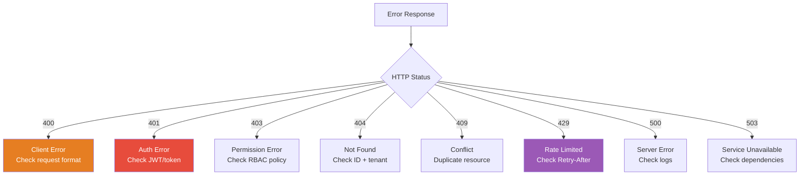

# GGID Error Codes Reference

Complete reference for all HTTP status codes, business error codes, and error response formats.

---

## Error Response Format

All GGID API errors return a consistent JSON structure:

```json
{
  "error": {
    "code": "INVALID_ARGUMENT",
    "message": "Email address is not valid",
    "details": {
      "field": "email",
      "value": "not-an-email"
    },
    "request_id": "req-abc123"
  }
}
```

| Field | Type | Always Present | Description |
|-------|------|:--------------:|-------------|
| `code` | string | Yes | Machine-readable error code |
| `message` | string | Yes | Human-readable description (English) |
| `details` | object | No | Additional context (field name, validation info) |
| `request_id` | string | Yes | Correlation ID for support/debugging |

---

## HTTP Status Codes

### 2xx Success

| Code | When | Example Endpoint |
|------|------|-----------------|
| 200 OK | Successful GET, PATCH, PUT | `GET /api/v1/users/{id}` |
| 201 Created | Resource created | `POST /api/v1/users` |
| 204 No Content | Deleted successfully | `DELETE /api/v1/users/{id}` |

### 4xx Client Errors

| Code | Error Code | Description |
|------|-----------|-------------|
| 400 | `INVALID_ARGUMENT` | Malformed request, missing required field, validation error |
| 401 | `UNAUTHENTICATED` | Missing/expired JWT, invalid credentials |
| 403 | `PERMISSION_DENIED` | RBAC/ABAC denied, insufficient role |
| 404 | `NOT_FOUND` | Resource doesn't exist |
| 405 | `METHOD_NOT_ALLOWED` | Wrong HTTP method for endpoint |
| 409 | `ALREADY_EXISTS` | Duplicate username, email, role key |
| 422 | `UNPROCESSABLE_ENTITY` | Valid JSON but business rule violation |
| 429 | `RATE_LIMITED` | Rate limit exceeded |

### 5xx Server Errors

| Code | Error Code | Description |
|------|-----------|-------------|
| 500 | `INTERNAL` | Unexpected server error (logged + request_id) |
| 502 | `BAD_GATEWAY` | Backend service returned invalid response |
| 503 | `UNAVAILABLE` | Backend service down, circuit breaker open |

---

## Business Error Codes

### Authentication

| Code | HTTP | Description |
|------|------|-------------|
| `INVALID_CREDENTIALS` | 401 | Wrong username or password |
| `ACCOUNT_LOCKED` | 403 | Account locked due to failed attempts |
| `ACCOUNT_INACTIVE` | 403 | Account is deactivated |
| `MFA_REQUIRED` | 200 | Login successful but MFA challenge needed |
| `MFA_INVALID_CODE` | 401 | Wrong MFA code |
| `MFA_SETUP_REQUIRED` | 403 | MFA not set up but policy requires it |
| `TOKEN_EXPIRED` | 401 | JWT has expired |
| `TOKEN_INVALID` | 401 | JWT signature invalid or malformed |
| `REFRESH_TOKEN_REVOKED` | 401 | Refresh token was already used (rotation) |

### User Management

| Code | HTTP | Description |
|------|------|-------------|
| `USER_NOT_FOUND` | 404 | User ID doesn't exist |
| `USERNAME_EXISTS` | 409 | Username already taken in tenant |
| `EMAIL_EXISTS` | 409 | Email already registered in tenant |
| `EMAIL_NOT_VERIFIED` | 403 | Email verification required by policy |
| `PASSWORD_TOO_WEAK` | 400 | Password doesn't meet complexity rules |
| `PASSWORD_IN_HISTORY` | 400 | Password was used recently |
| `PASSWORD_EXPIRED` | 403 | Password past expiration date |

### Roles & Permissions

| Code | HTTP | Description |
|------|------|-------------|
| `ROLE_NOT_FOUND` | 404 | Role ID doesn't exist |
| `ROLE_KEY_EXISTS` | 409 | Role key already taken in tenant |
| `PERMISSION_DENIED` | 403 | RBAC/ABAC policy denied access |
| `CIRCULAR_ROLE_REFERENCE` | 400 | Role hierarchy creates a cycle |

### Organizations

| Code | HTTP | Description |
|------|------|-------------|
| `ORG_NOT_FOUND` | 404 | Organization ID doesn't exist |
| `MEMBER_EXISTS` | 409 | User already member of this org |
| `MEMBER_NOT_FOUND` | 404 | User is not a member |

### OAuth

| Code | HTTP | Description |
|------|------|-------------|
| `INVALID_CLIENT` | 401 | Unknown client_id or invalid secret |
| `INVALID_GRANT` | 400 | Authorization code expired or already used |
| `INVALID_REDIRECT_URI` | 400 | Redirect URI doesn't match registered |
| `INVALID_SCOPE` | 400 | Requested scope not allowed for client |
| `UNSUPPORTED_GRANT_TYPE` | 400 | Grant type not configured for client |

### SCIM

| Code | HTTP | Description |
|------|------|-------------|
| `INVALID_SYNTAX` | 400 | Malformed SCIM request |
| `INVALID_FILTER` | 400 | Bad SCIM filter expression |
| `UNIQUENESS` | 409 | Duplicate SCIM resource |

---

## Error Handling by SDK

### Go

```go
var apiErr *ggid.APIError
if errors.As(err, &apiErr) {
    fmt.Println(apiErr.Code)       // "USERNAME_EXISTS"
    fmt.Println(apiErr.StatusCode) // 409
}
```

### Node.js

```typescript
catch (err: any) {
    const code = err.response?.data?.error?.code;
    // "USERNAME_EXISTS"
}
```

### Java

```java
catch (GGIDException e) {
    e.getStatusCode();  // 409
    e.getMessage();     // "Username already exists"
}
```

---

## Multi-Language Error Messages

GGID supports localized error messages via `Accept-Language` header:

```bash
GET /api/v1/users/999
Accept-Language: zh-CN
```

Response:

```json
{
  "error": {
    "code": "NOT_FOUND",
    "message": "用户不存在",
    "request_id": "req-abc123"
  }
}
```

### Supported Locales

| Locale | Language |
|--------|----------|
| `en-US` | English (default) |
| `zh-CN` | Chinese (Simplified) |
| `ja-JP` | Japanese |
| `ko-KR` | Korean |
| `es-ES` | Spanish |
| `de-DE` | German |
| `fr-FR` | French |

### Fallback

If the requested locale is not available, GGID falls back to English (`en-US`).

---

## Audit Error Codes

| Code | HTTP | Message | Fix |
|------|------|---------|-----|
| `AUDIT_QUERY_INVALID_RANGE` | 400 | Invalid date range for audit query | Ensure `start_date` < `end_date`, max 90-day range |
| `AUDIT_STREAM_DISCONNECTED` | 200 | SSE stream disconnected unexpectedly | Client should reconnect with exponential backoff |
| `AUDIT_NATS_UNAVAILABLE` | 503 | Audit event stream unavailable | Check NATS JetStream health; ensure stream exists |
| `AUDIT_PUBLISH_FAILED` | 500 | Failed to publish audit event | Check NATS connection; verify JetStream stream config |
| `AUDIT_EVENT_NOT_FOUND` | 404 | Audit event not found | Verify event_id and tenant_id |

## Webhook Error Codes

| Code | HTTP | Message | Fix |
|------|------|---------|-----|
| `WEBHOOK_NOT_FOUND` | 404 | Webhook subscription not found | Verify webhook_id and tenant scope |
| `WEBHOOK_DELIVERY_FAILED` | 200 | Webhook delivery failed (logged) | Check target endpoint availability; review retry log |
| `WEBHOOK_SIGNATURE_INVALID` | 401 | Invalid webhook signature | Ensure same secret on sender and receiver; use constant-time comparison |
| `WEBHOOK_URL_INVALID` | 400 | Invalid webhook URL | Must be HTTPS; no localhost in production |
| `WEBHOOK_RATE_EXCEEDED` | 429 | Webhook delivery rate exceeded | Reduce event volume or batch deliveries |

## Identity & SCIM Error Codes

| Code | HTTP | Message | Fix |
|------|------|---------|-----|
| `USER_NOT_FOUND` | 404 | User not found | Verify user_id is a valid UUID in the correct tenant |
| `USER_ALREADY_EXISTS` | 409 | User already exists | Check for duplicate username/email; use unique identifier |
| `USER_LOCKED` | 423 | User account is locked | Wait for lockout expiry (default 15 min) or admin unlock |
| `USER_INACTIVE` | 403 | User account is inactive | Admin must activate the user |
| `EMAIL_NOT_VERIFIED` | 403 | Email address not verified | User must verify email before proceeding |
| `SCIM_INVALID_SCHEMA` | 400 | Invalid SCIM schema | Ensure request uses correct `schemas` URN |
| `SCIM_FILTER_INVALID` | 400 | Invalid SCIM filter expression | Check filter syntax (e.g., `userName eq "user@test.com"`) |
| `SCIM_RESOURCE_NOT_FOUND` | 404 | SCIM resource not found | Verify resource exists and API key has correct scope |

## MFA Error Codes

| Code | HTTP | Message | Fix |
|------|------|---------|-----|
| `MFA_NOT_ENABLED` | 400 | MFA not enabled for user | User must set up MFA first via `/auth/mfa/setup` |
| `MFA_CODE_INVALID` | 401 | Invalid MFA code | Verify TOTP app time sync; code is single-use |
| `MFA_CODE_EXPIRED` | 401 | MFA code expired | Request new code from authenticator app |
| `MFA_BACKUP_CODES_EXHAUSTED` | 400 | All backup codes used | Generate new backup codes after MFA verification |
| `WEBAUTHN_CREDENTIAL_NOT_FOUND` | 404 | WebAuthn credential not found | User must register a passkey |
| `WEBAUTHN_CHALLENGE_EXPIRED` | 401 | WebAuthn challenge expired | Restart registration/authentication flow |

## LDAP Error Codes

| Code | HTTP | Message | Fix |
|------|------|---------|-----|
| `LDAP_CONNECTION_FAILED` | 503 | Cannot connect to LDAP server | Verify LDAP_URL; check network/firewall; test with ldapsearch |
| `LDAP_BIND_FAILED` | 401 | LDAP bind authentication failed | Verify BIND_DN and BIND_PASSWORD; check service account |
| `LDAP_USER_NOT_FOUND` | 404 | User not found in LDAP directory | Verify BASE_DN and USER_FILTER; check user exists in directory |
| `LDAP_STARTTLS_FAILED` | 500 | STARTTLS negotiation failed | Check LDAP server TLS config; verify CA certificate |

---

## Error Troubleshooting Guide

### Common Error Patterns



### Debugging 401 Errors

| Error Code | Likely Cause | Diagnostic Step |
|------------|-------------|-----------------|
| `JWT_INVALID` | Expired or tampered token | `echo $TOKEN \| cut -d. -f2 \| base64 -d \| jq .exp` |
| `JWT_EXPIRED` | Token past expiry time | Refresh token via `/auth/refresh` |
| `JWT_SIGNATURE_INVALID` | Wrong signing key or JWKS stale | Fetch JWKS: `curl /well-known/jwks.json` |
| `JWT_MISSING` | No Authorization header | Ensure `Authorization: Bearer <token>` header present |
| `JWT_TENANT_MISMATCH` | Token tenant ≠ request tenant | Verify X-Tenant-ID matches JWT `tid` claim |

### Debugging 403 Errors

| Error Code | Likely Cause | Fix |
|------------|-------------|-----|
| `PERMISSION_DENIED` | User lacks required permission | Assign role with needed permission |
| `ROLE_INSUFFICIENT` | Role hierarchy violation | Can't assign roles above own level |
| `TENANT_ACCESS_DENIED` | User not member of tenant | Add user to tenant's org |

---

## Request Tracing

Every error response includes a `request_id` for tracing:

```json
{
  "error": "internal server error",
  "code": "INTERNAL_ERROR",
  "request_id": "req-abc123def456"
}
```

### Finding Logs by Request ID

```bash
# Docker
docker compose logs gateway | grep "req-abc123"

# Kubernetes
kubectl logs -n ggid deploy/ggid-gateway | grep "req-abc123"

# Loki / ELK query
{service="gateway"} |= "req-abc123"
```

---

## References

- [API Reference](./api-reference.md) — REST endpoint documentation
- [Troubleshooting](./troubleshooting.md) — Diagnostic guides
- [API Conventions](./api-conventions.md) — Error response format design
- [SDK Guide](./sdk-guide.md) — Error handling in SDKs
