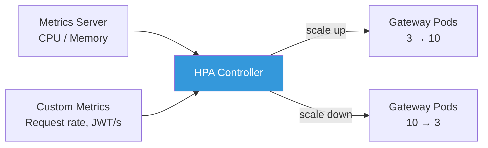
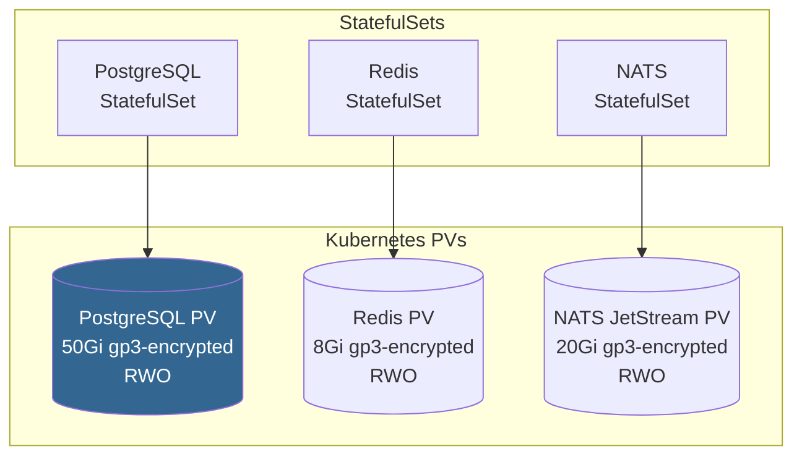

# Helm Chart Deployment Guide

> Deploy GGID to Kubernetes using Helm — production-ready configuration with
> Ingress, HPA auto-scaling, persistent volumes, and secrets management.

---

## Overview

GGID ships with a Helm chart that deploys all 7 microservices, the Admin Console,
and infrastructure dependencies (PostgreSQL, Redis, NATS) to a Kubernetes cluster.

**Chart structure:**

```
deploy/helm/ggid/
├── Chart.yaml              # Chart metadata
├── values.yaml             # Default configuration
├── values-prod.yaml        # Production overrides
├── templates/
│   ├── _helpers.tpl        # Template helpers
│   ├── gateway/            # API Gateway Deployment + Service + HPA
│   ├── auth/               # Auth Service
│   ├── identity/           # Identity Service
│   ├── oauth/              # OAuth Service
│   ├── policy/             # Policy Service
│   ├── org/                # Org Service
│   ├── audit/              # Audit Service
│   ├── console/            # Admin Console
│   ├── ingress.yaml        # Ingress rules
│   ├── cert-issuer.yaml    # cert-manager ClusterIssuer
│   └── networkpolicy.yaml  # Network policies
└── charts/                 # Dependency subcharts (bitnami/postgresql, etc.)
```

---

## Quick Start

```bash
# Add the GGID Helm repository
helm repo add ggid https://charts.ggid.dev
helm repo update

# Install with defaults (development mode)
helm install ggid ggid/ggid \
  --namespace ggid --create-namespace

# Install with production overrides
helm install ggid ggid/ggid \
  --namespace ggid --create-namespace \
  --values values-prod.yaml
```

---

## values.yaml Configuration

### Global Settings

```yaml
global:
  # Image registry — override for private registries
  imageRegistry: ""           # e.g. ghcr.io/your-org
  imagePullSecrets: []        # [{ name: regcred }]
  storageClass: ""            # Override default StorageClass
  domain: "iam.example.com"   # Base domain for Ingress

  # Default tenant (bootstrap)
  defaultTenantID: "00000000-0000-0000-0000-000000000001"

  # Security context (run as non-root)
  podSecurityContext:
    runAsNonRoot: true
    runAsUser: 65532
    fsGroup: 65532
```

### API Gateway

```yaml
gateway:
  enabled: true
  image:
    repository: ghcr.io/ggid/gateway
    tag: latest
    pullPolicy: IfNotPresent

  replicaCount: 3

  service:
    type: ClusterIP
    port: 8080

  resources:
    requests:
      cpu: 100m
      memory: 128Mi
    limits:
      cpu: 500m
      memory: 512Mi

  # Horizontal Pod Autoscaler
  autoscaling:
    enabled: true
    minReplicas: 3
    maxReplicas: 10
    targetCPUUtilizationPercentage: 70
    targetMemoryUtilizationPercentage: 80

  # JWT verification keys
  jwt:
    publicKey: ""             # RS256 public key (PEM)
    privateKeySecret: "jwt-signing-key"  # K8s Secret name

  # Rate limiting
  rateLimit:
    requestsPerMinute: 60     # Per IP
    burst: 10

  ingress:
    enabled: true
    className: nginx
    annotations:
      cert-manager.io/cluster-issuer: letsencrypt-prod
      nginx.ingress.kubernetes.io/rate-limit: "60"
      nginx.ingress.kubernetes.io/ssl-redirect: "true"
    hosts:
      - host: api.iam.example.com
        paths:
          - path: /
            pathType: Prefix
    tls:
      - secretName: gateway-tls
        hosts:
          - api.iam.example.com
```

### Auth Service

```yaml
auth:
  enabled: true
  image:
    repository: ghcr.io/ggid/auth
    tag: latest

  replicaCount: 3

  resources:
    requests:
      cpu: 100m
      memory: 128Mi
    limits:
      cpu: 500m
      memory: 256Mi

  autoscaling:
    enabled: true
    minReplicas: 3
    maxReplicas: 8
    targetCPUUtilizationPercentage: 75

  # Password policy
  passwordPolicy:
    minLength: 12
    requireUppercase: true
    requireLowercase: true
    requireDigit: true
    requireSpecial: true
    historyCount: 5
    maxAgeDays: 90

  # MFA settings
  mfa:
    totp:
      enabled: true
      issuer: "GGID"
    webauthn:
      enabled: true
      rpId: "iam.example.com"

  # LDAP integration (optional)
  ldap:
    enabled: false
    url: "ldap://openldap:389"
    bindDN: "cn=admin,dc=example,dc=com"
    bindPasswordSecret: "ldap-bind-password"
    baseDN: "ou=users,dc=example,dc=com"
    startTLS: true
    autoProvision: true
```

### PostgreSQL (Subchart)

```yaml
postgresql:
  enabled: true              # Set false to use external DB
  image:
    tag: "16"

  auth:
    postgresPassword: ""      # Set via --set or external secret
    username: ggid
    password: ""
    database: ggid
    existingSecret: "postgres-credentials"

  primary:
    persistence:
      enabled: true
      size: 50Gi
      storageClass: "gp3-encrypted"

    # High availability via read replicas
    extendedConfiguration: |
      max_connections = 200
      shared_buffers = 512MB
      effective_cache_size = 2GB
      wal_level = logical
      track_activity_query_size = 2048

  readReplicas:
    replicaCount: 1
    persistence:
      size: 50Gi
```

### Redis (Subchart)

```yaml
redis:
  enabled: true
  architecture: replication   # standalone | replication
  image:
    tag: "7.2"

  auth:
    enabled: true
    password: ""
    existingSecret: "redis-credentials"

  master:
    persistence:
      enabled: true
      size: 8Gi
      storageClass: "gp3-encrypted"

  replica:
    replicaCount: 2
    persistence:
      enabled: true
      size: 8Gi

  metrics:
    enabled: true             # Prometheus exporter
```

### NATS JetStream (Subchart)

```yaml
nats:
  enabled: true
  image:
    tag: "2.10"

  jetstream:
    enabled: true
    fileStore:
      enabled: true
      storageClass: "gp3-encrypted"
      size: 20Gi

  cluster:
    enabled: true
    replicas: 3               # RAFT consensus

  auth:
    enabled: true
    users:
      - user: ggid
        password: ""
        permissions:
          publish: ["audit.events"]
          subscribe: ["audit.events"]
```

---

## Ingress Configuration

### TLS with cert-manager

```yaml
# cert-manager ClusterIssuer (Let's Encrypt)
apiVersion: cert-manager.io/v1
kind: ClusterIssuer
metadata:
  name: letsencrypt-prod
spec:
  acme:
    server: https://acme-v02.api.letsencrypt.org/directory
    email: admin@example.com
    privateKeySecretRef:
      name: letsencrypt-prod
    solvers:
      - http01:
          ingress:
            class: nginx
```

### Route Splitting

```yaml
ingress:
  hosts:
    - host: api.iam.example.com
      paths:
        - path: /api/v1/auth
          pathType: Prefix
          backend:
            service:
              name: ggid-auth
              port: 9001
        - path: /api/v1/users
          pathType: Prefix
          backend:
            service:
              name: ggid-identity
              port: 8080
        - path: /api/v1/policies
          pathType: Prefix
          backend:
            service:
              name: ggid-policy
              port: 8070
```

### WebSocket / SSE Support

For audit event streaming (Server-Sent Events):

```yaml
ingress:
  annotations:
    nginx.ingress.kubernetes.io/proxy-read-timeout: "3600"
    nginx.ingress.kubernetes.io/proxy-send-timeout: "3600"
    nginx.ingress.kubernetes.io/configuration-snippet: |
      proxy_set_header Connection "";
      proxy_http_version 1.1;
      chunked_transfer_encoding off;
```

---

## Horizontal Pod Autoscaler (HPA)



### Custom Metrics (Prometheus Adapter)

```yaml
# values-prod.yaml
gateway:
  autoscaling:
    enabled: true
    behavior:
      scaleUp:
        stabilizationWindowSeconds: 30
        policies:
          - type: Percent
            value: 100
            periodSeconds: 30
      scaleDown:
        stabilizationWindowSeconds: 300
        policies:
          - type: Percent
            value: 50
            periodSeconds: 60

  # Custom metric: requests per second
  customMetrics:
    - type: Pods
      pods:
        metric:
          name: http_requests_per_second
        target:
          type: AverageValue
          averageValue: "100"
```

---

## Persistent Volumes (PV/PVC)

### Volume Architecture



### StatefulSet Volume Claim Templates

```yaml
# PostgreSQL StatefulSet PVC template
volumeClaimTemplates:
  - metadata:
      name: data
    spec:
      accessModes: ["ReadWriteOnce"]
      storageClassName: gp3-encrypted
      resources:
        requests:
          storage: 50Gi
```

### Backup with Velero

```bash
# Install Velero with S3 backend
velero install \
  --provider aws \
  --bucket ggid-backups \
  --backup-location-config region=us-east-1 \
  --snapshot-location-config region=us-east-1

# Schedule daily backups
velero schedule create ggid-daily \
  --schedule="0 2 * * *" \
  --include-namespaces ggid

# On-demand backup
velero backup create ggid-pre-upgrade --include-namespaces ggid
```

---

## Secrets Management

### External Secrets Operator

```yaml
apiVersion: external-secrets.io/v1beta1
kind: ExternalSecret
metadata:
  name: ggid-secrets
  namespace: ggid
spec:
  refreshInterval: 1h
  secretStoreRef:
    name: vault-backend
    kind: ClusterSecretStore
  target:
    name: ggid-secrets
    creationPolicy: Owner
  data:
    - secretKey: postgres-password
      remoteRef:
        key: ggid/prod/postgres
        property: password
    - secretKey: jwt-signing-key
      remoteRef:
        key: ggid/prod/jwt
        property: private_key
    - secretKey: ldap-bind-password
      remoteRef:
        key: ggid/prod/ldap
        property: password
```

### Sealed Secrets (Alternative)

```bash
# Create a sealed secret from a Kubernetes Secret
echo -n 'my-db-password' | kubectl create secret generic db-password \
  --dry-run=client --from-file=password=/dev/stdin -o yaml | \
  kubeseal --format yaml > sealed-db-password.yaml
```

---

## Network Policies

```yaml
apiVersion: networking.k8s.io/v1
kind: NetworkPolicy
metadata:
  name: ggid-deny-all-default
  namespace: ggid
spec:
  podSelector: {}
  policyTypes:
    - Ingress
    - Egress
  ingress: []
  egress: []
---
apiVersion: networking.k8s.io/v1
kind: NetworkPolicy
metadata:
  name: ggid-gateway-allow-ingress
  namespace: ggid
spec:
  podSelector:
    matchLabels:
      app.kubernetes.io/name: gateway
  policyTypes:
    - Ingress
  ingress:
    - from:
        - namespaceSelector:
            matchLabels:
              name: ingress-nginx
      ports:
        - protocol: TCP
          port: 8080
---
apiVersion: networking.k8s.io/v1
kind: NetworkPolicy
metadata:
  name: ggid-allow-internal
  namespace: ggid
spec:
  podSelector:
    matchLabels:
      app.kubernetes.io/part-of: ggid
  policyTypes:
    - Egress
  egress:
    - to:
        - podSelector:
            matchLabels:
              app.kubernetes.io/part-of: ggid
    - to:
        - podSelector:
            matchLabels:
              app.kubernetes.io/name: postgresql
      ports:
        - protocol: TCP
          port: 5432
    - to:
        - podSelector:
            matchLabels:
              app.kubernetes.io/name: redis
      ports:
        - protocol: TCP
          port: 6379
```

---

## Production Deployment Checklist

- [ ] Set strong passwords for PostgreSQL, Redis, NATS
- [ ] Configure TLS certificates (cert-manager + Let's Encrypt or internal CA)
- [ ] Set up external secrets (Vault or Sealed Secrets)
- [ ] Configure HPA with appropriate min/max replicas
- [ ] Enable PodDisruptionBudgets for high availability
- [ ] Configure Velero backups with off-site storage
- [ ] Set up Prometheus + Grafana for monitoring
- [ ] Configure log aggregation (Loki or ELK)
- [ ] Enable Network Policies for zero-trust networking
- [ ] Set resource requests and limits on all workloads
- [ ] Configure Pod anti-affinity for multi-AZ spread
- [ ] Review and test disaster recovery procedures

---

## Upgrade Strategy

```bash
# Dry-run upgrade to preview changes
helm upgrade ggid ggid/ggid \
  --namespace ggid \
  --values values-prod.yaml \
  --dry-run

# Perform rolling update
helm upgrade ggid ggid/ggid \
  --namespace ggid \
  --values values-prod.yaml \
  --timeout 10m \
  --wait

# Rollback on failure
helm rollback ggid 1 --namespace ggid
```

### Database Migration

```yaml
# Pre-upgrade hook for database migration
hooks:
  - name: db-migrate
    type: pre-upgrade
    command: ["/app/migrate", "up"]
    ignoreFailure: false
```

---

## References

- [Deployment Guide](./deployment.md) — Docker Compose deployment
- [High Availability](./high-availability.md) — HA architecture
- [Disaster Recovery](./disaster-recovery.md) — DR procedures
- [Configuration](./configuration.md) — Environment variables
- [Security Whitepaper](./security-whitepaper.md) — Security controls
