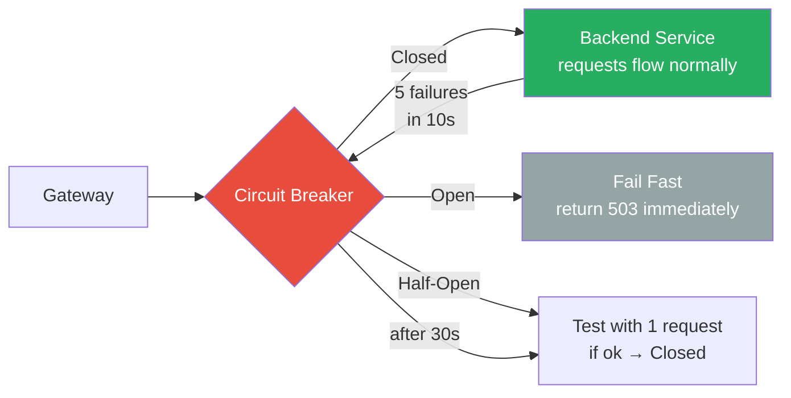
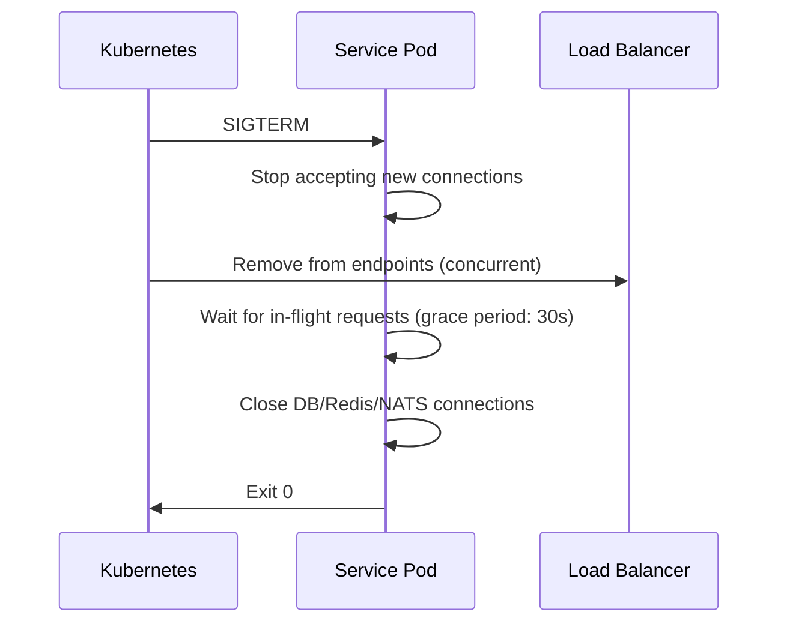
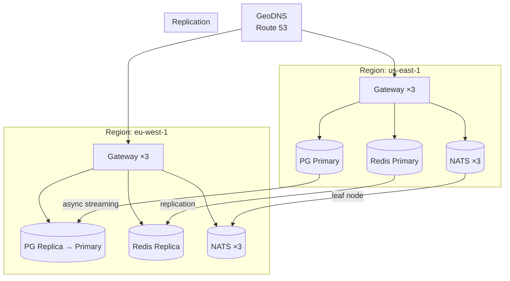

# High Availability Deployment Guide

How to deploy GGID with no single point of failure.

---

## Architecture

```
                    ┌──────────────┐
                    │  Load Balancer│
                    │  (nginx/ALB) │
                    └──────┬───────┘
                           │
              ┌────────────┼────────────┐
              │            │            │
         ┌────▼───┐  ┌────▼───┐  ┌────▼───┐
         │ GW #1  │  │ GW #2  │  │ GW #3  │
         └────┬───┘  └────┬───┘  └────┬───┘
              │           │            │
     ┌────────┼───────────┼────────────┼──────┐
     │        │           │            │      │
  ┌──▼─┐  ┌──▼─┐  ┌──▼─┐  ┌──▼─┐  ┌──▼─┐  ┌──▼─┐
  │Auth│  │Ident│  │OAuth│  │Pol │  │Org │  │Aud │
  │x3  │  │x2  │  │x2  │  │x2  │  │x2  │  │x2  │
  └──┬─┘  └──┬─┘  └──┬─┘  └──┬─┘  └──┬─┘  └──┬─┘
     │       │       │       │       │       │
     └───────┴───────┴───┬───┴───────┴───────┘
                         │
          ┌──────────────┼──────────────┐
          │              │              │
     ┌────▼────┐  ┌─────▼─────┐  ┌────▼─────┐
     │PostgreSQL│  │  Redis    │  │  NATS    │
     │ Primary  │  │ Sentinel  │  │ Cluster  │
     │ + Replica│  │ (3 nodes) │  │ (3 nodes)│
     └─────────┘  └───────────┘  └──────────┘
```

---

## Stateless Services

All 7 GGID microservices are **stateless** — no session data stored in process memory. Sessions live in Redis, JWTs are self-contained. This means any instance can serve any request.

### Horizontal Scaling

```bash
# Docker Compose
docker compose up --scale gateway=3 --scale auth=3 --scale identity=2

# Kubernetes
kubectl scale deployment ggid-gateway --replicas=3
kubectl scale deployment ggid-auth --replicas=3
```

### Recommended Replica Counts

| Service | Min Replicas | Production | CPU-Intensive? |
|---------|:------------:|:----------:|:--------------:|
| Gateway | 2 | 3+ | No (proxy) |
| Auth | 2 | 3+ | Yes (Argon2id) |
| Identity | 1 | 2+ | No |
| OAuth | 1 | 2 | No |
| Policy | 1 | 2 | Moderate |
| Org | 1 | 2 | No |
| Audit | 1 | 2 | No |

---

## Database HA

### Streaming Replication

```
PostgreSQL Primary (read/write)
    │
    ├── Sync Replica (sync_commit=on)    ← failover target
    └── Async Replica (sync_commit=off)  ← read replica for queries
```

### Failover

Use **Patroni** or **Stolon** for automatic failover:

```yaml
# patroni.yml
patroni:
  scope: ggid-pg
  postgresql:
    use_slots: true
    parameters:
      wal_level: replica
      max_wal_senders: 5
      synchronous_commit: "on"
  tags:
    nofailover: false
    clonefrom: true
```

### RPO/RTO

| Metric | Target | How |
|--------|--------|-----|
| RPO | < 1s | Synchronous streaming replication |
| RTO | < 30s | Patroni automatic failover |

### Read Replicas

Route read-heavy queries (audit, user listing) to replicas:

```yaml
# Application config
database:
  primary: "postgres://...primary:5432/..."
  replica: "postgres://...replica:5432/..."
```

---

## Redis HA

### Redis Sentinel

```
Redis Master ←──── Sentinel #1
     │          ──── Sentinel #2
     │          ──── Sentinel #3
     ▼
Redis Replica
```

3 Sentinel nodes monitor the Redis master. If master fails, Sentinels elect the replica as new master.

### Configuration

```bash
# sentinel.conf
sentinel monitor ggid-redis redis-master 6379 2
sentinel down-after-milliseconds ggid-redis 5000
sentinel failover-timeout ggid-redis 30000
sentinel parallel-syncs ggid-redis 1
```

### Client Configuration

```go
// Go client with Sentinel support
client := redis.NewFailoverClient(&redis.FailoverOptions{
    MasterName: "ggid-redis",
    SentinelAddrs: []string{":26379", ":26380", ":26381"},
    Password: "strong-password",
})
```

---

## NATS HA

### NATS Cluster (RAFT)

```bash
# 3-node NATS cluster
nats-server --cluster_name ggid \
  --routes=nats://nats-1:6222,nats://nats-2:6222,nats://nats-3:6222 \
  --jetstream --store_dir /data/nats
```

JetStream data is replicated via RAFT consensus across all 3 nodes. Tolerates 1 node failure.

---

## Load Balancer Configuration

### nginx

```nginx
upstream ggid_gateway {
    least_conn;
    server gateway-1:8080 max_fails=3 fail_timeout=30s;
    server gateway-2:8080 max_fails=3 fail_timeout=30s;
    server gateway-3:8080 max_fails=3 fail_timeout=30s;
}

server {
    listen 443 ssl http2;
    ssl_certificate /etc/ssl/ggid.crt;
    ssl_certificate_key /etc/ssl/ggid.key;

    location / {
        proxy_pass http://ggid_gateway;
        proxy_set_header Host $host;
        proxy_set_header X-Real-IP $remote_addr;
        proxy_set_header X-Forwarded-For $proxy_add_x_forwarded_for;
        proxy_set_header X-Forwarded-Proto $scheme;
    }
}
```

### Health Check

```nginx
location /healthz {
    proxy_pass http://ggid_gateway/healthz;
    access_log off;
}
```

---

## Zero-Downtime Deployment

### Rolling Update (Kubernetes)

```yaml
spec:
  strategy:
    type: RollingUpdate
    rollingUpdate:
      maxSurge: 1
      maxUnavailable: 0
  template:
    spec:
      containers:
        - name: ggid-auth
          lifecycle:
            preStop:
              exec:
                command: ["sleep", "5"]  # drain connections
          readinessProbe:
            httpGet:
              path: /healthz
              port: 9001
            initialDelaySeconds: 3
            periodSeconds: 2
```

### Blue-Green Deployment

```
Blue (active) ←── 100% traffic
Green (idle)  ←── 0% traffic

1. Deploy to Green
2. Run health checks on Green
3. Switch traffic: Blue→Green
4. Keep Blue as rollback target
```

### Database Migrations

Use backward-compatible migrations:

1. **Expand:** Add new column (nullable, no default)
2. **Migrate:** Deploy new code that writes to both old + new columns
3. **Contract:** Remove old column after all instances updated

---

## Disaster Recovery

See [Disaster Recovery Guide](./disaster-recovery.md) for RPO/RTO targets, backup strategy, cross-region replication, and DR runbook.

---

## Pod Disruption Budgets

Ensure minimum available replicas during voluntary disruptions (node drain, cluster upgrade).

```yaml
apiVersion: policy/v1
kind: PodDisruptionBudget
metadata:
  name: ggid-gateway-pdb
  namespace: ggid
spec:
  minAvailable: 2              # Always keep at least 2 pods running
  selector:
    matchLabels:
      app.kubernetes.io/name: gateway
---
apiVersion: policy/v1
kind: PodDisruptionBudget
metadata:
  name: ggid-auth-pdb
  namespace: ggid
spec:
  minAvailable: 2
  selector:
    matchLabels:
      app.kubernetes.io/name: auth
```

### Recommended PDB Settings

| Service | minAvailable | Rationale |
|---------|-------------|-----------|
| Gateway | 2 | Single point of entry; always need redundancy |
| Auth | 2 | Login traffic cannot stop |
| Identity | 1 | Lower traffic, 1 replica sufficient during disruption |
| OAuth | 1 | Only used for OAuth flows |
| Policy | 1 | Fast in-process check |
| Org | 1 | Lower traffic volume |
| Audit | 1 | Async, can tolerate brief gaps |

---

## Health Probes (Kubernetes)

### Liveness Probe

Detects deadlocked or hung processes. If liveness fails, the pod is restarted.

```yaml
livenessProbe:
  httpGet:
    path: /healthz
    port: 8080
  initialDelaySeconds: 10
  periodSeconds: 10
  failureThreshold: 3      # Restart after 3 consecutive failures (30s)
  timeoutSeconds: 3
```

### Readiness Probe

Determines if the pod can serve traffic. If readiness fails, the pod is removed
from the Service's endpoint list but NOT restarted.

```yaml
readinessProbe:
  httpGet:
    path: /readyz
    port: 8080
  initialDelaySeconds: 5
  periodSeconds: 5
  failureThreshold: 2
  timeoutSeconds: 2
```

### Startup Probe

For services with slow initialization (e.g., DB connection, key loading):

```yaml
startupProbe:
  httpGet:
    path: /healthz
    port: 8080
  failureThreshold: 30
  periodSeconds: 5          # Allow up to 150 seconds for startup
```

---

## Circuit Breakers

The Gateway implements circuit breakers for each backend service to prevent
cascade failures.



### Circuit Breaker Configuration

| Setting | Default | Description |
|---------|---------|-------------|
| `CB_ENABLED` | true | Enable circuit breakers |
| `CB_FAILURE_THRESHOLD` | 5 | Failures before opening circuit |
| `CB_RESET_TIMEOUT` | 30s | Time before half-open probe |
| `CB_HALF_OPEN_MAX` | 1 | Max requests in half-open state |
| `CB_WINDOW` | 10s | Sliding window for failure counting |

```bash
# Environment variables
CB_ENABLED=true
CB_FAILURE_THRESHOLD=5
CB_RESET_TIMEOUT=30s
```

---

## Graceful Shutdown

When a pod receives SIGTERM (e.g., during rolling update):



### Grace Period Configuration

```yaml
spec:
  terminationGracePeriodSeconds: 45   # Allow 45s for in-flight requests
  containers:
    - name: gateway
      lifecycle:
        preStop:
          exec:
            command: ["sh", "-c", "sleep 10"]  # Give LB time to deregister
```

---

## Multi-Region Deployment

For active-active multi-region deployments:



### Failover Procedure

1. **Database:** Promote eu-west-1 replica to primary (`pg_ctl promote`)
2. **Redis:** Promote eu-west-1 replica, update Sentinel
3. **NATS:** Update DNS to point to eu-west-1 cluster
4. **DNS:** Switch GeoDNS weight to eu-west-1 (100%)
5. **Verify:** Run smoke tests against new region
6. **Reroute:** Application clients reconnect via DNS TTL

---

## HA Monitoring Checklist

| Component | Metric to Watch | Alert Threshold |
|-----------|----------------|-----------------|
| Gateway pods | `kube_deployment_status_replicas_available` | < 2 for 2m |
| Auth pods | `kube_deployment_status_replicas_available` | < 2 for 2m |
| PostgreSQL | `pg_replication_lag_seconds` | > 10s |
| Redis | `redis_connected_clients` | < 1 for 1m |
| NATS | `nats_jetstream_stream_messages` | consumer lag > 1000 |
| Load balancer | `nginx_upstream_health_status` | any upstream down |

```promql
# Alert: insufficient replicas
kube_deployment_status_replicas_available{deployment="ggid-gateway"} < 2

# Alert: replication lag
pg_replication_lag_seconds > 10

# Alert: NATS consumer lag
nats_jetstream_consumer_num_ack_pending > 100
```
