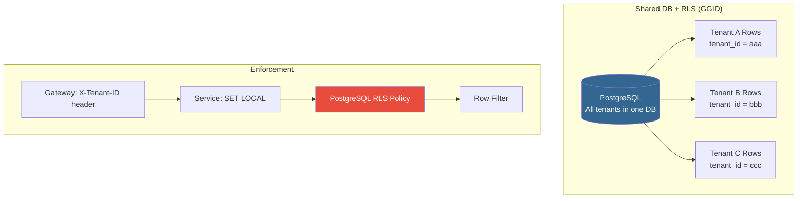
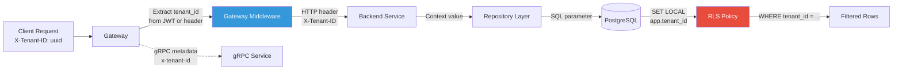
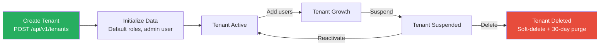
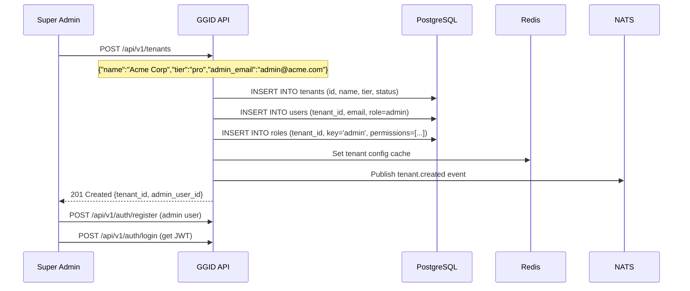
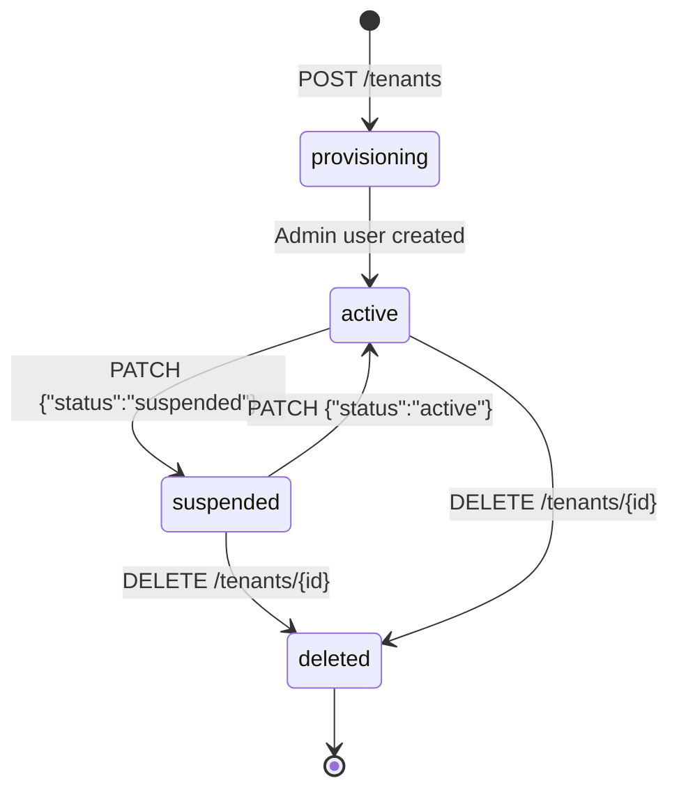

# Multi-Tenant Architecture

> Tenant isolation strategy, RLS deep dive, tenant_id propagation chain, and
> isolation model comparison for the GGID IAM Platform.

---

## Overview

GGID is a multi-tenant IAM platform where multiple organizations (tenants) share
the same infrastructure while maintaining strict data isolation. This document
describes the architecture, enforcement mechanisms, and performance characteristics.

---

## Isolation Model

GGID uses **shared database with Row-Level Security (RLS)** — the highest-density,
lowest-cost model:



### Isolation Model Comparison

| Model | Isolation | Cost | Complexity | GGID Uses |
|-------|-----------|------|------------|-----------|
| **Shared DB + RLS** | Row-level | Low | Medium | Yes (default) |
| Schema-per-tenant | Schema-level | Medium | High | Optional |
| DB-per-tenant | Complete | High | Low | Future (enterprise) |

---

## Tenant ID Propagation Chain

The tenant_id flows through every layer of the system:



### Layer 1: Gateway (HTTP Header)

```go
// services/gateway/internal/middleware/tenant.go
func TenantMiddleware(next http.Handler) http.Handler {
    return http.HandlerFunc(func(w http.ResponseWriter, r *http.Request) {
        // Extract tenant_id from header (set by JWT middleware)
        tenantIDStr := r.Header.Get("X-Tenant-ID")
        if tenantIDStr == "" {
            // Fallback: extract from JWT claims
            claims := r.Context().Value(claimsKey).(*Claims)
            tenantIDStr = claims.TenantID
        }

        tenantID, err := uuid.Parse(tenantIDStr)
        if err != nil {
            writeError(w, 400, "invalid tenant_id")
            return
        }

        // Inject into context for downstream services
        ctx := tenant.WithTenant(r.Context(), tenantID)
        next.ServeHTTP(w, r.WithContext(ctx))
    })
}
```

### Layer 2: Service (Context Propagation)

```go
// pkg/tenant/tenant.go
type contextKey struct{}

func WithTenant(ctx context.Context, tenantID uuid.UUID) context.Context {
    return context.WithValue(ctx, contextKey{}, tenantID)
}

func FromContext(ctx context.Context) uuid.UUID {
    tid, ok := ctx.Value(contextKey{}).(uuid.UUID)
    if !ok {
        panic("tenant_id not found in context")
    }
    return tid
}
```

### Layer 3: Repository (Database Query)

```go
// services/identity/internal/repository/user_repo.go
func (r *UserRepository) List(ctx context.Context) ([]domain.User, error) {
    tenantID := tenant.FromContext(ctx)

    // Set RLS context for this transaction
    _, err := r.db.Exec(ctx,
        fmt.Sprintf("SET LOCAL app.tenant_id = '%s'", tenantID))
    if err != nil {
        return nil, err
    }

    // RLS automatically filters rows — no explicit WHERE needed
    rows, err := r.db.Query(ctx,
        "SELECT id, username, email FROM users ORDER BY created_at DESC")
    // ...
}
```

### Layer 4: PostgreSQL (RLS Enforcement)

```sql
-- Enable RLS on all tenant-scoped tables
ALTER TABLE users ENABLE ROW LEVEL SECURITY;
ALTER TABLE credentials ENABLE ROW LEVEL SECURITY;
ALTER TABLE roles ENABLE ROW LEVEL SECURITY;
ALTER TABLE organizations ENABLE ROW LEVEL SECURITY;
ALTER TABLE audit_events ENABLE ROW LEVEL SECURITY;

-- Policy: only see rows matching current tenant context
CREATE POLICY tenant_isolation ON users
    USING (tenant_id = current_setting('app.tenant_id')::uuid);

CREATE POLICY tenant_isolation ON credentials
    USING (tenant_id = current_setting('app.tenant_id')::uuid);

-- Force RLS even for table owners (production safety)
ALTER TABLE users FORCE ROW LEVEL SECURITY;
```

---

## RLS Deep Dive

### How RLS Works

RLS adds an implicit `WHERE` clause to every query. The database rewrites:

```sql
-- What you write:
SELECT * FROM users WHERE email = 'alice@test.com';

-- What PostgreSQL executes:
SELECT * FROM users
WHERE email = 'alice@test.com'
  AND tenant_id = current_setting('app.tenant_id')::uuid;
```

### RLS on INSERT/UPDATE/DELETE

```sql
-- WITH CHECK ensures INSERT and UPDATE set the correct tenant_id
CREATE POLICY tenant_insert ON users
    FOR INSERT
    WITH CHECK (tenant_id = current_setting('app.tenant_id')::uuid);

CREATE POLICY tenant_update ON users
    FOR UPDATE
    USING (tenant_id = current_setting('app.tenant_id')::uuid)
    WITH CHECK (tenant_id = current_setting('app.tenant_id')::uuid);

CREATE POLICY tenant_delete ON users
    FOR DELETE
    USING (tenant_id = current_setting('app.tenant_id')::uuid);
```

### Bypassing RLS (Admin Only)

```sql
-- Superuser bypasses RLS (Docker development mode)
-- Production: use non-superuser role
CREATE ROLE ggid_app WITH LOGIN PASSWORD 'secure-password';
GRANT SELECT, INSERT, UPDATE, DELETE ON ALL TABLES IN SCHEMA public TO ggid_app;

-- ggid_app is NOT a superuser, so RLS applies
-- Only explicit BYPASSRLS roles can skip it:
-- CREATE ROLE ggid_admin WITH BYPASSRLS;
```

### SET LOCAL Gotcha

PostgreSQL's `SET LOCAL` with parameterized values requires `fmt.Sprintf`:

```go
// WRONG — SET LOCAL doesn't support $1 parameter binding
db.Exec(ctx, "SET LOCAL app.tenant_id = $1", tenantID)

// CORRECT — use fmt.Sprintf (tenant_id is a validated UUID, safe from injection)
db.Exec(ctx, fmt.Sprintf("SET LOCAL app.tenant_id = '%s'", tenantID))
```

---

## Tenant Lifecycle



### Tenant Operations API

```bash
# Create tenant
curl -X POST $API/api/v1/tenants \
  -H "Authorization: Bearer $ADMIN_TOKEN" \
  -d '{"name":"Acme Corp","tier":"pro","admin_email":"admin@acme.com"}'

# List tenants (superadmin only)
curl $API/api/v1/tenants \
  -H "Authorization: Bearer $SUPERADMIN_TOKEN"

# Suspend tenant
curl -X PATCH $API/api/v1/tenants/$TENANT_ID \
  -d '{"status":"suspended"}'

# Delete tenant (soft-delete)
curl -X DELETE $API/api/v1/tenants/$TENANT_ID
```

---

## Cross-Tenant Prevention

GGID employs multiple layers to prevent cross-tenant data access:

| Layer | Mechanism | Failure Mode if Bypassed |
|-------|-----------|-------------------------|
| Gateway | JWT `tid` claim must match `X-Tenant-ID` header | 403 Forbidden |
| Service | Context-propagated tenant_id to all repo calls | Panic (no tenant_id in context) |
| Repository | `SET LOCAL app.tenant_id` per transaction | Queries fail |
| Database | RLS policy on every table | Rows filtered automatically |
| Audit | Log includes tenant_id for every action | Detectable in audit trail |

### Defense-in-Depth Example

```go
// Even if a developer forgets WHERE clause, RLS saves us:
func (r *UserRepository) GetAll(ctx context.Context) ([]User, error) {
    // No WHERE tenant_id = ... clause!
    // But RLS adds it automatically:
    rows, err := r.db.Query(ctx, "SELECT * FROM users")
    // This only returns rows for the current tenant
}
```

---

## Performance Impact of RLS

RLS adds a trivial overhead because `tenant_id` is always indexed:

| Query | Without RLS | With RLS | Overhead |
|-------|------------|----------|----------|
| Single row by PK | 0.12 ms | 0.14 ms | +0.02 ms |
| List 20 rows (paginated) | 0.45 ms | 0.48 ms | +0.03 ms |
| Count all | 0.30 ms | 0.33 ms | +0.03 ms |
| Aggregate (SUM) | 0.55 ms | 0.58 ms | +0.03 ms |

**RLS overhead: ~5-8%** — negligible compared to network and application overhead.

### Required Indexes

```sql
-- Every tenant-scoped table MUST have this index:
CREATE INDEX idx_users_tenant ON users(tenant_id);
CREATE INDEX idx_users_tenant_created ON users(tenant_id, created_at DESC);
CREATE INDEX idx_roles_tenant ON roles(tenant_id);
CREATE INDEX idx_audit_tenant_time ON audit_events(tenant_id, created_at DESC);
```

---

## Schema-Per-Tenant (Optional)

For tenants requiring stronger isolation, GGID supports schema-per-tenant:

```sql
-- Create isolated schema
CREATE SCHEMA tenant_aaa;
CREATE TABLE tenant_aaa.users (LIKE public.users INCLUDING ALL);
CREATE TABLE tenant_aaa.roles (LIKE public.roles INCLUDING ALL);

-- RLS not needed — physical schema separation
-- Switch schema per request:
SET search_path TO tenant_aaa, public;
```

| Aspect | Shared + RLS | Schema-per-tenant |
|--------|-------------|-------------------|
| Isolation | Row-level | Schema-level |
| Max tenants | Unlimited | ~100 (manageable) |
| Migration complexity | Low (one schema) | High (N schemas) |
| Connection pool | Shared | Per-tenant or search_path |
| Backup granularity | Full DB | Per-schema |

---

## Redis Per-Tenant Isolation

GGID uses Redis key namespacing to isolate tenant data:

### Key Naming Convention

All Redis keys are prefixed with the tenant ID to prevent cross-tenant data
access:

```
tid:{tenant_id}:{key_type}:{identifier}

Examples:
  tid:aaa-111:session:sess-abc123       # Session data
  tid:aaa-111:rl:login:ip:192.168.1.1   # Rate limit bucket
  tid:aaa-111:lockout:user:johndoe       # Account lockout
  tid:aaa-111:refresh:rt-uuid-456        # Refresh token (one-time-use)
  tid:aaa-111:apikey:key-xyz789          # API key cache
```

### Isolation Guarantees

| Mechanism | Implementation |
|-----------|---------------|
| Key prefix | Every Redis operation includes `tid:{tenant_id}:` prefix |
| TTL isolation | Rate limit buckets and sessions have per-tenant TTLs |
| SCAN safety | `SCAN` operations are scoped by tenant prefix pattern |
| Flush protection | `FLUSHDB` is disabled; only `DEL` with explicit key patterns |

### Tenant Data Cleanup

When a tenant is deleted, GGID removes all tenant-scoped Redis keys:

```bash
# Soft-delete: suspend tenant (keep data)
curl -X PATCH $API/api/v1/tenants/$TENANT_ID -d '{"status":"suspended"}'

# Hard-delete: purge all tenant data
# 1. Delete Redis keys
redis-cli --scan --pattern "tid:$TENANT_ID:*" | xargs redis-cli DEL

# 2. Delete database rows (cascaded by RLS policy)
DELETE FROM tenants WHERE id = $TENANT_ID;
```

---

## NATS Per-Tenant Isolation

Audit events are published to NATS JetStream with tenant-scoped subjects:

### Subject Hierarchy

```
ggid.events.{tenant_id}.{event_type}

Examples:
  ggid.events.aaa-111.user.created     # Tenant aaa-111 user creation
  ggid.events.aaa-111.auth.login        # Tenant aaa-111 login event
  ggid.events.bbb-222.user.created      # Tenant bbb-222 user creation
```

### Consumer Filtering

Event subscribers can filter by tenant:

```go
// Subscribe to events for a single tenant only
cons, _ := js.CreateOrUpdateConsumer(ctx, "GGID_EVENTS",
    jetstream.ConsumerConfig{
        DurableName:   "crm-sync-aaa",
        FilterSubject: fmt.Sprintf("ggid.events.%s.>", tenantID),
    },
)

// Subscribe to events for all tenants (superadmin/multi-tenant apps)
cons, _ := js.CreateOrUpdateConsumer(ctx, "GGID_EVENTS",
    jetstream.ConsumerConfig{
        DurableName:   "cross-tenant-analytics",
        FilterSubject: "ggid.events.>",
    },
)
```

### Audit Query Isolation

The audit SSE stream filters events by the requesting user's tenant_id. A user
from tenant A cannot subscribe to events from tenant B:

```sql
-- RLS automatically adds: AND tenant_id = current_setting('app.tenant_id')::uuid
SELECT * FROM audit_events
WHERE created_at > $1
ORDER BY created_at DESC
LIMIT 100;
```

---

## Tenant Onboarding Flow

### Automated Onboarding



### Onboarding Steps

| Step | Action | API Call |
|------|--------|----------|
| 1 | Create tenant | `POST /api/v1/tenants` |
| 2 | Create admin user | `POST /api/v1/auth/register` |
| 3 | Assign admin role | `POST /api/v1/roles/assign` |
| 4 | Configure branding | `PUT /api/v1/settings/branding` |
| 5 | Set rate limits | `PUT /api/v1/settings/rate-limits` |
| 6 | Enable features | `PUT /api/v1/settings/features` |
| 7 | Configure auth providers | `PUT /api/v1/settings/auth-providers` |
| 8 | Verify setup | `GET /healthz` |

### Automated Onboarding Script

```bash
#!/bin/bash
# onboard-tenant.sh
TENANT_NAME=$1
ADMIN_EMAIL=$2
API=https://iam.example.com

# Step 1: Create tenant
TENANT=$(curl -s -X POST $API/api/v1/tenants \
  -H "Authorization: Bearer $SUPERADMIN_TOKEN" \
  -d "{\"name\":\"$TENANT_NAME\",\"tier\":\"pro\",\"admin_email\":\"$ADMIN_EMAIL\"}")
TENANT_ID=$(echo $TENANT | jq -r '.id')
echo "Tenant created: $TENANT_ID"

# Step 2: Register admin user
curl -s -X POST $API/api/v1/auth/register \
  -H "X-Tenant-ID: $TENANT_ID" \
  -d "{\"username\":\"admin\",\"email\":\"$ADMIN_EMAIL\",\"password\":\"TempPass123!\"}"

# Step 3: Login to get JWT
JWT=$(curl -s -X POST $API/api/v1/auth/login \
  -H "X-Tenant-ID: $TENANT_ID" \
  -d "{\"username\":\"admin\",\"password\":\"TempPass123!\"}" | jq -r '.access_token')

echo "Tenant $TENANT_NAME onboarded. Admin JWT: ${JWT:0:20}..."
```

### Tenant Lifecycle States



| State | Login | New Users | Data Retained |
|-------|-------|-----------|---------------|
| provisioning | Blocked | Allowed (admin) | N/A |
| active | Allowed | Allowed | Yes |
| suspended | Blocked | Blocked | Yes |
| deleted | Blocked | Blocked | Purged (30-day grace) |

---

## References

- [Architecture](./architecture.md) — Overall system design
- [Security Whitepaper](./security-whitepaper.md) — Threat model
- [Design: Multi-Tenant RLS](./design/multi-tenant-rls.md) — Design document
- [Performance](./performance.md) — Benchmark results
