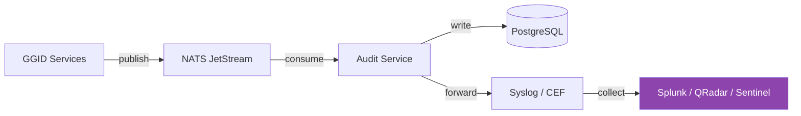
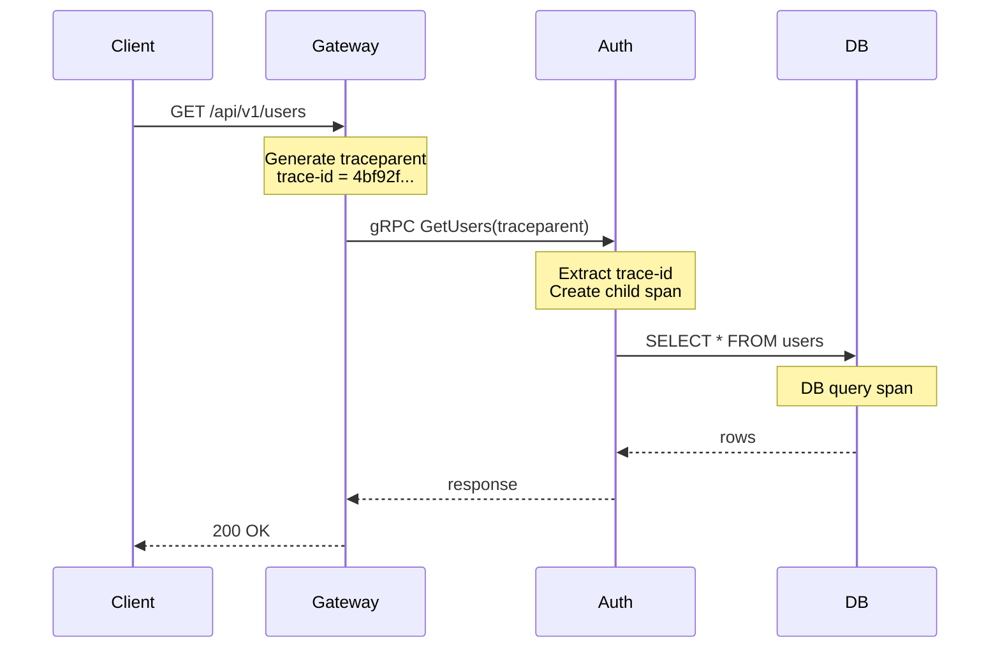

# Observability Guide

Monitoring, tracing, and alerting for GGID deployments.

---

## Three Pillars

| Pillar | Tool | What It Measures |
|--------|------|-----------------|
| Metrics | Prometheus + Grafana | Request rate, error rate, latency, resource usage |
| Traces | OpenTelemetry (OTLP) | Request flow across services |
| Logs | ELK / Loki | Structured event details |

---

## Prometheus Metrics

### Exposed Endpoints

Each service exposes `/metrics` on its HTTP port:

```bash
GET http://gateway:8080/metrics
GET http://auth:9001/metrics
GET http://policy:8070/metrics
```

### Key Metrics

#### Gateway

| Metric | Type | Description |
|--------|------|-------------|
| `ggid_http_requests_total{method,path,status}` | Counter | Total HTTP requests |
| `ggid_http_request_duration_seconds{method,path}` | Histogram | Request latency |
| `ggid_rate_limit_hits_total{path}` | Counter | Rate-limited requests |
| `ggid_circuit_breaker_state{backend}` | Gauge | 0=closed, 1=open, 2=half-open |
| `ggid_backend_healthy{backend}` | Gauge | 1=healthy, 0=unhealthy |
| `ggid_jwt_verifications_total` | Counter | JWT verification count |
| `ggid_jwt_verification_errors_total{reason}` | Counter | JWT verification failures |

#### Auth Service

| Metric | Type | Description |
|--------|------|-------------|
| `ggid_auth_login_total{result}` | Counter | Login attempts (success/failure) |
| `ggid_auth_register_total` | Counter | New registrations |
| `ggid_auth_mfa_total{method,result}` | Counter | MFA verifications |
| `ggid_auth_active_sessions` | Gauge | Current active sessions |

#### Audit Pipeline

| Metric | Type | Description |
|--------|------|-------------|
| `ggid_nats_published_total` | Counter | Events published |
| `ggid_nats_dropped_total` | Counter | Events dropped (NATS unavailable) |
| `ggid_nats_consumer_lag` | Gauge | Unprocessed events in stream |

---

## OpenTelemetry Tracing

### Configuration

```bash
# Set OTLP endpoint for all services
OTEL_EXPORTER_OTLP_ENDPOINT=http://otel-collector:4318
OTEL_SERVICE_NAME=ggid-gateway
```

### Trace Flow

```
Client Request
  └─ Gateway span (entry)
       ├─ JWT verification span
       ├─ Rate limit check span
       └─ Backend proxy span
            ├─ Auth Service span
            │   ├─ DB query span
            │   └─ NATS publish span
            └─ Response span
```

### Viewing Traces

Use **Jaeger** or **Zipkin**:

```bash
# Start Jaeger (Docker)
docker run -d -p 16686:16686 jaegertracing/all-in-one

# Access UI
open http://localhost:16686
```

Search by:
- Service name: `ggid-gateway`
- Operation: `POST /api/v1/auth/login`
- Tags: `http.status_code=500`

---

## Health Checks

### Liveness Probe

```bash
GET /healthz
```

Returns `200 OK` if the process is running and can accept connections.

### Readiness Probe

```bash
GET /readyz
```

Returns `200 OK` if the service can serve requests (DB connected, Redis connected).

### Backend Health

```bash
GET /healthz/backends
```

Returns health status of all backend services:

```json
{
  "auth": {"status": "healthy", "latency_ms": 5},
  "identity": {"status": "healthy", "latency_ms": 3},
  "policy": {"status": "unhealthy", "latency_ms": 0, "error": "connection refused"}
}
```

---

## Grafana Dashboard

### Pre-provisioned Dashboard

GGID includes a Grafana dashboard at `deploy/grafana/dashboards/ggid-overview.json`.

Import manually:
1. Grafana → **Dashboards** → **Import**
2. Upload `deploy/grafana/dashboards/ggid-overview.json`

### Key Panels

| Panel | PromQL |
|-------|--------|
| Request Rate | `rate(ggid_http_requests_total[5m])` |
| Error Rate | `rate(ggid_http_requests_total{status=~"5.."}[5m]) / rate(ggid_http_requests_total[5m])` |
| p95 Latency | `histogram_quantile(0.95, rate(ggid_http_request_duration_seconds_bucket[5m]))` |
| Active Sessions | `ggid_auth_active_sessions` |
| Backend Health | `ggid_backend_healthy` |
| Circuit Breaker | `ggid_circuit_breaker_state` |
| NATS Lag | `ggid_nats_consumer_lag` |

---

## Alerting Rules

```yaml
# deploy/prometheus/alerts.yml
groups:
  - name: ggid
    rules:
      # Service down
      - alert: GGIDServiceDown
        expr: up{job=~"ggid-.*"} == 0
        for: 1m
        labels:
          severity: critical
        annotations:
          summary: "Service {{ $labels.job }} is down"

      # High error rate
      - alert: GGIDHighErrorRate
        expr: |
          rate(ggid_http_requests_total{status=~"5.."}[5m])
          / rate(ggid_http_requests_total[5m]) > 0.01
        for: 5m
        labels:
          severity: warning
        annotations:
          summary: "Error rate above 1%"

      # High latency
      - alert: GGIDHighLatency
        expr: |
          histogram_quantile(0.95,
            rate(ggid_http_request_duration_seconds_bucket[5m])) > 0.5
        for: 5m
        labels:
          severity: warning
        annotations:
          summary: "p95 latency above 500ms"

      # Backend unhealthy
      - alert: GGIDBackendUnhealthy
        expr: ggid_backend_healthy == 0
        for: 2m
        labels:
          severity: critical
        annotations:
          summary: "Backend {{ $labels.backend }} is unhealthy"

      # Circuit breaker open
      - alert: GGIDCircuitBreakerOpen
        expr: ggid_circuit_breaker_state == 1
        for: 1m
        labels:
          severity: critical
        annotations:
          summary: "Circuit breaker open for {{ $labels.backend }}"

      # NATS consumer lag
      - alert: GGIDAuditConsumerLag
        expr: ggid_nats_consumer_lag > 1000
        for: 5m
        labels:
          severity: warning
        annotations:
          summary: "Audit consumer lag > 1000 events"

      # Login failure spike (brute force)
      - alert: GGIDBruteForceAttack
        expr: |
          rate(ggid_auth_login_total{result="failure"}[5m]) > 10
        for: 2m
        labels:
          severity: warning
        annotations:
          summary: "Possible brute-force attack (>10 failed logins/min)"
```

---

## Structured Logging

GGID emits JSON-formatted structured logs for machine parsing.

### Log Format

```json
{
  "time": "2024-01-15T10:30:00.123Z",
  "level": "info",
  "service": "auth",
  "message": "user login successful",
  "request_id": "req-abc123def456",
  "tenant_id": "00000000-0000-0000-0000-000000000001",
  "user_id": "550e8400-e29b-41d4-a716-446655440000",
  "remote_ip": "192.168.1.100",
  "user_agent": "Mozilla/5.0 ...",
  "duration_ms": 8,
  "method": "POST",
  "path": "/api/v1/auth/login",
  "status": 200
}
```

### Standard Fields

| Field | Type | Description |
|-------|------|-------------|
| `time` | ISO 8601 | Timestamp in UTC |
| `level` | string | trace, debug, info, warn, error |
| `service` | string | Service name (gateway, auth, etc.) |
| `message` | string | Human-readable message |
| `request_id` | string | Unique request identifier for tracing |
| `tenant_id` | uuid | Tenant context |
| `user_id` | uuid | Actor (if authenticated) |
| `remote_ip` | string | Client IP address |
| `duration_ms` | int | Request duration in milliseconds |

### PII Redaction

Sensitive data is automatically redacted in logs:

```json
// Input: password=MySecret123
// Logged: "password": "***REDACTED***"

// Input: email=alice@test.com
// Logged: "email": "a***@t***.com"

// Input: token=eyJhbGci...
// Logged: "token": "***REDACTED***"
```

### Log Aggregation with Loki

```yaml
# loki-promtail-config.yaml
server:
  http_listen_port: 9080

positions:
  filename: /tmp/positions.yaml

clients:
  - url: http://loki:3100/loki/api/v1/push

scrape_configs:
  - job_name: ggid
    docker_sd_configs:
      - host: unix:///var/run/docker.sock
        filters:
          - name: label
            values: ["com.docker.compose.project=ggid"]
    pipeline_stages:
      - json:
          expressions:
            level: level
            service: service
            request_id: request_id
      - labels:
          level:
          service:
```

### Querying Logs in Loki/LogQL

```logql
# All errors in the last hour
{service="auth", level="error"}

# Requests for a specific user
{service="gateway"} |= "550e8400-e29b-41d4-a716-446655440000"

# Slow requests (>100ms)
{service="gateway"} | json | duration_ms > 100

# Failed logins from a specific IP
{service="auth", level="warn"} |= "login failed" |= "192.168.1.100"

# Trace a request across services
{request_id="req-abc123def456"}
```

---

## SIEM Integration

GGID audit events integrate with Security Information and Event Management (SIEM)
systems for compliance and threat detection.

### Audit → SIEM Flow



### Splunk Integration (HEC)

```bash
# Configure audit service to forward to Splunk HTTP Event Collector
AUDIT_SIEM_ENABLED=true
AUDIT_SIEM_TYPE=splunk
AUDIT_SIEM_URL=https://splunk.example.com:8088/services/collector
AUDIT_SIEM_TOKEN=your-hec-token-here
```

Splunk receives events in CEF format:

```
CEF:0|GGID|IAM|1.0|100|User Login|3|suser=alice act=user.login dst=192.168.1.100 rt=Jan 15 2024 10:30:00
```

### Splunk SPL Queries

```splunk
# Count logins by user in the last 24 hours
index=ggid act=user.login
| stats count by suser
| sort -count

# Detect brute force: >5 failed logins from same IP in 10 min
index=ggid act=user.login outcome=failure
| stats count by src_ip
| where count > 5
| sort -count

# Track admin actions
index=ggid suser=*
| where match(act, "(create|delete|update|assign|revoke)")
| table _time, suser, act, object, outcome
```

### Microsoft Sentinel Integration

```bash
# Forward via Log Analytics API
AUDIT_SIEM_TYPE=azure_sentinel
AUDIT_SIEM_WORKSPACE_ID=your-workspace-id
AUDIT_SIEM_SHARED_KEY=your-shared-key
AUDIT_SIEM_LOG_TYPE=GGIDAudit
```

### Audit Integrity Verification

GGID periodically verifies audit log integrity using hash chaining:

```bash
# Each audit event includes a hash of the previous event
# This creates a tamper-evident chain

# Verify chain integrity
curl $API/api/v1/audit/verify-integrity \
  -H "Authorization: Bearer $ADMIN_TOKEN"

# Response
{
  "verified": true,
  "events_checked": 1542832,
  "chain_broken_at": null,
  "last_verified": "2024-01-15T10:30:00Z"
}
```

---

## Health Endpoint Design

GGID exposes three health endpoint variants:

### /healthz — Liveness

Returns 200 if the process is alive. No dependency checks.

```bash
$ curl localhost:8080/healthz
{ "status": "ok" }
```

### /readyz — Readiness

Returns 200 only if the service can serve requests (all dependencies reachable).

```bash
$ curl localhost:8080/readyz
{
  "status": "ok",
  "checks": {
    "database": "ok",
    "redis": "ok",
    "nats": "ok"
  }
}
```

If any dependency is down:

```json
{
  "status": "unhealthy",
  "checks": {
    "database": "ok",
    "redis": "fail: connection refused",
    "nats": "ok"
  }
}
```

### /healthz/deep — Deep Health

Returns detailed health status including replication lag, connection pool stats, and latency probes:

```json
{
  "status": "ok",
  "checks": {
    "database": {
      "status": "ok",
      "latency_ms": 0.3,
      "pool_active": 5,
      "pool_idle": 20,
      "replication_lag_s": 0
    },
    "redis": {
      "status": "ok",
      "latency_ms": 0.1,
      "connected_clients": 3
    }
  }
}
```

---

## Grafana Dashboards

### Importing Dashboards

Reference dashboards are provided in `deploy/grafana/dashboards/`:

```bash
# Dashboard JSON files
deploy/grafana/dashboards/
  ggid-overview.json         # High-level platform health
  ggid-auth-service.json     # Auth-specific metrics
  ggid-gateway.json          # Gateway latency & throughput
  ggid-policy-engine.json    # Policy check performance
  ggid-infrastructure.json   # DB/Redis/NATS health
```

### Dashboard Panel Reference

#### Overview Dashboard

| Panel | PromQL Query | Visualization |
|-------|-------------|---------------|
| Request Rate | `rate(ggid_gateway_requests_total[1m])` | Time series |
| Error Rate | `rate(ggid_gateway_requests_total{status=~"5.."}[5m]) / rate(ggid_gateway_requests_total[5m])` | Stat |
| p95 Latency | `histogram_quantile(0.95, rate(ggid_gateway_request_duration_seconds_bucket[5m]))` | Time series |
| Active Sessions | `ggid_auth_active_sessions` | Gauge |
| NATS Lag | `nats_jetstream_consumer_num_pending` | Time series |

#### Auth Service Dashboard

| Panel | PromQL Query | Visualization |
|-------|-------------|---------------|
| Login Rate | `rate(ggid_auth_login_total{result="success"}[5m])` | Time series |
| Login Failures | `rate(ggid_auth_login_total{result="failure"}[5m])` | Time series |
| Token Issuance | `rate(ggid_auth_tokens_issued_total[5m])` | Time series |
| JWT Verify Latency | `histogram_quantile(0.95, rate(ggid_auth_jwt_verify_seconds_bucket[5m]))` | Time series |
| Account Lockouts | `rate(ggid_auth_lockouts_total[5m])` | Stat |
| Rate Limit Denials | `rate(ggid_ratelimit_denied_total[5m])` by endpoint | Bar chart |

#### Infrastructure Dashboard

| Panel | PromQL Query | Visualization |
|-------|-------------|---------------|
| DB Connections | `pg_stat_activity_count` | Gauge |
| DB Query Latency | `histogram_quantile(0.95, rate(pg_query_duration_seconds_bucket[5m]))` | Time series |
| Redis Memory | `redis_memory_used_bytes / redis_memory_max_bytes` | Gauge |
| Redis Hit Rate | `redis_keyspace_hits_total / (redis_keyspace_hits_total + redis_keyspace_misses_total)` | Stat |
| NATS Messages | `rate(nats_jetstream_stream_messages[1m])` | Time series |

### Provisioning Dashboards via ConfigMap

```yaml
apiVersion: v1
kind: ConfigMap
metadata:
  name: ggid-grafana-dashboards
  namespace: monitoring
  labels:
    grafana_dashboard: "1"
data:
  ggid-overview.json: |
    {"dashboard": {"title": "GGID Overview", "panels": [...]}, ...}
  ggid-auth-service.json: |
    {"dashboard": {"title": "GGID Auth Service", ...}, ...}
```

---

## Structured Logging

### JSON Log Format

All GGID services emit structured JSON logs. Every log entry includes:

```json
{
  "timestamp": "2024-07-15T10:30:45.123Z",
  "level": "info",
  "service": "auth",
  "tenant_id": "00000000-0000-0000-0000-000000000001",
  "request_id": "req-abc-123",
  "trace_id": "4bf92f3577b34da6a3ce929d0e0e4736",
  "span_id": "00f067aa0ba902b7",
  "message": "login successful",
  "user_id": "550e8400-e29b-41d4-a716-446655440000",
  "method": "password",
  "duration_ms": 8.2,
  "metadata": {
    "ip_address": "192.168.1.100",
    "user_agent": "Mozilla/5.0...",
    "mfa_used": false
  }
}
```

### Standard Fields

| Field | Type | Required | Description |
|------|------|----------|-------------|
| `timestamp` | ISO 8601 | Yes | UTC timestamp with milliseconds |
| `level` | string | Yes | `debug`, `info`, `warn`, `error` |
| `service` | string | Yes | Service name (auth, gateway, etc.) |
| `message` | string | Yes | Human-readable message |
| `request_id` | string | Yes (HTTP) | Unique request identifier |
| `trace_id` | string | Recommended | W3C traceparent trace ID |
| `tenant_id` | UUID | Yes (multi-tenant) | Tenant context |
| `duration_ms` | float | When applicable | Operation duration |

### Log Level Guidelines

| Level | Use For | Example |
|------|---------|--------|
| `debug` | Detailed diagnostic info | "cache miss for user 550e8400" |
| `info` | Normal operations | "login successful for user 550e8400" |
| `warn` | Unexpected but non-fatal | "rate limit threshold reached for IP" |
| `error` | Errors requiring attention | "database connection failed: connection refused" |

### PII Redaction

GGID automatically redacts PII fields in logs:

```json
{
  "message": "login attempt",
  "email": "[REDACTED]",
  "password": "[REDACTED]",
  "token": "[REDACTED]"
}
```

Fields redacted: `password`, `email`, `token`, `access_token`, `refresh_token`,
`secret`, `api_key`, `ssn`, `credit_card`, `phone`.

### Configuring Log Output

```bash
# JSON format (default, recommended for production)
LOG_FORMAT=json

# Text format (for local development)
LOG_FORMAT=text

# Log level
LOG_LEVEL=info  # debug | info | warn | error
```

---

## Distributed Tracing

### W3C Trace Context

GGID implements the W3C Trace Context standard. The Gateway generates a
`traceparent` header for each incoming request and propagates it to all
downstream services.

```
traceparent: 00-4bf92f3577b34da6a3ce929d0e0e4736-00f067aa0ba902b7-01
              |  |                                   |                |
              |  |                                   |                +- flags (01 = sampled)
              |  |                                   +-- span ID (parent)
              |  +-- trace ID (shared across all services)
              +-- version (00 = W3C standard)
```

### Propagation Chain



### OpenTelemetry Export

GGID exports traces via OTLP (OpenTelemetry Protocol):

```bash
# Configure OTLP endpoint
OTEL_EXPORTER_OTLP_ENDPOINT=http://otel-collector:4317
OTEL_EXPORTER_OTLP_PROTOCOL=grpc
OTEL_SERVICE_NAME=ggid

# Sampling rate (1.0 = all traces, 0.1 = 10%)
OTEL_TRACES_SAMPLER_ARG=0.1
```

### Jaeger / Tempo Integration

```yaml
# docker-compose.yaml — add OTLP collector
services:
  jaeger:
    image: jaegertracing/all-in-one:1.55
    ports:
      - "16686:16686"  # Jaeger UI
      - "4317:4317"    # OTLP gRPC
    environment:
      COLLECTOR_OTLP_ENABLED: true
```

Access Jaeger UI at `http://localhost:16686` to search traces by service,
operation, or trace ID.

---

## Health Check Endpoints Per Service

### Summary Table

| Service | Liveness | Readiness | Deep Health | Metrics |
|---------|----------|-----------|-------------|---------|
| Gateway | `:8080/healthz` | `:8080/readyz` | `:8080/healthz/deep` | `:8080/metrics` |
| Identity | `:8081/healthz` | `:8081/readyz` | `:8081/healthz/deep` | `:8081/metrics` |
| Auth | `:9001/healthz` | `:9001/readyz` | `:9001/healthz/deep` | `:9001/metrics` |
| OAuth | `:9005/healthz` | `:9005/readyz` | `:9005/healthz/deep` | `:9005/metrics` |
| Policy | `:8070/healthz` | `:8070/readyz` | `:8070/healthz/deep` | `:8070/metrics` |
| Org | `:8071/healthz` | `:8071/readyz` | `:8071/healthz/deep` | `:8071/metrics` |
| Audit | `:8072/healthz` | `:8072/readyz` | `:8072/healthz/deep` | `:8072/metrics` |

### Kubernetes Probe Configuration

```yaml
spec:
  containers:
    - name: gateway
      livenessProbe:
        httpGet:
          path: /healthz
          port: 8080
        initialDelaySeconds: 5
        periodSeconds: 10
        failureThreshold: 3

      readinessProbe:
        httpGet:
          path: /readyz
          port: 8080
        initialDelaySeconds: 10
        periodSeconds: 5
        failureThreshold: 2

      # Deep health as a startup probe (checks DB + Redis on first boot)
      startupProbe:
        httpGet:
          path: /healthz/deep
          port: 8080
        failureThreshold: 30
        periodSeconds: 10
```

---

## References

- [Prometheus Documentation](https://prometheus.io/docs/)
- [OpenTelemetry Go SDK](https://opentelemetry.io/docs/instrumentation/go/)
- [Benchmark Guide](./benchmark.md) — Performance metrics
- [Deployment Guide](./deployment-guide.md) — Production setup
- [High Availability](./high-availability.md) — HA monitoring
