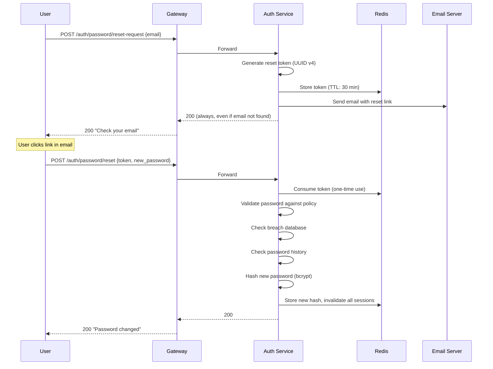

# Password Policy Guide

Configure and enforce password security policies in GGID.

---

## Default Policy

| Rule | Default | Configurable |
|------|---------|:------------:|
| Minimum length | 8 characters | Yes |
| Maximum length | 128 characters | Yes |
| Uppercase letter | Required | Yes |
| Lowercase letter | Required | Yes |
| Digit | Required | Yes |
| Special character | Required | Yes |
| History check | Last 5 passwords | Yes |
| Expiration | Never | Yes |
| Breach check (HIBP) | Disabled | Yes |

---

## Configure Policy

### Via Console

**Settings** → **Security** → **Password Policy**

### Via API

```bash
PUT /api/v1/settings/password-policy
{
  "min_length": 12,
  "max_length": 128,
  "require_uppercase": true,
  "require_lowercase": true,
  "require_digit": true,
  "require_special": true,
  "special_chars": "!@#$%^&*()-_=+[]{}|;:,.<>?",
  "history_count": 10,
  "expiration_days": 90,
  "breach_check": true,
  "breach_check_api": "https://api.pwnedpasswords.com/range/"
}
```

---

## Complexity Rules

### Minimum Length

```json
{"min_length": 12}
```

NIST recommends minimum 8 characters. For sensitive systems, use 12+.

### Character Classes

```json
{
  "require_uppercase": true,
  "require_lowercase": true,
  "require_digit": true,
  "require_special": true
}
```

A valid password must contain at least one character from each enabled class.

### Custom Special Characters

```json
{"special_chars": "!@#$%^&*"}
```

Define which characters count as "special". Default includes common punctuation.

---

## Password History

Prevent password reuse:

```json
{"history_count": 10}
```

- Stores hashes of the last N passwords per user
- When user changes password, new password is checked against history
- If match found → rejected with `PASSWORD_IN_HISTORY` error
- History is checked using Argon2id verification (not plaintext comparison)

### How It Works

```go
// PasswordService.CheckHistory
func (ps *PasswordService) CheckHistory(ctx context.Context, tenantID, userID uuid.UUID, newPassword string) error {
    history, _ := ps.repo.GetPasswordHistory(ctx, tenantID, userID, 10)
    for _, oldHash := range history {
        if argon2id.Verify(newPassword, oldHash) {
            return ErrPasswordInHistory
        }
    }
    return nil
}
```

---

## Password Expiration

```json
{"expiration_days": 90}
```

- Passwords expire after N days
- On login, if expired → user forced to change password
- Audit event: `password.expired`
- Grace period configurable (default: 0 days — hard expiry)

### Configure Grace Period

```json
{
  "expiration_days": 90,
  "expiration_warning_days": 7
}
```

Users get a warning N days before expiration. During warning window, login succeeds but UI shows "Your password expires in X days."

---

## Breach Detection (HIBP)

Check passwords against the [Have I Been Pwned](https://haveibeenpwned.com/API/v3) database:

```json
{
  "breach_check": true,
  "breach_check_api": "https://api.pwnedpasswords.com/range/"
}
```

### How It Works (k-Anonymity)

1. Hash the password with SHA-1
2. Send first 5 hex characters to HIBP API
3. HIBP returns all breach hashes starting with those 5 chars
4. Check locally if the full hash is in the response

```
Password → SHA1("password") → 5BAA61E4C9B93F3F0682250B6CF8331B7EE68FD8
Send to HIBP: GET https://api.pwnedpasswords.com/range/5BAA6
Receive: 1E4C9B93F3F0682250B6CF8331B7EE68FD8:5  ← found 5 times
Result: PASSWORD_FOUND_IN_BREACH
```

### Response on Breach

If the password is found in a breach database:

```json
{
  "error": {
    "code": "PASSWORD_TOO_WEAK",
    "message": "This password has been found in known data breaches. Please choose a different password.",
    "details": {"breach_count": 4523}
  }
}
```

### Self-Hosted HIBP

For air-gapped deployments, download the HIBP database locally:

```bash
# Download HIBP password list (7-Zip compressed)
wget https://downloads.pwnedpasswords.com/passwords/pwned-passwords-sha1-ordered-v8.txt.7z

# Configure GGID to use local file
{"breach_check_api": "file:///data/hibp/pwned-passwords.txt"}
```

---

## Password Hashing

GGID uses **Argon2id** (RFC 9106) for all password storage:

| Parameter | Value | Description |
|-----------|-------|-------------|
| `time` | 1 | Iterations |
| `memory` | 64 MB | Memory per hash |
| `parallelism` | 2 | Threads |
| `salt length` | 16 bytes | Random per-user |
| `key length` | 32 bytes | Hash output |

### Why Argon2id?

- **Memory-hard** — Resistant to GPU/ASIC brute-force
- **Side-channel resistant** — Data-independent memory access
- **PHC winner** — Recommended by Password Hashing Competition

---

## Password Validation API

Validate a password against policy without changing it:

```bash
POST /api/v1/auth/password/validate
{"password": "TestPass@123"}
```

Response:

```json
{
  "valid": true,
  "score": 4,
  "checks": {
    "length": true,
    "uppercase": true,
    "lowercase": true,
    "digit": true,
    "special": true,
    "not_in_history": true,
    "not_in_breach": true
  },
  "suggestions": []
}
```

### Invalid Response

```json
{
  "valid": false,
  "score": 1,
  "checks": {
    "length": true,
    "uppercase": false,
    "lowercase": true,
    "digit": false,
    "special": false,
    "not_in_history": true,
    "not_in_breach": true
  },
  "suggestions": [
    "Add at least one uppercase letter",
    "Add at least one digit",
    "Add at least one special character"
  ]
}
```

---

## Best Practices

1. **Use HIBP breach check** — Catches common passwords users try to set
2. **Set min_length to 12+** — NIST SP 800-63B recommends 8 minimum, but 12+ is better
3. **Don't require periodic rotation** — NIST no longer recommends forced rotation (unless breach suspected)
4. **Allow paste in password fields** — Password managers improve security, not reduce it
5. **Show strength meter** — Real-time feedback helps users choose strong passwords
6. **Rate limit password changes** — Prevent rapid cycling to bypass history
7. **Log password policy changes** — Audit trail for compliance

---

## NIST SP 800-63B Compliance

GGID implements NIST Special Publication 800-63B (Digital Identity Guidelines)
recommendations:

| NIST Recommendation | GGID Implementation | Status |
|---------------------|---------------------|--------|
| Min password length ≥ 8 | Default: 12 characters | Exceeds |
| Max password length ≥ 64 | Supports up to 128 characters | Compliant |
| Allow all ASCII + SPACE | No character restrictions beyond complexity | Compliant |
| No composition rules (NIST says optional) | Configurable complexity (on by default) | Configurable |
| Check against breached passwords | HIBP k-anonymity API integration | Compliant |
| No password hints | Feature not available | N/A |
| No knowledge-based verification | Not implemented | N/A |
| Rate limit authentication attempts | 10/min per IP+username, lockout after 5 | Compliant |
| No mandatory periodic rotation | Default: 90 days (configurable, can disable) | Configurable |
| Secure password storage | bcrypt cost 12 (or Argon2id optional) | Compliant |
| Allow paste in password fields | Console frontend allows paste | Compliant |

### Disabling Forced Rotation (NIST Aligned)

```bash
# If you follow NIST guidance (no forced rotation):
curl -X PUT $API/api/v1/settings/password-policy \
  -H "Authorization: Bearer $ADMIN_TOKEN" \
  -d '{
    "max_age_days": 0,
    "force_rotation": false
  }'
```

---

## Password Strength Scoring

GGID scores password strength using a zxcvbn-inspired algorithm:

| Score | Label | Example | Recommendation |
|-------|-------|---------|----------------|
| 0 | Very Weak | `password` | Reject |
| 1 | Weak | `password1` | Reject |
| 2 | Fair | `Hello123` | Warn user |
| 3 | Good | `H3ll0W0rld!` | Acceptable |
| 4 | Strong | `c0rrect-horse-battery-staple` | Ideal |

### Configure Minimum Score

```bash
curl -X PUT $API/api/v1/settings/password-policy \
  -H "Authorization: Bearer $ADMIN_TOKEN" \
  -d '{
    "min_strength_score": 3
  }'
```

### Strength Evaluation API

```bash
# Check password strength without setting it
curl -X POST $API/api/v1/auth/password/strength \
  -H "Authorization: Bearer $TOKEN" \
  -d '{"password": "MyP@ssw0rd123"}'

# Response
{
  "score": 3,
  "label": "Good",
  "feedback": {
    "warning": "",
    "suggestions": ["Add another word or two"]
  },
  "crack_time_display": "3 days",
  "crack_time_seconds": 259200
}
```

---

## Passwordless Authentication

GGID supports passwordless alternatives that bypass password policy entirely:

### WebAuthn / Passkeys

```mermaid
graph LR
    User[User] -->|Clicks "Sign in with Passkey"| GW[Gateway]
    GW -->|Begin| WebAuthn[WebAuthn Challenge]
    WebAuthn -->|Biometric/PIN| Device[Authenticator<br/>Touch ID / Windows Hello]
    Device -->|Signed Assertion| GW
    GW -->|Verify + Issue JWT| User

    style WebAuthn fill:#27ae60,color:#fff
```

**Advantages over passwords:**
- No password to remember, steal, or breach
- Phishing-resistant (origin-bound)
- Per-device credentials
- Biometric unlock (Touch ID, Face ID, Windows Hello)

### Magic Link (Email-based)

```bash
# Request magic link
curl -X POST $API/api/v1/auth/magic-link \
  -d '{"email": "user@test.com"}'

# User clicks link in email:
# https://iam.example.com/auth/magic?token=abc123
# → Exchanges token for JWT
```

### OTP (One-Time Password via Email/SMS)

```bash
# Request OTP
curl -X POST $API/api/v1/auth/otp/send \
  -d '{"channel": "email", "email": "user@test.com"}'

# Verify OTP
curl -X POST $API/api/v1/auth/otp/verify \
  -d '{"email": "user@test.com", "code": "123456"}'
```

---

## Password Policy Per Tenant

Each tenant can have different password policies:

| Tenant Type | Min Length | Complexity | History | Expiry | Breach Check |
|-------------|-----------|------------|---------|--------|--------------|
| Free tier | 8 | Basic | 3 | 90 days | Off |
| Pro tier | 12 | Full | 5 | 90 days | On |
| Enterprise | 16 | Full + custom blocklist | 10 | Configurable | On + self-hosted |
| Healthcare (HIPAA) | 14 | Full | 12 | 60 days | On |

### Configure Per-Tenant Policy

```bash
curl -X PUT $API/api/v1/tenants/$TENANT_ID/settings/password-policy \
  -H "Authorization: Bearer $ADMIN_TOKEN" \
  -d '{
    "min_length": 16,
    "require_uppercase": true,
    "require_lowercase": true,
    "require_digit": true,
    "require_special": true,
    "special_chars": "!@#$%^&*()_+-=[]{}|;:,.<>?",
    "history_count": 10,
    "max_age_days": 60,
    "breach_check_enabled": true,
    "custom_blocklist": ["company", "product_name", "tenant_name"],
    "min_strength_score": 4
  }'
```

---

## Password Reset Flow



### Reset Token Security

| Property | Value |
|----------|-------|
| Token format | UUID v4 (random) |
| Storage | Redis with TTL |
| TTL | 30 minutes |
| Usage | Single use (deleted on success) |
| Rate limit | 3 requests per hour per email |
| Response | Always 200 (prevent user enumeration) |
