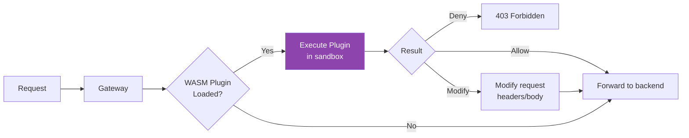

# GGID Plugin Development Guide

How to write, register, and deploy plugins (hooks) for the GGID Auth Service.

---

## Table of Contents

- [Overview](#overview)
- [Hook Types](#hook-types)
- [Plugin Interface](#plugin-interface)
- [Plugin Lifecycle](#plugin-lifecycle)
- [Error Handling](#error-handling)
- [Example Plugins](#example-plugins)
- [Registering Plugins](#registering-plugins)
- [Testing Plugins](#testing-plugins)
- [Best Practices](#best-practices)

---

## Overview

GGID supports an extensible **auth hooks engine** that allows you to intercept
and modify authentication flows at key points. Hooks are HTTP webhook callbacks
— when a configured event occurs, GGID sends a POST request to your hook URL.

This enables:
- Custom validation (e.g., check an external denylist before registration)
- Side effects (e.g., sync to a CRM after user creation)
- Notification (e.g., alert Slack on suspicious login)
- Token customization (e.g., inject custom claims)

---

## Hook Types

| Hook | Triggered When | Can Modify? | Abort Flow? |
|------|---------------|-------------|-------------|
| `pre-registration` | Before user registration | Yes (add metadata) | Yes (block registration) |
| `post-registration` | After user is created | No | No |
| `post-login` | After successful login | Yes (add custom claims) | No |
| `pre-token-issue` | Before JWT is issued | Yes (add/modify claims) | Yes (block token) |
| `post-token-refresh` | After token refresh | No | No |
| `pre-password-reset` | Before password reset email sent | Yes (override recipient) | Yes (block reset) |
| `post-password-change` | After password is changed | No | No |
| `pre-mfa-verify` | Before MFA code verification | No | Yes (force MFA) |
| `post-user-lock` | After account is locked | No | No |

### Hook Execution Order

```
User submits registration
  │
  ├─► pre-registration hook (can block)
  │     └─► User created in DB
  │           └─► post-registration hook (notification)
  │
User submits login
  │
  ├─► Password verified
  ├─► post-login hook (can add claims)
  ├─► pre-token-issue hook (can modify token, can block)
  │     └─► JWT issued
  └─► Response returned
```

---

## Plugin Interface

### Webhook Payload

All hooks receive an HTTP POST with this JSON structure:

```json
{
  "event": "pre-registration",
  "timestamp": "2024-07-10T12:00:00Z",
  "tenant_id": "00000000-0000-0000-0000-000000000001",
  "request_id": "req-abc123",
  "data": {
    "username": "john.doe",
    "email": "john@example.com",
    "ip_address": "192.168.1.100",
    "user_agent": "Mozilla/5.0..."
  }
}
```

### Webhook Response

Your hook must respond within **3 seconds** with HTTP 200 and optional JSON body:

#### Blocking Response (abort the flow)

```json
{
  "action": "deny",
  "reason": "Email domain not allowed"
}
```

When `action` is `deny`, GGID returns the error to the client:
- Registration: `403 Forbidden` with `{"error": "Email domain not allowed"}`
- Login: `401 Unauthorized`

#### Modification Response (add data)

```json
{
  "action": "allow",
  "modify": {
    "metadata": {
      "department": "engineering",
      "manager": "jane@example.com"
    },
    "claims": {
      "custom_role": "contractor"
    }
  }
}
```

#### Pass-Through Response (no modification)

```json
{
  "action": "allow"
}
```

Or simply HTTP 200 with empty body.

---

## Plugin Lifecycle

```
1. Event occurs (e.g., user submits registration)
      │
2. GGID checks if any hooks are registered for this event
      │
      ├─ No hooks ──► Proceed normally
      │
      ├─ Hook(s) found
      │     │
      │     ├─► POST to hook URL (with 3s timeout)
      │     │     │
      │     │     ├─► 200 + allow ──► Apply modifications, proceed
      │     │     ├─► 200 + deny  ──► Abort with error message
      │     │     ├─► Timeout (3s) ──► Fail-open (proceed, log warning)
      │     │     └─► Non-200 / error ──► Fail-open (proceed, log error)
      │     │
      │     └─► Multiple hooks run sequentially
      │           If any hook denies, flow aborts immediately
      │
3. Flow completes (or aborted with error)
```

### Fail-Open Behavior

If a hook URL is unreachable or times out, GGID **fails open** (proceeds with
the flow). This ensures hooks don't cause availability issues. Failed hook
invocations are logged and visible in the audit trail.

> For critical blocking hooks (e.g., denylist enforcement), ensure your hook
> service is highly available.

---

## Error Handling

### Hook Response Codes

| Response | GGID Behavior |
|----------|---------------|
| 200 + `action: allow` | Proceed, apply modifications |
| 200 + `action: deny` | Abort flow, return reason to client |
| 200 (no body) | Proceed normally |
| 200 (invalid JSON) | Proceed normally, log warning |
| 408 / timeout (>3s) | Proceed normally (fail-open), log error |
| 500 / 502 / 503 | Proceed normally (fail-open), log error |
| Connection refused | Proceed normally (fail-open), log error |

### Idempotency

Hooks may be called multiple times for the same event (e.g., during retries).
Your hook should be idempotent — processing the same event twice should not
cause side effects.

Use `request_id` to deduplicate:

```python
if request_id in processed_set:
    return {"action": "allow"}
processed_set.add(request_id)
```

---

## Example Plugins

### Example 1: Block Disposable Email Registration (pre-registration)

```python
# hook_server.py
from flask import Flask, request, jsonify

app = Flask(__name__)

DISPOSABLE_DOMAINS = {"mailinator.com", "tempmail.com", "guerrillamail.com"}

@app.route("/hooks/email-check", methods=["POST"])
def email_check():
    event = request.json
    email = event["data"]["email"]

    domain = email.split("@")[1].lower()
    if domain in DISPOSABLE_DOMAINS:
        return jsonify({
            "action": "deny",
            "reason": f"Email domain '{domain}' is not allowed"
        }), 200

    return jsonify({"action": "allow"}), 200
```

### Example 2: Slack Notification on Login (post-login)

```python
import requests

@app.route("/hooks/slack-notify", methods=["POST"])
def slack_notify():
    event = request.json
    username = event["data"]["username"]
    ip = event["data"]["ip_address"]

    requests.post("https://hooks.slack.com/services/...", json={
        "text": f":white_check_mark: User *{username}* logged in from {ip}"
    })

    return jsonify({"action": "allow"}), 200
```

### Example 3: Inject Custom JWT Claims (pre-token-issue)

```python
@app.route("/hooks/custom-claims", methods=["POST"])
def custom_claims():
    event = request.json
    user_id = event["data"]["user_id"]

    # Fetch department from your internal system
    department = get_department(user_id)
    clearance = get_clearance_level(user_id)

    return jsonify({
        "action": "allow",
        "modify": {
            "claims": {
                "department": department,
                "clearance_level": clearance
            }
        }
    }), 200
```

### Example 4: Force MFA for High-Risk Logins (post-login)

```python
@app.route("/hooks/risk-check", methods=["POST"])
def risk_check():
    event = request.json
    ip = event["data"]["ip_address"]
    user_agent = event["data"]["user_agent"]

    # Check if login is from a new location or suspicious UA
    risk_score = calculate_risk(ip, user_agent)

    if risk_score > 0.7:
        return jsonify({
            "action": "allow",
            "modify": {
                "force_mfa": True,
                "metadata": {"risk_score": risk_score}
            }
        }), 200

    return jsonify({"action": "allow"}), 200
```

### Example 5: Go Hook Server

```go
package main

import (
    "encoding/json"
    "fmt"
    "net/http"
)

type HookRequest struct {
    Event     string                 `json:"event"`
    Timestamp string                 `json:"timestamp"`
    TenantID  string                 `json:"tenant_id"`
    Data      map[string]interface{} `json:"data"`
}

type HookResponse struct {
    Action string                 `json:"action"`
    Reason string                 `json:"reason,omitempty"`
    Modify map[string]interface{} `json:"modify,omitempty"`
}

func auditHookHandler(w http.ResponseWriter, r *http.Request) {
    var req HookRequest
    json.NewDecoder(r.Body).Decode(&req)

    // Log the event to your SIEM
    fmt.Printf("[HOOK] %s: %+v\n", req.Event, req.Data)

    // Check denylist
    email, _ := req.Data["email"].(string)
    if isDenylisted(email) {
        json.NewEncoder(w).Encode(HookResponse{
            Action: "deny",
            Reason: "Account is suspended",
        })
        return
    }

    json.NewEncoder(w).Encode(HookResponse{Action: "allow"})
}

func main() {
    http.HandleFunc("/hooks/audit", auditHookHandler)
    http.ListenAndServe(":9100", nil)
}
```

---

## Registering Plugins

### Via REST API

```bash
# Register a webhook hook
curl -X POST "$GW/api/v1/auth/hooks" \
  -H "Authorization: Bearer $TOKEN" \
  -H "Content-Type: application/json" \
  -H "X-Tenant-ID: $TENANT" \
  -d '{
    "event": "pre-registration",
    "url": "https://hooks.yourapp.com/email-check",
    "method": "POST",
    "secret": "hmac-secret-for-signing"
  }'
```

### Via Admin Console

1. Navigate to **Settings** > **Webhooks**
2. Click **"Add Hook"**
3. Select the event type
4. Enter your hook URL
5. Optionally set an HMAC secret (sent as `X-GGID-Signature` header)

### Listing Hooks

```bash
curl -s "$GW/api/v1/auth/hooks" \
  -H "Authorization: Bearer $TOKEN" \
  -H "X-Tenant-ID: $TENANT"
```

### Deleting a Hook

```bash
curl -X DELETE "$GW/api/v1/auth/hooks/{hook_id}" \
  -H "Authorization: Bearer $TOKEN" \
  -H "X-Tenant-ID: $TENANT"
```

---

## Testing Plugins

### Local Testing with ngrok

```bash
# Start your hook server locally
python hook_server.py  # runs on :5000

# Expose it via ngrok
ngrok http 5000

# Register the ngrok URL as a hook
curl -X POST "$GW/api/v1/auth/hooks" \
  -H "Authorization: Bearer $TOKEN" \
  -H "Content-Type: application/json" \
  -H "X-Tenant-ID: $TENANT" \
  -d '{
    "event": "pre-registration",
    "url": "https://abc123.ngrok.io/hooks/email-check"
  }'
```

### Simulating Hook Events

Send a test event directly to your hook:

```bash
curl -X POST https://your-hook-url.com/hooks/email-check \
  -H "Content-Type: application/json" \
  -d '{
    "event": "pre-registration",
    "timestamp": "2024-07-10T12:00:00Z",
    "tenant_id": "00000000-0000-0000-0000-000000000001",
    "request_id": "test-req-001",
    "data": {
      "username": "testuser",
      "email": "test@mailinator.com",
      "ip_address": "127.0.0.1"
    }
  }'
```

### HMAC Signature Verification

If you set a `secret`, GGID signs each request with HMAC-SHA256:

```python
import hmac, hashlib

def verify_signature(request_body, signature_header, secret):
    expected = hmac.new(
        secret.encode(),
        request_body,
        hashlib.sha256
    ).hexdigest()
    return hmac.compare_digest(f"sha256={expected}", signature_header)

# In your handler
signature = request.headers.get("X-GGID-Signature", "")
if not verify_signature(request.data, signature, "your-hmac-secret"):
    return jsonify({"error": "invalid signature"}), 401
```

---

## Best Practices

1. **Respond within 1 second** — the hard timeout is 3s, but faster is better
2. **Be idempotent** — process each `request_id` only once
3. **Fail gracefully** — if your service is down, GGID fails open (allows the flow)
4. **Use HTTPS** — hook URLs must be HTTPS in production
5. **Verify HMAC signatures** — ensures requests are genuinely from GGID
6. **Log all events** — keep an audit trail of hook invocations
7. **Return meaningful deny reasons** — users see the `reason` field on denial
8. **Test edge cases** — empty fields, Unicode, very long strings
9. **Monitor hook latency** — add the `X-GGID-Signature` timestamp to measure
10. **Don't block critical paths** — use `post-*` hooks for non-critical side effects

---

## WASM Plugin Development

GGID supports WebAssembly (WASM) plugins that run in-process at the Gateway
layer for maximum performance (no network overhead).



### WASM SDK Interface

Plugins implement the `RequestHandler` interface:

```go
// SDK interface exposed to WASM plugins
type RequestHandler interface {
    // OnRequest is called before the request reaches the backend
    // Return nil to allow, or a Response to short-circuit
    OnRequest(req *Request) *Response

    // OnResponse is called after the backend responds
    // Can modify the response before returning to client
    OnResponse(resp *Response) *Response
}

type Request struct {
    Method   string            `json:"method"`
    Path     string            `json:"path"`
    Headers  map[string]string `json:"headers"`
    Body     []byte            `json:"body"`
    TenantID string            `json:"tenant_id"`
    UserID   string            `json:"user_id"`
}

type Response struct {
    Status  int               `json:"status"`
    Headers map[string]string `json:"headers"`
    Body    []byte            `json:"body"`
}
```

### Writing a WASM Plugin (TinyGo)

```go
// plugins/ip-blocker/main.go
//go:build tinygo.wasm

package main

import (
    "encoding/json"
    "syscall/js"
)

// Blocked IP ranges
var blockedCIDRs = []string{
    "10.0.0.0/8",
    "192.168.1.0/24",
}

func onRequest(this js.Value, args []js.Value) interface{} {
    reqJSON := args[0].String()
    var req struct {
        Headers  map[string]string `json:"headers"`
        Path     string            `json:"path"`
        TenantID string            `json:"tenant_id"`
    }
    json.Unmarshal([]byte(reqJSON), &req)

    clientIP := req.Headers["X-Forwarded-For"]

    // Check if IP is blocked
    for _, cidr := range blockedCIDRs {
        if isIPInCIDR(clientIP, cidr) {
            // Deny
            return map[string]interface{}{
                "status": 403,
                "body":   `{"error":"IP blocked"}`,
            }
        }
    }

    // Allow (nil response = pass-through)
    return nil
}

func main() {
    js.Global().Set("onRequest", js.FuncOf(onRequest))
    // Keep running
    select {}
}
```

### Build with TinyGo

```bash
# Install TinyGo
brew install tinygo

# Build WASM module
tinygo build -o ip-blocker.wasm \
  -target wasm \
  -opt 2 \
  plugins/ip-blocker/main.go

# Verify the module
file ip-blocker.wasm
# ip-blocker.wasm: WebAssembly (wasm) binary module
```

### Deploy WASM Plugin

```bash
# Upload the plugin
curl -X POST $API/api/v1/plugins/wasm \
  -H "Authorization: Bearer $ADMIN_TOKEN" \
  -F "file=@ip-blocker.wasm" \
  -F "name=ip-blocker" \
  -F "type=request_handler" \
  -F "priority=10"

# Enable for specific routes
curl -X PUT $API/api/v1/plugins/wasm/ip-blocker/routes \
  -H "Authorization: Bearer $ADMIN_TOKEN" \
  -d '{
    "routes": ["/api/v1/*"],
    "methods": ["GET", "POST", "PUT", "DELETE"]
  }'
```

### WASM Plugin Capabilities

| Capability | Supported | Notes |
|------------|-----------|-------|
| Read request headers | Yes | Via `Headers` field |
| Read request body | Yes | Up to 1MB |
| Modify request headers | Yes | Return modified `Request` |
| Deny request | Yes | Return `Response` with status |
| Read response headers | Yes | In `OnResponse` |
| Modify response | Yes | Return modified `Response` |
| Network access | No | Sandboxed (no sockets) |
| File system access | No | Sandboxed |
| Environment access | No | Sandboxed |
| Memory limit | 32MB | Per-plugin instance |

### Performance

| Metric | Webhook Hook | WASM Plugin |
|--------|-------------|-------------|
| Latency overhead | 5-50ms (network) | <0.1ms (in-process) |
| Failure mode | Network timeout | Panic (caught by runtime) |
| Deployment | External server | Upload to Gateway |
| Language | Any (HTTP) | TinyGo (WASM) |
| Use case | External integrations | High-performance filtering |

---

## Auth Provider Plugin Interface

Custom auth providers can be added without modifying core GGID code.

### Provider Interface

```go
type AuthProvider interface {
    Name() string

    // Authenticate validates credentials
    // Returns user identity or error
    Authenticate(ctx context.Context, identifier, password string) (*AuthResult, error)

    // SupportsPasswordChange indicates if this provider allows password updates
    SupportsPasswordChange() bool

    // ChangePassword updates the user's password
    ChangePassword(ctx context.Context, userID uuid.UUID, oldPassword, newPassword string) error
}

type AuthResult struct {
    UserID       uuid.UUID         `json:"user_id"`
    TenantID     uuid.UUID         `json:"tenant_id"`
    ProviderName string            `json:"provider_name"`
    Claims       map[string]string `json:"claims,omitempty"`
}
```

### Example: Custom Database Provider

```go
package customdb

type DBProvider struct {
    db *sql.DB
}

func (p *DBProvider) Name() string { return "custom_db" }

func (p *DBProvider) Authenticate(ctx context.Context, identifier, password string) (*authprovider.AuthResult, error) {
    var userID, hash, tenantID string
    err := p.db.QueryRowContext(ctx,
        "SELECT id, password_hash, tenant_id FROM legacy_users WHERE email = $1",
        identifier,
    ).Scan(&userID, &hash, &tenantID)

    if err == sql.ErrNoRows {
        return nil, ErrUserNotFound
    }
    if err != nil {
        return nil, err
    }

    if err := bcrypt.CompareHashAndPassword([]byte(hash), []byte(password)); err != nil {
        return nil, ErrInvalidPassword
    }

    return &authprovider.AuthResult{
        UserID:       uuid.MustParse(userID),
        TenantID:     uuid.MustParse(tenantID),
        ProviderName: "custom_db",
    }, nil
}
```

### Register Custom Provider

```go
// In services/auth/cmd/main.go
func buildProviderChain(cfg *conf.Config) authprovider.Chain {
    chain := authprovider.NewChain()
    chain.Add(authprovider.NewLocalProvider(localRepo))

    if cfg.LDAP.URL != "" {
        chain.Add(authprovider.NewLDAPProvider(cfg.LDAP))
    }

    // Register your custom provider
    if cfg.CustomDB.Enabled {
        chain.Add(customdb.New(customDBConn))
    }

    return chain
}
```

---

## Event Subscriber Plugin

Event subscribers listen to the GGID event bus (NATS JetStream) and react to
lifecycle events asynchronously. Unlike hooks (synchronous, can block the auth
flow), event subscribers are **fire-and-forget** — GGID publishes the event and
continues without waiting for a response.

### Event Bus Architecture

```
GGID Service (auth/policy/org)
    |
    +--> Publish event to NATS JetStream
    |      Subject: ggid.events.{event_type}
    |      Payload: JSON with event + context
    |
    +--> Your subscriber receives the event
           +--> No ACK needed for auth flow (at-least-once delivery)
           +--> Processing is async (doesn't block auth flow)
           +--> Failed deliveries are retried by JetStream
```

### Available Events

| Event Type | NATS Subject | Published When |
|------------|-------------|----------------|
| `user.created` | `ggid.events.user.created` | User registered via API or SCIM |
| `user.updated` | `ggid.events.user.updated` | Profile fields modified |
| `user.deleted` | `ggid.events.user.deleted` | User soft-deleted or purged |
| `user.locked` | `ggid.events.user.locked` | Account locked (brute force) |
| `user.unlocked` | `ggid.events.user.unlocked` | Admin unlock or TTL expiry |
| `auth.login` | `ggid.events.auth.login` | Successful login |
| `auth.login_failed` | `ggid.events.auth.login_failed` | Failed login attempt |
| `auth.logout` | `ggid.events.auth.logout` | Explicit logout / token revoked |
| `auth.token_refreshed` | `ggid.events.auth.token_refreshed` | Refresh token used |
| `auth.mfa_enabled` | `ggid.events.auth.mfa_enabled` | MFA setup completed |
| `auth.mfa_disabled` | `ggid.events.auth.mfa_disabled` | MFA removed |
| `role.assigned` | `ggid.events.role.assigned` | Role granted to user |
| `role.revoked` | `ggid.events.role.revoked` | Role revoked from user |
| `org.member_added` | `ggid.events.org.member_added` | User added to org |
| `org.member_removed` | `ggid.events.org.member_removed` | User removed from org |
| `policy.denied` | `ggid.events.policy.denied` | Policy check denied access |

### Event Payload Schema

All events share a common envelope:

```json
{
  "event_id": "evt-uuid-unique",
  "event_type": "user.created",
  "timestamp": "2024-07-10T12:00:00.123Z",
  "tenant_id": "00000000-0000-0000-0000-000000000001",
  "actor": {
    "user_id": "uuid-of-actor",
    "ip_address": "192.168.1.100",
    "user_agent": "Mozilla/5.0..."
  },
  "data": {}
}
```

#### `user.created` payload

```json
{
  "event_type": "user.created",
  "data": {
    "user_id": "550e8400-e29b-41d4-a716-446655440000",
    "username": "john.doe",
    "email": "john@example.com",
    "status": "active",
    "created_by": "system"
  }
}
```

#### `auth.login` payload

```json
{
  "event_type": "auth.login",
  "data": {
    "user_id": "550e8400-e29b-41d4-a716-446655440000",
    "username": "john.doe",
    "method": "password",
    "mfa_used": false,
    "session_id": "sess-abc123"
  }
}
```

#### `role.assigned` payload

```json
{
  "event_type": "role.assigned",
  "data": {
    "user_id": "550e8400-e29b-41d4-a716-446655440000",
    "role_id": "uuid-of-role",
    "role_key": "admin",
    "assigned_by": "uuid-of-admin"
  }
}
```

### Go Event Subscriber Example

```go
// subscriber/main.go
package main

import (
    "context"
    "encoding/json"
    "fmt"
    "log"

    "github.com/nats-io/nats.go/jetstream"
    "github.com/nats-io/nats.go"
)

type Event struct {
    EventID   string          `json:"event_id"`
    EventType string          `json:"event_type"`
    Timestamp string          `json:"timestamp"`
    TenantID  string          `json:"tenant_id"`
    Actor     json.RawMessage `json:"actor"`
    Data      json.RawMessage `json:"data"`
}

func main() {
    nc, _ := nats.Connect("nats://nats:4222")
    js, _ := jetstream.New(nc)
    ctx := context.Background()

    // Create or get a durable consumer
    cons, _ := js.CreateOrUpdateConsumer(ctx, "GGID_EVENTS",
        jetstream.ConsumerConfig{
            DurableName:   "crm-sync",
            FilterSubject: "ggid.events.user.>",
            AckPolicy:     jetstream.AckExplicitPolicy,
            MaxDeliveries: 3,
            AckWait:       30_000_000_000, // 30s
            MaxAckPending: 100,
        },
    )

    // Consume events
    iter, _ := cons.Messages(ctx)
    for {
        msg, err := iter.Next()
        if err != nil {
            log.Printf("consumer error: %v", err)
            break
        }

        var event Event
        json.Unmarshal(msg.Data(), &event)

        switch event.EventType {
        case "user.created":
            syncUserToCRM(event)
        case "user.deleted":
            removeUserFromCRM(event)
        case "user.updated":
            updateUserInCRM(event)
        }

        msg.Ack()
    }
}

func syncUserToCRM(event Event) {
    fmt.Printf("[CRM] Syncing new user: %s\n", event.EventID)
    // Your CRM integration logic here
}
```

### Node.js Event Subscriber Example

```typescript
// subscriber.ts
import { connect, JSONCodec, headers } from 'nats';

const nc = await connect({ servers: 'nats://nats:4222' });
const jc = JSONCodec();

// Subscribe to all user events (queue group for load balancing)
const sub = nc.subscribe('ggid.events.user.>',', { queue: 'crm-sync-group' });

for await (const msg of sub) {
  const event = jc.decode(msg) as Event;

  switch (event.event_type) {
    case 'user.created':
      await syncToCRM(event);
      break;
    case 'user.deleted':
      await removeFromCRM(event);
      break;
    case 'user.updated':
      await updateInCRM(event);
      break;
  }
}
```

### Python Event Subscriber Example

```python
# subscriber.py
import asyncio
import json
from nats import NATS

async def main():
    nc = await NATS().connect("nats://nats:4222")
    js = nc.jetstream()

    # Bind to durable consumer
    sub = await js.subscribe(
        "ggid.events.user.>",
        durable="crm-sync",
        manual_ack=True,
        max_msgs=100,
    )

    async for msg in sub.messages:
        event = json.loads(msg.data)
        event_type = event.get("event_type")

        if event_type == "user.created":
            await sync_to_crm(event)
        elif event_type == "user.deleted":
            await remove_from_crm(event)

        await msg.ack()

asyncio.run(main())
```

### Delivery Guarantees

| Property | Guarantee |
|----------|-----------|
| Delivery | At-least-once |
| Ordering | Per-subject (per event type) |
| Persistence | JetStream file-based |
| Retention | 7 days (configurable via stream config) |
| Max retries | 3 with exponential backoff (1s, 4s, 16s) |
| Dead letter | After max retries, moved to DLQ |

### Subscriber Best Practices

1. **Use durable consumers** — Survive restarts, resume from last acknowledged position
2. **Set `MaxAckPending`** — Control concurrency (100 is a good default)
3. **Be idempotent** — Duplicate delivery is possible; deduplicate by `event_id`
4. **Use queue groups** — For horizontal scaling (load-balanced delivery)
5. **Handle poison messages** — Catch panics in handlers, nack malformed events after 3 retries
6. **Monitor consumer lag** — Alert if `pending > 1000`

### Registering Subscribers

Unlike hooks, event subscribers don't need to be registered with GGID — they
connect directly to NATS JetStream. Simply ensure your subscriber has:

1. Network access to NATS (`nats://nats:4222`)
2. NATS credentials if auth is enabled
3. A durable consumer name unique to your application

```bash
# Verify NATS connectivity
nats stream info GGID_EVENTS --server nats://nats:4222

# List active consumers
nats consumer list GGID_EVENTS --server nats://nats:4222
```

---

## Webhook Hook vs Event Subscriber

| Aspect | Webhook Hook | Event Subscriber |
|--------|-------------|-----------------|
| **Delivery** | Synchronous HTTP POST | Async NATS JetStream |
| **Timing** | Blocks the auth flow | Fire-and-forget |
| **Can modify?** | Yes (claims, metadata) | No (read-only) |
| **Can deny?** | Yes | No |
| **Latency impact** | 5-50ms per hook | 0ms (async) |
| **Retries** | No (fail-open) | Yes (JetStream redelivery) |
| **Use case** | Validation, token customization | Sync to CRM, notifications, analytics |
| **Failure mode** | Fail-open (flow continues) | Event persists, retried later |

---

## Debugging Plugins

### Enable Debug Logging

```bash
# Enable plugin debug logging
export LOG_LEVEL=debug
export PLUGIN_DEBUG=true

# View plugin execution logs
docker logs ggid-gateway 2>&1 | grep "plugin"

# Filter by plugin name
docker logs ggid-gateway 2>&1 | grep "ip-blocker"
```

### Trace Hook Execution

```bash
# Trace a request through the hook chain
curl -v -H "X-Debug: true" \
  -X POST $API/api/v1/auth/login \
  -H "Content-Type: application/json" \
  -d '{"username":"test","password":"Test123!"}'

# Response headers include hook trace
# X-Hook-Trace: pre-login:ok:12ms,post-login:skip
```

### Common Issues

| Issue | Cause | Fix |
|-------|-------|-----|
| Hook timeout | Server too slow | Reduce processing time or increase `timeout_ms` |
| 403 on all requests | Hook returning deny | Check hook response format and logic |
| WASM panic | Plugin crash | Check `onRequest` return type; add error handling |
| Plugin not loading | Wrong WASM target | Use `-target wasm` with TinyGo |
| HMAC verification fails | Wrong secret or timestamp drift | Sync clocks (NTP), verify secret matches |

---

## Middleware Chain Plugin

Middleware plugins wrap the Gateway's HTTP handler chain, enabling custom
request/response processing (custom headers, request rewriting, response
filtering).

### Middleware Plugin Interface

```go
// Plugin interface for HTTP middleware
type MiddlewarePlugin interface {
    // Name returns the plugin identifier
    Name() string

    // Wrap is called for every HTTP request. It receives the next handler
    // and must call it to continue the chain.
    Wrap(next http.Handler) http.Handler
}
```

### Sample Middleware Plugin: Request Logger

```go
// plugins/request_logger/plugin.go
package main

import (
    "log"
    "net/http"
    "time"
)

type RequestLoggerPlugin struct{}

func (p *RequestLoggerPlugin) Name() string {
    return "request-logger"
}

func (p *RequestLoggerPlugin) Wrap(next http.Handler) http.Handler {
    return http.HandlerFunc(func(w http.ResponseWriter, r *http.Request) {
        start := time.Now()

        // Wrap ResponseWriter to capture status code
        wrapped := &statusWriter{ResponseWriter: w, status: 200}

        // Process request
        next.ServeHTTP(wrapped, r)

        // Log after request completes
        log.Printf(
            "[%s] %s %s %d %s %s",
            p.Name(),
            r.Method,
            r.URL.Path,
            wrapped.status,
            time.Since(start),
            r.Header.Get("X-Tenant-ID"),
        )
    })
}

type statusWriter struct {
    http.ResponseWriter
    status int
}

func (w *statusWriter) WriteHeader(status int) {
    w.status = status
    w.ResponseWriter.WriteHeader(status)
}

// Required: export Plugin instance
var Plugin RequestLoggerPlugin
```

### Sample Middleware Plugin: Custom Header Injection

```go
// plugins/custom_headers/plugin.go
package main

import (
    "net/http"
    "os"
)

type CustomHeaderPlugin struct {
    headers map[string]string
}

func (p *CustomHeaderPlugin) Name() string {
    return "custom-headers"
}

func (p *CustomHeaderPlugin) Wrap(next http.Handler) http.Handler {
    return http.HandlerFunc(func(w http.ResponseWriter, r *http.Request) {
        // Inject custom headers before processing
        for key, value := range p.headers {
            w.Header().Set(key, value)
        }

        // Add security headers
        w.Header().Set("X-Custom-Security", "enabled")
        w.Header().Set("X-Request-ID", r.Header.Get("X-Request-ID"))

        next.ServeHTTP(w, r)
    })
}

func init() {
    // Read config from env
    Plugin = CustomHeaderPlugin{
        headers: map[string]string{
            "X-Powered-By": "GGID",
            "X-Frame-Options": "DENY",
        },
    }
}

var Plugin CustomHeaderPlugin
```

### Sample Middleware Plugin: Tenant-Based Rate Limiter

```go
// plugins/tenant_ratelimit/plugin.go
package main

import (
    "net/http"
    "sync"
    "time"
)

type TenantRateLimitPlugin struct {
    mu      sync.Mutex
    buckets map[string]*bucket // tenant_id → bucket
    limit   int
    window  time.Duration
}

func (p *TenantRateLimitPlugin) Name() string {
    return "tenant-ratelimit"
}

func (p *TenantRateLimitPlugin) Wrap(next http.Handler) http.Handler {
    return http.HandlerFunc(func(w http.ResponseWriter, r *http.Request) {
        tenantID := r.Header.Get("X-Tenant-ID")
        if tenantID == "" {
            next.ServeHTTP(w, r)
            return
        }

        p.mu.Lock()
        b, ok := p.buckets[tenantID]
        if !ok {
            b = &bucket{count: 0, reset: time.Now().Add(p.window)}
            p.buckets[tenantID] = b
        }

        // Reset bucket if window expired
        if time.Now().After(b.reset) {
            b.count = 0
            b.reset = time.Now().Add(p.window)
        }

        // Check limit
        if b.count >= p.limit {
            w.Header().Set("Retry-After", "60")
            http.Error(w, `{"error":"rate limited"}`, http.StatusTooManyRequests)
            p.mu.Unlock()
            return
        }

        b.count++
        w.Header().Set("X-RateLimit-Limit", "100")
        w.Header().Set("X-RateLimit-Remaining", "0")
        p.mu.Unlock()

        next.ServeHTTP(w, r)
    })
}

type bucket struct {
    count int
    reset time.Time
}

var Plugin = &TenantRateLimitPlugin{
    buckets: make(map[string]*bucket),
    limit:   100,
    window:  time.Minute,
}
```

### Middleware Chain Order

Plugins execute in registration order. The Gateway builds the chain:

```
Request → Plugin1.Wrap → Plugin2.Wrap → Plugin3.Wrap → Handler → Response
```

Register middleware plugins in the Gateway's `main.go`:

```go
func main() {
    gateway := NewGateway()

    // Register middleware plugins (order matters!)
    gateway.UsePlugin(&RequestLoggerPlugin{})
    gateway.UsePlugin(&TenantRateLimitPlugin{})
    gateway.UsePlugin(&CustomHeaderPlugin{})

    gateway.ListenAndServe(":8080")
}
```

### Middleware vs Hooks

| Aspect | Middleware Plugin | Hook |
|--------|-------------------|------|
| Scope | All HTTP requests | Specific auth events |
| Can modify response | Yes | No |
| Can short-circuit | Yes (return 4xx/5xx) | Yes (deny) |
| Runs async | No (synchronous) | Configurable |
| Use case | Headers, logging, rate limit | Token customization, validation |

---

## Sample Complete Plugin

A full example combining auth provider and event subscriber patterns:

```go
// plugins/legacy_idp/main.go
package main

import (
    "context"
    "encoding/json"
    "fmt"
    "log"
    "net/http"
    "sync"
    "time"
)

// === Auth Provider Interface ===
type AuthProvider interface {
    Name() string
    Authenticate(ctx context.Context, username, password string) (*User, error)
}

// === Event Subscriber Interface ===
type EventSubscriber interface {
    HandleEvent(ctx context.Context, event Event) error
}

type User struct {
    ID       string
    Username string
    Email    string
    TenantID string
}

type Event struct {
    EventType string          `json:"event_type"`
    Data      json.RawMessage `json:"data"`
}

// === Legacy IdP Plugin ===
type LegacyIdPPlugin struct {
    baseURL string
    client  *http.Client
}

func NewLegacyIdP(baseURL string) *LegacyIdPPlugin {
    return &LegacyIdPPlugin{
        baseURL: baseURL,
        client:  &http.Client{Timeout: 5 * time.Second},
    }
}

// --- Auth Provider Implementation ---
func (p *LegacyIdPPlugin) Name() string {
    return "legacy-idp"
}

func (p *LegacyIdPPlugin) Authenticate(ctx context.Context, username, password string) (*User, error) {
    // Call legacy IdP API
    body := fmt.Sprintf(`{"username":"%s","password":"%s"}`, username, password)

    req, _ := http.NewRequestWithContext(ctx, "POST",
        p.baseURL+"/api/auth", strings.NewReader(body))
    req.Header.Set("Content-Type", "application/json")

    resp, err := p.client.Do(req)
    if err != nil {
        return nil, fmt.Errorf("legacy idp unreachable: %w", err)
    }
    defer resp.Body.Close()

    if resp.StatusCode != http.StatusOK {
        return nil, fmt.Errorf("legacy idp returned %d", resp.StatusCode)
    }

    var result struct {
        UserID string `json:"user_id"`
        Email  string `json:"email"`
        Name   string `json:"name"`
    }
    json.NewDecoder(resp.Body).Decode(&result)

    return &User{
        ID:       result.UserID,
        Username: username,
        Email:    result.Email,
    }, nil
}

// --- Event Subscriber Implementation ---
func (p *LegacyIdPPlugin) HandleEvent(ctx context.Context, event Event) error {
    // Sync user creation events to the legacy IdP
    if event.EventType == "user.created" {
        var data struct {
            UserID string `json:"user_id"`
            Email  string `json:"email"`
        }
        json.Unmarshal(event.Data, &data)

        // Create user in legacy system
        log.Printf("[LegacyIdP] Syncing new user %s", data.Email)
        // POST to legacy IdP...
    }
    return nil
}

// === Plugin Registration ===
var Plugin *LegacyIdPPlugin
var once sync.Once

func Init(baseURL string) *LegacyIdPPlugin {
    once.Do(func() {
        Plugin = NewLegacyIdP(baseURL)
        log.Printf("[LegacyIdP] Initialized with base URL: %s", baseURL)
    })
    return Plugin
}
```

### Usage

```go
// In GGID main.go
func main() {
    legacyIdP := legacyidp.Init(os.Getenv("LEGACY_IDP_URL"))

    // Register as auth provider (in the auth chain after Local and LDAP)
    authService.AddProvider(legacyIdP)

    // Register as event subscriber (receives user.created events)
    eventBus.Subscribe("ggid.events.user.created", legacyIdP)
}
```

---

## Sample Plugin: SMS OTP Provider

A complete MFA plugin that sends one-time passcodes via SMS using Twilio.
This plugin implements both the MFA Challenge Provider interface and the
Event Subscriber interface (for auto-enrollment).

### Plugin Interface

```go
// MFAProvider defines a multi-factor authentication challenge provider.
type MFAProvider interface {
    // Type returns the MFA method identifier
    Type() string

    // IssueChallenge generates a challenge and sends it to the user.
    // For SMS OTP: generate 6-digit code, send via SMS, store in Redis.
    IssueChallenge(ctx context.Context, userID uuid.UUID, identifier string) (challengeID string, err error)

    // VerifyChallenge validates the user's response.
    // For SMS OTP: compare submitted code with stored code.
    VerifyChallenge(ctx context.Context, challengeID, code string) (valid bool, err error)
}
```

### SMS OTP Provider Implementation

```go
// plugins/sms_otp/provider.go
package main

import (
    "context"
    "encoding/json"
    "fmt"
    "log"
    "math/rand"
    "net/http"
    "net/url"
    "time"

    "github.com/google/uuid"
    "github.com/redis/go-redis/v9"
)

type SMSOTPProvider struct {
    twilioAccountSID string
    twilioAuthToken  string
    twilioFromNumber string
    rdb              *redis.Client
    client           *http.Client
}

func NewSMSOTPProvider(sid, token, from string, rdb *redis.Client) *SMSOTPProvider {
    return &SMSOTPProvider{
        twilioAccountSID: sid,
        twilioAuthToken:  token,
        twilioFromNumber: from,
        rdb:              rdb,
        client:           &http.Client{Timeout: 10 * time.Second},
    }
}

// --- MFAProvider Interface ---

func (p *SMSOTPProvider) Type() string {
    return "sms_otp"
}

func (p *SMSOTPProvider) IssueChallenge(ctx context.Context, userID uuid.UUID, phone string) (string, error) {
    // Generate 6-digit code
    code := fmt.Sprintf("%06d", rand.Intn(1000000))

    // Store in Redis with 5-minute TTL
    challengeID := uuid.New().String()
    key := fmt.Sprintf("ggid:mfa:sms:%s", challengeID)
    val := fmt.Sprintf("%s:%s", userID, code)

    if err := p.rdb.Set(ctx, key, val, 5*time.Minute).Err(); err != nil {
        return "", fmt.Errorf("store OTP code: %w", err)
    }

    // Send SMS via Twilio
    if err := p.sendSMS(phone, fmt.Sprintf("Your GGID verification code is: %s. Expires in 5 minutes.", code)); err != nil {
        return "", fmt.Errorf("send SMS: %w", err)
    }

    log.Printf("[SMSOTP] Challenge %s sent to phone ending %s", challengeID, phone[len(phone)-4:])
    return challengeID, nil
}

func (p *SMSOTPProvider) VerifyChallenge(ctx context.Context, challengeID, code string) (bool, error) {
    key := fmt.Sprintf("ggid:mfa:sms:%s", challengeID)

    // Get stored code
    stored, err := p.rdb.Get(ctx, key).Result()
    if err == redis.Nil {
        return false, fmt.Errorf("challenge expired or not found")
    }
    if err != nil {
        return false, fmt.Errorf("retrieve OTP code: %w", err)
    }

    // Delete after use (one-time)
    p.rdb.Del(ctx, key)

    // Compare (constant-time comparison recommended)
    _, expectedCode, _ := splitStored(stored)
    if code != expectedCode {
        return false, nil
    }

    return true, nil
}

// --- Twilio SMS Sending ---

func (p *SMSOTPProvider) sendSMS(to, body string) error {
    endpoint := fmt.Sprintf(
        "https://api.twilio.com/2010-04-01/Accounts/%s/Messages.json",
        p.twilioAccountSID,
    )

    data := url.Values{
        "From": {p.twilioFromNumber},
        "To":   {to},
        "Body": {body},
    }

    req, _ := http.NewRequest("POST", endpoint, strings.NewReader(data.Encode()))
    req.SetBasicAuth(p.twilioAccountSID, p.twilioAuthToken)
    req.Header.Set("Content-Type", "application/x-www-form-urlencoded")

    resp, err := p.client.Do(req)
    if err != nil {
        return err
    }
    defer resp.Body.Close()

    if resp.StatusCode != http.StatusCreated {
        var twilioErr struct {
            Message string `json:"message"`
        }
        json.NewDecoder(resp.Body).Decode(&twilioErr)
        return fmt.Errorf("twilio error: %s", twilioErr.Message)
    }

    return nil
}

// --- Event Subscriber Interface (Auto-Enrollment) ---

func (p *SMSOTPProvider) HandleEvent(ctx context.Context, event Event) error {
    // Auto-enroll SMS OTP for users with phone numbers
    if event.EventType == "user.phone_verified" {
        var data struct {
            UserID string `json:"user_id"`
            Phone  string `json:"phone"`
        }
        if err := json.Unmarshal(event.Data, &data); err != nil {
            return err
        }

        // Register this MFA method for the user
        log.Printf("[SMSOTP] Auto-enrolling user %s for SMS OTP", data.UserID)
        // Call GGID API to register MFA factor...
    }
    return nil
}

// --- Helper ---

func splitStored(stored string) (userID, code string, ok bool) {
    parts := strings.SplitN(stored, ":", 2)
    if len(parts) != 2 {
        return "", "", false
    }
    return parts[0], parts[1], true
}

// === Plugin Registration ===

var Plugin *SMSOTPProvider

func Init(sid, token, from string, rdb *redis.Client) *SMSOTPProvider {
    Plugin = NewSMSOTPProvider(sid, token, from, rdb)
    log.Printf("[SMSOTP] Initialized with Twilio SID: %s", sid[:8]+"...")
    return Plugin
}
```

### Configuration

```bash
# Enable SMS OTP MFA
SMS_OTP_ENABLED=true
SMS_OTP_TWILIO_SID=ACxxxxxxxxxxxxxxxxxxxxxxxxxxxxxxxx
SMS_OTP_TWILIO_TOKEN=your_twilio_auth_token
SMS_OTP_FROM_NUMBER=+15551234567

# Code settings
SMS_OTP_CODE_LENGTH=6
SMS_OTP_CODE_TTL_SECONDS=300
SMS_OTP_MAX_ATTEMPTS=3
```

### Registration in Gateway

```go
func main() {
    // Initialize SMS OTP provider
    smsOTP := smsotp.Init(
        os.Getenv("SMS_OTP_TWILIO_SID"),
        os.Getenv("SMS_OTP_TWILIO_TOKEN"),
        os.Getenv("SMS_OTP_FROM_NUMBER"),
        rdb,
    )

    // Register as MFA provider
    authService.RegisterMFAProvider(smsOTP)

    // Register as event subscriber (auto-enroll on phone verification)
    eventBus.Subscribe("ggid.events.user.phone_verified", smsOTP)
}
```

### User Flow

```
1. User logs in with password
2. Auth service checks MFA enrollment
   └── User has sms_otp factor → trigger challenge
3. SMSOTPProvider.IssueChallenge()
   ├── Generate 6-digit code
   ├── Store in Redis (5 min TTL)
   └── Send SMS via Twilio
4. User enters code on login page
5. SMSOTPProvider.VerifyChallenge()
   ├── Compare code with Redis
   ├── Delete code (one-time use)
   └── Return valid/invalid
6. If valid → issue JWT with amr: ["pwd", "sms"]
```

### Rate Limiting

SMS OTP has additional rate limits to prevent abuse:

| Check | Limit | Window |
|-------|-------|--------|
| Challenge per user | 3 | 5 min |
| Challenge per phone | 5 | 1 hour |
| Verify attempts per challenge | 3 | 5 min |

### Alternative Providers

The SMS OTP plugin supports pluggable SMS backends:

| Provider | Env Var | Notes |
|----------|---------|-------|
| Twilio | `SMS_OTP_PROVIDER=twilio` | Default |
| AWS SNS | `SMS_OTP_PROVIDER=sns` | AWS_REGION required |
| Vonage | `SMS_OTP_PROVIDER=vonage` | Nexmo API |
| Custom | `SMS_OTP_PROVIDER=custom` | Webhook to your endpoint |

```go
// Switch SMS backend
switch os.Getenv("SMS_OTP_PROVIDER") {
case "sns":
    sender = sns.NewSender(awsSession, senderID)
case "vonage":
    sender = vonage.NewSender(apiKey, apiSecret)
case "custom":
    sender = webhook.NewSender(os.Getenv("SMS_OTP_WEBHOOK_URL"))
default:
    sender = twilio.NewSender(sid, token, from)
}
```

---

## References

- [Plugin API Reference](./plugin-api-reference.md) — Detailed API docs
- [Custom Claims Guide](./custom-claims.md) — JWT claim injection
- [Developer Guide](./developer-guide.md) — Adding auth providers
- [Webhooks Guide](./webhooks-guide.md) — Event webhook configuration

---

## Writing Custom Auth Providers

GGID's `authprovider` package defines an interface for pluggable
authentication backends. You can implement custom providers for databases,
APIs, or legacy systems.

### AuthProvider Interface

```go
package authprovider

// AuthProvider is the interface for authentication backends.
type AuthProvider interface {
    // Authenticate validates credentials and returns user identity.
    Authenticate(ctx context.Context, username, password string) (*AuthResult, error)

    // ProviderName returns the provider identifier.
    ProviderName() string

    // Priority sets order in the chain (lower = higher priority).
    Priority() int
}

// AuthResult contains authentication outcome.
type AuthResult struct {
    UserID      string
    Username    string
    Email       string
    DisplayName string
    Groups      []string
    Attributes  map[string]string
    Provider    string
}
```

### Example: Custom REST API Provider

```go
package myprovider

import (
    "context"
    "encoding/json"
    "fmt"
    "net/http"
    "net/url"
)

type RESTProvider struct {
    apiURL    string
    apiKey    string
    client    *http.Client
}

func NewRESTProvider(apiURL, apiKey string) *RESTProvider {
    return &RESTProvider{
        apiURL: apiURL,
        apiKey: apiKey,
        client: &http.Client{},
    }
}

func (p *RESTProvider) ProviderName() string { return "rest-api" }
func (p *RESTProvider) Priority() int        { return 50 }

func (p *RESTProvider) Authenticate(ctx context.Context, username, password string) (*authprovider.AuthResult, error) {
    // Call external API
    resp, err := p.client.PostForm(p.apiURL+"/auth", url.Values{
        "username": {username},
        "password": {password},
        "api_key":  {p.apiKey},
    })
    if err != nil {
        return nil, fmt.Errorf("rest provider: %w", err)
    }
    defer resp.Body.Close()

    if resp.StatusCode != http.StatusOK {
        return nil, fmt.Errorf("authentication failed: status %d", resp.StatusCode)
    }

    var result struct {
        UserID string `json:"user_id"`
        Name   string `json:"display_name"`
        Email  string `json:"email"`
        Groups []string `json:"groups"`
    }
    if err := json.NewDecoder(resp.Body).Decode(&result); err != nil {
        return nil, fmt.Errorf("decode response: %w", err)
    }

    return &authprovider.AuthResult{
        UserID:      result.UserID,
        Username:    username,
        Email:       result.Email,
        DisplayName: result.Name,
        Groups:      result.Groups,
        Provider:    p.ProviderName(),
    }, nil
}
```

### Registering Custom Providers

```go
// In your service initialization (main.go)
func main() {
    chain := authprovider.NewChain()

    // Add built-in providers
    chain.Add(localProvider)
    chain.Add(ldapProvider)

    // Add custom provider
    restProvider := myprovider.NewRESTProvider(
        os.Getenv("CUSTOM_API_URL"),
        os.Getenv("CUSTOM_API_KEY"),
    )
    chain.Add(restProvider)

    // Auth service uses the chain — tries each provider in priority order
    authSvc := auth.NewService(chain, ...)
}
```

### Provider Chain Order

```
Priority 10: Local (database)     ← Default, always first
Priority 20: LDAP / AD
Priority 30: OAuth / OIDC (external)
Priority 50: Custom REST API
Priority 99: Fallback (deny all)
```

---

## Writing Custom Audit Sinks

Audit sinks allow forwarding audit events to external systems (SIEM, Splunk,
Elasticsearch, Datadog).

### AuditSink Interface

```go
package audit

// AuditSink consumes audit events.
type AuditSink interface {
    // Publish sends an event to the sink.
    Publish(ctx context.Context, event *AuditEvent) error

    // SinkName returns the sink identifier.
    SinkName() string

    // Close cleans up resources.
    Close() error
}

// AuditEvent represents a single auditable action.
type AuditEvent struct {
    ID          string            `json:"id"`
    TenantID    string            `json:"tenant_id"`
    EventType   string            `json:"event_type"`
    UserID      string            `json:"user_id,omitempty"`
    ActorID     string            `json:"actor_id,omitempty"`
    Resource    string            `json:"resource,omitempty"`
    Action      string            `json:"action,omitempty"`
    SourceIP    string            `json:"source_ip,omitempty"`
    UserAgent   string            `json:"user_agent,omitempty"`
    Timestamp   time.Time         `json:"timestamp"`
    Metadata    map[string]string `json:"metadata,omitempty"`
}
```

### Example: Splunk HEC Sink

```go
package audit

import (
    "bytes"
    "context"
    "encoding/json"
    "net/http"
)

type SplunkSink struct {
    hecURL string
    token  string
    client *http.Client
}

func NewSplunkSink(hecURL, token string) *SplunkSink {
    return &SplunkSink{
        hecURL: hecURL,
        token:  token,
        client: &http.Client{},
    }
}

func (s *SplunkSink) SinkName() string { return "splunk" }

func (s *SplunkSink) Publish(ctx context.Context, event *AuditEvent) error {
    payload := map[string]interface{}{
        "time":       event.Timestamp.Unix(),
        "host":       event.SourceIP,
        "source":     "ggid",
        "sourcetype": "ggid:audit",
        "event":      event,
    }

    body, _ := json.Marshal(payload)

    req, err := http.NewRequestWithContext(ctx, "POST", s.hecURL, bytes.NewReader(body))
    if err != nil {
        return err
    }
    req.Header.Set("Authorization", "Splunk "+s.token)

    resp, err := s.client.Do(req)
    if err != nil {
        return err
    }
    resp.Body.Close()

    if resp.StatusCode != http.StatusOK {
        return fmt.Errorf("splunk HEC returned %d", resp.StatusCode)
    }
    return nil
}

func (s *SplunkSink) Close() error { return nil }
```

### Registering Custom Sinks

```go
// In audit service initialization
func main() {
    publisher := audit.NewPublisher()

    // Built-in: NATS JetStream
    publisher.AddSink(natsSink)

    // Built-in: PostgreSQL
    publisher.AddSink(pgSink)

    // Custom: Splunk
    splunkSink := NewSplunkSink(
        os.Getenv("SPLUNK_HEC_URL"),
        os.Getenv("SPLUNK_HEC_TOKEN"),
    )
    publisher.AddSink(splunkSink)

    // Custom: Datadog
    if os.Getenv("DATADOG_API_KEY") != "" {
        ddSink := datadog.NewSink(os.Getenv("DATADOG_API_KEY"))
        publisher.AddSink(ddSink)
    }

    // Publisher fans out to all sinks asynchronously
    auditSvc := audit.NewService(publisher, ...)
}
```

### Sink Reliability

| Feature | Behavior |
|---------|----------|
| Async publishing | Non-blocking — events queued via NATS |
| Retry | Exponential backoff (3 retries) |
| Dead letter | Failed events stored in PostgreSQL for replay |
| Ordering | Events ordered per-tenant via NATS consumer |
| Backpressure | NATS JetStream handles flow control |

---

## Writing Custom Middleware

Custom HTTP middleware for the Gateway can intercept requests for logging,
rate limiting, or custom authorization.

### Middleware Interface

```go
package middleware

// Middleware wraps an http.Handler with additional behavior.
type Middleware func(http.Handler) http.Handler
```

### Example: IP Allowlist Middleware

```go
package myplugin

import (
    "net"
    "net/http"
)

func IPAllowlist(allowedCIDRs []string) middleware.Middleware {
    // Parse CIDRs once at startup
    networks := make([]*net.IPNet, 0, len(allowedCIDRs))
    for _, cidr := range allowedCIDRs {
        _, n, _ := net.ParseCIDR(cidr)
        networks = append(networks, n)
    }

    return func(next http.Handler) http.Handler {
        return http.HandlerFunc(func(w http.ResponseWriter, r *http.Request) {
            ip := net.ParseIP(extractIP(r))
            if ip == nil {
                http.Error(w, "forbidden", http.StatusForbidden)
                return
            }

            allowed := false
            for _, n := range networks {
                if n.Contains(ip) {
                    allowed = true
                    break
                }
            }

            if !allowed {
                http.Error(w, "IP not allowed", http.StatusForbidden)
                return
            }

            next.ServeHTTP(w, r)
        })
    }
}
```

### Registering Middleware

```go
// In Gateway initialization
func main() {
    r := router.New()

    // Built-in middleware
    r.Use(middleware.RequestID())
    r.Use(middleware.TenantContext())
    r.Use(middleware.JWTAuth(authSvc))

    // Custom middleware
    r.Use(myplugin.IPAllowlist(os.Getenv("ALLOWED_CIDR").split(",")))

    r.Use(middleware.RateLimiter())
    r.Use(middleware.Logger())
}
```
