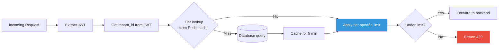
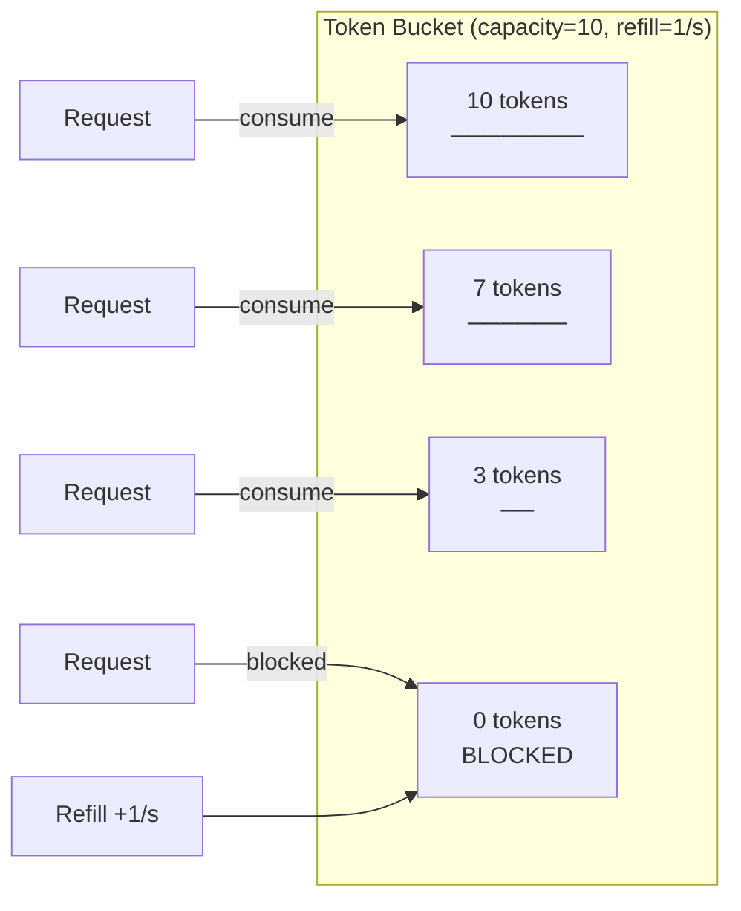

# Rate Limiting Strategy

Gateway and Auth service rate limiting policies, configuration, and best practices.

---

## Overview

GGID enforces rate limiting at multiple layers:

| Layer | Scope | Purpose |
|-------|-------|---------|
| Gateway (IP) | Per client IP | Protect against brute-force, credential stuffing |
| Gateway (Tenant) | Per tenant ID | Prevent noisy-neighbor problems |
| Auth Service | Per username/IP | Login attempt throttling |

---

## Gateway Rate Limits

### Default Limits

| Endpoint Pattern | Limit | Window | Scope |
|------------------|-------|--------|-------|
| `POST /auth/login` | 5 | minute | per IP |
| `POST /auth/register` | 3 | minute | per IP |
| `POST /auth/password/forgot` | 3 | minute | per IP |
| `POST /auth/magic-link` | 3 | minute | per IP |
| `POST /auth/password/reset` | 5 | minute | per IP |
| `POST /auth/mfa/login` | 5 | minute | per IP |
| `GET /api/v1/*` | 100 | minute | per IP |
| `POST /api/v1/*` | 60 | minute | per IP |
| `PUT/PATCH/DELETE /api/v1/*` | 30 | minute | per IP |
| `GET /oauth/authorize` | 30 | minute | per IP |
| `POST /oauth/token` | 30 | minute | per IP |
| `GET /scim/v2/*` | 100 | minute | per IP |
| `POST/PUT/DELETE /scim/v2/*` | 30 | minute | per IP |

### Algorithm: Fixed Window

```go
// Gateway uses a fixed-window counter per (IP, endpoint_pattern)
key := fmt.Sprintf("ratelimit:%s:%s", ip, pattern)
count := redis.Incr(key)
if count == 1 { redis.Expire(key, 60*time.Second) }
if count > limit { return 429 }
```

### 429 Response

```json
{
  "error": "rate limit exceeded",
  "code": "RATE_LIMITED",
  "retry_after": 60
}
```

**Headers:**
```
Retry-After: 60
X-RateLimit-Limit: 5
X-RateLimit-Remaining: 0
X-RateLimit-Reset: 1720612860
```

---

## Auth Service: Login Failure Throttling

### Per-Username Locking

After consecutive failed login attempts for a specific username:

| Failed Attempts | Action |
|:--------------:|--------|
| 1-4 | Normal rejection (401) |
| 5 | Account temporarily locked (5 min cooldown) |
| 10 | Account locked (requires admin unlock) |

### Per-IP Throttling

The Gateway limits login attempts per IP at 5/minute, independent of username. This prevents trying many usernames from one IP (credential stuffing).

### Redis Key Structure

```
auth:fail:{tenant_id}:{username}     → failure count (TTL: 15 min)
auth:lock:{tenant_id}:{username}     → lock flag (TTL: 5 min or permanent)
auth:cooldown:{tenant_id}:{username} → cooldown timestamp
```

---

## Per-Tenant Rate Limiting

### Configure Tenant Limits

```bash
PUT /api/v1/tenants/{tenant_id}/rate-limit
{
  "requests_per_minute": 2000,
  "login_attempts_per_minute": 20
}
```

### Default Tenant Limits

| Plan | RPS | Login/min |
|------|:---:|:---------:|
| Free | 100 | 5 |
| Pro | 500 | 20 |
| Enterprise | 5000 | 100 |

---

## Multi-Instance Configuration

### Problem

In-memory rate limiting doesn't work across multiple Gateway replicas — each instance has its own counter.

### Solution: Redis-Backed Rate Limiting

```bash
# Enable shared rate limiting
GATEWAY_REDIS_RATELIMIT=true
REDIS_ADDR=redis:6379
```

All Gateway instances share rate limit counters via Redis `INCR` + `EXPIRE`.

### Alternative: Sticky Sessions

If Redis-backed limiting is unavailable, configure the load balancer with sticky sessions (by client IP) so the same IP always hits the same Gateway instance.

---

## Configuration

### Environment Variables

| Variable | Default | Description |
|----------|---------|-------------|
| `GATEWAY_RATE_LIMIT_ENABLED` | `true` | Enable/disable rate limiting |
| `GATEWAY_RATE_LIMIT_LOGIN` | `5` | Login attempts per minute |
| `GATEWAY_RATE_LIMIT_REGISTER` | `3` | Registrations per minute |
| `GATEWAY_RATE_LIMIT_API` | `100` | General API requests per minute |
| `GATEWAY_RATE_LIMIT_WINDOW` | `60` | Window size in seconds |
| `GATEWAY_REDIS_RATELIMIT` | `false` | Use Redis for shared counters |

### Programmatic Configuration

```go
config := gateway.RateLimitConfig{
    Enabled:          true,
    LoginLimit:       5,
    RegisterLimit:    3,
    APILimit:         100,
    WindowSeconds:    60,
    UseRedis:         true,
    RedisAddr:        "redis:6379",
}
```

---

## Best Practices

1. **Respect `Retry-After`** — Wait the specified duration before retrying
2. **Exponential backoff + jitter** — Don't retry all clients simultaneously
3. **Use webhooks instead of polling** — Reduce API calls
4. **Batch operations** — Use bulk import instead of individual creates
5. **Cache GET responses** — Reduce repeated identical queries
6. **Monitor rate limit hits** — Alert if hitting limits frequently (misconfigured client)
7. **Separate rate limits for SCIM** — Provisioning bursts shouldn't affect user-facing limits

---

## Monitoring

### Prometheus Metrics

| Metric | Description |
|--------|-------------|
| `ggid_rate_limit_hits_total{path}` | Counter of rate-limited requests |
| `ggid_rate_limit_remaining{path}` | Remaining requests in current window |
| `ggid_auth_failures_total{username}` | Login failure count |

### Alerting

```yaml
- alert: HighRateLimitHits
  expr: rate(ggid_rate_limit_hits_total[5m]) > 10
  for: 5m
  annotations:
    summary: "Rate limit rejections high — possible abuse or misconfigured client"

- alert: BruteForceDetected
  expr: rate(ggid_auth_failures_total[1m]) > 20
  for: 2m
  annotations:
    summary: "Possible brute-force attack — many login failures"
```

---

## Per-Endpoint Rate Limits (Complete Reference)

| Endpoint | Method | Default Limit | Key | Burst |
|----------|--------|---------------|-----|-------|
| `/api/v1/auth/login` | POST | 10/min | IP + username | 5 |
| `/api/v1/auth/register` | POST | 5/min | IP | 3 |
| `/api/v1/auth/refresh` | POST | 30/min | Token `jti` | 10 |
| `/api/v1/auth/logout` | POST | 10/min | User ID | 5 |
| `/api/v1/auth/password/change` | POST | 5/min | User ID | 3 |
| `/api/v1/auth/password/reset` | POST | 3/min | IP | 2 |
| `/api/v1/auth/mfa/*` | POST | 10/min | User ID | 5 |
| `/api/v1/auth/webauthn/*` | POST | 10/min | User ID | 5 |
| `/api/v1/users` | GET | 60/min | User ID | 20 |
| `/api/v1/users` | POST | 10/min | User ID | 5 |
| `/api/v1/users/:id` | GET | 60/min | User ID | 20 |
| `/api/v1/users/:id` | PATCH | 20/min | User ID | 10 |
| `/api/v1/users/:id` | DELETE | 5/min | User ID | 2 |
| `/api/v1/roles` | GET/POST | 30/min | User ID | 15 |
| `/api/v1/policies/check` | POST | 200/min | User ID | 50 |
| `/api/v1/orgs` | GET/POST | 30/min | User ID | 15 |
| `/api/v1/audit/events` | GET | 20/min | User ID | 10 |
| `/api/v1/audit/stream` | SSE | 5 conns | User ID | — |
| `/scim/v2/*` | * | 100/min | API key | 30 |
| `/healthz` | GET | Unlimited | — | — |
| `/.well-known/*` | GET | Unlimited | — | — |

---

## Tenant Tier Configuration

GGID supports per-tenant rate limit overrides via the tenant management API.

### Tier Definitions

| Tier | Login | Register | API Calls | SSE Streams |
|------|-------|----------|-----------|-------------|
| `free` | 10/min | 5/min | 60/min | 1 |
| `starter` | 20/min | 10/min | 120/min | 3 |
| `pro` | 50/min | 20/min | 300/min | 10 |
| `enterprise` | Custom | Custom | Custom | Unlimited |

### Configure Tenant Tier

```bash
# Set tenant tier
curl -X PUT http://localhost:8080/api/v1/tenants/00000000-0000-0000-0000-000000000001/rate-limits \
  -H "Authorization: Bearer $ADMIN_TOKEN" \
  -H "Content-Type: application/json" \
  -d '{
    "tier": "enterprise",
    "custom_limits": {
      "login_rpm": 200,
      "register_rpm": 50,
      "api_rpm": 1000,
      "sse_connections": 50
    }
  }'
```

### How Tier Resolution Works



---

## Redis Token Bucket Algorithm

GGID uses a **token bucket** algorithm backed by Redis for distributed rate limiting.

### How It Works

1. Each bucket starts with a **capacity** (burst size) of tokens
2. Tokens are **refilled** at a fixed rate (e.g., 1 token/second = 60 RPM)
3. Each request **consumes** 1 token
4. If no tokens available, request is **rejected** (429)



### Redis Lua Script (Atomic Operation)

```lua
-- token_bucket.lua
-- KEYS[1] = bucket key (e.g., "rate_limit:login:192.168.1.1")
-- ARGV[1] = capacity (burst)
-- ARGV[2] = refill_rate (tokens per second)
-- ARGV[3] = current_time (unix timestamp)
-- ARGV[4] = consumed (tokens to consume, usually 1)

local key = KEYS[1]
local capacity = tonumber(ARGV[1])
local refill_rate = tonumber(ARGV[2])
local now = tonumber(ARGV[3])
local consumed = tonumber(ARGV[4])

local bucket = redis.call('HMGET', key, 'tokens', 'last_refill')
local tokens = tonumber(bucket[1]) or capacity
local last_refill = tonumber(bucket[2]) or now

-- Refill tokens based on elapsed time
local elapsed = math.max(0, now - last_refill)
tokens = math.min(capacity, tokens + (elapsed * refill_rate))

-- Try to consume
if tokens >= consumed then
    tokens = tokens - consumed
    redis.call('HMSET', key, 'tokens', tokens, 'last_refill', now)
    redis.call('EXPIRE', key, math.ceil(capacity / refill_rate) + 60)
    return {1, math.floor(tokens)}  -- allowed, remaining
else
    redis.call('HMSET', key, 'tokens', tokens, 'last_refill', now)
    redis.call('EXPIRE', key, math.ceil(capacity / refill_rate) + 60)
    return {0, math.floor(tokens)}  -- denied, remaining
end
```

### Redis Key Structure

```
rate_limit:{endpoint_type}:{key_identifier}

Examples:
rate_limit:login:ip:192.168.1.100           # Per-IP login limit
rate_limit:login:user:alice@test.com        # Per-username login limit
rate_limit:register:ip:192.168.1.100        # Per-IP register limit
rate_limit:api:user:uuid-here               # Per-user API limit
rate_limit:tenant:tenant-uuid:api           # Per-tenant aggregate limit
rate_limit:scim:apikey:key-id               # Per-SCIM API key
```

TTL is set to `capacity / refill_rate + 60` seconds to auto-clean idle buckets.

---

## Client-Side 429 Handling

### Response Format

```json
HTTP/1.1 429 Too Many Requests
Content-Type: application/json
Retry-After: 30
X-RateLimit-Limit: 10
X-RateLimit-Remaining: 0
X-RateLimit-Reset: 1699999999

{
  "error": "rate limit exceeded",
  "code": "RATE_LIMIT_EXCEEDED",
  "retry_after_seconds": 30
}
```

### Retry Strategy (Exponential Backoff with Jitter)

```go
// Go example
func withRetry(ctx context.Context, fn func() (*http.Response, error)) (*http.Response, error) {
    maxRetries := 3
    baseDelay := time.Second

    for i := 0; i < maxRetries; i++ {
        resp, err := fn()
        if err != nil {
            return nil, err
        }

        if resp.StatusCode != 429 {
            return resp, nil
        }

        // Parse Retry-After header
        retryAfter := resp.Header.Get("Retry-After")
        delay, _ := strconv.Atoi(retryAfter)
        if delay == 0 {
            delay = int(baseDelay.Seconds()) * (1 << i) // exponential
        }

        // Add jitter (0-50% of delay)
        jitter := time.Duration(rand.Intn(delay*1000)/2) * time.Millisecond

        select {
        case <-time.After(time.Duration(delay)*time.Second + jitter):
        case <-ctx.Done():
            return nil, ctx.Err()
        }
    }

    return nil, fmt.Errorf("max retries exceeded")
}
```

```javascript
// Node.js example
async function withRetry(fn, maxRetries = 3) {
  for (let i = 0; i < maxRetries; i++) {
    const resp = await fn();

    if (resp.status !== 429) return resp;

    const retryAfter = parseInt(resp.headers.get('Retry-After') || '1', 10);
    const delay = retryAfter * 1000 + Math.random() * 500; // jitter

    await new Promise(resolve => setTimeout(resolve, delay));
  }

  throw new Error('Max retries exceeded');
}
```
