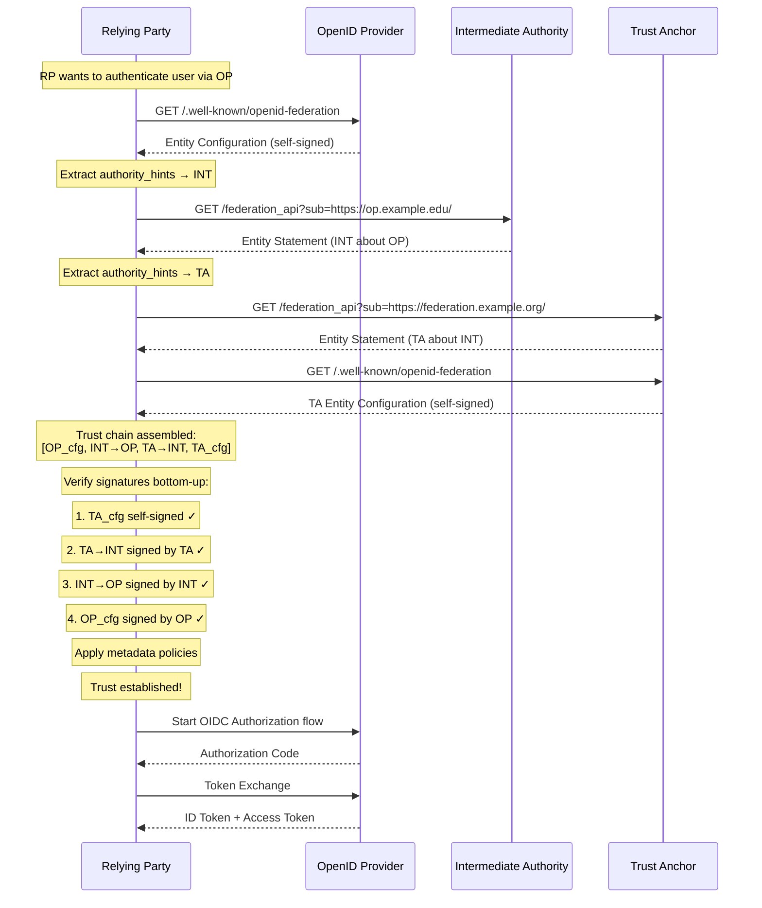

# OpenID Connect Federation 1.0 — Research & Integration Assessment

> **Status**: Research Document
> **Date**: 2025-07-10
> **Author**: GGID Team
> **Specification**: [OpenID Federation 1.0](https://openid.net/specs/openid-federation-1_0.html) (OpenID Foundation)

---

## Table of Contents

1. [Overview](#1-overview)
2. [Federation Architecture](#2-federation-architecture)
3. [Trust Chains and Entity Statements](#3-trust-chains-and-entity-statements)
4. [Metadata Discovery](#4-metadata-discovery)
5. [Entity Statement Deep-Dive](#5-entity-statement-deep-dive)
6. [Trust Chain Construction Example](#6-trust-chain-construction-example)
7. [Metadata Policy](#7-metadata-policy)
8. [Implementation Considerations](#8-implementation-considerations)
9. [Existing Implementations](#9-existing-implementations)
10. [GGID Integration Assessment](#10-ggid-integration-assessment)

---

## 1. Overview

### 1.1 The Problem: Bilateral Trust at Scale

In standard OAuth 2.0 / OpenID Connect, a Relying Party (RP) must be **pre-registered** with each OpenID Provider (OP) it wishes to use. For a small deployment with 3 OPs and 10 RPs, this means 30 registrations. But in real-world federations:

- **eduGAIN** connects 4,000+ Identity Providers to 5,000+ Service Providers across 80+ national federations
- **InCommon** (US higher education) has 1,000+ IdPs and 3,000+ SPs
- **eIDAS** (EU cross-border eID) connects national eID systems across 27+ member states
- **Healthcare networks** connect hospital systems, labs, insurers, and patient portals

Bilateral registration in these environments is **O(n x m)** in configuration effort — completely infeasible.

### 1.2 The Solution: Hierarchical Trust Federation

OIDC Federation introduces a **hierarchical trust model** where trust is established through signed statements forming a **trust chain** from a leaf entity (OP or RP) up to a mutually trusted **Trust Anchor (TA)**.

```
                    Trust Anchor (TA)
                   /                 \
          Intermediate Authority    Intermediate Authority
           /          \                    |          \
         OP-1         RP-1               OP-2        RP-2
```

Instead of registering RP-1 with OP-1 directly:
1. RP-1 presents its **trust chain** (RP-1 → Intermediate → TA)
2. OP-1 verifies the chain against a TA it already trusts
3. Trust is established **automatically** through cryptographic verification

**Key insight**: Both OP-1 and RP-1 trust the TA. The TA (or intermediate) vouches for each entity's identity and metadata. No bilateral registration needed.

### 1.3 Use Cases

| Use Case | Federation | Trust Anchor | Scale |
|---|---|---|---|
| **Research & Education** | eduGAIN | National federations (SWAMID, SURFconext, UK Federation) | 4,000+ IdPs, 5,000+ SPs |
| **US Higher Ed** | InCommon | Internet2 | 1,000+ IdPs, 3,000+ SPs |
| **Government / eID** | eIDAS 2.0 | EU eIDAS gateway | 27+ member states |
| **Enterprise Consortium** | B2B partnerships | Consortium root | Dozens to hundreds of orgs |
| **Healthcare** | NHIN / regional HIEs | National health authority | Hundreds of hospitals |
| **Finance (Open Banking)** | PSD2 / FAPI | Central bank registry | Thousands of banks + TPPs |

### 1.4 Specification Reference

The OIDC Federation 1.0 specification is published by the **OpenID Foundation** as a single comprehensive document:

- **Primary spec**: [OpenID Federation 1.0](https://openid.net/specs/openid-federation-1_0.html)

> **Note**: Some early documentation and discussions referenced the federation work in terms of three logical areas (architecture, trust chains, discovery). These are all covered within the single OpenID Federation 1.0 specification. The document was finalized after ~31 draft revisions and addresses all three areas cohesively.

The specification builds on these foundational RFCs:
- [RFC 7515](https://datatracker.ietf.org/doc/html/rfc7515) — JSON Web Signature (JWS)
- [RFC 7517](https://datatracker.ietf.org/doc/html/rfc7517) — JSON Web Key (JWK)
- [RFC 7519](https://datatracker.ietf.org/doc/html/rfc7519) — JSON Web Token (JWT)
- [RFC 8414](https://datatracker.ietf.org/doc/html/rfc8414) — OAuth 2.0 Authorization Server Metadata
- [RFC 8441](https://datatracker.ietf.org/doc/html/rfc8441) — OpenID Connect Discovery

---

## 2. Federation Architecture

### 2.1 Entity Types

Every participant in an OIDC Federation is an **Entity**. An entity is identified by a globally unique **Entity Identifier** — an HTTPS URL.

```
https://op.example.edu/
https://rp.example.com/
https://ta.swamid.se/
https://federation.incommon.org/
```

There are several entity roles:

| Role | Entity Type String | Description |
|---|---|---|
| **OpenID Provider** | `openid_provider` | Issues ID tokens, performs user authentication |
| **Relying Party** | `openid_relying_party` | Consumes ID tokens, relies on OP for authentication |
| **Trust Anchor** | `federation_entity` | Root of trust; signs statements about direct subordinates |
| **Intermediate Authority** | `federation_entity` | Delegates trust from TA to leaf entities; can apply metadata policies |
| **Federation Entity** | `federation_entity` | Generic role for any federation infrastructure entity |

A single entity can hold **multiple roles** simultaneously. For example, an entity could be both an OP and an Intermediate Authority.

### 2.2 Trust Hierarchy

```
Level 0:  ┌─────────────────────────────┐
          │      Trust Anchor (TA)      │
          │   e.g. https://ta.edugain.org │
          └──────────┬────────┬─────────┘
                     │        │
Level 1:  ┌──────────┴──┐  ┌──┴──────────┐
          │ Intermediate│  │ Intermediate │
          │ (SWAMID)    │  │ (InCommon)   │
          └──────┬──────┘  └──────┬──────┘
                 │                │
Level 2:  ┌──────┴────┐    ┌──────┴────┐
          │  OP       │    │  RP       │
          │  RP       │    │  OP       │
          └───────────┘    └───────────┘
```

The trust hierarchy has these properties:
- **Multi-level**: Arbitrary depth, though typically 2-4 levels
- **Multiple trust anchors**: An entity can be configured to trust multiple TAs
- **Cross-federation**: Entities can participate in multiple federations simultaneously
- **Self-signed root**: The Trust Anchor's entity configuration is self-signed (its `iss` equals its `sub`)

### 2.3 Trust Chain Concept

A **trust chain** is an ordered sequence of signed JWTs (Entity Statements) connecting a leaf entity to a Trust Anchor:

```
Trust Chain = [ EntityStatement_leaf, EntityStatement_intermediate, ..., EntityStatement_TA ]
```

Verification proceeds **bottom-up**: each statement is signed by the entity above it in the hierarchy. The final statement is the Trust Anchor's **self-signed** entity configuration.

### 2.4 Trust Marks

**Trust Marks** are additional certifications or verifications attached to an entity statement. They are signed JWTs issued by a Trust Mark Issuer (which may or may not be the same as the Trust Anchor).

Examples:
- "This OP has completed SAML2int profile certification"
- "This RP is GDPR-compliant"
- "This OP supports MFA for all users"
- "This entity is a member of the REFEDS Research and Scholarship category"

Trust marks contain:
- `id`: URI identifying the trust mark type
- `sub`: Entity the trust mark is about
- `iss`: Entity that issued the trust mark
- Signature by the Trust Mark Issuer's key

A Trust Anchor or Intermediate Authority can specify **which trust marks are required** for an entity to be trusted within the federation.

---

## 3. Trust Chains and Entity Statements

### 3.1 Entity Statements

An **Entity Statement** is a JWS-signed JWT containing metadata about an entity. There are two types:

1. **Entity Configuration (about-self)**: An entity's statement about itself, served at its own `/.well-known/openid-federation` endpoint. The `iss` equals the `sub`.
2. **Subordinate Statement (about-other)**: A statement by one entity about its subordinate. The `iss` is the parent, `sub` is the child.

Every entity statement is a JWT with the following claims:

| Claim | Required | Description |
|---|---|---|
| `iss` | Yes | Issuer — the entity making the statement (parent for subordinate statements, self for entity configurations) |
| `sub` | Yes | Subject — the entity the statement is about |
| `iat` | Yes | Issued At — Unix timestamp when the statement was created |
| `exp` | Yes | Expiration — Unix timestamp when the statement expires |
| `jwks` | Yes | JSON Web Key Set — public keys of the `sub` entity |
| `metadata` | No | Entity metadata (openid_provider, openid_relying_party, etc.) |
| `metadata_policy` | No | Policy applied to subordinate metadata (intermediate authorities only) |
| `constraints` | No | Constraints on metadata (e.g., allowed scopes, max auth age) |
| `trust_marks` | No | Array of trust mark JWTs issued to this entity |
| `authority_hints` | No | Array of URLs pointing to authorities that can issue statements about this entity |
| `crit` | No | Critical claims that must be understood |
| `policy_language_crit` | No | Critical policy operators that must be understood |

### 3.2 Entity Configuration (Self-Statement)

Every entity publishes its own configuration at:

```
GET https://<entity_id>/.well-known/openid-federation
```

For the entity `https://op.example.edu`, this returns a signed JWT where:
- `iss` = `https://op.example.edu`
- `sub` = `https://op.example.edu`
- Contains the entity's own metadata and public keys
- Contains `authority_hints` pointing to its parent(s) in the federation

### 3.3 Trust Chain Construction

Trust chain construction is the process of collecting entity statements from a leaf entity up to a Trust Anchor:

```
┌──────────────────────────────────────────────────────────────┐
│                    RP wants to trust an OP                    │
│                                                              │
│  1. RP fetches OP's Entity Configuration                     │
│     GET https://op.example.edu/.well-known/openid-federation │
│     → Returns OP's self-statement                            │
│     → Contains authority_hints → [https://fed.example.org]   │
│                                                              │
│  2. RP fetches statement about OP from the authority          │
│     GET https://fed.example.org/federation_api?               │
│         sub=https://op.example.edu                            │
│     → Returns statement signed by fed.example.org             │
│     → Contains authority_hints → [https://ta.example.org]     │
│                                                              │
│  3. RP fetches statement about Intermediate from TA          │
│     GET https://ta.example.org/federation_api?               │
│         sub=https://fed.example.org                           │
│     → Returns statement signed by ta.example.org              │
│     → authority_hints empty (TA is root)                      │
│                                                              │
│  4. RP fetches TA's Entity Configuration (self-signed)        │
│     GET https://ta.example.org/.well-known/openid-federation  │
│     → Self-signed root statement                             │
│                                                              │
│  5. Trust chain assembled:                                   │
│     [OP_config, Fed→OP_stmt, TA→Fed_stmt, TA_config]        │
│                                                              │
│  6. Verify signatures bottom-up using jwks from each level   │
└──────────────────────────────────────────────────────────────┘
```

**Optimization**: If the RP already knows and trusts the TA, steps 3-4 may be cached. The RP only needs:
- The leaf entity's configuration (step 1)
- Statements from each intermediate authority up to the TA

### 3.4 Trust Chain Verification Algorithm

```
Algorithm: VerifyTrustChain(chain, trust_anchor_id)

Input:
  chain: array of JWS-signed entity statements [leaf, intermediate, ..., TA_config]
  trust_anchor_id: URL of the Trust Anchor the RP trusts

Output:
  verified metadata for the leaf entity, or error

Steps:
1. Check that chain has at least 2 elements (leaf + at least TA self-config)
2. Verify the last element is self-signed by the Trust Anchor:
   a. Decode JWS header to get kid
   b. Look up key in last_statement.jwks using kid
   c. Verify JWS signature
   d. Verify iss == sub == trust_anchor_id
   e. Check exp > now

3. For i from chain.length-2 down to 0:
   a. Statement[i] was issued by the entity at chain[i+1]
      (i.e., chain[i].iss should == chain[i+1].sub)
   b. Verify chain[i].iss == chain[i+1].sub
   c. Decode JWS header of chain[i] to get kid
   d. Look up key in chain[i+1].jwks (the issuer's keys)
   e. Verify JWS signature of chain[i] using that key
   f. Check chain[i].exp > now
   g. If chain[i+1].metadata_policy exists, apply it to chain[0].metadata

4. Check authority_hints consistency:
   - Each statement's authority_hints should include the URL of its parent

5. Apply metadata_policy from each level (bottom-up through the chain):
   - Start with leaf metadata
   - Apply each intermediate's policy in order

6. Apply constraints from each level

7. Verify required trust_marks if specified

8. Return the final merged metadata
```

### 3.5 Key Rotation

Key rotation is handled through **short-lived entity statements**:

- Entity statements typically have `exp` set 1-7 days after `iat`
- Each statement contains the entity's current `jwks` (public keys)
- Private keys are rotated independently of statement expiration
- **Overlap period**: During rotation, an entity includes both old and new keys in `jwks`
- Clients re-fetch entity configurations periodically (every few hours to once per day)
- If a key is compromised, the authority can immediately stop publishing statements about the affected entity (or publish a statement with an empty `jwks`)

**Rotation sequence**:
```
Day 1:  Entity generates new keypair (key_B)
        jwks = {key_A, key_B}  // overlap period starts
Day 7:  jwks = {key_B}        // key_A removed
        // Any cached statements with only key_A now expire
```

### 3.6 Federation Entity ID

Every entity in a federation is identified by an **Entity Identifier** — an HTTPS URL:

- `https://op.university.edu/` (OpenID Provider)
- `https://research-portal.example.org/` (Relying Party)
- `https://federation.swamid.se/` (Intermediate Authority)
- `https://ta.edugain.org/` (Trust Anchor)

The Entity ID serves as:
1. **Unique identifier**: Globally unique within and across federations
2. **Discovery endpoint base**: `entity_id + /.well-known/openid-federation`
3. **`iss` and `sub` in entity statements**: The URL is used verbatim in JWT claims
4. **TLS certificate subject**: Must have a valid TLS certificate for the HTTPS URL

---

## 4. Metadata Discovery

OIDC Federation defines several HTTP endpoints for discovering entities, fetching statements, and resolving metadata.

### 4.1 Entity Configuration Endpoint

```
GET /.well-known/openid-federation
```

Served by **every** entity at its own Entity ID URL. Returns the entity's self-signed configuration (Entity Configuration JWT).

**Request**:
```http
GET /.well-known/openid-federation HTTP/1.1
Host: op.example.edu
```

**Response**:
```http
HTTP/1.1 200 OK
Content-Type: application/entity-statement+jwt

eyJhbGciOiJSUzI1NiIsImtpZCI6IjFl...<compact JWS>
```

The response is a compact JWS (JWT) string. Content-Type is `application/entity-statement+jwt`.

### 4.2 Fetch Entity Statement Endpoint

Used to get a statement by one entity (`iss`) about another entity (`sub`):

```
GET <federation_api_endpoint>?sub=<subject_entity_id>
```

The `federation_api_endpoint` is discovered from the entity configuration's `metadata.federation_entity.federation_api_endpoint` field.

**Request**:
```http
GET /federation_api?sub=https%3A%2F%2Fop.example.edu%2F HTTP/1.1
Host: federation.swamid.se
```

**Response**:
```http
HTTP/1.1 200 OK
Content-Type: application/entity-statement+jwt

eyJhbGciOiJSUzI1NiIsImtpZCI6InN3YW1pZC1rZXk...<compact JWS>
```

If the authority has no statement about the requested subject, it returns `404 Not Found`.

### 4.3 Resolve Endpoint (Metadata Aggregation)

The **resolve** endpoint performs the full trust chain resolution server-side and returns the final, merged metadata:

```
GET <federation_api_endpoint>/resolve?sub=<leaf_entity_id>
```

or using a separate path:

```
GET /resolve?sub=https%3A%2F%2Fop.example.edu%2F
```

This is a **convenience endpoint** — instead of the RP fetching multiple statements and building the chain itself, the authority server does the work and returns:
- The resolved trust chain (array of JWTs)
- The merged metadata (after applying all metadata policies)

**Response**:
```json
{
  "resolved_metadata": {
    "openid_provider": {
      "issuer": "https://op.example.edu/",
      "authorization_endpoint": "https://op.example.edu/authorize",
      "token_endpoint": "https://op.example.edu/token",
      "jwks_uri": "https://op.example.edu/jwks",
      "scopes_supported": ["openid", "profile", "email"],
      "response_types_supported": ["code"],
      "subject_types_supported": ["public", "pairwise"]
    }
  },
  "trust_chain": [
    "eyJhbG...<OP entity configuration>",
    "eyJhbG...<SWAMID statement about OP>",
    "eyJhbG...<eduGAIN statement about SWAMID>",
    "eyJhbG...<eduGAIN self-signed config>"
  ]
}
```

### 4.4 Listing Endpoint

Enumerates entities in the federation (subordinates of the authority):

```
GET <federation_api_endpoint>/list
```

Optional query parameters:
- `entity_type`: Filter by type (`openid_provider`, `openid_relying_party`)
- `trust_marked`: Filter by trust mark ID
- `trust_mark_issuer`: Filter by trust mark issuer

**Response**:
```json
{
  "entities": [
    "https://op.example.edu/",
    "https://op2.example.edu/",
    "https://rp.example.org/"
  ]
}
```

### 4.5 Trust Negotiation Status Endpoint

Returns whether trust can be established between two entities:

```
GET <federation_api_endpoint>/trust_negotiation?sub=<entity_a>&trust_anchor=<entity_b>
```

Returns the trust negotiation result including the trust chain if one exists.

### 4.6 Discovery Flow Summary

```
┌──────┐          ┌──────┐          ┌──────┐          ┌──────┐
│  RP  │          │  OP  │          │ Int. │          │  TA  │
└──┬───┘          └──┬───┘          └──┬───┘          └──┬───┘
   │                 │                 │                 │
   │ 1. GET /.well-known/openid-federation              │
   │────────────────>│                 │                 │
   │  Entity Config  │                 │                 │
   │<────────────────│                 │                 │
   │                 │                 │                 │
   │ 2. authority_hints → intermediate │                 │
   │    GET /federation_api?sub=OP    │                 │
   │─────────────────────────────────>│                 │
   │  Statement(OP) │                 │                 │
   │<─────────────────────────────────│                 │
   │                 │                 │                 │
   │ 3. authority_hints → TA          │                 │
   │    GET /federation_api?sub=Int.  │                 │
   │───────────────────────────────────────────────────>│
   │  Statement(Intermediate)         │                 │
   │<───────────────────────────────────────────────────│
   │                 │                 │                 │
   │ 4. Verify trust chain (local)    │                 │
   │    [OP_cfg, Int→OP, TA→Int]     │                 │
   │                 │                 │                 │
   │ 5. Start OIDC flow with merged   │                 │
   │    metadata                      │                 │
   │────────────────>│                 │                 │
   │                 │                 │                 │
```

---

## 5. Entity Statement Deep-Dive

### 5.1 Entity Configuration: Complete Example

Below is a complete Entity Configuration for an OpenID Provider, showing both the decoded JWT structure and the compact JWS representation.

#### JWS Header

```json
{
  "alg": "RS256",
  "kid": "op-signing-key-2025-01",
  "typ": "entity-statement+jwt"
}
```

#### JWS Payload (Entity Configuration)

```json
{
  "iss": "https://op.example.edu/",
  "sub": "https://op.example.edu/",
  "iat": 1720600800,
  "exp": 1720687200,

  "jwks": {
    "keys": [
      {
        "kty": "RSA",
        "use": "sig",
        "alg": "RS256",
        "kid": "op-signing-key-2025-01",
        "n": "0vx7agoebGcQSuuPiLJXZptN9nndrQmbXEps2aiAFbWhM78LhWx4cbbfA...",
        "e": "AQAB"
      },
      {
        "kty": "RSA",
        "use": "enc",
        "alg": "RSA-OAEP-256",
        "kid": "op-encryption-key-2025-01",
        "n": "xTpr9WamtmYGIQb7j9sZ7F3BkLpN2cV8hQrxYwK5aE...",
        "e": "AQAB"
      },
      {
        "kty": "EC",
        "crv": "P-256",
        "use": "sig",
        "kid": "op-ec-key-2025-01",
        "x": "MKBCTNIcKUSDii11ySs3526iDZ8AiTo7Tu6KPAqv7D4",
        "y": "4Etl6SRW2YhI2LUPa5dFvG8Er4SfAYU7Vy8a5xjMqD5"
      }
    ]
  },

  "metadata": {
    "openid_provider": {
      "issuer": "https://op.example.edu/",
      "authorization_endpoint": "https://op.example.edu/oauth2/authorize",
      "token_endpoint": "https://op.example.edu/oauth2/token",
      "userinfo_endpoint": "https://op.example.edu/oauth2/userinfo",
      "jwks_uri": "https://op.example.edu/oauth2/jwks",
      "scopes_supported": ["openid", "profile", "email", "offline_access"],
      "response_types_supported": ["code", "code id_token", "token"],
      "response_modes_supported": ["query", "fragment", "form_post", "jwt"],
      "grant_types_supported": [
        "authorization_code",
        "implicit",
        "refresh_token",
        "client_credentials"
      ],
      "subject_types_supported": ["public", "pairwise"],
      "id_token_signing_alg_values_supported": ["RS256", "ES256"],
      "token_endpoint_auth_methods_supported": [
        "client_secret_basic",
        "client_secret_post",
        "private_key_jwt",
        "none"
      ],
      "claims_supported": [
        "sub", "name", "given_name", "family_name",
        "email", "email_verified", "affiliation", "eduPersonScopedAffiliation"
      ],
      "request_object_signing_alg_values_supported": ["RS256", "ES256", "none"],
      "require_request_uri_registration": true
    },

    "federation_entity": {
      "organization_name": "Example University",
      "homepage_uri": "https://www.example.edu/",
      "policy_uri": "https://www.example.edu/privacy",
      "logo_uri": "https://www.example.edu/logo.png",
      "contacts": ["federation@example.edu"]
    }
  },

  "constraints": {
    "max_path_length": 1
  },

  "trust_marks": [
    {
      "id": "https://refeds.org/sirtfi",
      "trust_mark": "eyJhbGciOiJSUzI1NiIsImtpZCI6InJlZmVkcy10bSJ9..."
    },
    {
      "id": "https://refeds.org/category/research-and-scholarship",
      "trust_mark": "eyJhbGciOiJSUzI1NiIsImtpZCI6InJlZmVkcy10bS0yIn0..."
    }
  ],

  "authority_hints": [
    "https://federation.swamid.se/"
  ]
}
```

### 5.2 Subordinate Statement Example

When an Intermediate Authority issues a statement about a subordinate, the `iss` differs from `sub`:

#### JWS Header
```json
{
  "alg": "RS256",
  "kid": "swamid-federation-key-2025",
  "typ": "entity-statement+jwt"
}
```

#### Payload
```json
{
  "iss": "https://federation.swamid.se/",
  "sub": "https://op.example.edu/",
  "iat": 1720600800,
  "exp": 1720687200,

  "jwks": {
    "keys": [
      {
        "kty": "RSA",
        "kid": "op-signing-key-2025-01",
        "n": "0vx7agoebGcQSuuPiLJXZptN9nndrQmbXEps2aiAFbWhM78LhWx4...",
        "e": "AQAB"
      }
    ]
  },

  "metadata": {
    "openid_provider": {
      "organization_name": "Example University (SWAMID member)"
    }
  },

  "metadata_policy": {
    "openid_provider": {
      "contacts": {
        "add": ["federation-admin@swamid.se"]
      },
      "id_token_signing_alg_values_supported": {
        "essential": true,
        "one_of": ["RS256", "ES256"]
      },
      "scopes_supported": {
        "subset_of": ["openid", "profile", "email", "offline_access", "edu-scopes"]
      }
    }
  },

  "constraints": {
    "max_path_length": 0
  },

  "trust_marks": [
    {
      "id": "https://refeds.org/sirtfi",
      "trust_mark": "eyJhbGciOiJSUzI1NiIsImtpZCI6InN3YW1pZC10bSJ9..."
    }
  ],

  "authority_hints": [
    "https://ta.edugain.org/"
  ]
}
```

### 5.3 How Trust Marks Work

A Trust Mark is a **separately signed JWT** embedded within an entity statement. The trust mark itself is a JWS with:

```json
// Trust Mark Header
{
  "alg": "RS256",
  "kid": "refeds-tm-signing-key",
  "typ": "trust-mark+jwt"
}

// Trust Mark Payload
{
  "iss": "https://refeds.org/",
  "sub": "https://op.example.edu/",
  "id": "https://refeds.org/sirtfi",
  "iat": 1719794400,
  "exp": 1725040800,
  "logo_uri": "https://refeds.org/wp-content/uploads/sirtfi.png",
  "ref": "https://refeds.org/sirtfi/spec"
}
```

**Verification process**:
1. Extract `trust_mark` JWT from entity statement
2. Verify signature using the Trust Mark Issuer's keys (discovered from their entity configuration)
3. Check `sub` matches the entity the statement is about
4. Check `exp` hasn't expired
5. Optionally verify the Trust Mark Issuer is recognized by the Trust Anchor

**Common trust mark IDs**:
| ID | Issuer | Meaning |
|---|---|---|
| `https://refeds.org/sirtfi` | REFEDS | Security Incident Response Trust Framework |
| `https://refeds.org/category/research-and-scholarship` | REFEDS | R&S entity category |
| `https://refeds.org/category/personalized` | REFEDS | Provides personalized data |
| `https://refeds.org/category/anonymous` | REFEDS | Supports anonymous access |
| `https://refeds.org/category/pseudonymous` | REFEDS | Supports pseudonymous access |

---

## 6. Trust Chain Construction Example

### 6.1 Three-Entity Scenario

```
Entities:
  RP:   https://research-portal.example.org/   (Leaf, Relying Party)
  INT:  https://federation.example.org/         (Intermediate Authority)
  TA:   https://trust-anchor.example.com/       (Trust Anchor)
```

```
          TA (https://trust-anchor.example.com/)
          │
          ├── Statement about INT
          │
    INT (https://federation.example.org/)
          │
          ├── Statement about RP
          │
     RP (https://research-portal.example.org/)
```

### 6.2 RP Entity Configuration

```json
{
  "iss": "https://research-portal.example.org/",
  "sub": "https://research-portal.example.org/",
  "iat": 1720600800,
  "exp": 1720687200,
  "jwks": {
    "keys": [{
      "kty": "RSA",
      "kid": "rp-key-01",
      "n": "rp_public_key_modulus...",
      "e": "AQAB"
    }]
  },
  "metadata": {
    "openid_relying_party": {
      "client_name": "Research Portal",
      "redirect_uris": [
        "https://research-portal.example.org/callback"
      ],
      "response_types": ["code"],
      "grant_types": ["authorization_code"],
      "scope": "openid profile email",
      "token_endpoint_auth_method": "private_key_jwt",
      "jwks_uri": "https://research-portal.example.org/jwks"
    }
  },
  "authority_hints": [
    "https://federation.example.org/"
  ]
}
```

### 6.3 Intermediate's Statement About RP

```json
{
  "iss": "https://federation.example.org/",
  "sub": "https://research-portal.example.org/",
  "iat": 1720600800,
  "exp": 1720687200,
  "jwks": {
    "keys": [{
      "kty": "RSA",
      "kid": "rp-key-01",
      "n": "rp_public_key_modulus...",
      "e": "AQAB"
    }]
  },
  "metadata_policy": {
    "openid_relying_party": {
      "scope": {
        "essential": true,
        "subset_of": ["openid", "profile", "email", "offline_access"]
      },
      "response_types": {
        "essential": true,
        "one_of": ["code"]
      }
    }
  },
  "authority_hints": [
    "https://trust-anchor.example.com/"
  ]
}
```

### 6.4 TA's Statement About Intermediate

```json
{
  "iss": "https://trust-anchor.example.com/",
  "sub": "https://federation.example.org/",
  "iat": 1720600800,
  "exp": 1720687200,
  "jwks": {
    "keys": [{
      "kty": "RSA",
      "kid": "fed-int-key-01",
      "n": "fed_intermediate_public_key_modulus...",
      "e": "AQAB"
    }]
  },
  "metadata": {
    "federation_entity": {
      "organization_name": "Example Federation",
      "federation_api_endpoint": "https://federation.example.org/federation_api"
    }
  },
  "authority_hints": []
}
```

### 6.5 TA Self-Signed Entity Configuration

```json
{
  "iss": "https://trust-anchor.example.com/",
  "sub": "https://trust-anchor.example.com/",
  "iat": 1720600800,
  "exp": 1720946400,
  "jwks": {
    "keys": [{
      "kty": "RSA",
      "kid": "ta-root-key-01",
      "n": "ta_public_key_modulus...",
      "e": "AQAB"
    }]
  },
  "metadata": {
    "federation_entity": {
      "organization_name": "Example Trust Anchor",
      "federation_api_endpoint": "https://trust-anchor.example.com/federation_api"
    }
  },
  "constraints": {
    "max_path_length": 3
  }
}
```

### 6.6 Assembled Trust Chain

The complete trust chain is an **array of compact JWS strings**:

```json
[
  "eyJhbGciOiJSUzI1NiIsImtpZCI6InJwLWtleS0wMSJ9.eyJpc3MiOiJodHRwczovL3Jlc2VhcmNoLXBvcnRhbC5leGFtcGxlLm9yZy8iLCJzdWIiOiJodHRwczovL3Jlc2VhcmNoLXBvcnRhbC5leGFtcGxlLm9yZy8iLCJpYXQiOjE3MjA2MDA4MDAsImV4cCI6MTcyMDY4NzIwMCwiamWrcyI6eyJrZXlzIjpbeyJrdHkiOiJSU0EiLCJraWQiOiJycC1rZXktMDEiLCJuIjoicnBfcHVibGljX2tleV9tb2R1bHVzLi4uIiwiZSI6IkFRQUIifV19LCJtZXRhZGF0YSI6eyJvcGVuaWRfcmVseWluZ19wYXJ0eSI6eyJjbGllbnRfbmFtZSI6IlJlc2VhcmNoIFBvcnRhbCIsInJlZGlyZWN0X3VyaXMiOlsiaHR0cHM6Ly9yZXNlYXJjaC1wb3J0YWwuZXhhbXBsZS5vcmcvY2FsbGJhY2siXSwicmVzcG9uc2VfdHlwZXMiOlsiY29kZSJdLCJzY29wZSI6Im9wZW5pZCBwcm9maWxlIGVtYWlsIn19LCJhdXRob3JpdHlfaGludHMiOlsiaHR0cHM6Ly9mZWRlcmF0aW9uLmV4YW1wbGUub3JnLyJdfQ.signature...",
  "eyJhbGciOiJSUzI1NiIsImtpZCI6ImZlZC1pbnQta2V5LTAxIn0.eyJpc3MiOiJodHRwczovL2ZlZGVyYXRpb24uZXhhbXBsZS5vcmcvIiwic3ViIjoiaHR0cHM6Ly9yZXNlYXJjaC1wb3J0YWwuZXhhbXBsZS5vcmcvIiwiaWF0IjoxNzIwNjAwODAwLCJleHAiOjE3MjA2ODcyMDAsIm1ldGFkYXRhX3BvbGljeSI6e319.signature...",
  "eyJhbGciOiJSUzI1NiIsImtpZCI6InRhLXJvb3Qta2V5LTAxIn0.eyJpc3MiOiJodHRwczovL3RydXN0LWFuY2hvci5leGFtcGxlLmNvbS8iLCJzdWIiOiJodHRwczovL2ZlZGVyYXRpb24uZXhhbXBsZS5vcmcvIn0.signature...",
  "eyJhbGciOiJSUzI1NiIsImtpZCI6InRhLXJvb3Qta2V5LTAxIn0.eyJpc3MiOiJodHRwczovL3RydXN0LWFuY2hvci5leGFtcGxlLmNvbS8iLCJzdWIiOiJodHRwczovL3RydXN0LWFuY2hvci5leGFtcGxlLmNvbS8ifQ.signature..."
]
```

### 6.7 Verification Walkthrough

```
Trust Chain: [ RP_config, INT→RP_stmt, TA→INT_stmt, TA_config ]

Step 1: Verify TA_config (self-signed)
  ├─ TA_config.iss == TA_config.sub == "https://trust-anchor.example.com/" ✓
  ├─ Decode header → kid = "ta-root-key-01"
  ├─ Look up key in TA_config.jwks → found ✓
  ├─ Verify JWS signature with TA key ✓
  └─ Check exp > now ✓

Step 2: Verify TA→INT_stmt (signed by TA)
  ├─ TA→INT_stmt.iss == TA_config.sub ✓ (TA issued it)
  ├─ TA→INT_stmt.sub == INT entity_id ✓
  ├─ Decode header → kid = "ta-root-key-01"
  ├─ Look up key in TA_config.jwks → found ✓
  ├─ Verify JWS signature with TA key ✓
  └─ Check exp > now ✓

Step 3: Verify INT→RP_stmt (signed by INT)
  ├─ INT→RP_stmt.iss == TA→INT_stmt.sub ✓ (INT issued it)
  ├─ INT→RP_stmt.sub == RP entity_id ✓
  ├─ Decode header → kid = "fed-int-key-01"
  ├─ Look up key in TA→INT_stmt.jwks → found ✓
  ├─ Verify JWS signature with INT key ✓
  └─ Check exp > now ✓

Step 4: Verify RP_config (signed by RP itself)
  ├─ RP_config.iss == RP_config.sub ✓ (self-signed)
  ├─ RP_config.iss == INT→RP_stmt.sub ✓
  ├─ Decode header → kid = "rp-key-01"
  ├─ Look up key in INT→RP_stmt.jwks → found ✓
  ├─ Verify JWS signature with RP key ✓
  └─ Check exp > now ✓

Step 5: Apply metadata policies (top-down)
  ├─ TA constraints: max_path_length = 3, current chain length = 4 ✓
  ├─ INT metadata_policy on openid_relying_party:
  │   ├─ scope: essential, subset_of check → "openid profile email" ⊂ allowed ✓
  │   └─ response_types: essential, one_of check → "code" ∈ ["code"] ✓
  └─ Final merged metadata for RP returned ✓

Result: TRUST ESTABLISHED — RP metadata verified and merged
```

### 6.8 Verification Flow Diagram



---

## 7. Metadata Policy

### 7.1 Purpose

Intermediate Authorities can define **metadata policies** that modify the metadata of their subordinate entities. This allows federations to enforce standards without modifying individual entity configurations.

For example, SWAMID can mandate that all member OPs:
- Support specific signing algorithms (`RS256` or `ES256`)
- Only offer scopes from an approved set
- Include specific contact information

### 7.2 Policy Operators

The `metadata_policy` field uses a set of operators applied to specific metadata parameters:

| Operator | Description | Example Use Case |
|---|---|---|
| `value` | Sets the parameter to exactly this value (overwrites) | Force `token_endpoint_auth_method: "private_key_jwt"` |
| `values` | Sets the parameter to an array of values | Set `scopes_supported: ["openid", "profile"]` |
| `add` | Appends values to an existing array | Add a federation admin email to `contacts` |
| `default` | Sets value only if the parameter is not present | Default `grant_types: ["authorization_code"]` |
| `essential` | Marks the parameter as required (must be present) | Require `jwks_uri` to be present |
| `subset_of` | Parameter values must be a subset of this set | Limit scopes to approved set |
| `one_of` | Parameter value must be exactly one from this set | Require specific `response_type` |
| `superset_of` | Parameter values must include all of this set | Require `openid` scope to be present |
| `regex` | Parameter must match regex pattern | Enforce redirect_uri domain pattern |

### 7.3 Policy Examples

#### Example 1: Enforce security requirements

```json
{
  "metadata_policy": {
    "openid_provider": {
      "id_token_signing_alg_values_supported": {
        "essential": true,
        "one_of": ["RS256", "ES256"]
      },
      "token_endpoint_auth_signing_alg_values_supported": {
        "essential": true,
        "one_of": ["RS256", "ES256", "ES384"]
      },
      "scopes_supported": {
        "subset_of": [
          "openid", "profile", "email",
          "offline_access", "eduPersonScopedAffiliation"
        ]
      },
      "claims_supported": {
        "superset_of": ["sub", "iss", "aud", "exp", "iat"]
      },
      "token_endpoint_auth_methods_supported": {
        "one_of": ["private_key_jwt", "client_secret_basic"]
      }
    }
  }
}
```

#### Example 2: RP requirements

```json
{
  "metadata_policy": {
    "openid_relying_party": {
      "response_types": {
        "essential": true,
        "one_of": ["code"]
      },
      "grant_types": {
        "one_of": ["authorization_code"]
      },
      "scope": {
        "subset_of": ["openid", "profile", "email", "offline_access"],
        "essential": true
      },
      "token_endpoint_auth_method": {
        "value": "private_key_jwt",
        "essential": true
      },
      "redirect_uris": {
        "regex": "^https://[a-z0-9.-]+\\.example\\.org/callback$"
      }
    }
  }
}
```

#### Example 3: Add federation contacts

```json
{
  "metadata_policy": {
    "openid_provider": {
      "contacts": {
        "add": ["federation-admin@example.org", "security@example.org"]
      },
      "op_policy_uri": {
        "default": "https://federation.example.org/policy"
      },
      "op_tos_uri": {
        "default": "https://federation.example.org/tos"
      }
    }
  }
}
```

### 7.4 Policy Application Algorithm

Policies are applied **top-down** through the trust chain. Starting from the leaf entity's metadata, each intermediate authority's policy is applied in turn:

```
Algorithm: ApplyMetadataPolicies(chain)

Input: chain (array of entity statements from leaf to TA)

Steps:
1. Start with metadata = chain[0].metadata (leaf's metadata)

2. For each statement from chain[1] to chain[N-1]:
   a. If statement.metadata_policy exists:
      For each entity_type in metadata_policy:
        For each parameter in metadata_policy[entity_type]:
          Apply operators in this order:
            1. subset_of: Verify values are within allowed set
            2. one_of: Verify value is in allowed set
            3. superset_of: Verify required values are present
            4. regex: Verify value matches pattern
            5. value: Overwrite parameter with this value
            6. values: Overwrite parameter with array
            7. add: Append to existing array
            8. default: Set only if not already present
            9. essential: Verify parameter is present

3. After all policies applied, verify all essential parameters are present

4. Return final merged metadata
```

### 7.5 Policy Conflict Resolution

When multiple intermediate authorities have policies on the same parameter:
- Policies are applied **sequentially** from the outermost (closest to TA) to the innermost (closest to leaf)
- `value` and `values` operators overwrite — last applied wins
- `add` operators accumulate — values from all levels are merged
- `subset_of` / `one_of` operators create progressively tighter constraints (intersection)
- `regex` patterns are ANDed — all must match

---

## 8. Implementation Considerations

### 8.1 Trust Termination / Revocation

There is **no explicit revocation endpoint** in the OIDC Federation specification. Trust is terminated through:

1. **Statement expiration**: The most common method. Entity statements have short `exp` values (typically 1-7 days). To revoke an entity, the authority simply **stops publishing** a statement about it. Within hours, cached statements expire and trust is lost.

2. **Statement replacement**: The authority can publish a new statement with an **immediate expiration** (`exp` set to a past timestamp or very near future). This causes faster revocation than simply removing the statement.

3. **Key removal from jwks**: The authority can publish a statement with an **empty jwks** for the revoked entity, preventing signature verification.

4. **Trust mark revocation**: If the revocation reason is loss of a certification, the Trust Mark Issuer can stop publishing the trust mark. Entities that require the trust mark will reject the entity.

5. **Manual trust anchor removal**: An RP or OP can remove a Trust Anchor from its trusted list, breaking all trust chains rooted at that TA.

**Recommended revocation flow**:
```
Authority decides to revoke Entity X:

1. Immediately stop publishing statement about X
   → GET /federation_api?sub=X returns 404

2. Optionally publish a "tombstone" statement with exp in the past
   → Clients see immediate expiration on next fetch

3. Contact dependent entities if urgent
   → Federation operators may send notifications via mailing lists

4. Cache invalidation:
   → Clients with cached statements will fail on next validation
   → Max propagation time = client cache TTL (typically 1-6 hours)
```

### 8.2 Automatic Trust Chain Refresh

Entities should periodically refresh their cached trust chains:

| Parameter | Recommended Value | Rationale |
|---|---|---|
| Entity Configuration cache TTL | 1-6 hours | Balance staleness vs server load |
| Trust Chain cache TTL | 1-4 hours | Shorter for high-security federations |
| Statement fetch timeout | 5-10 seconds | Authority servers should respond fast |
| Retry on fetch failure | 3 retries with exponential backoff | Transient network errors |
| Pre-emptive refresh | At 80% of `exp` duration | Refresh before expiration |

```
Cache Management Pseudocode:

function GetCachedEntityConfig(entity_id):
    cached = cache.get(entity_id)
    if cached and cached.exp > now + safety_margin:
        return cached

    # Async refresh if within 80% of TTL
    if cached and cached.exp > now:
        async_refresh(entity_id)  # fire-and-forget
        return cached

    # Synchronous refresh
    stmt = fetch_entity_config(entity_id)
    cache.set(entity_id, stmt, ttl=stmt.exp - now)
    return stmt
```

### 8.3 Error Handling

| Error | Cause | Handling |
|---|---|---|
| **Entity Configuration 404** | Entity ID not valid or endpoint down | Log, skip entity, notify admin |
| **Invalid JWS signature** | Tampered statement or key rotation mismatch | Reject chain, force re-fetch of issuer keys |
| **Expired statement** | `exp < now` | Re-fetch statement; if still expired, reject |
| **Key not found in jwks** | `kid` mismatch after rotation | Re-fetch parent entity configuration for updated keys |
| **Broken authority_hints** | Parent entity unreachable | Try alternate authority hints if available |
| **metadata_policy violation** | Entity doesn't meet federation policy | Log violation, reject or warn based on policy severity |
| **max_path_length exceeded** | Trust chain too deep | Reject chain |
| **Missing required trust_mark** | Entity lacks required certification | Reject entity |
| **Network timeout** | Authority server slow/down | Retry with backoff, use cache if available |

### 8.4 Security Considerations

#### Key Compromise

**Scenario**: An attacker obtains an entity's private signing key.

**Mitigations**:
- Short `exp` on entity statements limits the window of abuse
- The parent authority can immediately stop publishing statements about the compromised entity
- Key rotation with overlap period ensures continuity without vulnerability gaps
- Multi-key `jwks` allows instant key disablement (remove compromised key, keep others)

**Impact**: Attacker can forge entity configurations for the compromised entity until statements expire. Cannot forge statements about other entities (those are signed by parent authorities with different keys).

#### Trust Anchor Compromise

**Scenario**: An attacker obtains the TA's private key.

**Mitigations**:
- TA keys should use HSM or KMS with access logging
- TA self-signed configuration should have the shortest practical `exp` (hours, not days)
- Federations should have a documented **emergency key rotation procedure**
- Multiple TAs can be configured to avoid single point of failure
- Clients should verify TA certificate chain (TLS) in addition to JWS signature

**Impact**: Catastrophic — attacker can forge statements for any entity in the federation. Requires all clients to update their trusted TA keys.

#### Downgrade Attacks

**Scenario**: An attacker strips intermediate authorities from the trust chain to bypass metadata policies.

**Mitigations**:
- The `constraints.max_path_length` field prevents chain shortening
- Entities can specify minimum required trust chain length
- Trust marks provide independent verification (attacker can't forge trust marks)
- Metadata policy enforcement happens at every level — removing a level removes its policy enforcement but also removes its authority (chain breaks)

**Defense-in-depth**: The verification algorithm checks that `chain[i].iss == chain[i+1].sub` for every element. You cannot skip levels without breaking the signature chain.

#### Replay Attacks

**Scenario**: An attacker captures a valid entity statement and replays it later.

**Mitigations**:
- `iat` and `exp` timestamps bound the validity period
- Statements include the entity's current public keys — if keys have been rotated, the replayed statement won't match
- `nonce` or `jti` could be added (though not standard) for replay prevention in specific flows

#### TLS / Transport Security

All federation endpoints use HTTPS. Additional considerations:
- Pin TA TLS certificates in addition to JWS verification
- Verify certificate chain for every HTTPS request
- Consider Certificate Transparency monitoring for TA domains
- Use HTTP/2 or HTTP/3 to reduce latency for multi-request discovery

---

## 9. Existing Implementations

### 9.1 Open Source Libraries

| Project | Language | Role | Status | Notes |
|---|---|---|---|---|
| [Satosa](https://github.com/SUNET/SATOSA) | Python | Proxy (SP↔IdP) | Production | SAML/OIDC federation proxy, widely used in eduGAIN |
| [pyoidc](https://github.com/CZ-NIC/pyoidc) | Python | OP/RP/Federation | Active | Full OIDC implementation including federation support |
| [oidc-federation](https://github.com/UniversitaDegliStudiDiNapoliParthenope/Selenium-oidc-federation) | Python | Test suite | Research | Academic reference implementation |
| [SimpleSAMLphp](https://github.com/simplesamlphp/simplesamlphp) | PHP | SP/IdP/Proxy | Production | Federation metadata support, OIDC federation module in development |
| [pyFF](https://github.com/IdentityPython/pyFF) | Python | Metadata aggregator | Production | SAML/MDQ aggregator, federation metadata pipeline |
| [eduTEAMS](https://eduteams.org/) | Service | Federation service | Production | GÉANT managed service using OIDC federation |
| [openid-federation-go](https://github.com/itsyouonline/oidc) | Go | Library | Experimental | Community Go implementation |
| [Keycloak](https://www.keycloak.org/) | Java | OP/IdP | In Progress | Federation support in development (KC OIDC Federation SPI) |

### 9.2 Test Suites and Conformance

| Tool | Description |
|---|---|
| [OIDF Federation Conformance Suite](https://www.oidf.org/federation/) | Official OpenID Foundation conformance testing |
| [SATOSA Federation Tests](https://github.com/SUNET/SATOSA/tree/master/tests) | Integration tests for Satosa proxy |
| [pyoidc tests](https://github.com/CZ-NIC/pyoidc/tree/master/tests) | Unit and integration tests for pyoidc |
| [REFEDS Test OP](https://refeds.org/test-op) | Test OpenID Provider for federation testing |
| [eduGAIN Metadata Validator](https://validator.edugain.org/) | Metadata validation for eduGAIN members |

### 9.3 Production Deployments

**eduGAIN**: The largest OIDC Federation deployment. Connects national research and education identity federations worldwide. Uses a multi-level hierarchy: eduGAIN TA → National Federation → Institutional IdP/SP. Transitioning from SAML metadata to OIDC Federation.

**InCommon**: US higher education federation operated by Internet2. Piloting OIDC Federation alongside existing SAML infrastructure.

**SWAMID**: Swedish national federation, early adopter of OIDC Federation. Operates an intermediate authority under eduGAIN.

**SURFconext**: Dutch national federation, production OIDC Federation deployment with Satosa proxy.

**GEANT eduTEAMS**: Managed OIDC Federation service for European research institutions.

---

## 10. GGID Integration Assessment

### 10.1 Current GGID Architecture

GGID is a Go microservices IAM suite with these services:

```
┌─────────────────────────────────────────────────────┐
│                    Gateway (:8080)                   │
│         JWT validation, routing, rate limiting       │
├──────┬──────┬──────┬──────┬──────┬──────┬───────────┤
│ Auth │OAuth │Ident │Policy│  Org │Audit │  Console   │
│:9001 │:9005 │:8081 │:8070 │:8071 │:8072 │   :3000   │
└──────┴──────┴──────┴──────┴──────┴──────┴───────────┘
         │      │      │
         │      │      ├── pkg/identity (user CRUD)
         │      │
         │      ├── services/oauth (OIDC server, token endpoint)
         │      │     ├── internal/conf (config)
         │      │     ├── internal/domain (models)
         │      │     ├── internal/repository (DB layer)
         │      │     ├── internal/server (HTTP handlers)
         │      │     └── internal/service (business logic)
         │      │
         │      └── pkg/authprovider (local, LDAP, social, SAML)
         │
         └── services/auth (registration, login, JWT, MFA)
               ├── pkg/social (9 OAuth2 connectors)
               └── pkg/saml (SAML SP support)
```

**Shared packages**: `pkg/` contains reusable libraries including crypto, tenant, errors, authprovider, social, saml, etc.

**Key capabilities already present**:
- OAuth 2.0 / OIDC server (`services/oauth`)
- Multi-tenant architecture (`pkg/tenant`)
- JWT issuance and validation (`services/gateway/middleware`)
- SAML support (`pkg/saml`)
- Social login connectors (`pkg/social`)
- API gateway with discovery and routing (`services/gateway`)

### 10.2 Required Changes

Adding OIDC Federation support requires changes across multiple services:

#### Service: OAuth (`services/oauth`)

| Change | Priority | Description |
|---|---|---|
| Entity Configuration endpoint | P0 | `GET /.well-known/openid-federation` — serve self-signed entity configuration JWT |
| Federation API endpoint | P0 | `GET /federation_api?sub=...` — serve subordinate entity statements |
| JWS signing of entity statements | P0 | Sign JWTs using existing RSA keys (`configs/rsa_private.pem`) |
| Trust chain verification engine | P0 | Verify chain signatures, apply metadata policies |
| Metadata policy engine | P1 | Apply `metadata_policy` operators (value, one_of, subset_of, etc.) |
| Trust mark verification | P1 | Verify embedded trust mark JWTs |
| Entity metadata storage | P0 | Store entity configurations, subordinate statements, trust anchor list |
| Automatic trust chain refresh | P1 | Background worker to refresh cached chains |

#### Service: Identity (`services/identity`)

| Change | Priority | Description |
|---|---|---|
| Entity metadata fields | P0 | Add `federation_entity_id`, `federation_metadata`, `federation_jwks` columns |
| Federation enrollment API | P1 | Admin API to register entities in the federation |
| Entity listing | P1 | API to list federation entities (for listing endpoint) |

#### Service: Gateway (`services/gateway`)

| Change | Priority | Description |
|---|---|---|
| Federation discovery routing | P0 | Route `/.well-known/openid-federation` to OAuth service |
| Federation API routing | P0 | Route `/federation_api` to OAuth service |
| Multi-tenant federation isolation | P1 | Per-tenant trust anchor configuration |

#### Shared Package: `pkg/federation` (new)

| Component | Description |
|---|---|
| `entity_statement.go` | Entity statement JWT struct, marshaling, signing |
| `trust_chain.go` | Trust chain builder, verifier |
| `metadata_policy.go` | Metadata policy application engine |
| `discovery.go` | HTTP client for federation endpoints |
| `cache.go` | Entity configuration/statement cache with TTL |
| `trust_mark.go` | Trust mark verification |
| `jwks.go` | JWK set management and key lookup |

### 10.3 Architecture Proposal

```
                    ┌──────────────────────────────────┐
                    │     pkg/federation (NEW)          │
                    │  ┌────────────┬────────────────┐  │
                    │  │TrustChain  │ MetadataPolicy │  │
                    │  │Verifier    │ Engine         │  │
                    │  ├────────────┼────────────────┤  │
                    │  │EntityStmt  │ Discovery      │  │
                    │  │Builder     │ Client         │  │
                    │  ├────────────┼────────────────┤  │
                    │  │TrustMark   │ JWKS Manager   │  │
                    │  │Verifier    │ + Cache        │  │
                    │  └────────────┴────────────────┘  │
                    └──────┬───────────────┬────────────┘
                           │               │
              ┌────────────┴───┐   ┌───────┴────────────┐
              │  services/oauth│   │ services/gateway   │
              │                │   │                    │
              │  ┌──────────┐  │   │ ┌────────────────┐ │
              │  │Entity    │  │   │ │ Federation     │ │
              │  │Config    │──┼───┼─┤ Discovery      │ │
              │  │Endpoint  │  │   │ │ Routes         │ │
              │  └──────────┘  │   │ └────────────────┘ │
              │  ┌──────────┐  │   │ ┌────────────────┐ │
              │  │Federation│  │   │ │ Multi-tenant   │ │
              │  │API       │  │   │ │ Trust Anchor   │ │
              │  │Endpoint  │  │   │ │ Config         │ │
              │  └──────────┘  │   │ └────────────────┘ │
              │  ┌──────────┐  │   └────────────────────┘
              │  │Trust Chain│ │
              │  │Resolver   │  │
              │  └──────────┘  │
              └────────────────┘
```

### 10.4 Phased Roadmap

#### Phase 1: Foundation (pkg/federation + Discovery)

**Goal**: Serve and consume entity configurations.

- [ ] Create `pkg/federation` package
- [ ] Implement `EntityStatement` struct with JWT signing/verification
- [ ] Implement entity configuration endpoint handler
- [ ] Implement federation API endpoint handler (subordinate statement serving)
- [ ] Add migration: `federation_entities` table (entity_id, role, metadata, jwks, trust_anchor_id, tenant_id)
- [ ] Wire `/.well-known/openid-federation` route through gateway
- [ ] Wire `/federation_api` route through gateway
- [ ] Unit tests for entity statement signing/verification
- [ ] Integration test: self-signed entity configuration round-trip

**Deliverable**: GGID can serve as an OP in a federation, responding to entity configuration and statement requests.

#### Phase 2: Trust Chain Verification

**Goal**: Verify trust chains from external entities.

- [ ] Implement trust chain builder (collect statements from leaf to TA)
- [ ] Implement signature verification algorithm (bottom-up)
- [ ] Implement federation discovery HTTP client (fetch entity configs and statements)
- [ ] Implement entity configuration/statement cache with TTL
- [ ] Add trust anchor configuration (admin API to add/remove trusted TAs)
- [ ] Integration test: verify a 3-entity trust chain
- [ ] Error handling: expired statements, key mismatch, broken hints

**Deliverable**: GGID can verify external entities' trust chains before establishing OAuth flows.

#### Phase 3: Metadata Policy Engine

**Goal**: Enforce federation metadata policies.

- [ ] Implement all policy operators: `value`, `values`, `add`, `default`, `essential`, `subset_of`, `one_of`, `superset_of`, `regex`
- [ ] Implement policy application algorithm (top-down through chain)
- [ ] Add policy validation endpoint (admin can preview applied policies)
- [ ] Integration test: verify metadata policy enforcement
- [ ] Policy conflict resolution tests

**Deliverable**: GGID enforces intermediate authority metadata policies on all federation entities.

#### Phase 4: Trust Marks & Federation Admin

**Goal**: Full trust mark support and federation management UI.

- [ ] Implement trust mark verification (verify embedded trust mark JWTs)
- [ ] Add trust mark requirements in entity metadata
- [ ] Console UI: Federation management page
  - Entity enrollment form
  - Trust anchor configuration
  - Trust mark management
  - Entity listing and status
- [ ] Federation listing endpoint
- [ ] Resolve endpoint (server-side metadata aggregation)
- [ ] End-to-end test: full federation flow

**Deliverable**: GGID can operate as a Trust Anchor, Intermediate Authority, or leaf entity with full management UI.

#### Phase 5: Production Hardening

**Goal**: Production-ready federation support.

- [ ] Background trust chain refresh worker
- [ ] Metrics: chain verification latency, cache hit rate, policy violations
- [ ] Audit logging: all federation operations logged to audit service
- [ ] Key rotation automation
- [ ] Conformance testing with OIDF suite
- [ ] Documentation: federation deployment guide
- [ ] Multi-tenant federation isolation (per-tenant trust anchors)
- [ ] Rate limiting on federation endpoints

**Deliverable**: Production-grade OIDC Federation support, ready for eduGAIN or enterprise federation deployment.

### 10.5 Estimated Effort

| Phase | Duration | Dependencies |
|---|---|---|
| Phase 1: Foundation | 1-2 weeks | None |
| Phase 2: Trust Chain Verification | 1-2 weeks | Phase 1 |
| Phase 3: Metadata Policy Engine | 1 week | Phase 2 |
| Phase 4: Trust Marks & Admin UI | 1-2 weeks | Phase 3 |
| Phase 5: Production Hardening | 1-2 weeks | Phase 4 |
| **Total** | **5-9 weeks** | |

### 10.6 Data Model

```sql
-- Federation entities (OPs, RPs, intermediaries that GGID manages)
CREATE TABLE federation_entities (
    id              UUID PRIMARY KEY DEFAULT gen_random_uuid(),
    tenant_id       UUID NOT NULL REFERENCES tenants(id),
    entity_id       TEXT NOT NULL UNIQUE,  -- HTTPS URL
    entity_type     TEXT NOT NULL,          -- openid_provider, openid_relying_party, federation_entity
    role            TEXT NOT NULL,          -- leaf, intermediate, trust_anchor
    metadata        JSONB NOT NULL DEFAULT '{}',
    jwks            JSONB NOT NULL,         -- Public keys
    trust_marks     JSONB DEFAULT '[]',     -- Array of trust mark JWTs
    authority_hints JSONB DEFAULT '[]',     -- Parent entity IDs
    status          TEXT DEFAULT 'active',  -- active, suspended, revoked
    created_at      TIMESTAMPTZ DEFAULT NOW(),
    updated_at      TIMESTAMPTZ DEFAULT NOW()
);

-- Trust anchors GGID trusts (for verifying external entities)
CREATE TABLE federation_trust_anchors (
    id              UUID PRIMARY KEY DEFAULT gen_random_uuid(),
    tenant_id       UUID NOT NULL REFERENCES tenants(id),
    entity_id       TEXT NOT NULL,          -- TA entity ID
    entity_config   TEXT NOT NULL,          -- Cached self-signed config JWT
    name            TEXT NOT NULL,
    jwks            JSONB NOT NULL,         -- TA public keys
    metadata_policy JSONB DEFAULT '{}',
    constraints     JSONB DEFAULT '{}',
    fetched_at      TIMESTAMPTZ DEFAULT NOW(),
    expires_at      TIMESTAMPTZ,
    UNIQUE(tenant_id, entity_id)
);

-- Cached entity statements (from external authorities)
CREATE TABLE federation_entity_statements (
    id              UUID PRIMARY KEY DEFAULT gen_random_uuid(),
    tenant_id       UUID NOT NULL REFERENCES tenants(id),
    issuer_id       TEXT NOT NULL,          -- Entity that signed the statement
    subject_id      TEXT NOT NULL,          -- Entity the statement is about
    statement_jwt   TEXT NOT NULL,          -- Full JWS compact serialization
    jwks            JSONB NOT NULL,         -- Subject's public keys from statement
    authority_hints JSONB DEFAULT '[]',
    fetched_at      TIMESTAMPTZ DEFAULT NOW(),
    expires_at      TIMESTAMPTZ NOT NULL,   -- From statement exp claim
    UNIQUE(tenant_id, issuer_id, subject_id)
);

-- Indexes
CREATE INDEX idx_fed_entities_tenant ON federation_entities(tenant_id);
CREATE INDEX idx_fed_entities_type ON federation_entities(entity_type);
CREATE INDEX idx_fed_anchors_tenant ON federation_trust_anchors(tenant_id);
CREATE INDEX idx_fed_stmts_subject ON federation_entity_statements(subject_id);
CREATE INDEX idx_fed_stmts_expires ON federation_entity_statements(expires_at);
```

### 10.7 Go Package Structure

```
pkg/federation/
├── entity_statement.go       # EntityStatement struct, JWT marshal/unmarshal, sign/verify
├── entity_statement_test.go
├── trust_chain.go            # TrustChain builder, verifier
├── trust_chain_test.go
├── metadata_policy.go        # Policy operators and application engine
├── metadata_policy_test.go
├── discovery.go              # HTTP client for federation endpoints
├── discovery_test.go
├── cache.go                  # TTL-based cache for entity configs and statements
├── cache_test.go
├── trust_mark.go             # Trust mark verification
├── trust_mark_test.go
├── jwks.go                   # JWK set management, key lookup by kid
├── jwks_test.go
├── errors.go                 # Federation-specific error types
├── types.go                  # Shared type definitions
└── doc.go                    # Package documentation
```

### 10.8 Key Design Decisions

1. **Reuse existing crypto**: GGID already has RSA key management (`configs/rsa_private.pem`). Federation entity statements can use the same keys with different `kid` values.

2. **Multi-tenant isolation**: Each tenant can have its own trust anchors and federation entities. The `tenant_id` column in all tables ensures isolation.

3. **Cache-first architecture**: All external entity configurations and statements are cached in PostgreSQL with TTL. The background refresh worker updates caches before expiration.

4. **Policy as code**: Metadata policies are stored as JSONB and applied at runtime. This allows federation administrators to update policies without redeployment.

5. **Gateway routing**: All federation endpoints are routed through the gateway, benefiting from existing rate limiting, JWT validation (for admin endpoints), and audit logging.

---

## Appendix A: Glossary

| Term | Definition |
|---|---|
| **Entity** | Any participant in an OIDC Federation, identified by an HTTPS URL |
| **Entity Configuration** | An entity's self-signed statement about itself |
| **Entity Statement** | A signed JWT containing metadata and public keys for an entity |
| **Trust Anchor (TA)** | The root of trust in a federation; entities implicitly trust the TA |
| **Intermediate Authority** | An entity between the TA and leaf entities; can apply metadata policies |
| **Trust Chain** | Ordered sequence of entity statements from leaf to TA |
| **Trust Mark** | A separately signed certification attached to an entity statement |
| **Federation** | A group of entities that share a common trust model |
| **Metadata Policy** | Rules applied by authorities to modify/validate subordinate metadata |
| **RP** | Relying Party — an application that relies on an OP for authentication |
| **OP** | OpenID Provider — an entity that authenticates users and issues ID tokens |

## Appendix B: Reference Links

- [OpenID Federation 1.0 Specification](https://openid.net/specs/openid-federation-1_0.html)
- [OpenID Connect Core 1.0](https://openid.net/specs/openid-connect-core-1_0.html)
- [OpenID Connect Discovery 1.0](https://openid.net/specs/openid-connect-discovery-1_0.html)
- [RFC 7515 — JSON Web Signature (JWS)](https://datatracker.ietf.org/doc/html/rfc7515)
- [RFC 7517 — JSON Web Key (JWK)](https://datatracker.ietf.org/doc/html/rfc7517)
- [RFC 7519 — JSON Web Token (JWT)](https://datatracker.ietf.org/doc/html/rfc7519)
- [RFC 8414 — OAuth 2.0 Authorization Server Metadata](https://datatracker.ietf.org/doc/html/rfc8414)
- [eduGAIN Federation](https://edugain.org/)
- [InCommon Federation](https://www.incommon.org/)
- [REFEDS](https://refeds.org/)
- [Satosa Project](https://github.com/SUNET/SATOSA)
- [pyoidc Project](https://github.com/CZ-NIC/pyoidc)
- [SimpleSAMLphp](https://simplesamlphp.org/)

---

*This document is a research artifact for GGID project planning. It reflects the OpenID Federation 1.0 specification as of its final publication by the OpenID Foundation.*
