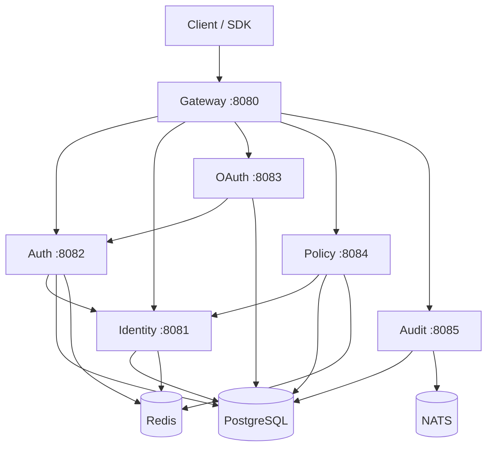

# README & Quickstart Guide: Research and Draft Content for GGID

> **Focus**: Professional README.md for GitHub — project description, features, architecture, quickstart, screenshots plan, comparison table, badges, contributing guide, and roadmap.
>
> **Author**: ggcxf (researcher) | **Date**: 2026-07-17 | **Status**: Research Complete

---

## 1. Recommended README.md Content Plan

### Structure

```
README.md
├── Badges (build, coverage, Go version, license)
├── Title + tagline
├── Feature highlights (bullet list, 10 items)
├── Architecture diagram (Mermaid)
├── Quickstart (5 minutes: Docker → login → API call)
├── Feature matrix (80+ features in categories)
├── Comparison table (vs Auth0/Okta/Keycloak/Auth0)
├── Screenshots (4-6 Console pages)
├── SDK table (11 languages)
├── Documentation links
├── Contributing guide link
├── Roadmap summary
├── License (Apache 2.0)
└── Community (Slack, GitHub Discussions)
```

### License Recommendation: Apache 2.0

- Most permissive while including patent grant
- Compatible with enterprise adoption
- Used by Kubernetes, Istio, gRPC
- Better than MIT (no patent clause) or AGPL (viral)

---

## 2. Actual README.md Draft

```markdown
# GGID — Open Source Identity & Access Management Platform

[](https://github.com/topcheer/ggid/actions)
[](https://golang.org)
[](LICENSE)
[]()

> Enterprise-grade IAM with Zero Trust, OAuth 2.1, ReBAC, ITDR, and AI Agent Identity — built in Go.

## Why GGID?

GGID is the only open-source IAM evolving into a **Zero Trust platform** with:
- **OAuth 2.1** with PKCE, DPoP, PAR, JAR, RAR, Token Exchange (RFC 8693)
- **ReBAC** (Zanzibar-style) + **ABAC** fine-grained authorization
- **ITDR** with MITRE ATT&CK mapping (15 detection rules)
- **AI Agent Identity** — first-class agent principals with delegated access
- **Verifiable Credentials** (W3C DID/VC) with OID4VCI/OID4VP
- **Adaptive Authentication** with unified risk engine (5 signal categories)
- **SM2/SM3/SM4** China GM compliance
- **11 SDKs** (Go, Python, TypeScript, Java, C#, Rust, Ruby, PHP, Dart, React)

## Quickstart (5 Minutes)

### 1. Start GGID

```bash
docker-compose up -d
# Services: gateway(:8080), auth(:8082), identity(:8081), 
# oauth(:8083), policy(:8084), audit(:8085)
```

### 2. Create Admin User

```bash
curl -X POST http://localhost:8081/api/v1/identity/users \
  -H "Content-Type: application/json" \
  -d '{"email":"admin@corp.com","password":"Admin123!","name":"Admin"}'
```

### 3. Login & Get Token

```bash
TOKEN=$(curl -s -X POST http://localhost:8082/api/v1/auth/login \
  -H "Content-Type: application/json" \
  -d '{"username":"admin@corp.com","password":"Admin123!"}' | jq -r .access_token)
```

### 4. Create OAuth Client

```bash
curl -X POST http://localhost:8083/api/v1/oauth/clients \
  -H "Authorization: Bearer $TOKEN" \
  -d '{"client_name":"My App","redirect_uris":["http://localhost:3000/callback"]}'
```

### 5. Access Console

Open `http://localhost:8080` — login with admin@corp.com / Admin123!

## Architecture



## Feature Matrix

### Authentication
- [x] OAuth 2.1 (PKCE, PAR, JAR, DPoP)
- [x] OIDC (Discovery, UserInfo, Back-Channel Logout)
- [x] WebAuthn / FIDO2 / Passkeys
- [x] Passwordless (magic link, SMS)
- [x] MFA (TOTP, SMS, push, biometric)
- [x] Adaptive MFA (risk-based step-up)
- [x] SAML 2.0 federation
- [x] Social login (Google, GitHub, Microsoft, Apple)
- [x] China GM (SM2/SM3) signing

### Authorization
- [x] ReBAC (Zanzibar-style relationship-based)
- [x] ABAC (attribute-based conditions)
- [x] RAR (Rich Authorization Requests)
- [x] Token Exchange (RFC 8693, delegation chains)
- [x] Unified PDP (per-request authorization)
- [x] PostgreSQL Row-Level Security (tenant isolation)
- [x] PAM JIT (zero standing privilege)

### Security
- [x] ITDR (15 MITRE ATT&CK detection rules)
- [x] Risk Engine (5 signal categories, 20 types)
- [x] Impossible Travel detection
- [x] Device posture compliance
- [x] Hash-chained audit trail (tamper-evident)
- [x] DLP policies + egress PII redaction
- [x] CMK/KMS (7 providers: AWS/GCP/Azure/Vault/PKCS11/SM2)
- [x] DPoP proof-of-possession tokens

### Zero Trust
- [x] ZTNA Access Broker
- [x] Gateway PEP (per-request authz)
- [x] CAE continuous evaluation middleware
- [x] Secret Broker (zero-trust secret injection)
- [x] WASM plugin architecture (wazero)

### Platform
- [x] Multi-tenant with PostgreSQL RLS
- [x] Hash-chain audit (HMAC-SHA256)
- [x] SIEM/SOAR integration
- [x] Webhook engine (HMAC signed, retry, dead-letter)
- [x] Compliance automation (SOC2/ISO/NIST evidence)
- [x] DLP with data classification

### SDKs (11 Languages)
| Language | Status | Package |
|----------|--------|---------|
| Go | ✅ Production | go.mod |
| React | ✅ Production | npm |
| Java | ✅ Functional | Maven |
| C# | ✅ Functional | NuGet |
| TypeScript/Node | ⚠️ In progress | npm |
| Python | ⚠️ Minimal | PyPI |
| Rust | ⚠️ Skeleton | crates.io |
| Ruby | ⚠️ Skeleton | gem |
| PHP | ⚠️ Skeleton | Packagist |
| Dart | ⚠️ Skeleton | pub.dev |
| React Native | ⚠️ Minimal | npm |

## Comparison

| Feature | GGID | Auth0 | Okta | Keycloak |
|---------|------|-------|------|----------|
| Open Source | ✅ | Partial | ❌ | ✅ |
| License | Apache 2.0 | Proprietary | Proprietary | Apache 2.0 |
| Language | Go | Node.js | Java | Java |
| OAuth 2.1 | ✅ | ✅ | ✅ | Partial |
| ReBAC (Zanzibar) | ✅ | ❌ | ❌ | ❌ |
| ITDR | ✅ | Custom | Custom | ❌ |
| DPoP | ✅ | ❌ | ❌ | ❌ |
| China GM (SM2/3/4) | ✅ | ❌ | ❌ | ❌ |
| AI Agent Identity | ✅ | ❌ | ❌ | ❌ |
| VC/DID (W3C) | ✅ | ❌ | ❌ | Partial |
| Zero Trust (ZTNA) | ✅ | ❌ | ❌ | ❌ |
| SDKs | 11 | 8 | 7 | 3 |

## Documentation

- [Architecture](docs/research/zero-trust-maturity-assessment.md)
- [API Reference](https://ggid.corp.com/docs) (Swagger UI)
- [Quickstart Guide](docs/guides/)
- [Contributing](CONTRIBUTING.md)
- [Research Library](docs/research/) (40+ deep-dive documents)

## Contributing

```bash
# Setup
git clone https://github.com/topcheer/ggid.git
cd ggid
make docker-run   # Start PG + Redis + NATS
make migrate-up   # Apply migrations
make build        # Build all services
make test         # Run tests
```

See [CONTRIBUTING.md](CONTRIBUTING.md) for detailed guide.

## Roadmap

See [Kanban](docs/kanban.md) for 239 backlog items. Highlights:
- OpenAPI 3.1 spec generation + Swagger UI
- Multi-region active-active deployment
- GraphQL API layer
- EU Digital Identity Wallet (eIDAS 2.0)
- BBS+ selective disclosure
- Service mesh (Istio + microsegmentation)

## License

Apache License 2.0 — see [LICENSE](LICENSE).
```

---

## 3. Screenshot Plan

| Screenshot | Page | Purpose |
|-----------|------|---------|
| Dashboard | Console home | Shows metrics, active users, security overview |
| Security Overview | ZT posture | Shows pillar scores, compliance status |
| Risk Engine | Adaptive auth | Shows risk score distribution, signals |
| SOAR | Incident response | Shows detection → automated response |
| Audit Trail | Hash-chain | Shows tamper-evident event chain |
| OAuth Clients | Client management | Shows DCR, versioning, health |

---

## 4. Implementation Backlog

| # | Task | DoD | Effort |
|---|------|-----|--------|
| 1 | Write README.md | ✅ All sections ✅ Mermaid diagram renders ✅ Quickstart tested | 1d |
| 2 | Write CONTRIBUTING.md | ✅ Dev setup ✅ Test guide ✅ PR process | 1d |
| 3 | Add LICENSE file (Apache 2.0) | ✅ Full Apache 2.0 text | 0.5d |
| 4 | Capture screenshots (6 pages) | ✅ Real data ✅ High-res PNG | 1d |
| 5 | Add GitHub repo badges | ✅ CI badge ✅ Coverage badge ✅ License badge | 0.5d |

---

## References

- [Awesome README](https://github.com/matiassingers/awesome-readme) — Best practices
- [Apache 2.0 License](https://www.apache.org/licenses/LICENSE-2.0) — Full text
- [Mermaid Diagrams](https://mermaid-js.github.io/) — Text-based diagrams
- [shields.io](https://shields.io/) — Badges
- [GGID Kanban](../docs/kanban.md) — Roadmap source
