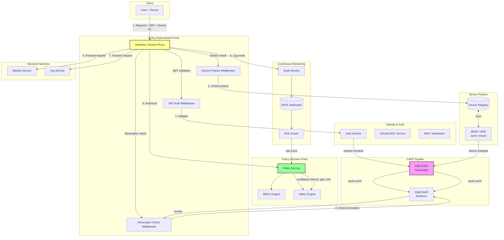

# Zero-Trust IAM Patterns

> **Research Document** — Architecture patterns, standards, and a practical roadmap for bringing Zero-Trust capabilities to GGID.

---

## Table of Contents

1. [Zero Trust Principles (NIST SP 800-207)](#1-zero-trust-principles-nist-sp-800-207)
2. [SPIFFE / SPIRE Framework](#2-spiffe--spire-framework)
3. [Google BeyondCorp Model](#3-google-beyondcorp-model)
4. [Continuous Authentication](#4-continuous-authentication)
5. [Device Posture Assessment](#5-device-posture-assessment)
6. [Zero-Trust for GGID Assessment](#6-zero-trust-for-ggid-assessment)
7. [Commercial ZT Solutions Comparison](#7-commercial-zt-solutions-comparison)
8. [Architecture Diagram](#8-architecture-diagram)
9. [References](#9-references)

---

## 1. Zero Trust Principles (NIST SP 800-207)

**NIST Special Publication 800-207** ("Zero Trust Architecture", published August 2020) is the definitive standard for zero-trust architecture. It defines zero trust through a set of **logical components** (Policy Decision Point, Policy Enforcement Point, trust algorithm) and seven fundamental tenets.

### The Seven Tenets

| # | Tenet | Summary |
|---|-------|---------|
| 1 | **All data sources and computing services are considered resources.** | Everything — databases, APIs, containers, SaaS apps, IoT devices — is a resource that must be protected, not just "endpoints." |
| 2 | **All communication is secured regardless of network location.** | Encryption (TLS/mTLS) is mandatory for all traffic, internal or external. Trust is never implied by network location (VPN, on-prem, cloud). |
| 3 | **Access to individual enterprise resources is granted on a per-session basis.** | Sessions are never implicitly trusted; each request is authenticated and authorized independently. Long-lived VPN tunnels are replaced by per-request verification. |
| 4 | **Access is determined by dynamic policy — identity, application/service, and device state.** | Policy evaluation incorporates who (identity), what (resource), how (device posture), and where (context — location, time, network). |
| 5 | **The enterprise monitors and measures the integrity and security posture of all owned and associated assets.** | Device health, patch level, and security status are continuously monitored — not checked once at enrollment. |
| 6 | **All resource authentication and authorization are dynamic and strictly enforced before access is allowed.** | Every access decision is made in real-time by the PDP, enforced by the PEP. No "trusted" sessions persist without re-evaluation. |
| 7 | **The enterprise collects as much information as possible about the current state of assets, network, and communications to improve its security posture.** | Continuous telemetry, logging, and analytics feed back into policy — enabling adaptive, risk-based decisions. |

### Core Philosophy

```
┌─────────────────────────────────────────────────────────────┐
│                    NEVER TRUST, ALWAYS VERIFY                │
│                                                             │
│   • No implicit trust based on network location             │
│   • No "trusted internal network" vs "untrusted external"   │
│   • Every request: authenticated → authorized → encrypted   │
│   • Least-privilege access, just-in-time, just-enough       │
│   • Assume breach — design for containment & detection      │
└─────────────────────────────────────────────────────────────┘
```

### Key Concepts

- **Trust Algorithm**: The PDP evaluates a trust score from signals (identity confidence, device posture, behavioral analytics, threat intelligence, resource sensitivity) and compares against the policy threshold for the requested resource.
- **Policy Decision Point (PDP)**: The brain — evaluates signals against policy, emits allow/deny/step-up decisions.
- **Policy Enforcement Point (PEP)**: The gate — sits in the data path (proxy, sidecar, SDK), enforces PDP decisions, denies unauthorized access.
- **Trust Tiers**: Resources are classified by sensitivity (e.g., Tier 1 = public, Tier 2 = internal, Tier 3 = sensitive, Tier 4 = highly restricted). Each tier requires progressively stronger signals for access.

---

## 2. SPIFFE / SPIRE Framework

**SPIFFE** (Secure Production Identity Framework for Everyone) and **SPIRE** (SPIFFE Runtime Environment) are CNCF graduated projects that provide a standardized framework for **workload identity** in cloud-native and microservices environments.

### The Problem SPIFFE Solves

In microservices architectures, services need to authenticate to each other (service-to-service mTLS). Traditional approaches (shared secrets, static certificates, IP-based trust) don't scale:
- Secrets leak, rotate poorly, and are hard to distribute.
- Static certificates expire and require manual renewal.
- IP addresses are ephemeral in cloud/K8s environments.

SPIFFE provides **cryptographic identity for workloads** — automatic, short-lived, attested, and verifiable.

### SPIFFE ID

A SPIFFE ID is a URI-formatted identifier that uniquely names a workload:

```
spiffe://<trust-domain>/<path>
```

Examples:
```
spiffe://prod.acme.com/payments/service
spiffe://staging.acme.com/ns/team-a/sa/backend-api
spiffe://cluster.internal/db/postgres-primary
```

- **Trust domain**: A cryptographic realm of trust (analogous to a DNS domain or a PKI root). Each trust domain has its own root CA.
- **Path**: An opaque, workload-defined identifier (often reflects deployment topology — namespace, service account, etc.).

### SVID Types (SPIFFE Verifiable Identity Document)

An **SVID** is the concrete cryptographic credential that proves a workload's SPIFFE identity.

| SVID Type | Format | Use Case | Lifetime |
|-----------|--------|----------|----------|
| **x509-SVID** | X.509 certificate with SPIFFE ID in SAN URI | Service-to-service **mTLS** — most common | Short-lived (minutes to hours) |
| **JWT-SVID** | JWT with SPIFFE ID in `sub` claim | **Token-based** authentication (HTTP headers, cloud APIs) | Short-lived (~5 min recommended) |
| **OIDC-SVID** | OIDC ID Token | **Federation** with external cloud providers (AWS IAM, GCP, Azure) | Provider-dependent |

```go
// x509-SVID SAN URI field example:
// URI: spiffe://prod.acme.com/payments/service
// This is placed in the X.509 Subject Alternative Name (SAN) extension.
```

### SPIRE Architecture

```
                    ┌──────────────────────────┐
                    │     SPIRE Server          │
                    │  (CA + Registration DB)   │
                    │                          │
                    │  • Signs SVIDs            │
                    │  • Manages trust bundles  │
                    │  • Defines attestation    │
                    │    policies               │
                    └────────┬──────────────────┘
                             │ gRPC (mTLS)
                             │
           ┌─────────────────┼──────────────────┐
           │                 │                  │
    ┌──────▼──────┐  ┌──────▼──────┐  ┌────────▼──────┐
    │ SPIRE Agent │  │ SPIRE Agent │  │ SPIRE Agent   │
    │  (Node A)   │  │  (Node B)   │  │  (Node C)     │
    │             │  │             │  │               │
    │ • Node      │  │ • Node      │  │ • Node        │
    │   attest.   │  │   attest.   │  │   attest.     │
    │ • Workload  │  │ • Workload  │  │ • Workload    │
    │   API (UDS) │  │   API (UDS) │  │   API (UDS)   │
    └──┬───┬───┬──┘  └──┬───┬─────┘  └────┬──────────┘
       │   │   │        │   │             │
    ┌──▼┐┌─▼┐┌─▼─┐   ┌──▼┐┌▼──┐        ┌──▼──┐
    │Svc││Svc││Svc│   │Svc││Svc│        │ Svc │
    │ A ││ B ││ C │   │ D ││ E │        │  F  │
    └───┘└───┘└───┘   └───┘└───┘        └─────┘
```

#### SPIRE Server
- Acts as the **Certificate Authority** for the trust domain.
- Maintains a **registration database** mapping workload selectors (e.g., K8s namespace + service account, Unix UID, AWS IID) to SPIFFE IDs.
- Signs SVIDs requested by agents and distributes trust bundles.

#### SPIRE Agent
- Runs on every node (host, VM, K8s node).
- **Node attestation**: Proves the node's identity to the server (using AWS IID, K8s PSAT, TPM, etc.).
- Exposes the **Workload API** via Unix Domain Socket (UDS).
- **Workload attestation**: When a local process connects to the Workload API, the agent introspects the process (via `syscall`, cgroup, SELinux labels) to determine selectors, then issues the appropriate SVID.

#### Workload API

The Workload API is the cornerstone — workloads get SVIDs **without any secrets baked into configuration**:

```go
// Example: fetching an x509-SVID via the Workload API (using go-spiffe v2)
package main

import (
    "context"
    "log"
    "os"
    "os/signal"
    "syscall"

    "github.com/spiffe/go-spiffe/v2/workloadapi"
)

func main() {
    // The Workload API is accessed via Unix Domain Socket
    // SPIRE Agent sets the address (default: /tmp/spire-agent/public/api.sock)
    ctx, cancel := signal.NotifyContext(context.Background(), syscall.SIGINT, syscall.SIGTERM)
    defer cancel()

    // Create an X.509 source — automatically rotates SVIDs before expiry
    source, err := workloadapi.NewX509Source(ctx,
        workloadapi.WithClientOptions(
            workloadapi.WithAddr("unix:///tmp/spire-agent/public/api.sock"),
        ),
    )
    if err != nil {
        log.Fatalf("Failed to create X.509 source: %v", err)
    }
    defer source.Close()

    // Get the current SVID
    svid, err := source.GetX509SVID()
    if err != nil {
        log.Fatalf("Failed to get SVID: %v", err)
    }

    log.Printf("Workload SPIFFE ID: %s", svid.ID)
    log.Printf("SVID expires at: %v", svid.Certificates[0].NotAfter)

    // Use source for mTLS — go-spiffe provides tls.Config helpers
    tlsConfig := workloadapi.MTLSClientConfig(source, []string{"spiffe://prod.acme.com/payments/receiver"})
    _ = tlsConfig // use with http.Client
    _ = os.Args
}
```

#### Workload Registrar
An optional component that automatically registers workloads with the SPIRE Server. In Kubernetes, the **K8s Workload Registrar** watches pod creation events and creates registration entries based on namespace + service account selectors.

### SPIFFE vs Traditional User-Centric IAM

| Dimension | Traditional IAM (GGID today) | SPIFFE/SPIRE |
|-----------|------------------------------|--------------|
| **Identity subject** | Human users | Workloads / services / pods |
| **Credential type** | Passwords, JWTs, OAuth tokens | x509-SVID, JWT-SVID |
| **Credential issuance** | User login flow | Automatic via Workload API |
| **Credential lifetime** | Hours to days | Minutes |
| **Authentication** | Central auth server validates | Peer-to-peer cryptographic verification |
| **Trust model** | Centralized (auth server as oracle) | Decentralized (any peer can verify via trust bundle) |
| **Secret distribution** | Config files, env vars, secrets managers | No secrets — SVIDs fetched on-demand |
| **Network encryption** | Optional / at edge | mTLS everywhere |

### Use Cases
- **Service-to-service mTLS** in microservices mesh (alternative to Istio/Linkerd internal certs)
- **Multi-cluster / multi-cloud identity** with federated trust domains
- **Secretless authentication** to databases and cloud APIs (e.g., AWS IAM Roles for Service Accounts)
- **Supply chain security** — attest build provenance via workload identity

---

## 3. Google BeyondCorp Model

**BeyondCorp** is Google's implementation of zero-trust access, developed internally starting in 2011 and publicly documented in a series of USENIX ;login: articles (2014–2017). It later evolved into the commercial product **BeyondCorp Enterprise**.

### Core Principles

1. **Eliminate network perimeter trust** — there is no "trusted corporate network." Access decisions are based entirely on identity + device + context, not IP address or VPN membership.
2. **Device + User + Context** — all three must be evaluated for every access decision:
   - **Device**: Is it managed? Patched? Encrypted? Running EDR?
   - **User**: Who are they? What's their role? Has their account been compromised?
   - **Context**: Where are they (geo)? What time is it? Is the network trusted? Is there anomalous behavior?
3. **Per-request access decisions** — access is evaluated for each individual request, not established once via VPN session.

### Access Proxy Architecture

BeyondCorp replaces the traditional VPN with a set of **Access Proxies**:

```
                   ┌─────────────────┐
                   │     User        │
                   │  (Corp Device)  │
                   └───────┬─────────┘
                           │ HTTPS
                           │
                   ┌───────▼─────────┐
                   │  Access Proxy   │  ← Replaces VPN
                   │  (Reverse Proxy)│
                   │                 │
                   │ • Validates JWT │
                   │ • Checks device │
                   │   trust         │
                   │ • Enforces ACLs │
                   └───┬───────┬─────┘
                       │       │
              ┌────────▼─┐  ┌──▼──────────┐
              │ Internal │  │ Internal    │
              │ App A    │  │ App B       │
              └──────────┘  └─────────────┘
```

Key design elements:
- The **Access Proxy** terminates TLS, validates user identity (via SSO/JWT), checks device trust certificates, and enforces access control lists before forwarding to the internal application.
- Users never have raw network access to internal services — only HTTP-level access through the proxy.
- **BeyondCorp Enterprise** generalizes this with Google's global edge network (Google Front Ends) acting as the proxy.

### Device Inventory and Trust Signals

BeyondCorp maintains a **Device Inventory** database that continuously tracks:
- Device certificate (issued at enrollment via MDM)
- OS version, patch level, security updates
- Disk encryption status
- EDR / antivirus status and health
- Managed vs unmanaged classification
- Device trust tier

These signals feed into the **Trust Engine** which assigns a **device trust score**.

### Resource Access Levels (Trust Tiers)

| Trust Tier | Required Signals | Example Resources |
|------------|-----------------|-------------------|
| **Tier 1** (Public) | None | Marketing site, public docs |
| **Tier 2** (Basic) | Valid user identity | Internal wiki, calendar |
| **Tier 3** (Corporate) | User identity + managed device | Email, code repos, HR system |
| **Tier 4** (Sensitive) | User identity + managed device + MFA + recent device check | Financial systems, admin consoles, production databases |

If the required trust signals aren't met, the proxy returns a **step-up authentication** challenge or denies access entirely.

### Continuous Access Evaluation

BeyondCorp doesn't just check at connection time — it **continuously re-evaluates**:
- If a device goes non-compliant mid-session → session revoked
- If a user's account is flagged for compromise → sessions terminated
- If threat intelligence flags the source IP → access blocked

This continuous evaluation was a precursor to the **CAEP** protocol (see Section 4).

---

## 4. Continuous Authentication

Traditional authentication is a **one-time gate** — verify at login, then trust for the session duration. Zero trust replaces this with **continuous authentication**: every request is validated against the current trust state.

### Per-Request Session Validation

```
Traditional:                    Zero Trust:
─────────────                   ───────────
Login ──► Session ──► ✓✓✓✓    Login ──► ✓ → check → ✓ → check → ✗ DENY
         (trusted for              Each request: validate token +
          entire session)          check device + check risk score
```

In a zero-trust system, the PEP evaluates each request independently. If the user's risk profile changes mid-session (device goes unhealthy, anomalous behavior detected, session flagged), access is immediately revoked.

### Token Introspection (RFC 7662) vs JWT Local Validation

| Approach | How it works | Pros | Cons |
|----------|-------------|------|------|
| **JWT local validation** | PEP validates JWT signature + expiry locally using cached public keys | Fast (no network call), scalable, stateless | Can't detect server-side revocation; risk changes aren't reflected until token expires |
| **Token introspection (RFC 7662)** | PEP calls the auth server's `/introspect` endpoint for each request (or periodically) | Real-time revocation, server-side state | Latency (network call per request), load on auth server |

**Recommended hybrid approach**: Use short-lived JWTs (5–15 min) with local validation for performance, combined with **push-based revocation** (CAEP events) to immediately invalidate compromised tokens before their natural expiry.

```go
// RFC 7662 Token Introspection — minimal Go implementation
func IntrospectToken(ctx context.Context, token, introspectionURL, clientID, clientSecret string) (*IntrospectionResponse, error) {
    form := url.Values{}
    form.Set("token", token)

    req, err := http.NewRequestWithContext(ctx, "POST", introspectionURL, strings.NewReader(form.Encode()))
    if err != nil {
        return nil, err
    }
    req.Header.Set("Content-Type", "application/x-www-form-urlencoded")
    req.SetBasicAuth(clientID, clientSecret)

    resp, err := http.DefaultClient.Do(req)
    if err != nil {
        return nil, err
    }
    defer resp.Body.Close()

    var result IntrospectionResponse
    if err := json.NewDecoder(resp.Body).Decode(&result); err != nil {
        return nil, err
    }
    return &result, nil
}

type IntrospectionResponse struct {
    Active    bool   `json:"active"`
    Scope     string `json:"scope,omitempty"`
    ClientID  string `json:"client_id,omitempty"`
    Username  string `json:"username,omitempty"`
    TokenType string `json:"token_type,omitempty"`
    Exp       int64  `json:"exp,omitempty"`
    Iat       int64  `json:"iat,omitempty"`
    Sub       string `json:"sub,omitempty"`
    Aud       string `json:"aud,omitempty"`
}
```

### CAEP (Continuous Access Evaluation Protocol) / Shared Signals Framework

**CAEP** is part of the **OpenID Shared Signals and Events (SSE) Framework** (1.0 finalized). It enables real-time event sharing between cooperating systems:

- A **Transmitter** (e.g., IdP, MDM, threat intelligence) detects a signal (device compromised, user account locked, credential breach).
- It pushes a **CAEP event** to all **Receivers** (e.g., resource servers, access proxies) via a streaming endpoint.
- The receiver immediately acts on the event (revoke session, require re-authentication, block access).

#### CAEP Event Types

| Event Type | Trigger | Receiver Action |
|-----------|---------|----------------|
| `session-revoked` | Admin or user revokes session | Terminate session immediately |
| `token-claims-change` | Token claims updated | Require new token |
| `assurance-level-change` | AAL drops (e.g., MFA expired) | Step-up authentication or deny |
| `credential-change` | Password reset or credential update | Invalidate cached credentials |
| `device-change` | Device posture changed (unmanaged, compromised) | Re-evaluate device trust |
| `compliance` | Risk incident shared (RISC events) | Investigate / block |

```json
// Example CAEP event (session-revoked)
{
  "iss": "https://idp.example.com",
  "aud": "https://app.example.com",
  "iat": 1700000000,
  "jti": "evt-uuid-12345",
  "events": {
    "https://schemas.openid.net/secevent/caep/event-type/session-revoked": {
      "subject": {
        "subject_type": "iss_sub",
        "iss": "https://idp.example.com",
        "sub": "user-uuid-98765"
      },
      "session_id": "session-abc-123"
    }
  }
}
```

### Risk-Based Step-Up Authentication

Zero trust doesn't treat all requests equally — it applies **risk-based** logic:

```go
// Risk-based step-up authentication logic
func EvaluateAccess(claims *Claims, device *DevicePosture, risk *RiskScore, resource *Resource) Decision {
    requiredTrust := resource.TrustTier

    // Calculate current trust score
    trustScore := 0
    if claims.MFAVerified {
        trustScore += 40
    }
    if device.Managed && device.Encrypted {
        trustScore += 30
    }
    if device.EDRHealthy {
        trustScore += 20
    }
    if risk.Score < risk.ThresholdMedium {
        trustScore += 10
    }

    switch {
    case trustScore >= int(requiredTrust):
        return DecisionAllow
    case trustScore >= int(requiredTrust)-30:
        // Close enough — require step-up
        return DecisionStepUp(ChallengeMFA | ChallengeDeviceCheck)
    default:
        return DecisionDeny("Insufficient trust score")
    }
}
```

### Short-Lived Tokens + Refresh Cycle

Zero trust favors **short-lived tokens** (5–15 minutes) with automatic refresh:
- Reduces the window of opportunity if a token is stolen.
- Forces periodic re-evaluation of device posture and risk during refresh.
- The refresh process itself can require device attestation (not just the refresh token).

---

## 5. Device Posture Assessment

Device posture is a critical input to zero-trust access decisions. A valid user on a compromised device is still a risk.

### MDM/UEM Integration

**Mobile Device Management (MDM)** / **Unified Endpoint Management (UEM)** platforms provide a single source of truth for device state:

| Platform | Target OS | Key Capabilities |
|----------|-----------|-----------------|
| **Jamf Pro** | macOS, iOS | Device compliance, encryption status, OS version, custom attributes |
| **Microsoft Intune** | Windows, iOS, Android, macOS | Compliance policies, conditional access integration |
| **VMware Workspace ONE (AirWatch)** | Multi-platform | Compliance, app distribution, network access control |
| **Google Endpoint Management** | ChromeOS, Android, iOS | Chrome OS device policies, Android management |

Integration patterns:
1. **Polling**: Access proxy queries MDM API for device status at access time.
2. **Push (CAEP)**: MDM pushes device-change events to the access proxy via CAEP.
3. **Device certificate**: MDM issues a device certificate at enrollment; access proxy validates certificate + checks compliance via MDM API.

### Device Health Attestation

Hardware-backed attestation proves the device is running in a known-good state:

- **TPM (Trusted Platform Module)**: Hardware chip on Windows/Linux devices. Provides:
  - Secure key storage (private keys never leave the chip)
  - Platform Configuration Register (PCR) measurements (boot chain integrity)
  - Remote attestation quotes (verifiable proof of device state)

- **Apple Secure Enclave**: Dedicated security coprocessor on Apple Silicon / T2 chips:
  - Stores biometric data (Face ID / Touch ID)
  - Generates and stores device-specific cryptographic keys
  - Used for device attestation in Apple's DeviceCheck / App Attest APIs

```go
// Device posture assessment structure
type DevicePosture struct {
    DeviceID         string    `json:"device_id"`
    Platform         string    `json:"platform"`          // macos, windows, linux, ios, android
    OSVersion        string    `json:"os_version"`
    Managed          bool      `json:"managed"`            // enrolled in MDM
    Encrypted        bool      `json:"encrypted"`          // disk encryption enabled
    FirewallEnabled  bool      `json:"firewall_enabled"`
    EDRHealthy       bool      `json:"edr_healthy"`         // endpoint detection & response active
    AntivirusActive  bool      `json:"antivirus_active"`
    Jailbroken       bool      `json:"jailbroken"`          // iOS/Android jailbreak/root detected
    LastSeen         time.Time `json:"last_seen"`
    AttestationValid bool      `json:"attestation_valid"`   // TPM/Secure Enclave attestation passed
    TrustScore       int       `json:"trust_score"`         // 0-100 computed score
}

// EvaluatePosture checks device state against required posture policy
func EvaluatePosture(device *DevicePosture, required PosturePolicy) PostureResult {
    var failures []string

    if required.Managed && !device.Managed {
        failures = append(failures, "device not managed")
    }
    if required.Encrypted && !device.Encrypted {
        failures = append(failures, "disk encryption disabled")
    }
    if required.FirewallEnabled && !device.FirewallEnabled {
        failures = append(failures, "firewall disabled")
    }
    if required.EDRHealthy && !device.EDRHealthy {
        failures = append(failures, "EDR not healthy")
    }
    if device.Jailbroken {
        failures = append(failures, "device jailbroken/rooted")
    }
    if required.AttestationValid && !device.AttestationValid {
        failures = append(failures, "hardware attestation failed")
    }
    // OS version check
    if required.MinOSVersion != "" && CompareVersions(device.OSVersion, required.MinOSVersion) < 0 {
        failures = append(failures, fmt.Sprintf("OS version %s below minimum %s", device.OSVersion, required.MinOSVersion))
    }

    if len(failures) > 0 {
        return PostureResult{Compliant: false, Failures: failures}
    }
    return PostureResult{Compliant: true}
}
```

### Standard Posture Checks

| Check | Description | Enforcement |
|-------|-------------|-------------|
| **Disk encryption** | FileVault (macOS), BitLocker (Windows), LUKS (Linux) | Required for Tier 3+ access |
| **OS version** | Minimum OS version with security patches | Enforce N-x policy (current or one major version behind) |
| **Firewall** | Host-based firewall enabled | Required for all corporate devices |
| **EDR / antivirus** | Endpoint Detection & Response agent running and healthy | Required for Tier 3+ |
| **Screen lock** | Auto-lock enabled with timeout | Required for mobile devices |
| **Jailbreak/root** | Device not jailbroken or rooted | Deny if detected |
| **USB restrictions** | Mass storage access controlled | Required for sensitive environments |
| **Patch recency** | Security patches applied within SLA | Required for Tier 4 |

### W3C Device Posture API (Draft)

The W3C Device Posture API is a **draft specification** that allows web applications to query the posture state of the device. While still evolving, it aims to standardize how web apps access device attestation:

```javascript
// Draft W3C Device Posture API (subject to change)
const posture = await navigator.devicePosture.getPosture();
// Returns: { managed: true, encrypted: true, osVersion: "14.2", ... }
```

In practice, device posture for web-based zero trust is typically obtained server-side via MDM APIs rather than client-side JavaScript, due to trust and spoofing concerns.

---

## 6. Zero-Trust for GGID Assessment

GGID is a Go IAM suite with **7 microservices**: gateway, identity, auth, oauth, policy, org, audit. This section evaluates what GGID supports today and what's needed for full zero-trust capabilities.

### Current State Analysis

| Zero-Trust Pillar | GGID Current Capability | Readiness |
|-------------------|------------------------|-----------|
| **Identity verification** | JWT-based auth, OAuth/OIDC, SAML, MFA (TOTP), WebAuthn/Passkeys | Strong foundation |
| **Access Proxy (PEP)** | Gateway acts as reverse proxy with JWT verification middleware | Good — already a PEP |
| **Policy Decision Point (PDP)** | Policy service with RBAC + ABAC engine (AWS IAM-style policies with conditions) | Good — supports attribute-based conditions |
| **Per-request authorization** | Gateway validates JWT per-request; Policy service `CheckRequest` evaluates per call | Good — per-request model exists |
| **Least privilege** | RBAC roles + permissions, ABAC conditions, role inheritance | Strong |
| **Device posture** | Not implemented | Missing |
| **Continuous evaluation** | Audit service logs events via NATS JetStream, but no real-time revocation | Partial — monitoring exists, no CAEP |
| **Network encryption** | gRPC (TLS) + REST (TLS via gateway) | Good — TLS exists, no mTLS between services |
| **Workload identity** | Not implemented (no SPIFFE/SPIRE) | Missing |
| **Risk-based auth** | MFA step-up exists, but no risk scoring or behavioral analytics | Partial |
| **Device inventory** | Not implemented | Missing |

### What GGID Has Going For It

**1. Gateway as PEP Foundation**

The gateway already acts as a reverse proxy with JWT verification:

```go
// Existing GGID gateway middleware (simplified)
// services/gateway/internal/middleware/middleware.go
handler := JWTAuth(jwks, true, "issuer", "audience")(nextHandler)
```

This is architecturally aligned with the BeyondCorp Access Proxy model. Adding device posture checks and CAEP revocation to the gateway middleware chain is a natural extension.

**2. Policy Service ABAC Engine**

The Policy service's `CheckRequest` already accepts arbitrary `Conditions map[string]any`:

```go
// services/policy/internal/domain/models.go
type CheckRequest struct {
    UserID       uuid.UUID
    TenantID     uuid.UUID
    ResourceType string
    Action       string
    Resource     string
    Conditions   map[string]any  // ← This can carry device posture, location, risk score
}
```

This is the exact mechanism needed for zero-trust: device posture, geo-location, and risk score can be passed as conditions to the ABAC evaluator. No schema change needed — just new condition keys.

**3. Audit Service as Telemetry Foundation**

The audit service already captures events via NATS JetStream. This can be extended to:
- Subscribe to device posture change events (from MDM)
- Publish risk signals to a risk-scoring consumer
- Log all access decisions for compliance and analytics

### Phased Roadmap

#### Phase 1: Device Posture API (3-4 months)

**Goal**: Incorporate device trust into access decisions.

**Deliverables**:
1. **Device Registration API** — new endpoints in the identity service:
   - `POST /api/v1/devices` — register a device (MDM enrollment callback)
   - `GET /api/v1/devices/{id}` — get device posture
   - `PATCH /api/v1/devices/{id}` — update posture (from MDM webhook)

2. **Posture Check Middleware** — new gateway middleware:
   ```go
   // Proposed: services/gateway/internal/middleware/device_posture.go
   func DevicePosture(deviceStore DeviceStore, requiredTiers map[string]int) func(http.Handler) http.Handler {
       return func(next http.Handler) http.Handler {
           return http.HandlerFunc(func(w http.ResponseWriter, r *http.Request) {
               deviceID := r.Header.Get("X-Device-ID")
               if deviceID == "" {
                   // No device context — evaluate against anonymous posture
                   ctx := context.WithValue(r.Context(), DevicePostureKey, &DevicePosture{TrustScore: 0})
                   next.ServeHTTP(w, r.WithContext(ctx))
                   return
               }

               posture, err := deviceStore.Get(r.Context(), deviceID)
               if err != nil || !posture.Compliant {
                   // Device not compliant — check if step-up is needed
                   requiredTier := requiredTiers[r.URL.Path]
                   if posture.TrustScore < requiredTier {
                       w.Header().Set("WWW-Authenticate", `Device challenge="/api/v1/devices/attest"`)
                       http.Error(w, "Device posture insufficient", http.StatusUnauthorized)
                       return
                   }
               }

               // Inject posture into context for policy evaluation
               ctx := context.WithValue(r.Context(), DevicePostureKey, posture)
               next.ServeHTTP(w, r.WithContext(ctx))
           })
       }
   }
   ```

3. **MDM Webhook Receivers** — accept posture updates from Jamf/Intune.

4. **Policy Integration** — pass device posture as ABAC conditions:
   ```go
   req := &domain.CheckRequest{
       UserID:   userID,
       TenantID: tenantID,
       // ... existing fields
       Conditions: map[string]any{
           "device.managed":       posture.Managed,
           "device.encrypted":     posture.Encrypted,
           "device.trust_score":   posture.TrustScore,
           "request.ip":           clientIP,
           "request.geo":          geoCountry,
       },
   }
   result := policyEngine.Check(ctx, req)
   ```

#### Phase 2: CAEP Signals (2-3 months, after Phase 1)

**Goal**: Real-time session revocation and continuous evaluation.

**Deliverables**:
1. **SSE/CAEP Transmitter** — GGID publishes security events:
   - Session revoked (admin action, suspicious activity)
   - Credential changed (password reset)
   - MFA factor removed/added

2. **SSE/CAEP Receiver** — GGID subscribes to external events:
   - MDM device posture changes
   - Threat intelligence flags

3. **Gateway revocation cache** — maintain a bloom filter or Redis set of revoked tokens for O(1) lookup:
   ```go
   // Proposed: services/gateway/internal/middleware/revocation_check.go
   func RevocationCheck(cache RevocationCache) func(http.Handler) http.Handler {
       return func(next http.Handler) http.Handler {
           return http.HandlerFunc(func(w http.ResponseWriter, r *http.Request) {
               token := extractBearer(r)
               if cache.IsRevoked(r.Context(), token) {
                   http.Error(w, "Token revoked", http.StatusUnauthorized)
                   return
               }
               next.ServeHTTP(w, r)
           })
       }
   }
   ```

4. **Risk scoring service** — consume audit events from NATS, compute behavioral risk scores, feed into policy conditions.

#### Phase 3: SPIFFE Integration (3-4 months, after Phase 2)

**Goal**: Workload identity for service-to-service mTLS.

**Deliverables**:
1. **SPIRE Server deployment** — deploy SPIRE server alongside GGID infrastructure (Docker Compose / Helm).
2. **SPIRE Agent sidecar** — add SPIRE agent as a sidecar to each GGID microservice.
3. **SVID-based mTLS** — replace inter-service plaintext/standard TLS with x509-SVID mTLS.
4. **JWT-SVID for API calls** — services obtain JWT-SVIDs from the Workload API for outbound API calls instead of static service tokens.
5. **Trust bundle distribution** — distribute trust bundles via the existing NATS infrastructure.

```go
// Proposed: GGID service-to-service client with SPIFFE mTLS
func NewSecureServiceClient(ctx context.Context, targetSPIFFEID string) (*http.Client, error) {
    source, err := workloadapi.NewX509Source(ctx) // auto-fetches SVID from Workload API
    if err != nil {
        return nil, fmt.Errorf("failed to create SVID source: %w", err)
    }

    tlsConfig := workloadapi.MTLSClientConfig(source, []string{targetSPIFFEID})
    return &http.Client{
        Transport: &http.Transport{TLSClientConfig: tlsConfig},
    }, nil
}
```

### Summary: GGID Zero-Trust Maturity Model

```
Level 0 (Today):     Identity-centric — strong auth, RBAC/ABAC, audit
Level 1 (Phase 1):   Device-aware — device posture in access decisions
Level 2 (Phase 2):   Continuous — real-time revocation, CAEP, risk scoring
Level 3 (Phase 3):   Workload-identity — mTLS everywhere, SPIFFE
Level 4 (Future):    Fully adaptive — ML-driven risk, automated response
```

---

## 7. Commercial ZT Solutions Comparison

| Feature | Cloudflare Access | Google BeyondCorp Enterprise | Okta (Zscaler ZTNA) | Microsoft Entra ID | Cisco Duo |
|---------|------------------|------------------------------|---------------------|--------------------|-----------|
| **Core model** | Reverse proxy on global edge | Reverse proxy on Google edge | Cloud proxy + tunnel | Identity + conditional access | MFA + device trust + proxy |
| **Network access** | None (identity-based) | None (identity-based) | ZTNA tunnel (app-level) | Conditional Access policies | ZTNA via Cisco Secure Access |
| **Device posture** | WARP client + device posture checks | Endpoint verification (Chrome extension) | Zscaler Client Connector | Intune compliance + Conditional Access | Duo Device Health |
| **Identity provider** | Any (SAML/OIDC) | Google Identity + third-party | Okta (native) + SAML | Entra ID (native) + SAML | Any IdP (SAML/OIDC) |
| **MFA** | Via IdP | Google MFA / hardware keys | Okta Verify / third-party | Windows Hello / FIDO2 | Duo Push / hardware tokens |
| **CAEP / Shared Signals** | Supported | Supported (early adopter) | Supported | Supported | Supported |
| **Self-hosted option** | No (SaaS) | No (SaaS) | No (SaaS) | Hybrid (Entra Connect) | Hybrid (Duo Authentication Proxy) |
| **mTLS / SPIFFE** | No | Internal only | No | No | No |
| **Best for** | Web app access, SaaS, global reach | Google Workspace shops, Chrome-first orgs | Okta customers, CASB needs | Microsoft 365 / Azure shops | MFA-first, SMB, Cisco ecosystem |
| **Pricing model** | Per-user, tiered | Per-user, bundled with Workspace | Per-user (ZIA + ZPA) | Per-user (P1/P2) | Per-user, tiered |

**Key takeaway**: Commercial solutions excel at the proxy + device posture + IdP integration layer but are all cloud-dependent. GGID's open-source, self-hostable approach is complementary — it can serve organizations that need sovereignty, customization, or on-prem zero trust.

---

## 8. Architecture Diagram

### Zero-Trust Data Flow (Mermaid)



### ASCII Alternative (Data Flow Sequence)

```
User/Device          Gateway (PEP)         Auth Service      Policy (PDP)        MDM/Device         Audit/NATS
    |                     |                     |                 |                   |                   |
    |--- Request -------->|                     |                 |                   |                   |
    |    + JWT            |                     |                 |                   |                   |
    |    + X-Device-ID    |                     |                 |                   |                   |
    |                     |                     |                 |                   |                   |
    |                     |-- Verify JWT ----->>|                 |                   |                   |
    |                     |<-- Valid/Invalid ---|                 |                   |                   |
    |                     |                     |                 |                   |                   |
    |                     |-- Check revocation ----> (CAEP cache / Redis)            |                   |
    |                     |                     |                 |                   |                   |
    |                     |-- Get device posture ---------------->|------------------>|                   |
    |                     |<-- Posture result (managed, encrypted, EDR, score) ------|                   |
    |                     |                     |                 |                   |                   |
    |                     |-- Check(req, conditions: {device, geo, risk}) ---------->|                   |
    |                     |                     |                 |-- Evaluate ABAC -->                   |
    |                     |<-- Allow / Deny / Step-up -----------|                   |                   |
    |                     |                     |                 |                   |                   |
    |                     |-- Forward to backend service -------->|                   |                   |
    |                     |                     |                 |                   |                   |
    |                     |-- Log access event -------------------------------------------->|------------------>|
    |                     |                     |                 |                   |    NATS JetStream |
    |                     |                     |                 |                   |        |          |
    |                     |                     |                 |                   |    Risk Scorer    |
    |                     |                     |                 |<-- Updated risk ---|<------|          |
    |<-- Response --------|                     |                 |                   |                   |
```

---

## 9. References

### Standards & Specifications
- **NIST SP 800-207** — "Zero Trust Architecture" (August 2020): https://nvlpubs.nist.gov/nistpubs/SpecialPublications/NIST.SP.800-207.pdf
- **SPIFFE Specification** — https://spiffe.io/docs/latest/spiffe-about/overview/
- **x509-SVID Specification** — https://spiffe.io/docs/latest/spiffe-specs/x509-svid/
- **RFC 7662** — OAuth 2.0 Token Introspection: https://datatracker.ietf.org/doc/html/rfc7662
- **OpenID CAEP 1.0** — Continuous Access Evaluation Profile: https://openid.net/specs/openid-caep-1_0-final.html
- **OpenID SSE Framework 1.0** — Shared Signals and Events Framework: https://openid.net/wg/sharedsignals/specifications/
- **W3C Device Posture API** (Draft): https://www.w3.org/community/owse/

### Implementations & Projects
- **SPIRE** — https://github.com/spiffe/spire
- **go-spiffe** — Go library for SPIFFE: https://github.com/spiffe/go-spiffe
- **BeyondCorp** — Google's publications: https://cloud.google.com/beyondcorp

### GGID Internal References
- Policy domain models: `services/policy/internal/domain/models.go`
- Gateway JWT middleware: `services/gateway/internal/middleware/middleware.go`
- Gateway device/rate-limit middleware: `services/gateway/internal/middleware/`
- Audit service (NATS JetStream): `services/audit/`
- Auth service (JWT + MFA): `services/auth/`

---

*Document version: 1.0 | Part of GGID IAM Suite research documentation*
