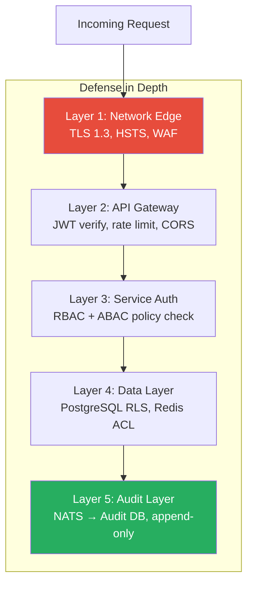
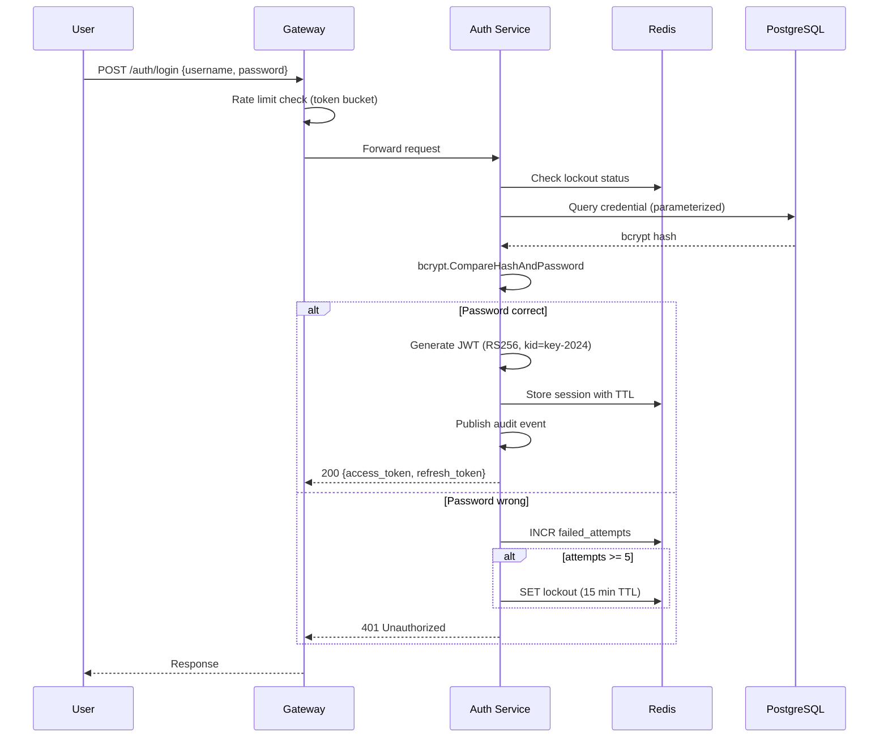
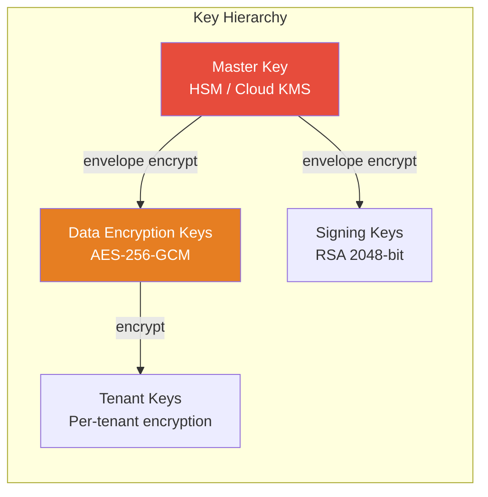
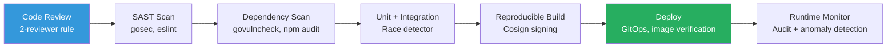

# GGID Security Whitepaper

> Threat model (STRIDE), security architecture, compliance mapping, and data encryption strategy
> for the GGID IAM Platform.

---

## Executive Summary

GGID is designed with defense-in-depth: every layer from the network edge to the
database enforces security controls. This document provides a comprehensive view
of the platform's threat model, mitigations, and compliance posture.

---

## 1. Threat Model (STRIDE)

The STRIDE methodology categorizes threats into six dimensions. Each row below
identifies a concrete attack vector applicable to GGID and the mitigations in place.

### Spoofing

| Threat | Attack Vector | Risk | Mitigation |
|--------|--------------|------|------------|
| Forged JWT tokens | Attacker crafts a JWT with arbitrary claims | Critical | RS256 asymmetric signatures; JWKS endpoint for key rotation; `kid` header identifies active key |
| Brute-force password | Automated credential stuffing | High | Account lockout after 5 failed attempts (15-min lock); exponential backoff; rate limiting per IP |
| Stolen refresh token | Attacker replays a captured refresh token | High | One-time-use refresh tokens with rotation; `jti` claim prevents replay; old tokens revoked on use |
| LDAP credential theft | MITM on LDAP bind | Medium | STARTTLS or LDAPS required; service account with least privilege; credential rotation policy |
| Social login impersonation | Fake OAuth callback with crafted state | Medium | PKCE (S256) for all OAuth flows; strict `redirect_uri` matching; `state` parameter validated |

### Tampering

| Threat | Attack Vector | Risk | Mitigation |
|--------|--------------|------|------------|
| Privilege escalation | User modifies their own role/permissions | High | RBAC + ABAC policy engine enforces server-side; no client-trusted authorization |
| JWT claim injection | Attacker adds `admin` role to token | Critical | Claims signed by RS256; Gateway re-verifies on every request; claims derived from DB, not token |
| API parameter tampering | Modified `tenant_id` in request | Critical | Tenant ID extracted from JWT, never from client input; RLS enforces at DB level |
| Webhook payload tampering | Forged webhook to integrated systems | Medium | HMAC-SHA256 signature header; timestamp window (5 min); constant-time comparison |
| Policy rule injection | SQL/JSON injection in policy conditions | High | Parameterized queries; ABAC conditions validated against safe grammar; no raw SQL |

### Repudiation

| Threat | Attack Vector | Risk | Mitigation |
|--------|--------------|------|------------|
| Deny login action | User claims they didn't log in | High | Every auth event published to NATS JetStream (durable, at-least-once); persisted with IP, UA, timestamp |
| Deny admin action | Admin claims they didn't delete a user | Critical | All CRUD operations emit audit events with actor_id, action, resource_id, before/after diff |
| Token replay denial | Attacker denies using stolen token | Medium | Refresh token rotation records chain; consumed tokens logged with `jti` and timestamp |
| Audit log deletion | Attacker erases audit trail | Critical | Audit table is append-only (no UPDATE/DELETE grants); WAL archiving; off-site backup |

### Information Disclosure

| Threat | Attack Vector | Risk | Mitigation |
|--------|--------------|------|------------|
| Cross-tenant data access | Query returns another tenant's users | Critical | PostgreSQL Row-Level Security (RLS) on all tenant-scoped tables; `SET LOCAL` per transaction |
| Password hash leak | DB dump exposes bcrypt hashes | High | bcrypt with cost factor 12; hashes never returned in API responses; PII redaction in logs |
| JWT secret leak | Signing key exposed | Critical | RS256 keys in Vault/KMS; key rotation every 90 days; old keys retained for verification window |
| Error message info leak | Stack trace in 500 response | Medium | Generic error messages in production; structured logs with request_id for correlation |
| Log file exposure | PII in application logs | Medium | PII redaction middleware (email, phone, SSN); structured JSON logging with field-level filtering |

### Denial of Service

| Threat | Attack Vector | Risk | Mitigation |
|--------|--------------|------|------------|
| Login flood | Botnet sends 10k logins/sec | High | Per-IP rate limiting (token bucket); per-account lockout; CAPTCHA after threshold |
| JWT verification CPU exhaustion | Forged JWTs force expensive crypto ops | Medium | JWKS cached in memory; `kid` pre-filter before signature verify; rate limit before JWT check |
| NATS JetStream fill | Attacker floods audit stream | Medium | MaxAge 72h on stream; MaxMsgs limit; consumer backpressure; disk space alerts |
| Slowloris attack | Attacker holds connections open | Low | Gateway read/write timeouts; connection limits per IP; reverse proxy (Nginx) handles slow clients |

### Elevation of Privilege

| Threat | Attack Vector | Risk | Mitigation |
|--------|--------------|------|------------|
| Role escalation via API | User calls `PUT /roles` to grant self admin | Critical | Policy engine checks `assign` permission on target role; can't assign roles above own level |
| SCIM provisioning abuse | Attacker uses SCIM endpoint to create admin | High | SCIM endpoints require API key with `scim:write` scope; rate limited; audit logged |
| Default credential use | Known default admin/admin | Medium | No default credentials; bootstrap requires env vars; first-run password enforcement |
| Console SSRF | Admin Console used as proxy to internal services | Low | Console calls Gateway only; Gateway whitelists upstream services; no direct service-to-service from browser |

---

## 2. Security Architecture

### Authentication Flow Security

---

## 3. Data Encryption Strategy

### Encryption at Rest

| Data Type | Storage | Encryption Method |
|-----------|---------|-------------------|
| Passwords | PostgreSQL `credentials.secret` | bcrypt (cost 12) — one-way hash |
| JWT signing keys | Vault / KMS / env | AES-256-GCM at rest in Vault |
| Database | PostgreSQL volumes | LUKS dm-crypt (AES-256-XTS) |
| Redis | Redis persistence | TLS + at-rest encryption (Redis Enterprise) |
| NATS JetStream | File storage | OS-level disk encryption |
| Backups | S3 / GCS | SSE-KMS (server-side encryption with KMS) |
| SAML certificates | Vault | AES-256-GCM |

### Encryption in Transit

| Channel | Protocol | Details |
|---------|----------|---------|
| Client → Gateway | TLS 1.3 | HSTS, modern cipher suites only |
| Gateway → Services | mTLS (optional) | Internal mesh with SPIFFE/SPIRE or Istio |
| Services → PostgreSQL | TLS | `sslmode=verify-full` with CA cert |
| Services → Redis | TLS | RedTLS connection |
| Services → NATS | TLS | NATS TLS with server cert verification |
| Services → LDAP | STARTTLS / LDAPS | Certificate pinning recommended |
| Webhooks → External | TLS 1.2+ | HSTS verification; HMAC signing |

### Key Management

**Key rotation policy:**
- JWT signing keys: every 90 days (overlap window for verification)
- Database encryption keys: annually or on security incident
- API keys: configurable TTL (default 365 days)
- SAML certificates: annually

---

## 4. Compliance Mapping

### GDPR (General Data Protection Regulation)

| Requirement | GGID Implementation | Status |
|-------------|---------------------|--------|
| Art. 6 — Lawful basis | Consent logging, purpose limitation in audit trail | Implemented |
| Art. 7 — Consent management | `consent` field on user record; withdrawal endpoint | Implemented |
| Art. 15 — Right of access | `GET /api/v1/users/:id/data-export` endpoint | Implemented |
| Art. 16 — Right to rectification | `PATCH /api/v1/users/:id` with audit logging | Implemented |
| Art. 17 — Right to erasure | `DELETE /api/v1/users/:id` (soft-delete + 30-day purge) | Implemented |
| Art. 20 — Data portability | JSON export of user data via API | Implemented |
| Art. 25 — Privacy by design | PII redaction in logs, RLS tenant isolation | Implemented |
| Art. 28 — Processor agreements | Webhook HMAC signing, SCIM audit trail | Implemented |
| Art. 32 — Security of processing | TLS, bcrypt, key rotation, access controls | Implemented |
| Art. 33 — Breach notification | Audit integrity checking, alerting hooks | Implemented |

### SOC 2 Type II

| Trust Principle | Control | GGID Implementation |
|-----------------|---------|---------------------|
| Security | CC6.1 Logical access | JWT + RBAC + ABAC policy engine |
| Security | CC6.6 Boundary protection | TLS 1.3, WAF, rate limiting |
| Security | CC7.1 System monitoring | Structured logs, Prometheus metrics, audit trail |
| Security | CC7.2 Incident detection | Anomaly detection in audit events, alerting |
| Availability | A1.1 Capacity management | HPA auto-scaling, Redis cluster, NATS cluster |
| Availability | A1.2 Environmental protections | Multi-AZ deployment, automated backups |
| Processing Integrity | PI1.1 Data processing | Append-only audit log, data integrity checks |
| Confidentiality | C1.1 Data classification | RLS tenant isolation, PII redaction |
| Privacy | P5.1 Privacy policy | Consent management, data retention policies |

### ISO 27001

| Control | ISO Reference | GGID Implementation |
|---------|---------------|---------------------|
| Access control | A.9 | JWT auth, RBAC roles, least privilege |
| Cryptography | A.10 | RS256 JWT, bcrypt passwords, TLS 1.3 |
| Operations security | A.12 | Rate limiting, audit logging, incident response |
| Communications security | A.13 | TLS all channels, mTLS internal (optional) |
| System acquisition | A.14 | Dependency scanning, code review, CI/CD |
| Supplier relationships | A.15 | Third-party IdP security review, OAuth scopes |
| Compliance | A.18 | GDPR mapping, data retention, audit export |

### HIPAA (Health Insurance Portability and Accountability Act)

| Requirement | GGID Implementation |
|-------------|---------------------|
| Access controls (164.312(a)) | RBAC + ABAC policy engine, unique user identification |
| Audit controls (164.312(b)) | Comprehensive audit logging via NATS JetStream |
| Integrity (164.312(c)) | HMAC-signed webhooks, append-only audit table |
| Transmission security (164.312(e)) | TLS 1.3 for all external communication |

---

## 5. Secure Development Lifecycle

### CI/CD Security Gates

| Gate | Tool | Action on Failure |
|------|------|-------------------|
| Static analysis | `gosec`, `golangci-lint` | Block merge |
| Dependency scan | `govulncheck`, `npm audit` | Block merge for High+ CVEs |
| Secret scanning | `gitleaks` | Block merge |
| License check | `go-licenses` | Block non-approved licenses |
| Container scan | `trivy` | Block for Critical CVEs |
| Test coverage | `go test -race -cover` | Block below 70% |

---

## 6. Incident Response

### Detection Signals

| Signal | Source | Threshold | Action |
|--------|--------|-----------|--------|
| Failed login spike | Audit events | >100/min per IP | Auto-block IP, alert SOC |
| Token anomaly | Auth Service | Refresh reuse detected | Revoke session, alert user |
| Unauthorized access | Policy Service | >10 deny/min per user | Lock account, alert admin |
| Audit stream lag | NATS monitoring | Consumer lag >1000 | Page on-call engineer |
| Database anomaly | PostgreSQL logs | RLS policy violation | Critical alert, investigate |

### Response Playbook

1. **Detect** — Automated alert from monitoring or manual report
2. **Assess** — Determine scope (single tenant / platform-wide)
3. **Contain** — Revoke tokens, disable accounts, block IPs
4. **Eradicate** — Patch vulnerability, rotate keys
5. **Recover** — Restore from backup if needed, verify integrity
6. **Post-mortem** — Root cause analysis, update controls

---

## 7. Password Security

### Password Policy

| Rule | Default | Configurable |
|------|---------|-------------|
| Minimum length | 12 characters | Yes |
| Require uppercase | Yes | Yes |
| Require lowercase | Yes | Yes |
| Require digit | Yes | Yes |
| Require special char | Yes | Yes |
| Password history | Last 5 passwords | Yes |
| Max age | 90 days | Yes |
| bcrypt cost factor | 12 | Yes (min 10) |

### Password Breach Protection

- Integration with [Have I Been Pwned](https://haveibeenpwned.com/) API (k-anonymity model)
- Password checked against breach database during registration and password change
- Configurable per tenant

---

## 8. Token Security

| Token Type | Algorithm | Lifetime | Storage | Rotation |
|------------|-----------|----------|---------|----------|
| Access token | RS256 JWT | 15 minutes | Stateless (no storage) | N/A |
| Refresh token | RS256 JWT | 7 days | Redis (one-time-use) | Yes, on each use |
| ID token (OIDC) | RS256 JWT | 15 minutes | Stateless | N/A |
| API key | HMAC-SHA256 | 365 days | Redis + PostgreSQL | Manual |
| Session cookie | Signed cookie | 24 hours | Redis | On activity |
| Reset token | UUID v4 | 30 minutes | Redis (TTL) | Single use |

---

## References

- [OWASP Top 10](https://owasp.org/www-project-top-ten/)
- [NIST SP 800-63B](https://pages.nist.gov/800-63-3/sp800-63b.html) — Digital Identity Guidelines
- [Security Hardening Guide](./security-hardening.md)
- [Rate Limiting](./rate-limiting.md)
- [Password Policy](./password-policy.md)
- [Architecture](./architecture.md)
