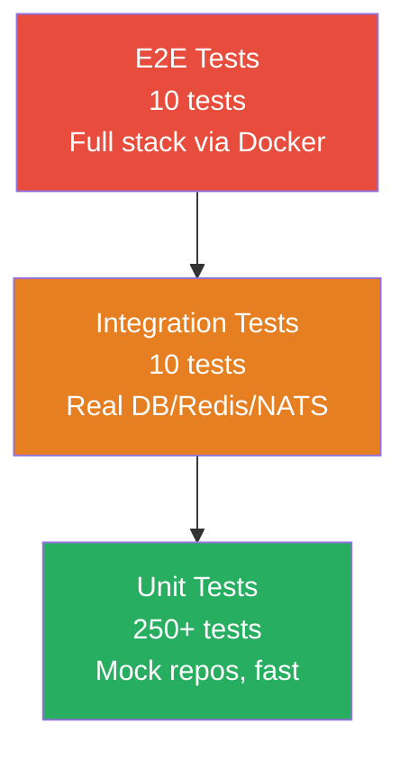

# GGID Testing Guide

Comprehensive testing strategy for the GGID IAM Platform.

## Test Pyramid

```
                    /\
                   /E2E\          deploy/e2e-docker-test.sh
                  /------\        (requires Docker stack)
                 /Integration\    //go:build integration
                /--------------\  (requires running services)
               /  Unit Tests   \  service/internal/*_test.go
              /------------------\ (mock-based, no external deps)
```

## Unit Tests

The primary test type — fast, isolated, mock-based.

### Running

```bash
make test                    # all packages
go test -v ./services/auth/internal/service/...
go test -race -cover ./...   # with race detector + coverage
```

### Mock Strategy

Services depend on **repo interfaces**, enabling mock substitution:

```go
// Interface in service package
type CredentialRepo interface {
    GetByUserID(ctx context.Context, tenantID, userID uuid.UUID) (*domain.Credential, error)
}

// Mock in test file
type mockCredentialRepo struct {
    creds map[uuid.UUID]*domain.Credential
    err   error
}

func (m *mockCredentialRepo) GetByUserID(ctx context.Context, tenantID, userID uuid.UUID) (*domain.Credential, error) {
    if m.err != nil { return nil, m.err }
    return m.creds[userID], nil
}

// Test uses mock
func TestLogin(t *testing.T) {
    repo := &mockCredentialRepo{creds: map[uuid.UUID]*domain.Credential{...}}
    svc := NewAuthService(repo)
    _, err := svc.Login(ctx, "user", "pass")
    assert.NoError(t, err)
}
```

### Coverage Targets

| Package | Current | Target |
|---------|---------|--------|
| pkg/errors | 100% | Maintain |
| pkg/tenant | 100% | Maintain |
| audit/service | 100% | Maintain |
| policy/service | 93.9% | >90% |
| auth/domain | 92.9% | >90% |
| authprovider | 88.1% | >85% |
| auth/service | 72.2% | >75% |
| identity/service | 72.3% | >75% |
| policy | 54.6% | >60% |

## Integration Tests

Tagged with `//go:build integration` — require running services.

```bash
# Start Docker stack
cd deploy && docker compose up -d
sleep 30

# Run integration tests
go test -tags=integration -v ./test/integration/...
```

Tests gracefully skip if services are unavailable.

## E2E Tests (Docker)

Full end-to-end through the Gateway:

```bash
bash deploy/e2e-docker-test.sh
```

**11 tests:**

| # | Test | Expected |
|---|------|----------|
| 1 | Gateway healthz | 200 |
| 2 | Register user | 201 |
| 3 | Login + JWT | 693+ chars |
| 4 | 401 without JWT | 401 |
| 5 | List users | 200 |
| 6 | Create role | 201 |
| 7 | List roles | 200 |
| 8 | Create org | 201 |
| 9 | Audit query | 200 |
| 10 | Wrong password | 401 |
| 11 | Duplicate register | 409 |

## k6 Performance Tests

```bash
k6 run deploy/k6/login-bench.js      # login benchmark
k6 run deploy/k6/api-bench.js        # full API benchmark
k6 run deploy/k6/mixed-workload.js   # mixed read/write
```

Key thresholds: p95 < 100ms, error rate < 1%.

## Test Conventions

1. **Run `go build ./...` before `go test`** — catch compilation errors first
2. **Use interface mocks** — never connect to real DB in unit tests
3. **Table-driven tests** for multi-scenario logic
4. **`t.Helper()`** in assertion helpers
5. **No `time.Sleep`** — use channels or `eventually` patterns
6. **Test file naming:** `*_test.go` in same package as code under test

## Debugging Test Failures

```bash
# Verbose output
go test -v ./services/auth/internal/service/... -run TestLogin

# No cache
go test -count=1 ./...

# Race detector
go test -race ./services/gateway/...

# Specific test with timeout
go test -v -timeout 30s -run TestCreateUser ./services/identity/...
```

---

## Test Strategy

### Test Pyramid



### Unit Tests

- **What:** Service-layer logic with mocked repositories
- **Speed:** <1ms per test
- **Coverage target:** 85%+ per package
- **Mocking:** Interface-based — each service defines its repo interfaces, tests
  provide mock implementations

```bash
# Run unit tests for one package
go test -count=1 -v ./services/auth/internal/service/

# Run a single test function
go test -count=1 -v -run TestAuthService_Login ./services/auth/internal/service/
```

### Integration Tests

- **What:** Tests that exercise real database, Redis, NATS connections
- **Build tag:** `//go:build integration`
- **Speed:** 1-5 seconds per test (includes setup/teardown)
- **Requirements:** Running PostgreSQL, Redis, NATS (via Docker)

```bash
# Start infrastructure
docker compose -f deploy/docker-compose.yaml up -d postgres redis nats

# Run integration tests
go test -tags=integration -v ./test/integration/

# Run Gateway E2E tests
go test -tags=integration -v ./test/integration/ -run TestGatewayE2E
```

### E2E Tests

- **What:** Full stack tests through the API Gateway
- **Requirements:** All 12 Docker containers running
- **Speed:** 30-60 seconds total

```bash
# Start full stack
docker compose -f deploy/docker-compose.yaml up -d
sleep 30  # wait for healthchecks

# Run E2E test suite
bash deploy/e2e-docker-test.sh
```

---

## Mock Strategy

GGID uses interface-based mocking. Services depend on interfaces, not
concrete repository types:

```go
// Service depends on interface
type AuthService struct {
    credRepo CredentialRepo  // interface, not *repository.CredentialRepository
}

// Interface
type CredentialRepo interface {
    FindByIDentifier(ctx context.Context, tenantID, identifier string) (*domain.Credential, error)
}

// Test provides mock
type mockCredentialRepo struct {
    creds map[string]*domain.Credential
    err   error
}

func (m *mockCredentialRepo) FindByIDentifier(ctx context.Context, tenantID, id string) (*domain.Credential, error) {
    if m.err != nil { return nil, m.err }
    return m.creds[id], nil
}
```

### Mock Components

| Component | Mock Method | Library |
|-----------|-------------|---------|
| PostgreSQL | Interface mock | Hand-written |
| Redis | `miniredis` | `github.com/alicebob/miniredis/v2` |
| NATS | Embedded test server | `natsserver.RunServer` |
| LDAP | `fakeLDAPServer` | Hand-written |
| HTTP client | `httptest.Server` | stdlib |
| OAuth provider | Override `oauth2.Endpoint` | stdlib |

---

## Coverage Targets

| Package Tier | Target | Current |
|-------------|--------|---------|
| Core (errors, tenant, crypto) | 100% | 89-100% |
| Shared (authprovider, social, saml) | 90%+ | 70-97% |
| Services (auth, oauth, policy) | 85%+ | 83-97% |
| Gateway (middleware, router) | 85%+ | 84-93% |
| Infra (http3, config, healthcheck) | 90%+ | 90-97% |

```bash
# Check coverage for a specific package
go test -cover ./services/auth/internal/service/

# Generate HTML coverage report
go test -coverprofile=coverage.out ./...
go tool cover -html=coverage.out -o coverage.html
open coverage.html
```

---

## Adding New Tests

1. **Create test file** in the same package: `service_test.go`
2. **Define mock** for any repo interfaces the service needs
3. **Write test functions** following `Test<ServiceName>_<Scenario>` convention
4. **Use table-driven tests** for multiple scenarios:

```go
func TestAuthService_Login(t *testing.T) {
    tests := []struct {
        name      string
        username  string
        password  string
        wantErr   bool
    }{
        {"valid login", "alice", "correct-pass", false},
        {"wrong password", "alice", "wrong-pass", true},
        {"user not found", "unknown", "any", true},
        {"empty username", "", "pass", true},
    }

    for _, tt := range tests {
        t.Run(tt.name, func(t *testing.T) {
            // Setup mock, call service, assert
        })
    }
}
```

5. **Run tests** before committing:
   ```bash
   go build ./... && go test -count=1 -race ./your/package/...
   ```
