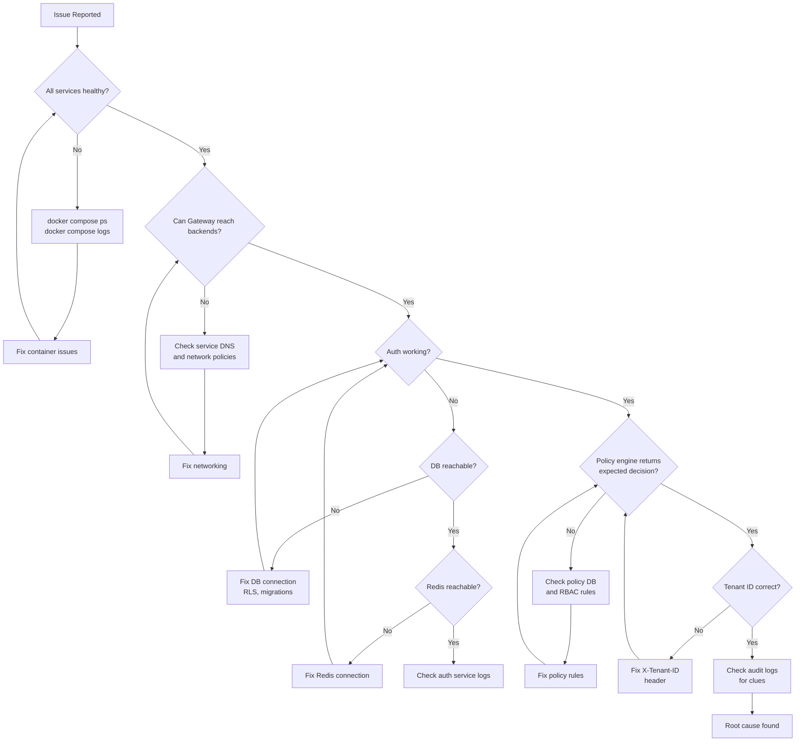

# GGID Troubleshooting Guide

Common issues and their solutions, organized by category.

---

## Docker / Startup Issues

### Q: `docker compose up` fails with "port is already allocated"

**Cause:** Another process is using a port that GGID needs (8080, 5432, 6379, etc.).

**Fix:** Identify and stop the conflicting process, or remap the port.

```bash
# Find what's using port 8080
sudo lsof -i :8080

# Option 1: Stop the conflicting process
kill <PID>

# Option 2: Remap the port in docker-compose.yaml
# Change "8080:8080" to "9080:8080"
```

---

### Q: Containers start but immediately exit

**Cause:** Missing dependencies (database not ready, RSA keys not generated).

**Fix:** Check logs and ensure init containers ran.

```bash
# Check which containers exited
docker compose ps -a

# Check logs of the failing container
docker compose logs identity
docker compose logs auth

# Common issues:
# - "connection refused" → postgres not ready, wait or restart
# - "no such file" → keygen or migrate didn't run, restart them
```

**Force restart init containers:**
```bash
docker compose up -d keygen migrate
docker compose up -d --force-recreate identity auth
```

---

### Q: `migrate` container fails with "database already initialized"

**Cause:** The idempotent check detected existing tables. This is normal.

**Fix:** No action needed — the container exits with code 0 after printing
"Database already initialized, skipping migrations".

If you need to re-run migrations from scratch:
```bash
docker compose down -v  # WARNING: deletes all data
docker compose up -d
```

---

### Q: Build fails with "no such file or directory" during Docker build

**Cause:** Build context is wrong, or `console/public/` directory is missing.

**Fix:**
```bash
# Ensure console/public exists
mkdir -p console/public/.gitkeep

# Rebuild from scratch
docker compose build --no-cache
```

---

### Q: Console shows a blank page or connection error

**Cause:** Gateway is not running or Console can't reach it.

**Fix:**
```bash
# Verify gateway is healthy
curl http://localhost:8080/healthz

# Check Console logs
docker compose logs console

# Verify the Console env var
# GATEWAY_URL should be "http://gateway:8080" (Docker internal network)
```

---

## Database Issues

### Q: Services fail with "connection refused" to PostgreSQL

**Cause:** PostgreSQL container is not running or not yet healthy.

**Fix:**
```bash
# Check postgres status
docker compose ps postgres

# Check logs
docker compose logs postgres

# Wait for it to become healthy
docker compose up -d postgres
# Wait 10 seconds, then restart dependent services
docker compose restart identity auth policy org audit
```

---

### Q: "relation does not exist" errors

**Cause:** Database migrations haven't been applied.

**Fix:**
```bash
# Run migrations manually
docker compose up migrate

# Or run via psql
docker exec -it ggid-postgres psql -U ggid -d ggid -f /migrations/001_init.sql
```

---

### Q: RLS policy blocks all queries (returns empty results)

**Cause:** The application is using a superuser role (bypasses RLS) in development,
but a non-superuser role in production that requires `SET LOCAL app.tenant_id`.

**Fix:** Ensure `SET LOCAL app.tenant_id` is called at the start of every transaction:

```go
// In your repository code:
_, err := tx.Exec(ctx, fmt.Sprintf("SET LOCAL app.tenant_id = '%s'", tenantID))
if err != nil {
    return err
}
// Then run queries...
```

> **Note:** `SET LOCAL` does NOT support `$1` parameters in pgx v5.
> Use `fmt.Sprintf` with a validated UUID string.

---

### Q: Database password incorrect

**Fix:** Reset the password and restart:

```bash
docker exec -it ggid-postgres psql -U ggid -c "ALTER USER ggid PASSWORD 'newpassword';"

# Update docker-compose.yaml and restart
docker compose down
docker compose up -d
```

> If you've forgotten the superuser password, you need to recreate the volume:
> `docker volume rm ggid-pgdata` (destroys all data).

---

## JWT / Authentication Issues

### Q: All API calls return 401 Unauthorized

**Cause:** The JWT is missing, expired, or invalid.

**Debugging steps:**
```bash
# 1. Verify the token is present
echo $TOKEN | wc -c  # should be > 100 chars

# 2. Check if the token is expired
echo $TOKEN | cut -d. -f2 | base64 -d 2>/dev/null | jq .exp
# Compare with current time: date +%s

# 3. Verify the token format
curl -s -H "Authorization: Bearer $TOKEN" \
  -H "X-Tenant-ID: $TENANT" \
  $GW/api/v1/users
```

**Fix:**
```bash
# Get a fresh token
TOKEN=$(curl -s -X POST $GW/api/v1/auth/login \
  -H "Content-Type: application/json" \
  -H "X-Tenant-ID: $TENANT" \
  -d '{"username":"demo","password":"SecurePass@123"}' \
  | python3 -c "import sys,json; print(json.load(sys.stdin)['access_token'])")
```

---

### Q: Login returns 429 Too Many Requests

**Cause:** Rate limiting kicks in after ~5 failed login attempts from the same IP.

**Fix:**
```bash
# Wait for the rate limit window to expire (60 seconds)
sleep 60

# Or restart the auth container to clear the rate limiter
docker compose restart auth

# Then retry login
```

---

### Q: JWT verification fails in the SDK

**Cause:** The SDK can't reach the JWKS endpoint, or the key has rotated.

**Fix:**
```bash
# 1. Verify JWKS endpoint is accessible
curl http://localhost:8080/.well-known/jwks.json

# 2. Check that the kid in the JWT header matches a key in JWKS
echo $TOKEN | cut -d. -f1 | base64 -d 2>/dev/null | jq .kid

# 3. If keys were rotated, clear the SDK cache (restart your app)
```

---

### Q: Register returns 409 Conflict

**Cause:** The username already exists within the tenant.

**Fix:** Use a different username, or delete the existing user first.

```bash
# Check if user exists
curl -s "$GW/api/v1/users?search=jane" \
  -H "$AUTH" -H "X-Tenant-ID: $TENANT"

# Delete if needed
curl -X DELETE "$GW/api/v1/users/USER_ID" \
  -H "$AUTH" -H "X-Tenant-ID: $TENANT"
```

---

### Q: Register returns 500 Internal Server Error

**Cause:** The `username` field is empty. The register handler reads `username`
(not `email`) as the credential identifier.

**Fix:** Ensure the request includes a non-empty `username` field:

```bash
curl -s -X POST $GW/api/v1/auth/register \
  -H "Content-Type: application/json" \
  -H "X-Tenant-ID: $TENANT" \
  -d '{
    "username": "jane.doe",   <-- THIS IS REQUIRED
    "email": "jane@example.com",
    "password": "SecurePass@123"
  }'
```

---

## Gateway Issues

### Q: API returns 502 Bad Gateway

**Cause:** The Gateway can reach the backend service, but the backend returned an error
or is misconfigured.

**Fix:**
```bash
# Check gateway logs
docker compose logs gateway

# Check which backend is failing
curl http://localhost:8080/healthz/ready

# Restart the failing service
docker compose restart identity  # or auth, policy, org, audit
```

---

### Q: API returns 503 Service Unavailable

**Cause:** A backend service is not responding to health checks.

**Fix:**
```bash
# Check all container statuses
docker compose ps

# Check health check failures
docker inspect ggid-auth --format='{{json .State.Health}}' | jq .

# Common cause: service is OOM-killed
docker compose logs auth | grep -i "killed\|oom"
```

---

### Q: Gateway returns 404 for an endpoint that should work

**Cause:** The route is not configured in the Gateway, or the path prefix is wrong.

**Fix:**
```bash
# Check gateway route configuration
docker compose logs gateway | grep "route"

# Verify the service is registered
# Gateway routes:
#   /api/v1/auth    → auth:9001
#   /api/v1/users   → identity:8080
#   /api/v1/roles   → policy:8070
#   /api/v1/policies → policy:8070
#   /api/v1/orgs    → org:8071
#   /api/v1/audit   → audit:8072

# If adding a new route, update config.Default() in
# services/gateway/internal/config/config.go
```

---

### Q: Gateway injects tenant_id but backend still returns 400 "missing tenant"

**Cause:** The backend service expects `tenant_id` in a different location
(query param vs JSON body) than what the Gateway injects.

**Fix:** The Gateway injects tenant_id as:
- Query param for GET requests
- JSON body field for POST/PUT/PATCH

If your endpoint reads it from a header instead, add explicit parsing:
```go
// In your handler
tenantIDStr := r.Header.Get("X-Tenant-ID")
```

---

## Policy / RBAC Issues

### Q: Create role returns 500 Internal Server Error

**Cause:** The `key` field is empty. The roles table has a `UNIQUE(tenant_id, key)`
constraint — an empty key conflicts with existing rows.

**Fix:** Always provide a unique, non-empty `key`:

```bash
curl -s -X POST $GW/api/v1/roles \
  -H "$AUTH" -H "Content-Type: application/json" -H "X-Tenant-ID: $TENANT" \
  -d '{"key":"editor","name":"Content Editor"}'
#                  ^^^^ must be unique within tenant
```

---

### Q: Permission check always returns `allowed: false`

**Cause:** The user has no roles assigned, or the policy doesn't match.

**Debugging:**
```bash
# 1. List user's roles
curl -s "$GW/api/v1/users/$USER_ID/roles" -H "$AUTH" -H "X-Tenant-ID: $TENANT"

# 2. Check role permissions
curl -s "$GW/api/v1/roles/$ROLE_ID/permissions" -H "$AUTH"

# 3. List policies
curl -s "$GW/api/v1/policies?tenant_id=$TENANT" -H "$AUTH"

# 4. Test with explicit context
curl -s -X POST $GW/api/v1/policies/check \
  -H "$AUTH" -H "Content-Type: application/json" -H "X-Tenant-ID: $TENANT" \
  -d '{"user_id":"...","resource":"documents:drafts","action":"read","context":{"department":"engineering"}}'
```

---

## NATS / Audit Issues

### Q: Audit events are not being recorded

**Cause:** NATS is down, or the audit consumer is not running.

**Fix:**
```bash
# 1. Check NATS health
curl http://localhost:8222/healthz

# 2. Check NATS is running
docker compose ps nats

# 3. Check audit service logs
docker compose logs audit | grep -i "nats\|error"

# 4. Restart NATS and audit
docker compose restart nats
docker compose restart audit
```

> **Note:** Audit event publishing is best-effort. If NATS is down when an
> event occurs, that event is lost (not retried). This is by design.

---

### Q: NATS fails to start with "stream already exists"

**Cause:** A previous NATS instance left stale JetStream data.

**Fix:**
```bash
docker compose down
docker volume rm deploy_ggid-nats-data  # if using a named volume
# Or
docker compose up -d --force-recreate nats
```

---

### Q: Audit query returns events from all tenants

**Cause:** RLS is not being enforced (superuser connection), or `tenant_id`
filter is missing.

**Fix:** Ensure the audit service's `ListEvents` uses the tenant_id from the
filter, and the database connection is using a non-superuser role.

---

## LDAP Issues

### Q: LDAP login fails with "invalid credentials"

**Cause:** LDAP server is not running, or bind credentials are wrong.

**Fix:**
```bash
# 1. Check LDAP is running
docker compose ps ldap

# 2. Test LDAP connectivity
docker exec ggid-ldap ldapsearch -x -H ldap://localhost:389 \
  -D "cn=admin,dc=corp,dc=local" -w admin123 -b "dc=corp,dc=local"

# 3. Verify env vars in auth service
docker compose exec auth env | grep LDAP
```

---

### Q: LDAP users can't auto-provision

**Cause:** `LDAP_AUTO_PROVISION` is not set to `true`.

**Fix:**
```yaml
# In docker-compose.yaml, auth service environment:
LDAP_AUTO_PROVISION: "true"
```

Then restart auth: `docker compose restart auth`

---

## Performance Issues

### Q: API responses are slow (>1s latency)

**Cause:** Database queries without indexes, or connection pool exhaustion.

**Fix:**
```bash
# 1. Check Gateway metrics
curl http://localhost:8080/metrics | grep -i "latency\|duration"

# 2. Check PostgreSQL slow queries
docker exec ggid-postgres psql -U ggid -c \
  "SELECT query, mean_exec_time, calls FROM pg_stat_statements ORDER BY mean_exec_time DESC LIMIT 10;"

# 3. Add indexes if missing (check your migration files)
# 4. Increase connection pool size in service configs
```

---

### Q: Auth service uses too much memory

**Cause:** JWKS cache, rate limiter, or session store consuming memory.

**Fix:**
```bash
# Check container memory usage
docker stats ggid-auth

# Reduce JWKS cache TTL
# Reduce session TTL
# Increase container memory limit in docker-compose.yaml
```

---

## FAQ

### Q: How do I reset everything to a clean state?

```bash
cd deploy
docker compose down -v  # removes all volumes (DB, LDAP, configs)
docker compose up -d    # starts fresh with new keys and migrations
```

### Q: How do I change the default tenant ID?

The default tenant `00000000-0000-0000-0000-000000000001` is created by
the migration scripts. To use a different tenant, create one via the API:

```bash
# Create a new tenant (requires admin access)
curl -s -X POST $GW/api/v1/orgs \
  -H "$AUTH" -H "Content-Type: application/json" \
  -H "X-Tenant-ID: $TENANT" \
  -d '{"name":"My Company"}'
```

### Q: Can I run GGID without Docker?

Yes. Build each service binary and run them directly:

```bash
go build -o bin/identity ./services/identity/cmd
go build -o bin/auth ./services/auth/cmd
# ... etc

# Set environment variables and run
DATABASE_URL="postgres://..." ./bin/auth
```

You still need PostgreSQL, Redis, and NATS running.

### Q: How do I rotate JWT signing keys?

```bash
# 1. Generate a new key pair
openssl genpkey -algorithm RSA -out new_private.pem -pkeyopt rsa_keygen_bits:2048
openssl rsa -pubout -in new_private.pem -out new_public.pem

# 2. Replace the keys in the configs volume
docker cp new_private.pem ggid-auth:/configs/rsa_private.pem
docker cp new_public.pem ggid-auth:/configs/rsa_public.pem

# 3. Restart auth and gateway
docker compose restart auth gateway

# 4. All existing JWTs become invalid — users must re-login
```

### Q: How do I see what's happening in real-time?

```bash
# All service logs
docker compose logs -f

# Specific service
docker compose logs -f auth

# Gateway access logs
docker compose logs -f gateway | grep "status"
```

---

## Redis Issues

### Q: Auth service crashes with "redis: connection refused"

**Cause:** Redis container is not running or the Auth service can't reach it.

**Fix:**

```bash
# Check if Redis is running
docker compose ps redis
docker compose logs redis

# Test connectivity from auth container
docker exec -it ggid-auth redis-cli -h redis ping
# Expected: PONG

# If Redis data is corrupted, reset it
docker compose down redis
docker volume rm deploy_redis_data
docker compose up -d redis
```

Common env var issues:
```bash
# Verify auth service has correct Redis URL
docker exec ggid-auth env | grep REDIS
# Should show: REDIS_URL=redis://redis:6379
```

---

### Q: Sessions expire immediately or tokens don't persist

**Cause:** Redis `maxmemory-policy` is not set to `allkeys-lru`, or memory is full.

**Fix:**

```bash
# Check Redis memory usage
docker exec ggid-redis redis-cli INFO memory | grep used_memory_human

# Check eviction policy
docker exec ggid-redis redis-cli CONFIG GET maxmemory-policy
# Should be: allkeys-lru

# Fix: set in redis.conf or via CONFIG SET
docker exec ggid-redis redis-cli CONFIG SET maxmemory-policy allkeys-lru
```

---

### Q: Rate limiting doesn't work (429 never returned)

**Cause:** Redis not reachable by Gateway, or rate limiter disabled.

**Fix:**

```bash
# Check Gateway logs for Redis connection errors
docker compose logs gateway | grep -i redis

# Verify rate limiter is enabled
docker exec ggid-gateway env | grep RATE_LIMIT
# RATE_LIMIT_ENABLED=true
# RATE_LIMIT_RPM=60
```

---

## OAuth / OIDC Issues

### Q: Social login callback returns "invalid state"

**Cause:** The `state` parameter from the OAuth flow doesn't match the one stored in the session.

**Fix:**

```bash
# Check OAuth service logs
docker compose logs oauth | grep -i state

# Common causes:
# 1. Cookie domain mismatch (check OIDC_COOKIE_DOMAIN env)
# 2. Clock skew between services (ensure NTP is running)
# 3. Load balancer stripping cookies (check sticky session config)

# Verify redirect URI matches exactly
docker exec ggid-oauth env | grep REDIRECT
```

---

### Q: OIDC discovery endpoint returns 404

**Cause:** OAuth service not registered in Gateway, or wrong path.

**Fix:**

```bash
# Test directly against OAuth service
curl http://localhost:9005/.well-known/openid-configuration

# Test through Gateway
curl http://localhost:8080/.well-known/openid-configuration

# If Gateway returns 404, check route registration
docker compose logs gateway | grep -i oauth
```

---

### Q: JWT issued by GGID fails verification in third-party app

**Cause:** Third-party app uses wrong JWKS endpoint or cached old keys.

**Fix:**

```bash
# Verify JWKS endpoint is accessible
curl http://localhost:8080/.well-known/jwks.json

# Check current signing key ID
docker exec ggid-auth cat /keys/active_kid.txt

# Ensure third-party app fetches JWKS from:
#   https://api.your-domain.com/.well-known/jwks.json
# And does NOT hardcode the public key (always use JWKS endpoint)
```

---

## LDAP Issues

### Q: LDAP login returns "invalid credentials" for all users

**Cause:** LDAP bind DN or password is incorrect, or the user filter doesn't
match the LDAP schema.

**Fix:**

```bash
# 1. Verify LDAP server is reachable
docker exec ggid-auth sh -c 'ldapsearch -x -H "$LDAP_URL" -D "$LDAP_BIND_DN" -w "$LDAP_BIND_PASSWORD" -b "$LDAP_BASE_DN" -s sub "(objectClass=person)" dn'

# 2. Check auth service logs for LDAP errors
docker compose logs auth | grep -i ldap

# 3. Test with ldapsearch directly
ldapsearch -x -H ldap://localhost:389 \
  -D "cn=admin,dc=example,dc=com" \
  -w "admin-password" \
  -b "dc=example,dc=com" \
  "(uid=testuser)" dn mail

# 4. Verify the user filter matches your LDAP schema
# Common patterns:
#   OpenLDAP:    (uid=%s)
#   Active Dir:  (sAMAccountName=%s)
#   FreeIPA:     (uid=%s)
```

### Q: LDAP connection times out

**Cause:** Network issue between auth container and LDAP server, or LDAP
requires TLS.

**Fix:**

```bash
# Check network connectivity
docker exec ggid-auth wget -qO- --timeout=5 http://ldap:389 || echo "unreachable"

# If using LDAPS (port 636), set LDAP_URL=ldaps://ldap:636
# If using StartTLS, set LDAP_START_TLS=true

# Verify TLS certificate is trusted (for LDAPS)
openssl s_client -connect ldap:636 -showcerts
```

### Q: LDAP users get created but can't login afterwards

**Cause:** `LDAP_AUTO_PROVISION` creates the user on first login, but the
local credential isn't set.

**Fix:** This is expected — LDAP users authenticate through LDAP, not local
password. Ensure the LDAP provider is still in the auth chain. Verify:

```bash
# Check if user was provisioned
curl $API/api/v1/users?username=ldapuser \
  -H "Authorization: Bearer $TOKEN" \
  -H "X-Tenant-ID: $TENANT_ID"

# Check auth provider chain includes LDAP
docker compose logs auth | grep "provider chain"
# Expected: "provider chain: local, ldap"
```

---

## NATS JetStream Issues

### Q: Audit events are not appearing in the SSE stream

**Cause:** NATS JetStream may not be enabled, or the audit consumer is not
connected.

**Fix:**

```bash
# 1. Check NATS monitoring
curl http://localhost:8222/jsz?enabled=true | jq '.enabled'
# Expected: true

# 2. Check if JetStream stream exists
curl http://localhost:8222/jsz?streams=true | jq '.streams[].name'
# Expected: ["GGID_EVENTS"]

# 3. Check audit service is connected to NATS
docker compose logs audit | grep -i nats
# Expected: "connected to NATS at nats://nats:4222"

# 4. Check consumer lag
nats consumer info GGID_EVENTS audit-consumer --server nats://localhost:4222
# Look at "Num Ack Pending" and "Num Redelivered"

# 5. Restart the audit service if consumer is stuck
docker compose restart audit
```

### Q: "stream not found" error in audit logs

**Cause:** JetStream stream `GGID_EVENTS` was not created (NATS may have lost
persistent storage, or JetStream wasn't enabled on first boot).

**Fix:**

```bash
# Recreate the stream
nats stream add GGID_EVENTS \
  --subjects "ggid.events.>" \
  --storage file \
  --retention limits \
  --max-age 7d \
  --server nats://localhost:4222

# Restart audit service to re-create consumer
docker compose restart audit
```

### Q: NATS JetStream shows high consumer lag

**Cause:** Audit service can't keep up with event ingestion, or consumer is
stuck on a poison message.

**Fix:**

```bash
# Check pending messages
nats consumer info GGID_EVENTS audit-consumer --server nats://localhost:4222

# If pending is high, check for errors in audit service
docker compose logs audit --tail 100 | grep -i error

# Purge and restart consumer (will lose unprocessed events)
nats consumer rm GGID_EVENTS audit-consumer --force --server nats://localhost:4222
docker compose restart audit
```

---

## Rate Limiting Issues

### Q: API returns 429 immediately on first request

**Cause:** Rate limit key collision, or Redis has stale rate limit buckets from
previous deployments.

**Fix:**

```bash
# Check rate limit headers in the response
curl -v -X POST $API/api/v1/auth/login \
  -H "Content-Type: application/json" \
  -d '{"username":"test","password":"Test123!"}' 2>&1 | grep -i ratelimit

# If X-RateLimit-Remaining is 0, clear Redis rate limit keys
redis-cli -h localhost KEYS "rl:*" | head -20
redis-cli -h localhost FLUSHDB  # WARNING: clears ALL Redis data

# Or selectively delete rate limit keys
redis-cli --scan --pattern 'rl:*' | xargs redis-cli DEL

# Restart auth to clear in-memory rate counters
docker compose restart auth
```

### Q: Rate limit not working at all

**Cause:** Redis is down and `RATE_LIMIT_FAIL_MODE=open` (fail-open), so all
requests are allowed.

**Fix:**

```bash
# Check Redis connectivity
docker exec ggid-gateway redis-cli -h redis ping
# Expected: PONG

# Check fail mode setting
docker exec ggid-gateway env | grep RATE_LIMIT_FAIL_MODE

# For strict enforcement, set fail-closed mode
# In docker-compose.yaml:
#   RATE_LIMIT_FAIL_MODE=closed
```

### Q: Different tenants hitting each other's rate limits

**Cause:** Rate limit key strategy is set to `ip` instead of `jwt_sub` or
`tenant_id`, so requests from the same IP (e.g., behind a corporate proxy)
share a bucket.

**Fix:**

```bash
# Check current rate limit configuration
curl $API/api/v1/settings/rate-limits \
  -H "Authorization: Bearer $ADMIN_TOKEN"

# Update key strategy per endpoint
curl -X PUT $API/api/v1/settings/rate-limits \
  -H "Authorization: Bearer $ADMIN_TOKEN" \
  -d '{
    "endpoints": {
      "/api/v1/auth/login": { "key": "ip_username" },
      "/api/v1/users": { "key": "jwt_sub" }
    }
  }'
```

---

## Diagnostic Flowchart

When experiencing issues, follow this diagnostic flow:



---

## Log Locations

| Environment | Location |
|-------------|----------|
| Docker | `docker compose logs <service>` |
| Kubernetes | `kubectl logs -n ggid deploy/<service>` |
| Systemd | `journalctl -u ggid-<service>` |
| Direct binary | stdout (structured JSON) |

### Log Level Configuration

```bash
# Set log level via environment variable
LOG_LEVEL=debug  # trace, debug, info, warn, error (default: info)

# Docker
docker compose up -d auth
# Override:
docker compose run -e LOG_LEVEL=debug auth

# Kubernetes
kubectl set env deploy/ggid-auth LOG_LEVEL=debug -n ggid
```

### Structured Log Format

```json
{
  "time": "2024-01-15T10:30:00Z",
  "level": "info",
  "service": "auth",
  "message": "user login successful",
  "request_id": "req-abc123",
  "tenant_id": "00000000-0000-0000-0000-000000000001",
  "user_id": "...",
  "duration_ms": 8,
  "remote_ip": "192.168.1.100"
}
```

---

## Diagnostic Commands Quick Reference

```bash
# === Health Status ===
curl -s http://localhost:8080/healthz | jq .

# === Check Database ===
docker exec ggid-postgres psql -U ggid -c "SELECT count(*) FROM users;"
docker exec ggid-postgres psql -U ggid -c "SELECT tenant_id, count(*) FROM users GROUP BY tenant_id;"

# === Check Redis ===
docker exec ggid-redis redis-cli DBSIZE
docker exec ggid-redis redis-cli KEYS "session:*" | head -10

# === Check NATS ===
curl -s http://localhost:8222/jsz?streams=true | jq '.streams[]'

# === Decode JWT ===
echo $TOKEN | cut -d. -f2 | base64 -d | jq .

# === Test gRPC ===
grpcurl -plaintext localhost:50051 list

# === Network connectivity ===
docker exec ggid-gateway wget -qO- http://auth:9001/healthz
docker exec ggid-gateway wget -qO- http://identity:8080/healthz

# === Container resource usage ===
docker stats --no-stream $(docker compose ps -q)
```

---

## SCIM 404 Issues

### Q: SCIM API returns 404 for `/scim/v2/Users`

**Cause:** The Gateway routes `/scim/` to the Identity service, but the Identity
service registers endpoints under `/api/v1/scim/` internally. The route alias
may not be configured.

**Fix:**

```bash
# 1. Check that the Gateway has a SCIM route
docker exec ggid-gateway sh -c 'wget -qO- http://localhost:8080/scim/v2/Users 2>&1 | head -5'

# 2. Verify Identity service exposes SCIM endpoints
docker exec ggid-identity wget -qO- http://localhost:8080/scim/v2/Users

# 3. Check Gateway routing table
curl -s http://localhost:8080/healthz/routes | jq '.routes[] | select(.path | contains("scim"))'

# 4. If route alias is missing, add it in the Gateway router config
# The Gateway should proxy /scim/ → identity:8080/scim/
# Verify in services/gateway/internal/router/router.go
```

### Q: SCIM PATCH request returns 501 Not Implemented

**Cause:** The SCIM handler may not fully implement RFC 7644 PATCH operations.

**Fix:** Use PUT (full replace) instead of PATCH for now. PATCH support is
tracked as a Phase 11 feature.

### Q: SCIM bulk request fails with 413 Payload Too Large

**Cause:** The default max bulk payload is 1MB. Large enterprise directories
may exceed this.

**Fix:**

```bash
# Increase the bulk payload limit
SCIM_BULK_MAX_SIZE=5242880  # 5MB

# Or split bulk requests into smaller batches
# POST /scim/v2/Bulk with maxOperations: 50
```

---

## Docker Container Unhealthy

### Q: Container shows "unhealthy" in `docker compose ps`

**Cause:** The healthcheck command is failing. This can be due to wrong port,
wrong path, missing dependencies, or the service hasn't finished starting.

**Fix:**

```bash
# 1. Check which containers are unhealthy
docker compose ps | grep -i unhealthy

# 2. Inspect the healthcheck definition
docker inspect --format='{{json .Config.Healthcheck}}' ggid-auth | jq

# 3. Run the healthcheck command manually inside the container
docker exec ggid-auth wget -qO- http://localhost:9001/healthz
# If this fails, the service inside the container is not responding

# 4. Check container logs for startup errors
docker logs ggid-auth --tail 50

# 5. Common causes:
#    - Wrong port in healthcheck (auth uses 9001, not 8080)
#    - DATABASE_URL not set or wrong → service exits
#    - Redis not ready → readiness probe fails
#    - Migration init container didn't complete → tables missing
```

### Q: Healthcheck passes but Gateway still returns 502

**Cause:** The Gateway may be proxying to the wrong upstream port, or the
service is healthy internally but not listening on the expected interface.

**Fix:**

```bash
# 1. Check service is listening on 0.0.0.0 (not 127.0.0.1)
docker exec ggid-auth sh -c 'wget -qO- http://0.0.0.0:9001/healthz'
# If 0.0.0.0 works but container IP doesn't, service is bound to loopback only

# 2. Check the service's listen address env var
docker exec ggid-auth env | grep -i listen
# Should be 0.0.0.0:9001 or :9001, NOT 127.0.0.1:9001

# 3. Verify network connectivity between containers
docker exec ggid-gateway wget -qO- http://auth:9001/healthz

# 4. Check Docker network
docker network inspect ggid_default | jq '.[].Containers'
```

### Q: Container restarts repeatedly (CrashLoopBackOff)

**Cause:** The service crashes on startup, typically due to missing config,
failed migration, or port conflict.

**Fix:**

```bash
# 1. Check exit code
docker inspect ggid-auth --format='{{.State.ExitCode}}'
# 0 = graceful, 1 = error, 137 = OOM killed

# 2. Check if port is already in use on the host
lsof -i :9001
# If another process uses the port, stop it or change the mapping

# 3. Check for OOM (Out of Memory)
docker inspect ggid-auth --format='{{.State.OOMKilled}}'
# If true, increase memory limit in docker-compose.yaml

# 4. Check migration status (database may not be ready)
docker logs ggid-migrate 2>&1 | tail -20

# 5. Check all required env vars are set
docker exec ggid-auth env | grep -E '(DATABASE_URL|REDIS_URL|JWT)'
```

---

## JWT Clock Skew

### Q: JWT validation fails with "token used before issued"

**Cause:** The server clock of the service verifying the JWT is behind the
clock of the service that issued it. This is common in distributed systems
where NTP is not synchronized.

**Fix:**

```bash
# 1. Check time sync on all nodes
docker exec ggid-gateway date
docker exec ggid-auth date
docker exec ggid-postgres date
# All should agree within 1-2 seconds

# 2. If using Kubernetes, check node time sync
kubectl get nodes -o wide
ssh node1 date  # verify each node

# 3. Install/configure NTP or chrony on the host
# macOS: enabled by default via timed
# Linux: sudo apt install chrony && sudo systemctl enable chronyd

# 4. GGID allows 30 seconds of clock skew by default
# To increase (not recommended for production):
JWT_CLOCK_SKEW=60s

# 5. In Docker Compose, ensure all containers use the host clock
# docker-compose.yaml:
#   services:
#     gateway:
#       environment:
#         TZ: UTC
```

### Q: JWT validation fails after key rotation

**Cause:** The JWKS cache on the Gateway hasn't refreshed yet, so it's trying
to verify with the old key.

**Fix:**

```bash
# 1. Force JWKS refresh
curl http://localhost:8080/.well-known/jwks.json | jq '.keys[].kid'
# Compare kid values with what's in the JWT header

# 2. Check JWKS cache TTL
docker exec ggid-gateway env | grep JWKS
# Default: JWKS_CACHE_TTL=300 (5 minutes)

# 3. Reduce TTL during rotation window
JWKS_CACHE_TTL=60

# 4. Restart the Gateway to clear JWKS cache immediately
docker compose restart gateway
```
