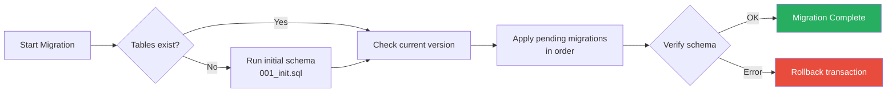
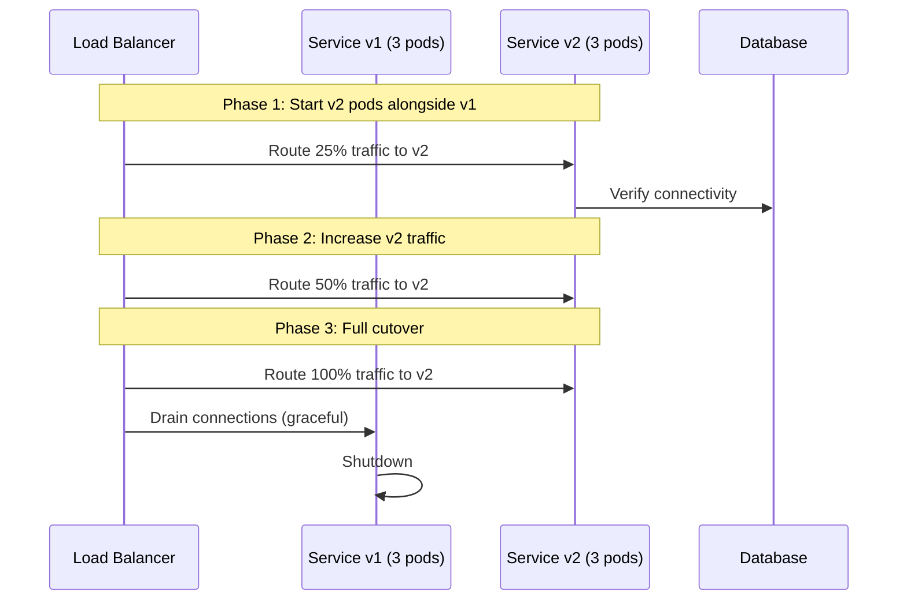

# Upgrading Guide

> Version migration steps, database schema upgrades, breaking changes, and
> rollback procedures for GGID platform upgrades.

---

## Versioning Policy

GGID follows [Semantic Versioning](https://semver.org/):

- **MAJOR** (1.0 → 2.0): Breaking API changes, migration required
- **MINOR** (1.0 → 1.1): New features, backward compatible
- **PATCH** (1.0.0 → 1.0.1): Bug fixes, no new features

---

## Pre-Upgrade Checklist

- [ ] Read the [CHANGELOG](./CHANGELOG.md) for breaking changes
- [ ] Test upgrade in staging environment
- [ ] Create database backup (`pg_basebackup` + WAL archive)
- [ ] Verify backup integrity (restore test)
- [ ] Notify users of maintenance window
- [ ] Prepare rollback plan
- [ ] Download new container images to registry

---

## Upgrade Procedures

### Docker Compose Upgrade

```bash
# 1. Backup current state
docker exec ggid-postgres pg_dump -U ggid -Fc ggid > backup_$(date +%Y%m%d).dump

# 2. Pull new images
docker compose pull

# 3. Stop services (keep infrastructure running)
docker compose stop gateway auth identity oauth policy org audit console

# 4. Run database migrations
docker compose run --rm migrate up

# 5. Start services
docker compose up -d

# 6. Verify health
sleep 10
curl localhost:8080/healthz
curl localhost:8080/readyz
```

### Kubernetes (Helm) Upgrade

```bash
# 1. Dry-run to preview changes
helm upgrade ggid ggid/ggid \
  --namespace ggid \
  --values values-prod.yaml \
  --dry-run

# 2. Perform rolling update
helm upgrade ggid ggid/ggid \
  --namespace ggid \
  --values values-prod.yaml \
  --timeout 10m \
  --wait

# 3. Check rollout status
kubectl rollout status deployment/ggid-gateway -n ggid
kubectl rollout status deployment/ggid-auth -n ggid

# 4. If failed, rollback
helm rollback ggid 1 -n ggid
```

### Rolling Update Strategy

```yaml
# Kubernetes deployment strategy
strategy:
  type: RollingUpdate
  rollingUpdate:
    maxSurge: 1          # Allow 1 extra pod during update
    maxUnavailable: 0    # Never reduce below desired replicas
```

---

## Database Schema Migration

GGID uses Go-based migrations run as an init container:

```bash
# Migration tracks version in schema_migrations table
CREATE TABLE IF NOT EXISTS schema_migrations (
    version INT PRIMARY KEY,
    applied_at TIMESTAMPTZ DEFAULT NOW()
);

# Check current version
psql -h $PG_HOST -U ggid -d ggid \
  -c "SELECT version FROM schema_migrations ORDER BY version DESC LIMIT 1;"
```

### Migration Process



### Idempotent Migration (Safe Re-Run)

```sql
-- 002_add_user_metadata.sql
-- Safe to run multiple times (uses IF NOT EXISTS)

DO $$
BEGIN
    -- Add metadata column if not exists
    IF NOT EXISTS (
        SELECT 1 FROM information_schema.columns
        WHERE table_name = 'users' AND column_name = 'metadata'
    ) THEN
        ALTER TABLE users ADD COLUMN metadata JSONB DEFAULT '{}';
    END IF;

    -- Add index if not exists
    IF NOT EXISTS (
        SELECT 1 FROM pg_indexes
        WHERE indexname = 'idx_users_metadata'
    ) THEN
        CREATE INDEX CONCURRENTLY idx_users_metadata
            ON users USING GIN (metadata);
    END IF;
END $$;
```

---

## Breaking Changes Changelog

### v1.0 (Upcoming)

| Change | Impact | Migration |
|--------|--------|-----------|
| API version `/api/v1/` stabilized | No impact if already on v1 | None |
| JWT claim `tid` renamed to `tenant_id` | Old tokens invalid | Re-login required |
| Password hash upgraded to bcrypt cost 12 | Transparent rehash on next login | Automatic |

### v0.x → v1.0 Migration

```bash
#!/bin/bash
# migrate-0.x-to-1.0.sh

echo "=== GGID 0.x → 1.0 Migration ==="

# Step 1: Backup
echo "1. Creating backup..."
pg_dump -h $PG_HOST -U ggid -Fc ggid > backup_pre_1.0.dump

# Step 2: Run migration
echo "2. Running schema migration..."
docker compose run --rm migrate up --to-version 10

# Step 3: Rehash passwords (if upgrading bcrypt cost)
echo "3. Scheduling password rehash (transparent on next login)..."
psql -h $PG_HOST -U ggid -d ggid -c "
  UPDATE credentials
  SET needs_rehash = true
  WHERE bcrypt_cost < 12;
"

# Step 4: Update JWT claims format
echo "4. JWT claim 'tid' → 'tenant_id' (old tokens will be rejected)"
echo "   All active sessions will need to re-authenticate."

# Step 5: Verify
echo "5. Verifying..."
curl -s localhost:8080/healthz | grep ok
echo "=== Migration complete ==="
```

---

## Rollback Procedure

### Application Rollback (Docker Compose)

```bash
# 1. Stop new version
docker compose down

# 2. Restore old images (from registry or local)
docker tag ggid/gateway:1.0.0 ggid/gateway:latest
docker tag ggid/auth:1.0.0 ggid/auth:latest
# ... for each service

# 3. Restore database (if migration changed schema)
pg_restore -h $PG_HOST -U ggid -d ggid -c backup_pre_upgrade.dump

# 4. Start old version
docker compose up -d
```

### Application Rollback (Kubernetes)

```bash
# Rollback Helm release
helm rollback ggid <REVISION_NUMBER> -n ggid

# Check rollback history
helm history ggid -n ggid

# Rollback specific deployment (if needed)
kubectl rollout undo deployment/ggid-gateway -n ggid
```

### Database Rollback

```bash
# Method 1: PITR (Point-in-Time Recovery) — for data-level rollback
./scripts/restore-postgres-pitr.sh
# Target time: before migration started

# Method 2: Logical restore — for schema changes
pg_restore -h $PG_HOST -U ggid -d ggid -c backup_pre_upgrade.dump

# Method 3: Migration down (if available)
docker compose run --rm migrate down --to-version 9
```

---

## SDK Version Compatibility Matrix

| GGID Platform | Go SDK | Node.js SDK | Java SDK | Python SDK |
|---------------|--------|-------------|----------|------------|
| 1.0.x | 1.0.x | 1.0.x | 1.0.x | 1.0.x |
| 0.9.x | 0.9.x | 0.9.x | 0.9.x | — |
| 0.8.x | 0.8.x | 0.8.x | — | — |

**Rule:** SDK major version must match platform major version. Minor and patch
versions are backward compatible within the same major.

### SDK Upgrade

```bash
# Go
go get github.com/ggid/ggid/sdk/go@latest

# Node.js
npm install @ggid/node-sdk@latest

# Java (Maven)
<dependency>
  <groupId>io.ggid</groupId>
  <artifactId>sdk</artifactId>
  <version>1.0.0</version>
</dependency>
```

---

## Zero-Downtime Upgrade Strategy

For upgrades that don't require schema changes:



### Canary Deployment

```bash
# Deploy v2 with 10% traffic
kubectl set image deployment/ggid-gateway gateway=ggid/gateway:v2 -n ggid
kubectl patch hpa ggid-gateway -n ggid -p '{"spec":{"maxReplicas":6}}'

# Monitor for 15 minutes
watch kubectl get pods -n ggid -l app=ggid-gateway

# If healthy, promote to 100%
# If issues, rollback:
kubectl rollout undo deployment/ggid-gateway -n ggid
```

---

## Post-Upgrade Verification

```bash
#!/bin/bash
# post-upgrade-verify.sh

API="${API:-http://localhost:8080}"
TENANT="${TENANT:-00000000-0000-0000-0000-000000000001}"

echo "=== Post-Upgrade Verification ==="

# 1. Health checks
echo "1. Health checks..."
curl -sf $API/healthz > /dev/null && echo "  healthz: OK" || echo "  healthz: FAIL"
curl -sf $API/readyz > /dev/null && echo "  readyz: OK" || echo "  readyz: FAIL"

# 2. Database connectivity
echo "2. Database connectivity..."
psql -h $PG_HOST -U ggid -d ggid -c "SELECT 1;" > /dev/null && echo "  DB: OK" || echo "  DB: FAIL"

# 3. Auth functional test
echo "3. Auth test..."
TOKEN=$(curl -sfX POST $API/api/v1/auth/login \
  -H "Content-Type: application/json" \
  -H "X-Tenant-ID: $TENANT" \
  -d '{"username":"test","password":"Test123!"}' | jq -r .access_token 2>/dev/null)
[ -n "$TOKEN" ] && echo "  Login: OK (${#TOKEN} chars)" || echo "  Login: FAIL"

# 4. CRUD test
echo "4. CRUD test..."
curl -sf $API/api/v1/users \
  -H "Authorization: Bearer $TOKEN" \
  -H "X-Tenant-ID: $TENANT" > /dev/null && echo "  List users: OK" || echo "  List users: FAIL"

# 5. Migration version
echo "5. Migration version..."
VERSION=$(psql -h $PG_HOST -U ggid -d ggid -tAc \
  "SELECT version FROM schema_migrations ORDER BY version DESC LIMIT 1;")
echo "  Schema version: $VERSION"

echo "=== Verification complete ==="
```

---

## References

- [CHANGELOG](./CHANGELOG.md) — Version history
- [Migration Guide](./migration-guide.md) — Migrate from Auth0/Keycloak
- [Deployment Guide](./deployment.md) — Production deployment
- [Backup & Recovery](./backup-recovery.md) — Backup before upgrading
